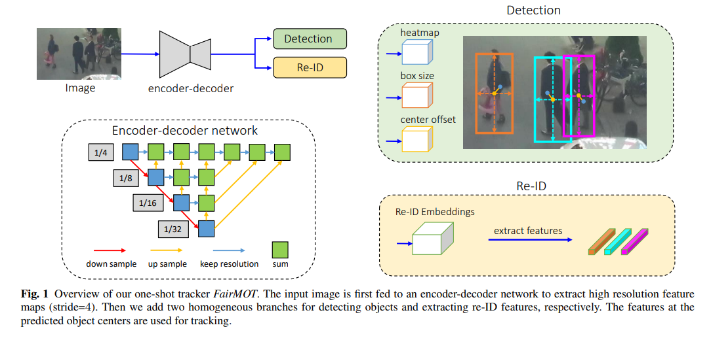
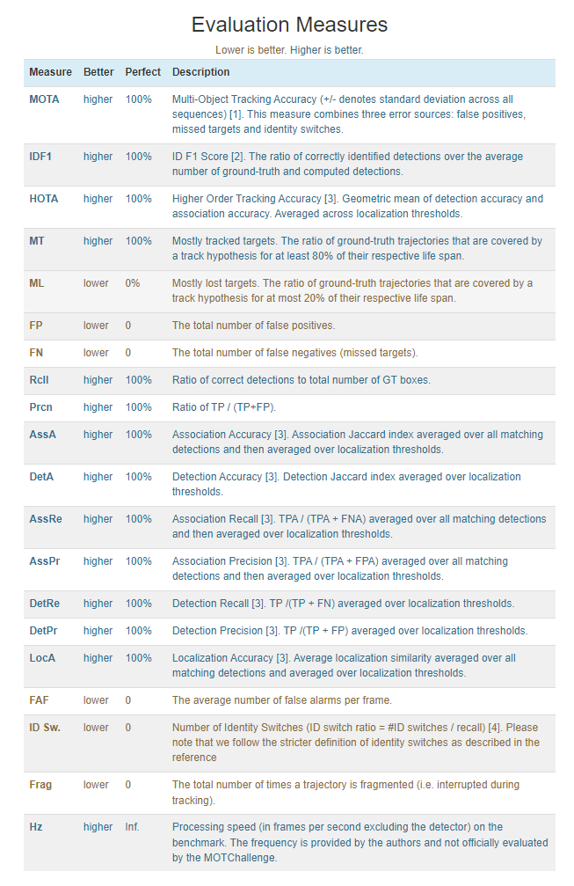
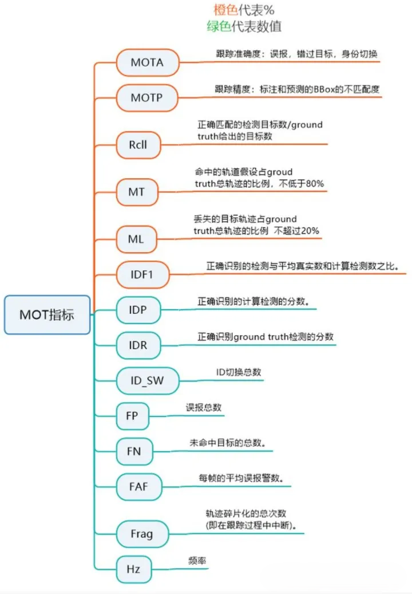
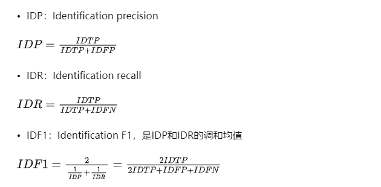

# FairMOT

[FairMOT: On the Fairness of Detection and Re-Identification in Multiple Object Tracking](https://arxiv.org/abs/2004.01888)

## Code Source
```
link: https://github.com/ifzhang/FairMOT
branch: master
commit: 4aa62976bde6266cbafd0509e24c3d98a7d0899f
```

## Model Arch

FairMOT是华中科技大学和微软亚洲研究院，论文分析现存one-shot目标追踪算法的问题所在，提出了三个观点：

1. anchors对于Re-ID并不友好，应该采用anchor-free算法。
2. 多层特征的融合。
3. 对于one-shot方法，Re-ID的特征向量采用低维度更好。

在MOT15、MOT16、MOT17、MOT20等数据集上以30fps的帧数达到了目前的SOTA水平。

### pre-processing

FairMOT算法的预处理主要是对输入图片利用letterbox算子进行resize，然后进行归一化，与检测算法基本一致

### 网络结构



#### backbone

作者发现使用ResNet-34结构作为骨干网络能够很好的兼容精度和速度，通在骨干网络上添加Deep Layer Aggregation (DLA)结构来实现不同尺度的检测，与原本的DLA不同的是在低层和高层之间添加了更多的连接(与FPN相似)，另外在上采样的时候采用的是可形变卷积，可以根据目标的尺度和姿势动态的适应感受野，这个改进也有助于缓解对齐问题。最终的模型为DLA-34，下采样stride=4。

#### Detection Branch

与centernet一样，作者将目标检测看作是高分辨率特征图上基于中心的边界盒回归任务。三个平行回归head被添加到backbone中，分别用来预测heatmap、对象中心偏移量和box大小。每个head的实现方法是对backbone的输出特征图进行3×3卷积(256通道)，再经过1×1卷积层生成最终目标。

#### Identity Embedding Branch

身份嵌入分支的目标是生成能够区分不同对象的特征。理想情况下，不同物体之间的距离应该大于同一物体之间的距离。为了实现这一目标，作者在backbone特征图上应用一个有128个核的卷积层来提取每个位置的身份嵌入特征，得到128×W×H的feature map，一个(x, y)上的Re-ID特征向量就是来自这个feature map。


### common

- letterbox
- DLA
- DCNv2
- Focus Layer

## Model Info

### 模型性能

| 模型  | 源码 | MOTA | IDF1 | IDs | dataset | input size |
| :---: | :--: | :--: | :--: | :---: | :----: | :--------: |
| fairmot_yolov5s |[official](https://github.com/ifzhang/FairMOT)|   	58.1  |  61.9    |   390    |    MOT17    |       608x1088    |

### 测评数据集说明

目前多目标跟踪算法中常用数据集为MOT17与MOT20，两者标签格式基本相同，MOT20数据集主要的特点是密集人群跟踪

### 评价指标说明






#### Classical metrics

*   _**MT**_：Mostly Tracked trajectories，成功跟踪的帧数占总帧数的80%以上的GT轨迹数量
    
*   Fragments：碎片数，成功跟踪的帧数占总帧数的80%以下的预测轨迹数量
    
*   _**ML**_：Mostly Lost trajectories，成功跟踪的帧数占总帧数的20%以下的GT轨迹数量
    
*   False trajectories：预测出来的轨迹匹配不上GT轨迹，相当于跟踪了个寂寞
    
*   ID switches：因为跟踪的每个对象都是有ID的，一个对象在整个跟踪过程中ID应该不变，但是由于跟踪算法不强大，总会出现一个对象的ID发生切换，这个指标就说明了ID切换的次数，指前一帧和后一帧中对于相同GT轨迹的预测轨迹ID发生切换，跟丢的情况不计算在ID切换中。
    

#### CLEAR MOT metrics

*   _**FP**_：总的误报数量，即整个视频中的FP数量，即对每帧的FP数量求和
    
*   _**FN**_：总的漏报数量，即整个视频中的FN数量，即对每帧的FN数量求和
    
*   _**Fragm（FM）**_：总的fragmentation数量，every time a ground truth object tracking is interrupted and later resumed is counted as a fragmentation，注意这个指标和Classical metrics中的Fragments有点不一样
    
*   _**IDSW**_：总的ID Switch数量，即整个视频中的ID Switch数量，即对每帧发生的ID Switch数量求和，这个和Classical metrics中的ID switches基本一致
    
*   _**MOTA**_：注意MOTA最大为1，由于IDSW的存在，MOTA最小可以为负无穷。
    

*   _**MOTP**_：衡量跟踪的位置误差
    

#### ID scores



## Build_In Deploy

- [official_deploy](./source_code/official_deploy.md)