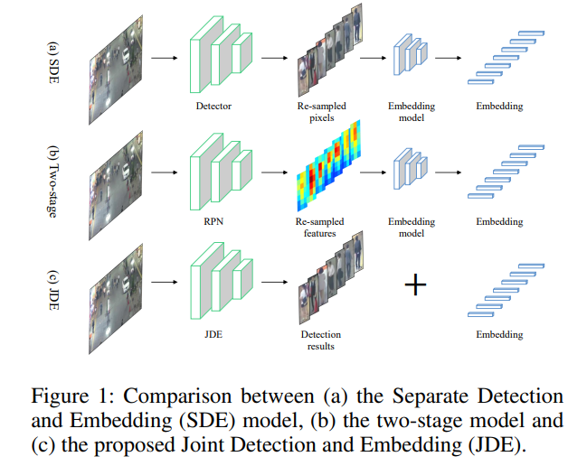
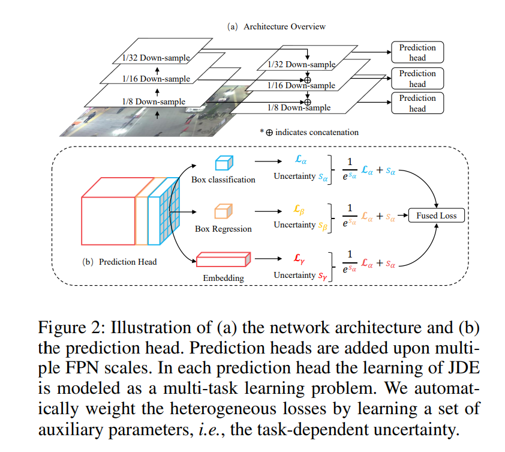

# JDE

[Towards Real-Time Multi-Object Tracking](https://arxiv.org/pdf/1909.12605v1.pdf)

## Code Source
```
link: https://github.com/Zhongdao/Towards-Realtime-MOT/tree/master
branch: master
commit: e9fa1e8014a9577410ce99505b871e4bc5aa1cde
```

## Model Arch

传统的DBT范式，将MOT分为两步：

1. 检测阶段，用于检测目标在单一视频帧中的位置；
2. 关联阶段，将检测的目标关联到之前的轨迹。

这意味着MOT存在两个密集型计算部分，一个检测网络，一个嵌入（Re-ID）网络。作者将这种检测和嵌入分开进行的命名为SDE。由于SDE的计算量比较大，所以实时很困难。

为了解决计算问题，简单思路是将检测和嵌入整合入同一个model中，共享低级特征，避免了重复的计算量。



对比下，SDE方法和双阶段方法分别重采样像素（边界框）和特征图进行特征表示， 边界框和特征图被单独喂到一个独立的Re-ID网络中进行外貌特征提取。该论文提到的JDE方法不仅接近实时，且精度堪比SDE方法。

论文中建立的JDE方法过程：

1. 首先，数据集方面，选择了带有行人检测和人物搜索的6个公开数据集组合成一个统一的大规模的多标签数据集。数据集中所有行人边界框都被标注，部分行人存在身份标签。
2. 其次，网络模型方面，选择了FPN作为基础结构，探讨选择能够最好的学习嵌入信息的损失函数。
3. 然后，我们将训练过程建模为一个多任务学习问题，包括锚分类、边界框回归和嵌入学习。为了平衡每个任务的重要性，我们使用独立任务的不确定性来动态地衡量性损失。提出一个简单的关联算法提升效率
4. 最后，使用各种参数评估模型。


### pre-processing

JDE算法的预处理主要是对输入图片利用letterbox算子进行resize，然后进行归一化，与检测算法基本一致

### 模型结构




JDE算法使用了FPN的结构，保证不同尺度目标的检测（本文生成了三种不同尺度的特征）。不同尺度的特征图送入多卷积层的预测头，输出一个(6A+D)×H×W的预测，A是分配给这个尺度的锚模板的数量，D是特征嵌入维度。
具体将输出分为三个部分送入是三个任务：

1. 边界框分类分支：2A×H×W
2. 边界框回归分支：4A×H×W
3. 密集嵌入特征图分支：D×H×W

### common

- letterbox
- FPN
- Fused Loss

## Model Info

### 模型性能

| 模型  | 源码 | MOTA | IDF1 | IDs | dataset | input size |
| :---: | :--: | :--: | :--: | :---: | :----: | :--------: |
| jde_1088x608_uncertainty |[pytorch](https://github.com/Zhongdao/Towards-Realtime-MOT/tree/master)|   	73.1  |  68.9    |   1312    |    MOT16    |       608x1088    |
| jde_864x480_uncertainty |[pytorch](https://github.com/Zhongdao/Towards-Realtime-MOT/tree/master)|   	70.8  |  65.8    |   1279    |    MOT16    |       480x864    |
| jde_576x320_uncertainty |[pytorch](https://github.com/Zhongdao/Towards-Realtime-MOT/tree/master)|   	63.7  |  63.3    |   1307    |    MOT16    |       320x576    |

### 测评数据集说明

目前多目标跟踪算法中常用数据集为MOT17与MOT20，两者标签格式基本相同，MOT20数据集主要的特点是密集人群跟踪

### 评价指标说明


#### Classical metrics

*   _**MT**_：Mostly Tracked trajectories，成功跟踪的帧数占总帧数的80%以上的GT轨迹数量
    
*   Fragments：碎片数，成功跟踪的帧数占总帧数的80%以下的预测轨迹数量
    
*   _**ML**_：Mostly Lost trajectories，成功跟踪的帧数占总帧数的20%以下的GT轨迹数量
    
*   False trajectories：预测出来的轨迹匹配不上GT轨迹，相当于跟踪了个寂寞
    
*   ID switches：因为跟踪的每个对象都是有ID的，一个对象在整个跟踪过程中ID应该不变，但是由于跟踪算法不强大，总会出现一个对象的ID发生切换，这个指标就说明了ID切换的次数，指前一帧和后一帧中对于相同GT轨迹的预测轨迹ID发生切换，跟丢的情况不计算在ID切换中。
    

#### CLEAR MOT metrics

*   _**FP**_：总的误报数量，即整个视频中的FP数量，即对每帧的FP数量求和
    
*   _**FN**_：总的漏报数量，即整个视频中的FN数量，即对每帧的FN数量求和
    
*   _**Fragm（FM）**_：总的fragmentation数量，every time a ground truth object tracking is interrupted and later resumed is counted as a fragmentation，注意这个指标和Classical metrics中的Fragments有点不一样
    
*   _**IDSW**_：总的ID Switch数量，即整个视频中的ID Switch数量，即对每帧发生的ID Switch数量求和，这个和Classical metrics中的ID switches基本一致
    
*   _**MOTA**_：注意MOTA最大为1，由于IDSW的存在，MOTA最小可以为负无穷。
    

*   _**MOTP**_：衡量跟踪的位置误差
    

#### ID scores


## Build_In Deploy

- [pytorch_deploy](./source_code/pytorch_deploy.md)