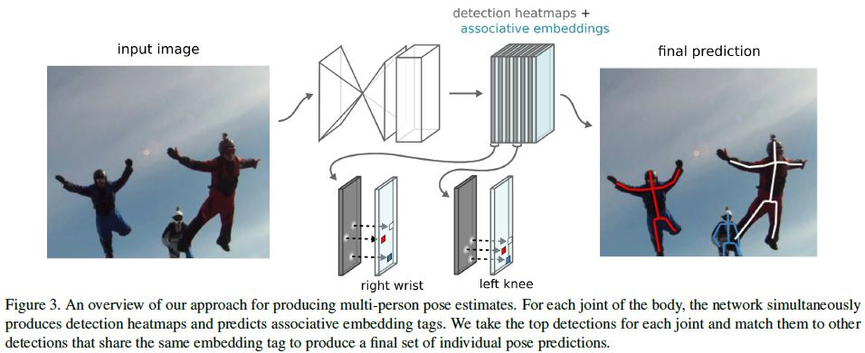
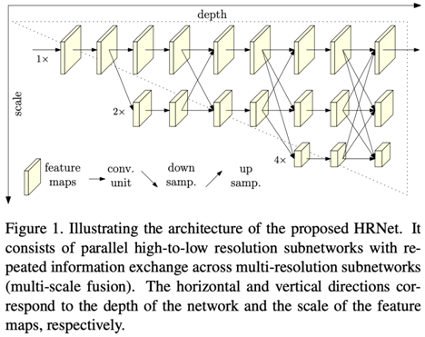

# HRNet_pose

[Associative Embedding: End-to-End Learning for Joint Detection and Grouping](https://arxiv.org/abs/1611.05424)

## Code Source
```
link: https://github.com/open-mmlab/mmpose
branch: master
commit: 4c397f2db99cc6d8f0787ec6a44266eddd231bb
```

## Model Arch

### pre-processing

hrnet_pose系列的预处理主要是对输入图片利用letterbox算子进行resize，然后进行归一化，与yolov5检测算法一致

### post-processing

- hrnet_pose(mmpose)的后处理思想借鉴于论文《Associative Embedding: End-to-End Learning for Joint Detection and Grouping》。模型预测每个身体关节在每个像素定位上的检测分数，并在每个像素位置生成一个tag，即每个keypoint heatmap都有相应的标签tag heatmap。对于m个关键点，网络将输出2m通道，m用于检测m用于分组

<div align=center></div>

- 为了将检测解析成个体实例，使用NMS来获取每个关节的峰值检测，并在相同像素位置检索相应的tag。迭代顺序是先考虑头和躯干而后逐渐像肢体移动，首先从第一个关键点开始NMS后得到超过阈值的关键点，组成待检测人的最初侯选池，然后对后续关节的标记与当前人员侯选池中的标记进行比较，找出最佳匹配。如此在每类关节点上循环匹配，直到每个检测都被匹配到单个检测者

### backbone

模型backbone采用hrnet

<div align=center></div>

### detail
Associative Embedding
- 用于多目标组分配，可结合多人姿态估计、实例分割、多目标跟踪等许多视觉任务。检测较小的视觉单元，并将其组合成更大的结构。网络输出逐像素的检测得分heatmap以及逐像素的身份标签identity tags heatmap，相同分组的tag期望具有相似的值，tag并没有确定的gt，起决定因素的不是tag绝对值，而是tag之间的相对差异。associative embedding用于在每一格候选目标的检测分数之外，再预测一个embeding：这些嵌入可以作为分组编码的标签，具有相似编码的应该被分在一起（相同人体tag相同，不同人体tag不同）。

Grouping分组
- 依次遍历关节点，先确定头部和躯干，然后确定四肢, 直至所有关节点都分配了人体
- 两个tags只有当他们落入设定阈值后，才被分为同一个group


### common

- Associative Embedding


## Model Info

### 模型性能

| 模型  | flops(G) | params(M) | AP | AR | input size |
| :---: | :--: | :--: | :---: | :----: | :--------: |
| [hrnet_pose](https://github.com/open-mmlab/mmpose/blob/master/configs/body/2d_kpt_sview_rgb_img/associative_embedding/coco/higherhrnet_w32_coco_512x512.py) |  91.557  |  28.537  |  0.6454 | 0.710 |  1x3x512x512  |


### 测评数据集说明


[MS COCO](https://cocodataset.org/#download)数据集，MS COCO的全称是Microsoft Common Objects in Context，是微软于2014年出资标注的Microsoft COCO数据集，与ImageNet竞赛一样，被视为是计算机视觉领域最受关注和最权威的比赛数据集之一。

COCO数据集支持目标检测、关键点检测、实例分割、全景分割与图像字幕任务。在图像检测任务中，COCO数据集提供了80个类别，验证集包含5000张图片，上表的结果即在该验证集下测试。

### 评价指标说明
- 关键点相似度(object keypoint similarity，oks), 在多人姿态估计任务中，oks在欧式距离基础上加入一定尺度，来计算两点之间的相似度。
- 平均准确率(Average Precision, AP),计算groundtruth中每个人和所有检测出来的人之间最大的oks，再通过设定阈值计算所有groundtruth的ap
- 平均召回率(Average Recall, AR), 代表的是OKS阈值从0.05到0.95、间隔0.05获得的关键点召回率的平均值

## Build_In Deploy

### step.1 准备模型
```bash
pip install mmcv
git clone https://github.com/open-mmlab/mmpose.git
cd mmpose
pip install -e .
python tools/deployment/pytorch2onnx.py \
    configs/body/2d_kpt_sview_rgb_img/associative_embedding/coco/hrnet_w32_coco_512x512.py \
    path/to/hrnet_w32_coco_512x512-bcb8c247_20200816.pth \
    --shape 1 3 512 512 \
    --verify --output-file hrnet.onnx

```

### step.2 准备数据集
- [校准数据集](http://images.cocodataset.org/zips/val2017.zip)
- [评估数据集](http://images.cocodataset.org/zips/val2017.zip)
- [gt: person_keypoints_val2017.json](http://images.cocodataset.org/annotations/annotations_trainval2017.zip)

### step.3 模型转换
1. 根据具体模型修改模型转换配置文件
    - [mmpose_hrnetpose.yaml](./build_in/build/mmpose_hrnetpose.yaml)
    
    > - runstream推理，编译参数`backend.type: tvm_vacc`
    > - fp16精度: 编译参数`backend.dtype: fp16`
    > - int8精度: 编译参数`backend.dtype: int8`，需要配置量化数据集和预处理算子

2. 模型编译
    ```bash
    vamc build ./build_in/build/mmpose_hrnetpose.yaml
    ```

### step.4 模型推理
1. sdk 1.x
   
    参考：[sample_forward.py](./build_in/runstream/sample_forward.py)

    ```bash
    python ./build_in/runstream/sample_forward.py
    ```
    > `生成的npz用于下面的精度评估`
2. [eval_multi.py](./source_code/eval_multi.py)，解析输出结果评估精度：
   ```bash
    python source_code/eval_multi.py --data_root det_data/coco --output_data output/hrnet_out --datalist_txt config/vamp_datalist.txt --num_process 4

   ```
    > `由于hrnet_pose后处理在host端进行，且耗时较久，可以视本地机器性能而定开启的进程数`  

### step.5 性能测试
1. 基于[image2npz.py](./source_code/convert_image.py)将原始图像转换为vamp需要的npz格式，以及输入顺序的datalist.txt：
    ```bash
    python ./source_code/convert_image.py 
    ```
    > `mmpose使用flip_test方法，因此convert_image生成了一份原图的npz数据和一份翻转图片的npz数据`
2. 配置vdsp参数[mmyolo-hrnet_pose-vdsp_params.json](./build_in/vdsp_params/mmyolo-hrnet_pose-vdsp_params.json)，vamp执行测试：
    ```bash
    ./vamp -m deploy_weights/hrnet_pose-int8-kl_divergence-512-vacc/hrnet_pose \
    --vdsp_params ./build_in/vdsp_params/mmyolo-hrnet_pose-vdsp_params.json \
    -i 2 p 2 -b 1 \
    --datalist datalist.txt --path_output ./save/hrnet_pose
    ```