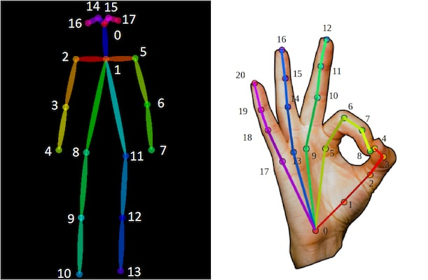

<div align=center></div>

# openpose

[Realtime Multi-Person 2D Pose Estimation using Part Affinity Fields ](https://openaccess.thecvf.com/content_cvpr_2017/papers/Cao_Realtime_Multi-Person_2D_CVPR_2017_paper.pdf)

[Hand Keypoint Detection in Single Images using Multiview Bootstrapping](https://arxiv.org/abs/1704.07809)

[Convolutional Pose Machines](https://arxiv.org/abs/1602.00134)

## Code Source
```
link: https://github.com/Hzzone/pytorch-openpose
branch: master
commit: 5ee71dc10020403dc3def2bb68f9b77c40337ae2
```

## Model Arch

openpose算法包含两个模型，分别是body、hand模型，两个模型均支持任意尺寸的输入（建议设置为8的倍数）

### pre-processing

openpose两个模型的预处理操作一致，都是将输入图片resize到网络输入的尺寸（body建议[184, 184]，hand建议[368, 368]），然后除以256减去0.5即可

### post-processing

openpose的主要流程如下：

- 输入一幅图像，经过卷积网络提取特征，得到一组特征图，然后分成两个岔路，分别使用CNN网络提取Part Confidence Maps 和 Part Affinity Fields；
- 得到这两个信息后，我们使用图论中的Bipartite Matching（偶匹配）求出Part Association，将同一个人的关节点连接起来，由于PAF自身的矢量性，使得生成的偶匹配很正确，最终合并为一个人的整体骨架；
- 最后基于PAFs求Multi-Person Parsing—>把Multi-person parsing问题转换成graphs问题—>Hungarian Algorithm(匈牙利算法)
- 如果根据上述流程检测到pose关键点，则可从其中提取hand关键点进一步经过hand模型更细致处理

### backbone

openpose算法两个模型都是由普通的卷积+relu激活函数堆叠而成

### head

openpose算法中body模型的输出有两个分支，分别对应19个通道（18个人体关键点+1个背景）和38个通道，hand模型输出有22个通道（21个手部关键点+1个背景）

### common

- multi path


## Build_In Deploy

### step.1 获取预训练模型

基于该项目可以实现模型转换至torchscript与onnx格式，可根据以下代码进行转换

```python
from src import model
from src import util
from src.body import Body
from src.hand import Hand

body_estimation = Body('model/body_pose_model.pth')
hand_estimation = Hand('model/hand_pose_model.pth')

input_shape = (1, 3, 184, 184)
input_data = torch.randn(input_shape)
scripted_model = torch.jit.trace(body_estimation.model, input_data).eval()

# scripted_model = torch.jit.script(net)
torch.jit.save(scripted_model, 'body.torchscript.pt')

input_names = ["input"]
inputs = torch.randn(1, 3, 184, 184)

torch_out = torch.onnx._export(body_estimation.model, inputs, 'body.onnx', export_params=True, verbose=False,
                            input_names=input_names, opset_version=10)


input_shape = (1, 3, 368, 368)
input_data = torch.randn(input_shape)
scripted_model = torch.jit.trace(hand_estimation.model, input_data).eval()

# scripted_model = torch.jit.script(net)
torch.jit.save(scripted_model, 'hand.torchscript.pt')

input_names = ["input"]
inputs = torch.randn(1, 3, 368, 368)

torch_out = torch.onnx._export(hand_estimation.model, inputs, 'hand.onnx', export_params=True, verbose=False,
                            input_names=input_names, opset_version=10)

```

在进行模型转换时，`body`模型的输入shape可以设置为[1, 3, 184, 184]，而`hand`模型的输入shape可以设置为[1, 3, 368, 368]

### step.2 准备数据集
    - 测试图像: [media](https://github.com/CMU-Perceptual-Computing-Lab/openpose/tree/master/examples/media/?download=zip)

### step.3 模型转换
1. 根据具体模型，修改编译配置
    - [pytorch_openpose_body.yaml](./build_in/build/pytorch_openpose_body.yaml)
    - [pytorch_openpose_hand.yaml](./build_in/build/pytorch_openpose_hand.yaml)

    > - runstream推理，编译参数`backend.type: tvm_vacc`
    > - fp16精度: 编译参数`backend.dtype: fp16`
    > - int8精度: 编译参数`backend.dtype: int8`

2. 模型编译
    ```bash
    cd openpose
    mkdir workspace
    cd workspace
    vamc compile ../build_in/build/pytorch_openpose_body.yaml
    vamc compile ../build_in/build/pytorch_openpose_hand.yaml
    ```

### step.4 模型推理
1. runstream
    - 参考[openpose_vsx.py](./build_in/vsx/python/openpose_vsx.py)生成预测的txt结果

    ```
    python ../build_in/vsx/python/openpose_vsx.py \
        --file_path path/to/open_pose_test \
        --body_prefix_path deploy_weights/pytorch_openpose_body_run_stream_int8/mod \
        --body_vdsp_info ../build_in/vdsp_params/pytorch-body-vdsp_params.json \
        --hand_prefix_path deploy_weights/pytorch_openpose_hand_run_stream_int8/mod \
        --hand_vdsp_info ../build_in/vdsp_params/pytorch-hand-vdsp_params.json \
        --save_dir ./runstream_output \
        --device 0
    ```

### step.5 性能测试
1. body模型，性能测试：
    ```bash
    vamp -m deploy_weights/pytorch_openpose_body_run_stream_fp16/mod \
    --vdsp_params ../build_in/vdsp_params/pytorch-body-vdsp_params.json \
    -i 2 p 2 -b 1 -s [3,184,184]
    ```

2. hand模型，性能测试：
    ```bash
    vamp -m deploy_weights/pytorch_openpose_hand_run_stream_fp16/mod \
    --vdsp_params ../build_in/vdsp_params/pytorch-hand-vdsp_params.json \
    -i 2 p 2 -b 1 -s [3,184,184]
    ```