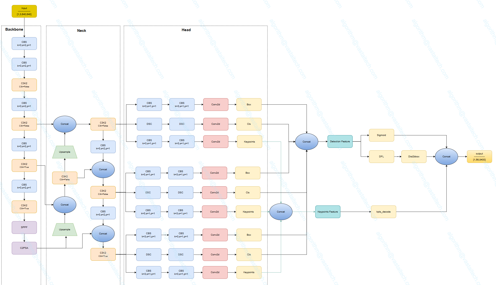
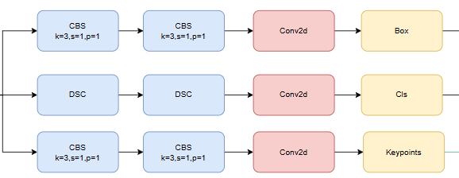

</a>

# YoloV11-POSE

## Code Source
```
link: https://github.com/ultralytics/ultralytics
branch: main
commit: d17b305786ba1055c642b5e5e820749ca66f132e
```

## Model Arch

</a>


### pre-processing

yolo11-pose系列的预处理主要是对输入图片利用`letterbox`算子进行resize，然后进行归一化

### post-processing
yolo11-pose系列网络的后处理操作是对检测结果中的检测信息（通常是边界框坐标和置信度）进行box decode之后进行nms，对预测结果中的关键点数据进行重塑（reshape）为模型定义的关键点形状。然后将关键点坐标从处理后的图像尺寸缩放到原始图像尺寸

### backbone
YOLO11采用改进的骨干和颈部架构，增强了特征提取能力，提高了物体检测的精确度和复杂任务的表现。相比较于YOLOv8模型，其将CF2模块改成C3K2，同时在SPPF模块后面添加了一个C2PSA模块，且将YOLOv10的head思想引入到YOLO11的head中，使用深度可分离的方法，减少冗余计算，提高效率。

YOLO11增加了一个C2PSA模块，并且将C2f替换为了C3k2。相比于C2f，当超参数c3k=True时，瓶颈块替换为 C3k，否则还是C2f,而C3k相比于C3则是可以让使用者自定义卷积块大小，更加灵活。C2PSA扩展了C2f，通过引入PSA( Position-Sensitive Attention)，旨在通过多头注意力机制和前馈神经网络来增强特征提取能力。它可以选择性地添加残差结构（shortcut）以优化梯度传播和网络训练效果。同时，使用FFN 可以将输入特征映射到更高维的空间，捕获输入特征的复杂非线性关系，允许模型学习更丰富的特征表示。

</a>
    
### neck
YOLO11使用PAN结构，并在其中也使用了C3K2模块。这种结构设计有助于聚合来自不同尺度的特征，并优化特征的传递过程。C3K2模块其实就是C2F模块转变出来的，它代码中有一个设置，就是当c3k这个参数为FALSE的时候，C3K2模块就是C2F模块，也就是说它的Bottleneck是普通的Bottleneck；反之当它为true的时候，将Bottleneck模块替换成C3模块。

</a>
    

### head
YOLO11-pose姿势估计头部扩展了检测头，增加了一个人体姿态关键点预测分支.
</a>

### common
- Spatial Pyramid Pooling Fast
- Position-Sensitive Attention
- Depthwise Convolution

## Model Info

### 模型性能

> official performance

| Model                                                                                          | size<br><sup>(pixels) | mAP<sup>pose<br>50-95 | mAP<sup>pose<br>50 | Speed<br><sup>CPU ONNX<br>(ms) | Speed<br><sup>T4 TensorRT10<br>(ms) | params<br><sup>(M) | FLOPs<br><sup>(B) |
| ---------------------------------------------------------------------------------------------- | --------------------- | --------------------- | ------------------ | ------------------------------ | ----------------------------------- | ------------------ | ----------------- |
| [YOLO11n-pose](https://github.com/ultralytics/assets/releases/download/v8.3.0/yolo11n-pose.pt) | 640                   | 50.0                  | 81.0               | 52.4 ± 0.5                     | 1.7 ± 0.0                           | 2.9                | 7.4               |
| [YOLO11s-pose](https://github.com/ultralytics/assets/releases/download/v8.3.0/yolo11s-pose.pt) | 640                   | 58.9                  | 86.3               | 90.5 ± 0.6                     | 2.6 ± 0.0                           | 9.9                | 23.1              |
| [YOLO11m-pose](https://github.com/ultralytics/assets/releases/download/v8.3.0/yolo11m-pose.pt) | 640                   | 64.9                  | 89.4               | 187.3 ± 0.8                    | 4.9 ± 0.1                           | 20.9               | 71.4              |
| [YOLO11l-pose](https://github.com/ultralytics/assets/releases/download/v8.3.0/yolo11l-pose.pt) | 640                   | 66.1                  | 89.9               | 247.7 ± 1.1                    | 6.4 ± 0.1                           | 26.1               | 90.3              |
| [YOLO11x-pose](https://github.com/ultralytics/assets/releases/download/v8.3.0/yolo11x-pose.pt) | 640                   | 69.5                  | 91.1               | 488.0 ± 13.9                   | 12.1 ± 0.2                          | 58.8               | 202.8             |


### 测评数据集说明


[MS COCO](https://cocodataset.org/#download)的全称是Microsoft Common Objects in Context，是微软于2014年出资标注的Microsoft COCO数据集，与ImageNet竞赛一样，被视为是计算机视觉领域最受关注和最权威的比赛数据集之一。 

COCO数据集支持目标检测、关键点检测、实例分割、全景分割与图像字幕任务。

### 评价指标说明

- mAP: mean of Average Precision, 多类别的AP的平均值；AP即平均精度，是Precision-Recall曲线下的面积
- mAP@.5: 即将IoU设为0.5时，计算每一类的所有图片的AP，然后所有类别求平均，即mAP
- mAP@.5:.95: 表示在不同IoU阈值（从0.5到0.95，步长0.05）上的平均mAP

## Build_In Deploy

### step.1 获取预训练模型

```
link: https://github.com/ultralytics/ultralytics
branch: main
commit: d17b305786ba1055c642b5e5e820749ca66f132e
```

- 获取原始仓库
- 为适配VACC和导出onnx文件，需进行适当修改源码。
    - 需要修改[Detect](https://github.com/ultralytics/ultralytics/blob/d17b305786ba1055c642b5e5e820749ca66f132e/ultralytics/nn/modules/head.py#L114)类的forward函数，替换成如下内容：
    ```python
    def forward(self, x: list[torch.Tensor], task_type="Detect") -> list[torch.Tensor] | tuple:
        """Concatenate and return predicted bounding boxes and class probabilities."""
        if task_type in ['Pose', 'pose']:
            print("task_type is Pose or pose, do not use Detect head")
            y = []
            for i in range(self.nl):
                cv2_output = self.cv2[i](x[i])  # 第一个分支
                cv3_output = self.cv3[i](x[i])  # 第二个分支
                # 返回未cat的各个分支
                y.append([cv2_output, cv3_output])
            return y  
         
        if self.end2end:
            return self.forward_end2end(x)

        for i in range(self.nl):
            x[i] = torch.cat((self.cv2[i](x[i]), self.cv3[i](x[i])), 1)
        if self.training:  # Training path
            return x
        y = self._inference(x)
        return y if self.export else (y, x)
    ```
    - 需要修改[Pose](https://github.com/ultralytics/ultralytics/blob/d17b305786ba1055c642b5e5e820749ca66f132e/ultralytics/nn/modules/head.py#L322)类的forward函数，替换成如下内容：
    ```python
    def forward(self, x: list[torch.Tensor]) -> torch.Tensor | tuple:
        """Perform forward pass through YOLO model and return predictions."""
        bs = x[0].shape[0]  # batch size
        kpt = torch.cat([self.cv4[i](x[i]).view(bs, self.nk, -1) for i in range(self.nl)], -1)  # (bs, 17*3, h*w)
        # 保存reshape之前的结果
        kpt_before_reshape = [self.cv4[i](x[i]) for i in range(self.nl)]
        if self.export :
            output_x = Detect.forward(self, x, 'Pose')
            return [output_x,kpt_before_reshape]
    
        # x = Detect.forward(self, x)
        # if self.training:
        #     return x, kpt
        # pred_kpt = self.kpts_decode(bs, kpt)
        # return torch.cat([x, pred_kpt], 1) if self.export else (torch.cat([x[0], pred_kpt], 1), (x[1], kpt))
    ```
- 按原仓库安装环境
- 参考[export_onnx.py](./source_code/export_onnx.py)，导出onnx

### step.2 准备数据集
> 注意标签文件为 person_keypoints_val2017
- [校准数据集](http://images.cocodataset.org/zips/val2017.zip)
- [评估数据集](http://images.cocodataset.org/zips/val2017.zip)
- [gt: person_keypoints_val2017.json](http://images.cocodataset.org/annotations/annotations_trainval2017.zip)
- [label: coco.txt](../../detection/common/label/coco.txt)

### step.3 模型转换
1. 根据具体模型，修改编译配置
    - [official_yolov11_pose_fp16.yaml](./build_in/build/official_yolov11_pose_fp16.yaml)
    - [official_yolov11_pose_int8.yaml](./build_in/build/official_yolov11_pose_int8.yaml)
    
    > - 编译参数`backend.type: tvm_vacc`
    > - fp16精度: 编译参数`backend.dtype: fp16`
    > - int8精度: 编译参数`backend.dtype: int8`

2. 模型编译
    ```bash
    cd yolov11_pose
    mkdir workspace
    cd workspace
    vamc compile ../build_in/build/official_yolov11_pose_fp16.yaml
    vamc compile ../build_in/build/official_yolov11_pose_int8.yaml
    ```

### step.4 模型推理

1. 参考[yolov11_pose_vsx.py](./build_in/vsx/python/yolov11_pose_vsx.py)生成预测的结果

    ```
    python ../build_in/vsx/python/yolov11_pose_vsx.py \
        --file_path /path/to/coco/det_coco_val \
        --model_prefix_path ./deploy_weights/ultralytics_yolo11n_pose_fp16/mod \
        --vdsp_params_info ../build_in/vdsp_params/official-yolov11n-vdsp_params.json \
        --label_txt /path/to/coco.txt \
        --save_dir ./infer_output \
        --device 0
    ```
2. [eval.py](./source_code/eval.py)，精度统计，指定gt路径和上步骤中的txt保存路径，即可获得精度指标
    ```
    python ../source_code/eval.py --gt path/to/person_keypoints_val2017.json --pred ./infer_output/predictions.json 
    ```
    测试精度如下：
    ```
    # yolo11n_pose_fp16
    Evaluate annotation type *keypoints*
    DONE (t=1.88s).
    Accumulating evaluation results...
    DONE (t=0.05s).
    Average Precision  (AP) @[ IoU=0.50:0.95 | area=   all | maxDets= 20 ] = 0.449
    Average Precision  (AP) @[ IoU=0.50      | area=   all | maxDets= 20 ] = 0.699
    Average Precision  (AP) @[ IoU=0.75      | area=   all | maxDets= 20 ] = 0.491
    Average Precision  (AP) @[ IoU=0.50:0.95 | area=medium | maxDets= 20 ] = 0.363
    Average Precision  (AP) @[ IoU=0.50:0.95 | area= large | maxDets= 20 ] = 0.591
    Average Recall     (AR) @[ IoU=0.50:0.95 | area=   all | maxDets= 20 ] = 0.506
    Average Recall     (AR) @[ IoU=0.50      | area=   all | maxDets= 20 ] = 0.726
    Average Recall     (AR) @[ IoU=0.75      | area=   all | maxDets= 20 ] = 0.555
    Average Recall     (AR) @[ IoU=0.50:0.95 | area=medium | maxDets= 20 ] = 0.393
    Average Recall     (AR) @[ IoU=0.50:0.95 | area= large | maxDets= 20 ] = 0.664
    ```

### step.5 性能测试
```bash
vamp -m ./deploy_weights/ultralytics_yolo11n_pose_fp16/mod --vdsp_params ../build_in/vdsp_params/official-yolov11n-vdsp_params.json -i 1 -b 1 -d 0 -p 1
```

## Tips
- YOLO系列模型中，官方在精度测试和性能测试时，设定了不同的conf和iou参数
- VACC在不同测试任务中，需要分别配置build yaml内的对应参数，分别进行build模型
- `precision mode：--confidence_threshold 0.001 --nms_threshold 0.65`
- `performance mode：--confidence_threshold 0.25 --nms_threshold 0.45`
- 不同参数量模型，在量化参数上存在差异：
```
quantize:
    calibrate_mode: percentile
    quantize_per_channel: true
    skip_matmul_layers: [0, 1] # yolo11-n/s/m
    # skip_matmul_layers: [0, 1, 2, 3, 4, 5, 6, 7]  # yolo11-l/x
    calibrate_chunk_by: -1
```
- yolov11含有Attention模块，GQA计算时，由于硬件限制seqlen需要是128的倍数；即输入分辨率需设置为128的倍数

