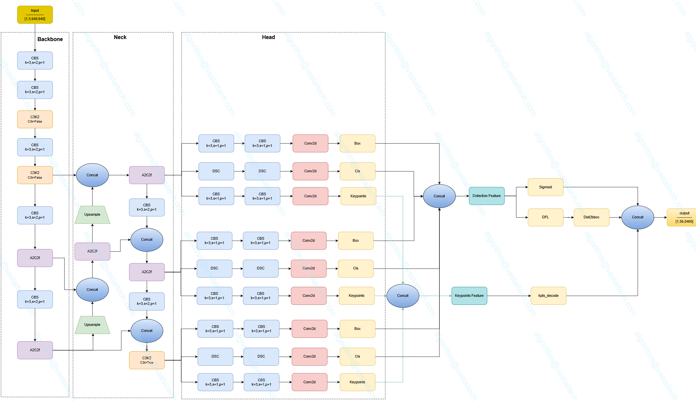
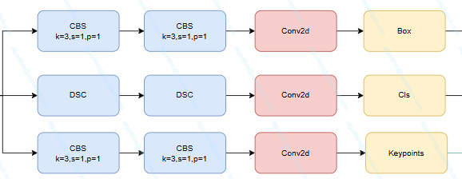

</a>

# Yolov12-POSE

## Code Source
```
link: https://github.com/sunsmarterjie/yolov12.git
branch: main
commit: 3a336a4adf3683d280e1a50d03fa24bbe7f24a5b
```

## Model Arch

</a>


### pre-processing

yolov12-pose系列的预处理主要是对输入图片利用`letterbox`算子进行resize，然后进行归一化

### post-processing
yolov12-pose系列网络的后处理操作是对检测结果中的检测信息（通常是边界框坐标和置信度）进行box decode之后进行nms，对预测结果中的关键点数据进行重塑（reshape）为模型定义的关键点形状。然后将关键点坐标从处理后的图像尺寸缩放到原始图像尺寸

### backbone
- YOLOv12的主干系统对于将原始图像数据转换为多尺度特征图至关重要，它为后续的检测任务提供了基础表征。主干网络的核心是残差高效层聚合网络（R-ELAN），它将更深的卷积层与精心设置的残差连接融合在一起。这种设计解决了梯度瓶颈问题，提高了特征重用率，增强了模型捕捉各种尺寸和形状的复杂物体细节的能力。
</a>

- 除了引入先进的卷积块（R-ELAN），YOLOv12还利用7×7可分离卷积等技术来减轻计算负担。这种方法有效取代了传统的大内核运算或位置编码，以更少的参数保持了空间感知能力。此外，多尺度特征金字塔可确保不同大小的物体，包括小物体或部分遮挡的物体，都能在网络中得到明显的体现。

- YOLOv12中的Neck是骨干和头部之间的通道，用于聚合和细化多尺度特征。其主要创新之一提出区域注意力模块（A2）：采用简单的划分方式将特征图划分为多个区域，避免复杂操作，在保持较大感受野的同时降低注意力计算复杂度。实验表明，使用区域注意力的 YOLOv12 - N/S/X 模型在 GPU 和 CPU 上推理速度显著提升，例如 YOLOv12 - N 在 RTX 3080 上使用 FP32 精度时，推理时间减少 0.7ms 。

</a>

    

### head
YOLO11-pose姿势估计头部扩展了检测头，增加了一个人体姿态关键点预测分支.
</a>

### common
- R-ELAN
- A2

## Model Info

### 测评数据集说明


[MS COCO](https://cocodataset.org/#download)的全称是Microsoft Common Objects in Context，是微软于2014年出资标注的Microsoft COCO数据集，与ImageNet竞赛一样，被视为是计算机视觉领域最受关注和最权威的比赛数据集之一。 

COCO数据集支持目标检测、关键点检测、实例分割、全景分割与图像字幕任务。

### 评价指标说明

- mAP: mean of Average Precision, 多类别的AP的平均值；AP即平均精度，是Precision-Recall曲线下的面积
- mAP@.5: 即将IoU设为0.5时，计算每一类的所有图片的AP，然后所有类别求平均，即mAP
- mAP@.5:.95: 表示在不同IoU阈值（从0.5到0.95，步长0.05）上的平均mAP

## Build_In Deploy

### step.1 获取预训练模型

```
link: https://github.com/sunsmarterjie/yolov12.git
branch: main
commit: 3a336a4adf3683d280e1a50d03fa24bbe7f24a5b
```

- 获取原始仓库，按照此仓库的[README](https://github.com/sunsmarterjie/yolov12/tree/3a336a4adf3683d280e1a50d03fa24bbe7f24a5b?tab=readme-ov-file#installation)进行安装
- 由于yolov12官方并未提供预训练模型,因此需要自己训练模型，训练过程可以参考[Pose Estimation](https://docs.ultralytics.com/zh/tasks/pose/)
    - 参考[train_pose.py](./source_code/train_pose.py)，获取预训练模型
    - 使用的模型配置文件为[yolov12-pose.yaml](https://github.com/ultralytics/ultralytics/blob/main/ultralytics/cfg/models/12/yolo12-pose.yaml)

### step.2 导出onnx模型
- 为适配VACC和导出onnx文件，需进行适当修改源码。
    - 目前Compiler暂不支持四维softmax算子，yolov11中DFL模块包含四维softmax算子，但是由于其后的卷积层不参与训练，因此可以将该算子后的处理截断写在host侧。综上，转换模型时可以修改修改[Detect](https://github.com/ultralytics/ultralytics/blob/d17b305786ba1055c642b5e5e820749ca66f132e/ultralytics/nn/modules/head.py#L114)类的forward函数，替换成如下内容：
    ```python
    def forward(self, x: list[torch.Tensor], task_type="Detect") -> list[torch.Tensor] | tuple:
        """Concatenate and return predicted bounding boxes and class probabilities."""
        if task_type in ['Pose', 'pose']:
            print("task_type is Pose or pose, do not use Detect head")
            y = []
            for i in range(self.nl):
                cv2_output = self.cv2[i](x[i])  # 第一个分支
                cv3_output = self.cv3[i](x[i])  # 第二个分支
                # 返回未cat的各个分支
                y.append([cv2_output, cv3_output])
            return y  
         
        if self.end2end:
            return self.forward_end2end(x)

        for i in range(self.nl):
            x[i] = torch.cat((self.cv2[i](x[i]), self.cv3[i](x[i])), 1)
        if self.training:  # Training path
            return x
        y = self._inference(x)
        return y if self.export else (y, x)
    ```
    - pose中关键点解码在build时存在问题，因此也需要放在host侧进行处理，需要修改[Pose](https://github.com/ultralytics/ultralytics/blob/d17b305786ba1055c642b5e5e820749ca66f132e/ultralytics/nn/modules/head.py#L379)类的forward函数，替换成如下内容：
    ```python
    def forward(self, x):
        """Perform forward pass through YOLO model and return predictions."""
        bs = x[0].shape[0]  # batch size
        kpt = torch.cat([self.cv4[i](x[i]).view(bs, self.nk, -1) for i in range(self.nl)], -1)  # (bs, 17*3, h*w)
        
        # 保存reshape之前的结果
        kpt_before_reshape = [self.cv4[i](x[i]) for i in range(self.nl)]
        if self.export :
            output_x = Detect.forward(self, x, 'Pose')
            return [output_x,kpt_before_reshape]
        
        # x = Detect.forward(self, x)
        # if self.training:
        #     return x, kpt
        # pred_kpt = self.kpts_decode(bs, kpt)
        # return torch.cat([x, pred_kpt], 1) if self.export else (torch.cat([x[0], pred_kpt], 1), (x[1], kpt))
    ```
- 按原仓库安装环境
- 参考[export_onnx.py](./source_code/export_onnx.py)，导出onnx。onnx文件不包含后处理部分，输出有9个feature map。

### step.2 准备数据集
> 注意标签文件为 person_keypoints_val2017
- [校准数据集](http://images.cocodataset.org/zips/val2017.zip)
- [评估数据集](http://images.cocodataset.org/zips/val2017.zip)
- [gt: person_keypoints_val2017.json](http://images.cocodataset.org/annotations/annotations_trainval2017.zip)
- [label: coco.txt](../../detection/common/label/coco.txt)

### step.3 模型转换
1. 根据具体模型，修改编译配置
    - [official_yolov12_pose_fp16.yaml](./build_in/build/official_yolov12_pose_fp16.yaml)
    
    > - 编译参数`backend.type: tvm_vacc`
    > - fp16精度: 编译参数`backend.dtype: fp16`

2. 模型编译
    ```bash
    cd yolov12_pose
    mkdir workspace
    cd workspace
    vamc compile ../build_in/build/official_yolov12_pose_fp16.yaml
    ```

### step.4 模型推理

1. 参考[yolov12_pose_vsx.py](./build_in/vsx/python/yolov12_pose_vsx.py)生成预测的结果

    ```
    python ../build_in/vsx/python/yolov12_pose_vsx.py \
        --file_path /path/to/coco/det_coco_val \
        --model_prefix_path ./deploy_weights/ultralytics_yolov12n_pose_fp16/mod \
        --vdsp_params_info ../build_in/vdsp_params/official-yolov12n-vdsp_params.json \
        --label_txt /path/to/coco.txt \
        --save_dir ./infer_output \
        --device 0
    ```
2. [eval.py](./source_code/eval.py)，精度统计，指定gt路径和上步骤中的txt保存路径，即可获得精度指标
    ```
    python ../source_code/eval.py \
    --gt path/to/person_keypoints_val2017.json \
    --pred ./infer_output/predictions.json 
    ```

### step.5 性能测试
```bash
vamp -m ./deploy_weights/ultralytics_yolov12n_pose_fp16/mod \
--vdsp_params ../build_in/vdsp_params/official-yolov12n-vdsp_params.json \
-i 1 -b 1 -d 0 -p 1
```

## Tips
- YOLOv12当前仅提供fp16的模型，后续会提供int8模型
- YOLO系列模型中，官方在精度测试和性能测试时，设定了不同的conf和iou参数
- VACC在不同测试任务中，需要分别配置build yaml内的对应参数，分别进行build模型
- `precision mode：--confidence_threshold 0.001 --nms_threshold 0.65`
- `performance mode：--confidence_threshold 0.25 --nms_threshold 0.45`

- yolov12含有Attention模块，GQA计算时，由于硬件限制seqlen需要是128的倍数；即输入分辨率需设置为128的倍数

