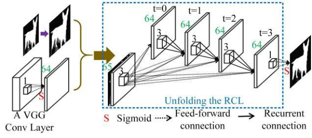

# DHSNet

[DHSNet: Deep Hierarchical Saliency Network for Salient Object Detection](https://openaccess.thecvf.com/content_cvpr_2016/papers/Liu_DHSNet_Deep_Hierarchical_CVPR_2016_paper.pdf)

## Code Source
```
# SALOD
link: https://github.com/moothes/SALOD
branch: master
commit: 59a4b280463ac9519420ad87c4f6666414f20aed
```

## Model Arch

### pre-processing

DHSNet系列网络的预处理操作可以按照如下步骤进行，即先对图片进行resize至一定尺寸，然后对其进行归一化等操作：

```python
image = cv2.imread(image_file)
img = cv2.resize(image, (input_size, input_size), interpolation=cv2.INTER_AREA)
img = cv2.cvtColor(img, cv2.COLOR_BGR2RGB)
mean = np.array([0.485, 0.456, 0.406])
std = np.array([0.229, 0.224, 0.225])
img = (img / 255.0 - mean) / std
img = np.ascontiguousarray(np.transpose(img, (2, 0, 1))).astype(np.float32) # HWC to CHW
img = np.expand_dims(img, axis=0)
```

### post-processing

DHSNet系列网络的后处理操作，主要有sigmoid和反归一化：
```python
out = np.squeeze(heatmap)
out = torch.from_numpy(out)
pred = (torch.sigmoid(out) * 255).cpu().numpy()
```

### backbone
局部差异为基础的方法，强调了边界但是忽视了物体内部。全局差异的方法，也强调了物体内部，但是细节内容同样不易保存。另一方面，检测大尺寸和复杂花纹的目标也很困难。特别是背景杂乱或者是与前景有相似花纹的物体。传统方法没有泛化到各种不同的场景。传统的提升显著性检测结果的方法非常消耗时间，这是显著性检测的计算效率的瓶颈。
如何去创建正真有意义的特征代表，如何同时去探索潜在的所有显著性线索，如何去找到优化整合的策略，如何有效保存目标细节，变成提升显著性目标检测方法最本质的问题。
为了解决这些问题我们提出一个端对端的深层次显著性检测框架DHSNet。DHSNet把整个图片当作是输入，直接输出显著性图，分层次检测目标从全局视角到局部内容，从粗略的尺寸到细微的尺寸。
- 提出一个端到端的显著性检测模型DHSNet。DHSNet能够同步学习有力的特征代表，信息显著性线索，和从全局视角学习他们最理想的组合机制，然后紧接着学习去调整显著性细节。
- 我们提出一个新的分层级的调整模型HRCNN。能够通过不使用跨分区的方法来引入局部内容信息分层和渐进调整显著性图来覆盖图片细节。能够有效提供提升显著性表现。这个也可以被用在其他的像素到像素的任务。
- 实验表明表现好而且很快，达到实时的23FPS。
  
<div  align="center">

</div>
Global View CNN网络，简称GV-CNN。GV-CNN对输入的整幅图片进行首次处理，生成一个粗略的显著图，用于粗略地检测和定位显著性目标。GV-CNN：包含一个VGG-16的13层卷积。一个全连接层，一个重塑层（reshape layer）。对于大小改变为224x224的输入图像，卷积层首先提取深度特征，最后一个卷积层大小为14x14x512，一个激活函数为sigmoid的全连接层输出节点为784个，然后重塑层使其大小变为28x28，我们称为SmG。合并显著性线索前，全连接层可以根据特征图学习显著性物体的检测以及定位。尽管GVCNN可以检测与定位显著性物体，但图像的细节，例如物体边界以及细微的结构，都丢失了。这是因为VGG的四层池化层使得空间信息遗失了许多，以及全连接层的参数总数与SmG的大小规模成线性增加，使得SmG的大小不得不很小，因此不满足要求，需要进一步的精细化。对于VGG的一个卷积，5x5的卷积会被拆成两个3x3的卷积，7x7的卷积会被拆成三个3x3的卷积。

引入递归卷积层Recurrent Convolutional Layer，RCL。它是HRCNN网络的核心组成部分。递归卷积层将递归连接并入每一卷积层中。

<div  align="center">

</div>

### common
- Global View CNN
- Hierarchical Recurrent Convolutional Neural Network，HRCNN
- Recurrent Convolutional Layer

## Model Info

### 模型性能

| Models  | Flops(G) | Params(M) | MAE ↓ | avg F-Measure ↑ | SM ↑ | Shapes |
| :---: | :--: | :--: | :---: | :--------: | :---: | :--------: |
| [DHSNet](https://github.com/moothes/SALOD) | 30.573  |  24.243 | 0.056   |  0.864  | 0.879  | 3x320x320  |
| DHSNet **vacc fp16** |  -  |  -  |  0.072  |  0.845  | 0.857  | 3x320x320 |
| DHSNet **vacc kl_divergence int8** |  -  |  -  |   0.072  |  0.848 | 0.862 |  3x320x320  |

> Tips
> 
> 512 size fp16&int8，run超时
> 

### 测评数据集说明


[ECSSD](http://www.cse.cuhk.edu.hk/leojia/projects/hsaliency/dataset.html)数据集，由香港中文大学的Yan等人于2013年建立, 包含了1000张图像, 这些图像由互联网得到。该数据集中的显著物体包含较复杂的结构, 且背景具备一定的复杂性。


<div  align="center">

</div>

### 评价指标说明
显著性目标检测主要的评测指标包括：
- 均值绝对误差（Mean Absolute Error，MAE），用于通过测量归一化映射和真值掩码之间平均像素方向的绝对误差来解决这个问题，越小越好
- EMD距离(earth movers distance，EMD)，衡量的是显著性预测结果P与连续的人眼注意力真值分布Q之间的相似性, 该度量方式被定义为:从显著性预测结果P上的概率分布转移到连续的人眼注意力真值分布Q上的最小代价。因而, EMD距离越小, 表示估计结果越准确
- 交叉熵(kullback-leibler divergence，KLD)，主要基于信息理论, 经常被用于衡量两个概率分布之间的距离，在人眼关注点检测中, 该指标被定义为:通过显著性预测结果P来近似连续的人眼注意力真值分布Q时产生的信息损失，越小越好
- 标准化扫描路径显著性(normalized scanpath saliency, NSS)，是专门为显著性检测设计的评估指标，该指标被定义为:对在人眼关注点位置归一化的显著性(均值为0和归一化标准差)求平均。越小越好
- 线性相关系数(linear correlation coefficient, CC)，是一种用于衡量两个变量之间相关性的统计指标，在使用该度量时, 将显著性预测结果P和连续的人眼注意力真值分布Q视为随机变量。然后, 统计它们之间的线性相关性。该统计指标的取值范围是[-1, +1].当该指标的值接近-1或+1时, 代表显著性预测结果与真值标定高度相似
- 相似性测度(similarity metric, SIM)指标，将显著性预测结果P和连续的人眼注意力真值分布Q视为概率分布, 将二者归一化后, 通过计算每一个像素上的最小值, 最后加和得到。当相似性测度为1时, 表示两个概率分布一致; 为0时, 表示二者完全不同
- AUC指标(the area under the receiver operating characteristic curve, 简称ROC曲线), 即受试者工作特性曲线下面积.ROC曲线是以假阳性概率(false positive rate, FPR)为横轴, 以真阳性概率(true positive rate, 简称TPR)为纵轴所画出的曲线。AUC即为ROC曲线下的面积, 通过在[0, 1]上滑动的阈值, 能够将显著性检测结果P进行二值化, 从而得到ROC曲线。ROC曲线越趋近于左上方, AUC数值越大, 说明算法性能越好。当接近1时, 代表着显著性估计与真值标定完全一致
- F-Measure，由于查准率和查全率相互制约, 且查准率-查全率曲线包含了两个维度的评估指标, 不易比较, 因而需要就二者进行综合考量。该指标同时考虑了查准率和查全率, 能够较为全面、直观地反映出算法的性能。F-值指标的数值越大, 说明算法性能越好
- 结构相似性（Structural measure，S-measure）：用以评估实值显著性映射与真实值之间的结构相似性，其中So和Sr分别指对象感知和区域感知结构的相似性，越大越好

## Build_In Deploy

- [salod.md](./source_code/salod.md)