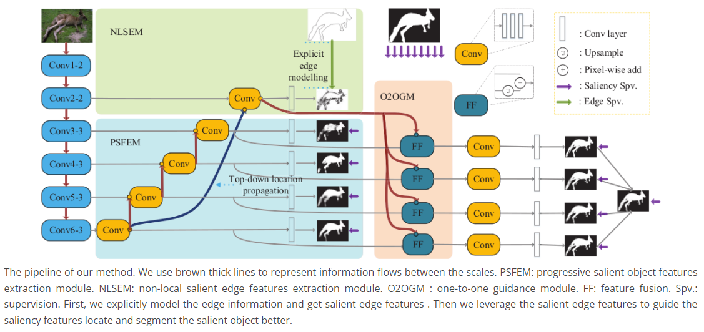
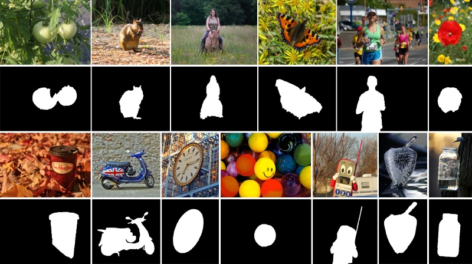

# EGNet

[EGNet: Edge Guidance Network for Salient Object Detection](https://openaccess.thecvf.com/content_ICCV_2019/papers/Zhao_EGNet_Edge_Guidance_Network_for_Salient_Object_Detection_ICCV_2019_paper.pdf)

## Code Source
```
# SALOD
link: https://github.com/moothes/SALOD
branch: master
commit: 59a4b280463ac9519420ad87c4f6666414f20aed
```

## Model Arch

### pre-processing

EGNet系列网络的预处理操作可以按照如下步骤进行，即先对图片进行resize至一定尺寸，然后对其进行归一化等操作：

```python
image = cv2.imread(image_file)
img = cv2.resize(image, (input_size, input_size), interpolation=cv2.INTER_AREA)
img = cv2.cvtColor(img, cv2.COLOR_BGR2RGB)
mean = np.array([0.485, 0.456, 0.406])
std = np.array([0.229, 0.224, 0.225])
img = (img / 255.0 - mean) / std
img = np.ascontiguousarray(np.transpose(img, (2, 0, 1))).astype(np.float32) # HWC to CHW
img = np.expand_dims(img, axis=0)
```

### post-processing

EGNet系列网络的后处理操作，主要有sigmoid和反归一化：
```python
out = np.squeeze(heatmap)
out = torch.from_numpy(out)
pred = (torch.sigmoid(out) * 255).cpu().numpy()
```

### backbone
全卷积神经网络(FCNs)在突出的目标检测任务中显示出了其优势。然而，大多数现有的基于fcns的方法仍然存在粗糙的对象边界。与基于区域的方法相比，像素级显著目标检测方法具有优势。然而，他们忽略了图像中的空间相干性，导致显著的物体边界不满意。大多数方法都希望通过融合多尺度信息来解决这一问题。一些方法使用后处理，如CRF来细化突出的对象边界。在NLDF中，他们提出了一个IOU损失来影响边缘周围位置的梯度。它们都不注意显著边缘检测和显著目标检测之间的互补性。一个良好的显著边缘检测结果可以帮助分割和定位中显著的目标检测任务，反之亦然。在此基础上，我们提出了一种EGNet，以端到端方式对互补的显著边缘信息和显著对象信息进行建模和融合。

我们重点研究了显著边缘信息和显著对象信息之间的互补性。为此，我们提出了一种用于显著目标检测的边缘制导网络(EGNet)，可以在一个单一网络中同时建模这两种互补信息。
- 在第一步中，我们通过一种渐进融合的方式提取显著的对象特征。
- 在第二步中，我们整合局部边缘信息和全局位置信息，得到显著的边缘特征。
- 最后，为了充分利用这些互补特征，我们将相同的显著边缘特征与不同分辨率的显著对象特征耦合。利用显著边缘特征中丰富的边缘信息和位置信息，融合后的特征可以帮助更准确地定位突出对象，特别是其边界。

<div  align="center">

</div>

- Progressive salient object features extraction，如图中的PSFEM所示，为了获得更丰富的上下文特征，我们利用广泛使用的架构UNet来生成多分辨率特征。与原来的U-Net不同，为了获得更鲁棒的显著对象特征，我们在每个边路径上添加三个卷积层(图中的Conv)，在每个卷积层之后增加一个ReLU层，以保证非线性。为了简单地说明，我们使用T表示这些卷积层和ReLU层。此外，对每条侧边路径都采用了深度监督。我们采用卷积层将特征映射转换为单通道预测掩模，并使用D来表示它。
- Non-local salient edge features extraction，在这个模块中，我们的目标是对显著边缘信息进行建模和提取显著边缘特征。如上所述，Conv2-2保存了更好的边缘信息。因此，我们从Conv2-2中提取局部边缘信息。然而，为了获得显著的边缘特征，只有局部信息是不够的。还需要高级的语义信息或位置信息。当信息像U-Net架构一样，逐步从顶层返回到低层次，高级位置信息逐渐被稀释。此外，顶层的感受域最大，位置最准确。因此，我们设计了一个自顶向下的位置传播方法，将顶层位置信息传播到侧路径S（2），以约束非凸性边缘。
- One-to-one guidance module，在获得互补的显著边缘特征和显著目标特征后，我们的目标是利用显著边缘特征来引导显著目标特征更好地进行分割和定位。最简单的方法是融合FE和Fˆ（3）。最好是充分利用多分辨率的显著对象特性。然而，将显著边缘特征和多分辨率显著对象特征从下到上逐步融合的缺点是，当显著对象特征融合时，显著边缘特征被稀释。此外，目标是融合显著目标特征和显著边缘特征，利用互补信息获得更好的预测结果。因此，我们提出了一个一对一的指导模块。具体来说，我们为S（3）、S（4）、S（5）、S（6）添加了子侧路径。在每条支线路径中，通过将显著边缘特征融合为增强的显著对象特征，使高级预测的位置更加准确，更重要的是，分割细节变得更好。


### common
- Progressive salient object features extraction
- Non-local salient edge features extraction
- One-to-one guidance module

## Model Info

### 模型性能
| Models  | Flops(G) | Params(M) | MAE ↓ | avg F-Measure ↑ | SM ↑ | Shapes |
| :---: | :--: | :--: | :---: | :--------: | :---: | :--------: |
| [EGNet](https://github.com/moothes/SALOD) | 495.069  | 111.660 | 0.032   |  0.928  | 0.931  | 3x320x320  |
| EGNet **vacc fp16** |  -  |  -  |  0.053  |  0.901  | 0.894  | 3x320x320 |
| EGNet **vacc kl_divergence int8** |  -  |  -  |   0.052  |  0.903 | 0.895 |  3x320x320  |

> Tips
> 
> 512 size fp16&int8，run超时
> 

### 测评数据集说明


[ECSSD](http://www.cse.cuhk.edu.hk/leojia/projects/hsaliency/dataset.html)数据集，由香港中文大学的Yan等人于2013年建立, 包含了1000张图像, 这些图像由互联网得到。该数据集中的显著物体包含较复杂的结构, 且背景具备一定的复杂性。


<div  align="center">

</div>

### 评价指标说明
显著性目标检测主要的评测指标包括：
- 均值绝对误差（Mean Absolute Error，MAE），用于通过测量归一化映射和真值掩码之间平均像素方向的绝对误差来解决这个问题，越小越好
- EMD距离(earth movers distance，EMD)，衡量的是显著性预测结果P与连续的人眼注意力真值分布Q之间的相似性, 该度量方式被定义为:从显著性预测结果P上的概率分布转移到连续的人眼注意力真值分布Q上的最小代价。因而, EMD距离越小, 表示估计结果越准确
- 交叉熵(kullback-leibler divergence，KLD)，主要基于信息理论, 经常被用于衡量两个概率分布之间的距离，在人眼关注点检测中, 该指标被定义为:通过显著性预测结果P来近似连续的人眼注意力真值分布Q时产生的信息损失，越小越好
- 标准化扫描路径显著性(normalized scanpath saliency, NSS)，是专门为显著性检测设计的评估指标，该指标被定义为:对在人眼关注点位置归一化的显著性(均值为0和归一化标准差)求平均。越小越好
- 线性相关系数(linear correlation coefficient, CC)，是一种用于衡量两个变量之间相关性的统计指标，在使用该度量时, 将显著性预测结果P和连续的人眼注意力真值分布Q视为随机变量。然后, 统计它们之间的线性相关性。该统计指标的取值范围是[-1, +1].当该指标的值接近-1或+1时, 代表显著性预测结果与真值标定高度相似
- 相似性测度(similarity metric, SIM)指标，将显著性预测结果P和连续的人眼注意力真值分布Q视为概率分布, 将二者归一化后, 通过计算每一个像素上的最小值, 最后加和得到。当相似性测度为1时, 表示两个概率分布一致; 为0时, 表示二者完全不同
- AUC指标(the area under the receiver operating characteristic curve, 简称ROC曲线), 即受试者工作特性曲线下面积.ROC曲线是以假阳性概率(false positive rate, FPR)为横轴, 以真阳性概率(true positive rate, 简称TPR)为纵轴所画出的曲线。AUC即为ROC曲线下的面积, 通过在[0, 1]上滑动的阈值, 能够将显著性检测结果P进行二值化, 从而得到ROC曲线。ROC曲线越趋近于左上方, AUC数值越大, 说明算法性能越好。当接近1时, 代表着显著性估计与真值标定完全一致
- F-Measure，由于查准率和查全率相互制约, 且查准率-查全率曲线包含了两个维度的评估指标, 不易比较, 因而需要就二者进行综合考量。该指标同时考虑了查准率和查全率, 能够较为全面、直观地反映出算法的性能。F-值指标的数值越大, 说明算法性能越好
- 结构相似性（Structural measure，S-measure）：用以评估实值显著性映射与真实值之间的结构相似性，其中So和Sr分别指对象感知和区域感知结构的相似性，越大越好

## Build_In Deploy

- [salod.md](./source_code/salod.md)