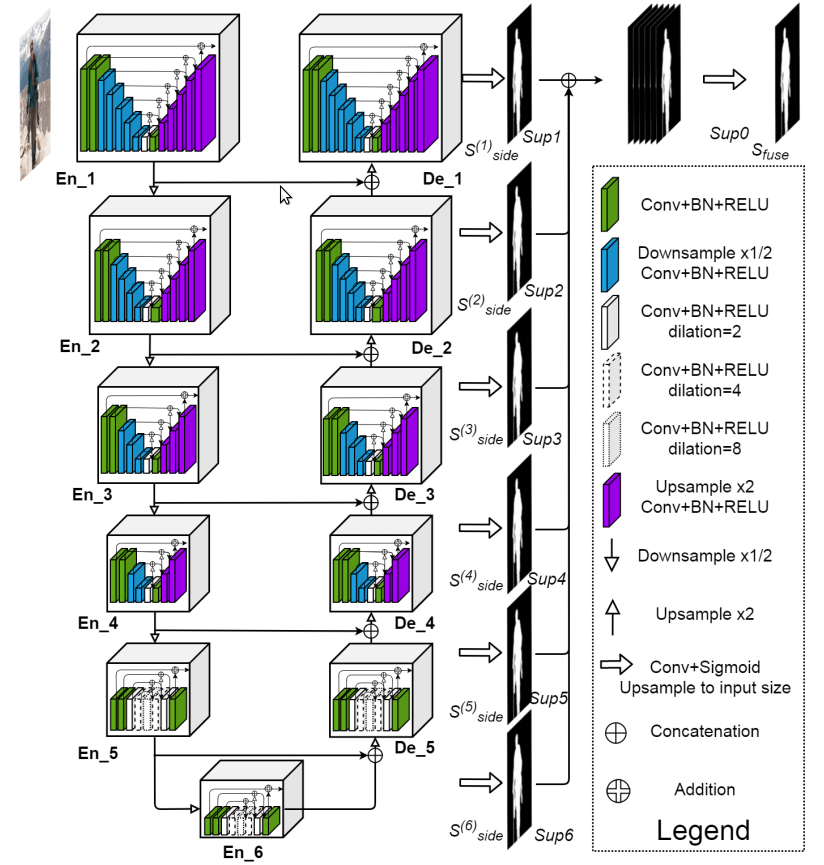

# U2Net

[U2-Net: Going Deeper with Nested U-Structure for Salient Object Detection](https://arxiv.org/pdf/2005.09007.pdf)

## Code Source
```
github: https://github.com/xuebinqin/U-2-Net/tree/master
branch: master
commit: 53dc9da026650663fc8d8043f3681de76e91cfde
```

## Model Arch

### pre-processing

U2Net系列网络的预处理操作可以按照如下步骤进行，即先对图片进行resize至一定尺寸，然后对其进行归一化等操作(两个来源预处理一致)：

```python
image = cv2.imread(image_file)
img = cv2.resize(image, (input_size, input_size), interpolation=cv2.INTER_AREA)
img = cv2.cvtColor(img, cv2.COLOR_BGR2RGB)
mean = np.array([0.485, 0.456, 0.406])
std = np.array([0.229, 0.224, 0.225])
img = (img / 255.0 - mean) / std
img = np.ascontiguousarray(np.transpose(img, (2, 0, 1))).astype(np.float32) # HWC to CHW
img = np.expand_dims(img, axis=0)
```

### post-processing

U2Net系列网络的后处理操作，主要有sigmoid和反归一化(两个来源后处理不一致，具体参考推理代码)：

```python
out = np.squeeze(heatmap)
out = torch.from_numpy(out)

ma = torch.max(out)
mi = torch.min(out)
res = (out-mi)/(ma-mi)
```

### backbone
- U2Net网络的主体是一个类似UNet的结构，网络的中的每个Encoder和Decoder模块也是类似UNet的结构，也就是在大的UNet中嵌入了一堆小UNet，所以作者给网络取名为U2Net
- 在原文中作者称每一个block为ReSidual U-block，图中block其实分为两种，一种是Encoder1到Encoder4加上Decoder1到Decoder4这八个结构相似，Encoder5与Encoder6，Decoder5又是另外一种结构
- 第一种block，在Encoder阶段，每通过一个block后都会通过最大池化层下采样2倍，在Decoder阶段，通过每一个block前都会用双线性插值进行上采样
- 第二种block，Encoder5和Decoder5，Encoder6使用是这个第二种block，由于经过了几次下采样，原图已经很小了，所以不再进行下采样，若再进行下采样，恐怕会丢失很多信息，这个block称为RSU-4F，主要是再RSU-4的基础上，将下采样和上采样换成了膨胀卷积，整个过程中特征图大小不变
- 最后，将每个阶段的特征图进行融合，主要是收集Decoder1、Decoder2、Decoder3、Decoder4、Decoder5、Encoder6的输出结果，对他们做3*3的卷积，卷积核个数为1，再用线性插值进行上采样恢复到原图大小，进行concat拼接，使用sigmoid函数输出最终分割结果

<div  align="center">

</div>

### common
- Ecode-Decode
- ReSidual U-block

## Model Info


### 模型性能
| Models  |Code Source | Flops(G) | Params(M) | MAE ↓ | avg F-Measure ↑ | SM ↑ | Shapes |
| :---: | :--: |  :--: |:--: | :---: | :--------: | :---: | :--------: |
| u2net |[Official](https://github.com/xuebinqin/U-2-Net/tree/master) | 130.610 | 44.010 | 0.033  | 0.922 | 0.928  | 3x320x320  |
| u2net **vacc fp16** |  -  |  -  | -  |  0.033  |  0.925  | 0.928  | 3x320x320 |
| u2net **vacc percentile int8** |  -  |  -  | -  |   0.034  |  0.921 | 0.926 |  3x320x320  |
| u2net_human_seg |[Official](https://github.com/xuebinqin/U-2-Net/tree/master) | 130.610 | 44.010 | 0.006   |  0.968  | 0.977  | 3x320x320  |
| u2net_human_seg **vacc fp16** |  -  |  -  | -  |  0.006  |  0.97  | 0.977  | 3x320x320 |
| u2net_human_seg **vacc percentile int8** |  -  |  -  | -  |   0.006  |  0.968 | 0.975 |  3x320x320  |
| u2netp |[Official](https://github.com/xuebinqin/U-2-Net/tree/master) | 44.185 | 1.131 | 0.041  |  0.902 | 0.917  | 3x320x320  |
| u2netp **vacc fp16** |  -  |  -  | -  |  0.041  |  0.904  | 0.917  | 3x320x320 |
| u2netp **vacc percentile int8** |  -  |  -  | -  |   0.149  |  0.587 | 0.662 |  3x320x320  |

> Tips
>
> `u2net_human_seg`和`u2net`使用同一网络结构，训练数据集不同


### 测评数据集说明


- [ECSSD](http://www.cse.cuhk.edu.hk/leojia/projects/hsaliency/dataset.html)数据集，由香港中文大学的Yan等人于2013年建立, 包含了1000张图像, 这些图像由互联网得到。该数据集中的显著物体包含较复杂的结构, 且背景具备一定的复杂性。


<div  align="center">

</div>

- [Supervisely Person](https://ecosystem.supervise.ly/projects/persons/)人像分割数据集，包含5711张图片，6884个人像注释。有一个背景，一个人像，共两个类别。

<div  align="center">

</div>


### 评价指标说明
显著性目标检测主要的评测指标包括：
- 均值绝对误差（Mean Absolute Error，MAE），用于通过测量归一化映射和真值掩码之间平均像素方向的绝对误差来解决这个问题
- EMD距离(earth movers distance，EMD)，衡量的是显著性预测结果P与连续的人眼注意力真值分布Q之间的相似性, 该度量方式被定义为:从显著性预测结果P上的概率分布转移到连续的人眼注意力真值分布Q上的最小代价。因而, EMD距离越小, 表示估计结果越准确
- 交叉熵(kullback-leibler divergence，KLD)，主要基于信息理论, 经常被用于衡量两个概率分布之间的距离，在人眼关注点检测中, 该指标被定义为:通过显著性预测结果P来近似连续的人眼注意力真值分布Q时产生的信息损失。越小越好
- 标准化扫描路径显著性(normalized scanpath saliency, NSS)，是专门为显著性检测设计的评估指标，该指标被定义为:对在人眼关注点位置归一化的显著性(均值为0和归一化标准差)求平均。越小越好
- 线性相关系数(linear correlation coefficient, CC)，是一种用于衡量两个变量之间相关性的统计指标，在使用该度量时, 将显著性预测结果P和连续的人眼注意力真值分布Q视为随机变量。然后, 统计它们之间的线性相关性。该统计指标的取值范围是[-1, +1].当该指标的值接近-1或+1时, 代表显著性预测结果与真值标定高度相似
- 相似性测度(similarity metric, SIM)指标，将显著性预测结果P和连续的人眼注意力真值分布Q视为概率分布, 将二者归一化后, 通过计算每一个像素上的最小值, 最后加和得到。当相似性测度为1时, 表示两个概率分布一致; 为0时, 表示二者完全不同
- AUC指标(the area under the receiver operating characteristic curve, 简称ROC曲线), 即受试者工作特性曲线下面积.ROC曲线是以假阳性概率(false positive rate, FPR)为横轴, 以真阳性概率(true positive rate, 简称TPR)为纵轴所画出的曲线。AUC即为ROC曲线下的面积, 通过在[0, 1]上滑动的阈值, 能够将显著性检测结果P进行二值化, 从而得到ROC曲线。ROC曲线越趋近于左上方, AUC数值越大, 说明算法性能越好。当接近1时, 代表着显著性估计与真值标定完全一致
- F-Measure，由于查准率和查全率相互制约, 且查准率-查全率曲线包含了两个维度的评估指标, 不易比较, 因而需要就二者进行综合考量。该指标同时考虑了查准率和查全率, 能够较为全面、直观地反映出算法的性能。F-值指标的数值越大, 说明算法性能越好
- 结构相似性（Structural measure，S-measure）：用以评估实值显著性映射与真实值之间的结构相似性，其中So和Sr分别指对象感知和区域感知结构的相似性。


## Build_In Deploy

- [official.md](./source_code/official.md)
