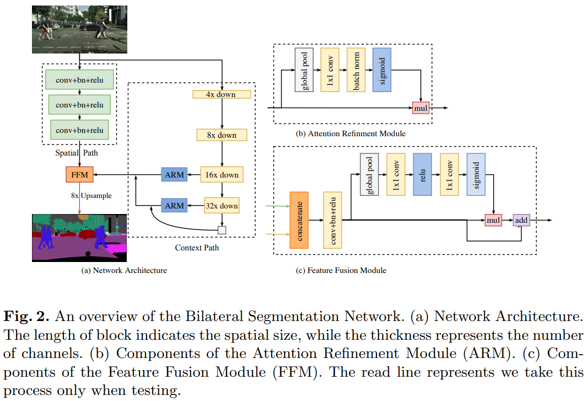
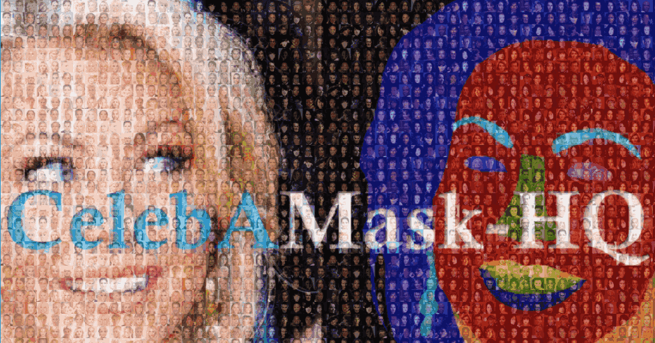
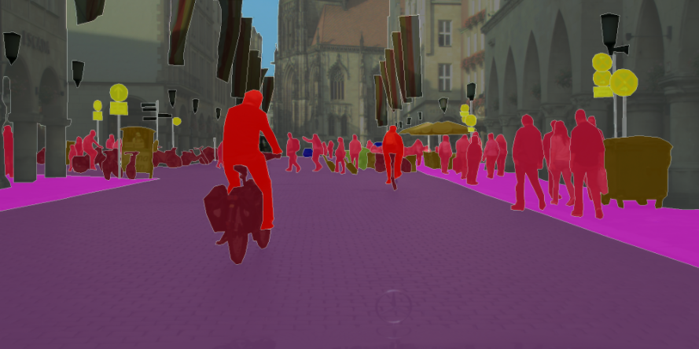

## BiSeNet

- Technical Report
    - [BiSeNet: Bilateral Segmentation Network for Real-time Semantic Segmentation](https://arxiv.org/abs/1808.00897)
    - [BiSeNet V2: Bilateral Network with Guided Aggregation for Real-time Semantic Segmentation](https://arxiv.org/abs/2004.02147)


## Code Source
```
# zllrunning for face-parsing
link: https://github.com/zllrunning/face-parsing.PyTorch
branch: master
commit: d2e684cf1588b46145635e8fe7bcc29544e5537e

# CoinCheung
link: https://github.com/CoinCheung/BiSeNet
branch: master
commit: f2b901599752ce50656d2e50908acecd06f7eb47
```


## Model Arch
<div  align="center">

</div>

### pre-processing

BiSeNet网络的预处理操作可以按照如下步骤进行，即先对图片进行resize至一定尺寸(512)，然后对其进行归一化、减均值除方差等操作（不同来源或数据集可能不一样，实际参考推理脚本）

```python
[
    torchvision.transforms.Resize(scale_size),
    torchvision.transforms.ToTensor(),
    torchvision.transforms.Normalize(mean=[0.485, 0.456, 0.406], std=[0.229, 0.224, 0.225],),
]
```

### post-processing

BiSeNet模型的后处理即是对网络输出的heatmap进行逐像素判断，比如一共19个类别，则网络会输出19个通道(18class+background)尺寸等于原图大小的heatmap，然后逐像素判断哪个通道数值大，就表示当前像素点所代表的类别为当前通道对应的类别。

### backbone

BiSeNet使用ResNet18或xception35作为骨架网络进行特征提取。

BiSeNet是一种新的双向分割网络，设计了一个带有小步长的空间路径来保留空间位置信息生成高分辨率的特征图；同时设计了一个带有快速下采样率的语义路径来获取客观的感受野。在这两个模块之上引入一个新的特征融合模块将二者的特征图进行融合，实现速度和精度的平衡。

- 空间路径Spatial Path使用较多的Channel、较浅的网络来保留丰富的空间信息生成高分辨率特征。减少下采样次数，只包含三个stride=2的Conv+BN+Relu，输出特征图的尺寸为原图的1/8。为了访存比考虑，此处并没有设计Residuals结构。由于它利用了较大尺度的特征图，所以可以编码比较丰富的空间信息。
- 上下文路径Context Path使用较少的Channel、较深的网络快速 downsample来获取充足的Context。上下文路径可以替换成任意的轻量网络，比如Xception，ShuffleNet系列，MobileNet系列。本文主要采用Xception39和ResNet-18进行实验。可以看到，为了准确率考虑，Context Path这边使用了类似U-shape结构的设计，最终进行了32倍下采样。不过，不同于普通的U-shape，此处只结合了最后两个Stage，这样设计的原因主要是考虑速度。Context Path依然在最后使用了Global Average Pooling来直接获取Global Context。
- 基于这两路网络的输出，文中还设计了一个Feature Fusion Module（FFM）来融合两种特征。在特征表示的层面上，两路网络的特征并不相同。因比不能简单地加权这些特征。由Spatial Path捕获的空间信息编码了绝大多数的丰富细节信息。而Context Path的输出特征主要编码语境信息。换言之，Spatial Path的输出特征是低层级的，Context Path的输出特征是高层级的。因此，提出一个独特的特征融合模块以融合这些特征。为了空间路径和上下文路径更好的融合，提出了特征融合模块FFM还有注意力优化模块ARM。
- ARM使用在上下文路径中，用于优化每一阶段的特征，使用全局平均池化指导特征学习，计算成本可以忽略。ARM应用全局平均池化来获取全局语义信息然后计算一个attention vector来知到特征学习。这个结构能够精细画Context Path中各个阶段的结果。它可以不用上采样就集成全局语义信息，计算代价较小。
- FFM，在特征的不同层级给定的情况下，特征融合模块首先连接Spatial Path和Context Path的输出特征；接着，通过批归一化平衡特征的尺度。下一步，像SENt一样，把相连接的特征池化为一个特征向量，并计算一个权重向量。这一权重向量可以重新加权特征，起到特征选择和结合的作用。将两个部分特征图通过concate方式叠加，然后使用类似SE模块的方式计算加权特征，起到特征选择和结合的作用。

相比于初版BiSeNetV1：
- V2简化了原始结构，使网络更加高效
- 使用更加紧凑的网络结构以及精心设计的组件，加深了Semantic Branch的网络，使用更加轻巧的深度可分离卷积来加速模型。
- 设计了更为有效的Aggregation Layer，以增强Semantic Branch和Detail Branch之间的链接。

### common

- Components of the Attention Refinement Module (ARM)
- Components of the Feature Fusion Module (FFM)


### 测评数据集说明

[CelebAMask-HQ](https://github.com/switchablenorms/CelebAMask-HQ)是一个大规模的面部图像数据集，通过遵循CelebA-HQ从CelebA数据集中选择了30,000张高分辨率面部图像。 每个图像具有对应于CelebA的面部属性的分割MASK，其采用512 x 512尺寸手动标注，分为19类，包括所有面部组件和配件，例如皮肤，鼻子，眼睛，眉毛，耳朵，嘴巴，嘴唇，头发，帽子，眼镜，耳环，项链，脖子和布。CelebAMask-HQ可用于训练和评估人脸解析，人脸识别以及用于人脸生成和编辑的GAN的算法。

<div  align="center">

</div>

[CityScapes](https://www.cityscapes-dataset.com/)数据集，即城市景观数据集，这是一个新的大规模数据集，其中包含不同的立体视频序列，记录在50个不同城市的街道场景。数据集被分为2975 train，500 val，1525 test，它具有19个类别的密集像素标注。

<div  align="center">

</div>


### 指标说明
- IoU并交比：两个区域重叠的部分除以两个区域的集合部分，取值TP/(TP+FN+FP)
- MIoU平均并交比：分割图像一般都有好几个类别，把每个分类得出的分数进行平均得到mean IoU，也就是mIoU，其是各种基准数据集最常用的标准之一，绝大数的图像语义分割论文中模型评估比较都以此作为主要评估指标。

## Build_In Deploy
- [zllrunning.md](./source_code/zllrunning.md)
- [coincheung.md](./source_code/coincheung.md)