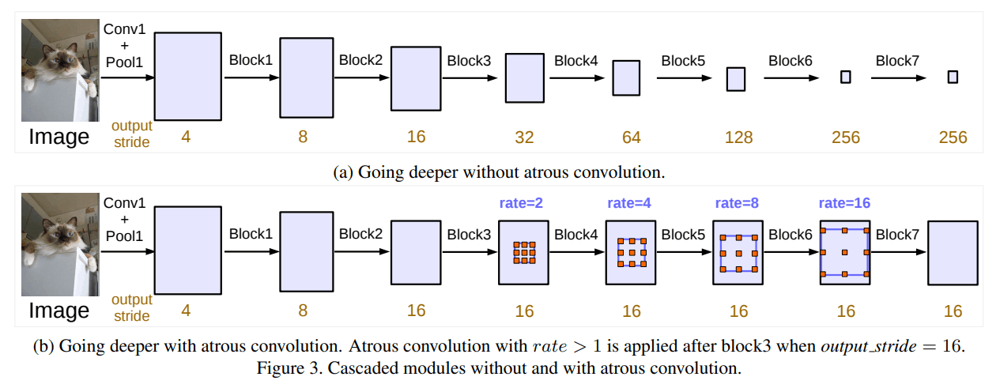
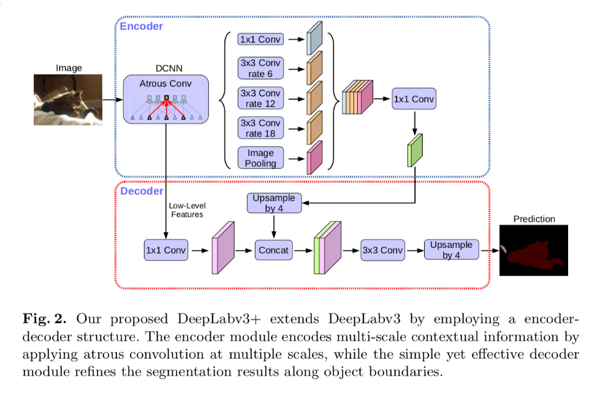

## Deeplab_v3

- Technical Report
    - [Rethinking Atrous Convolution for Semantic Image Segmentation](https://arxiv.org/abs/1706.05587)


## Code Source
```
link: https://github.com/VainF/DeepLabV3Plus-Pytorch
branch: master
commit: 4e1087de98bc49d55b9239ae92810ef7368660db
```


## Model Arch
<div  align="center">

</div>

### pre-processing

DeepLab_v3网络的预处理操作可以按照如下步骤进行，即先对图片进行resize至一定尺寸(513)，然后对其进行归一化、减均值除方差等操作

```python
[
    torchvision.transforms.Resize(scale_size),
    torchvision.transforms.ToTensor(),
    torchvision.transforms.Normalize(mean=[0.485, 0.456, 0.406], std=[0.229, 0.224, 0.225],),
]
```

### post-processing

DeepLab_v3算法的后处理即是对网络输出的heatmap进行逐像素判断，比如一共20个类别，则网络会输出21个通道(20class+background)尺寸等于原图大小的heatmap，然后逐像素判断哪个通道数值大，就表示当前像素点所代表的类别为当前通道对应的类别

### backbone

DeepLab_v3使用ResNet(50/101)作为骨架网络进行特征提取，取ResNet中最后一个block4，并在其后面增加级联模块，运用不同空洞率的空洞卷积代替传统卷积。
为捕获multi-scale context，借鉴图像金字塔、encode-decode等方法，改善v2版本中的空洞空间金字塔池化ASPP模块，加入BN层，将v2中的ASPP中尺寸3×3，dilation=24的空洞卷积替换成一个普通的1×1卷积，以保留滤波器中间部分的有效权重；增加了全局平均池化以便更好的捕捉全局信息。

<div  align="center">

</div>

DeepLab_v3+的主要改进：
- 将SPP和encoder-decoder结构结合起来
- 在ASPP模块和decoder模块中引入深度可分离卷积
- Modified Aligned Xception更深的骨架网络
- 所有的最大池化结构都被stride=2的深度可分离卷积代替
- 每个3x3的深度卷积后都跟着BN和Relu
- 在Encoder部分，对压缩四次的初步有效特征层利用ASPP结构特征提取，然后进行合并，再进行1x1卷积压缩特征
- 在Decoder中，我们会对压缩两次的初步有效特征层利用1x1卷积调整通道数，与上面经过ASPP处理的特征进行连接，之后进行两次卷积操作得到最终的特征图

<div  align="center">

</div>

### common

- Atrous Convolution
- ASPP

## Model Info

### 模型精度


|Methods|FLOPs(G)|Params(M)|MIoU|VACC MIoU|Shapes|
|:-:|:-:|:-:|:-:|:-:|:-:|
|[DeepLabV3-MobileNet](https://github.com/VainF/DeepLabV3Plus-Pytorch)|13.372|5.114|70.100|fp16 67.816<br>int8 64.441|3×513×513|
|[DeepLabV3-ResNet50](https://github.com/VainF/DeepLabV3Plus-Pytorch)	|114.137|39.639|76.900|fp16 72.671<br>int8 72.330|3×513×513|
|[DeepLabV3-ResNet101](https://github.com/VainF/DeepLabV3Plus-Pytorch)	|160.224|58.631|77.300|fp16 75.289<br>int8 74.492|3×513×513|
|[DeepLabV3Plus-MobileNet](https://github.com/VainF/DeepLabV3Plus-Pytorch)	|37.799|5.226|71.100|fp16 70.648<br>int8 69.137|3×513×513|
|[DeepLabV3Plus-ResNet50](https://github.com/VainF/DeepLabV3Plus-Pytorch)	|139.293|39.76|77.200|fp16 72.723<br>int8 72.032|3×513×513|
|[DeepLabV3Plus-ResNet101](https://github.com/VainF/DeepLabV3Plus-Pytorch)	|185.381|58.754|78.300|fp16 75.751<br>int8 75.143|3×513×513|


### 测评数据集说明

[PASCAL VOC](http://host.robots.ox.ac.uk/pascal/VOC/voc2012/)数据集除了用于object detection任务之外，还用于segmentation等任务，该数据集包含20个对象类，加背景共21类。

数据集子文件夹SegmentationClass内存放了JPEGimages中部分对应的pixel-level标注，以png形式存放，用于语义分割。

<div  align="center">

</div>


### 指标说明
- IoU并交比：两个区域重叠的部分除以两个区域的集合部分，取值TP/(TP+FN+FP)
- MIoU平均并交比：分割图像一般都有好几个类别，把每个分类得出的分数进行平均得到mean IoU，也就是mIoU，其是各种基准数据集最常用的标准之一，绝大数的图像语义分割论文中模型评估比较都以此作为主要评估指标。


## Build_In Deploy

### step.1 模型准备
1. 下载模型权重

    ```
    link: https://github.com/VainF/DeepLabV3Plus-Pytorch
    branch: master
    commit: 4e1087de98bc49d55b9239ae92810ef7368660db
    ```

2. 模型导出

    一般在原始仓库内进行模型转为onnx或torchscript。在原仓库test或val脚本内，如[predict.py#L102](https://github.com/VainF/DeepLabV3Plus-Pytorch/blob/master/predict.py#L102)，定义模型和加载训练权重后，添加以下脚本可实现：

    ```python
    args.weights_test = "path/to/trained/weight.pth"
    model = model.eval()
    input_shape = (1, 3, 513, 513)
    shape_dict = [("input", input_shape)]
    input_data = torch.randn(input_shape)
    scripted_model = torch.jit.trace(model, input_data).eval()
    scripted_model.save(args.weights_test.replace(".pth", ".torchscript.pt"))
    scripted_model = torch.jit.load(args.weights_test.replace(".pth", ".torchscript.pt"))

    import onnx
    torch.onnx.export(model, input_data, args.weights_test.replace(".pth", ".onnx"), input_names=["input"], output_names=["output"], opset_version=11,
                # dynamic_axes= {
                #                 "input": {0: 'batch_size', 2 : 'in_height', 3: 'in_width'},
                #                 "output": {0: 'batch_size', 2: 'out_height', 3:'out_width'}
                #                 }
    )
    shape_dict = {"input": input_shape}
    onnx_model = onnx.load(args.weights_test.replace(".pth", ".onnx"))
    ```

### step.2 准备数据集
- 下载[Pascal VOC2012](http://host.robots.ox.ac.uk/pascal/VOC/voc2012/)数据集，解压

### step.3 模型转换
1. 根据具体模型修改模型转换配置文件
    - [official_deeplab_v3.yaml](./build_in/build/official_deeplab_v3.yaml)
        
    > - 编译参数`backend.type: tvm_vacc`
    > - fp16精度: 编译参数`backend.dtype: fp16`
    > - int8精度: 编译参数`backend.dtype: int8`，需要配置量化数据集和预处理算子

2. 模型编译

    ```bash
    cd deeplab_v3
    mkdir workspace
    cd workspace
    vamc compile ../build_in/build/official_deeplab_v3.yaml
    ```

### step.4 模型推理
1. 参考[vsx_inference.py](./build_in/vsx/vsx_inference.py)，修改参数并运行如下脚本
    ```bash
    python ../build_in/vsx/vsx_inference.py \
        --file_path  /path/to/VOCdevkit/VOC2012/JPEGImages_val \
        --model_prefix_path deploy_weights/official_deeplab_v3_int8/mod \
        --vdsp_params_info ../build_in/vdsp_params/vainf-deeplab_v3_resnet50-vdsp_params.json \
        --gt_path /path/to/VOCdevkit/VOC2012/SegmentationClass \
        --save_dir ./infer_output \
        --device 0
    ```
    ```
    # official_deeplab_v3_int8 精度参考
    validation pixAcc: 93.896, mIoU: 73.926
    ```

### step.5 性能精度测试
1. 基于[image2npz.py](./build_in/vdsp_params/image2npz.py)，将评估数据集转换为npz格式，生成对应的`npz_datalist.txt`
    > 注意只转换`VOC2012/ImageSets/Segmentation/val.txt`对应的验证集图像（配置相应路径）：
    ```bash
    python ./build_in/vdsp_params/image2npz.py \
    --dataset_path VOC2012/JPEGImages \
    --target_path  VOC2012/JPEGImages_npz \
    --text_path npz_datalist.txt
    ```

2. 性能测试，配置vdsp参数[vainf-deeplab_v3_mobilenet-vdsp_params.json](./build_in/vdsp_params/vainf-deeplab_v3_mobilenet-vdsp_params.json)，执行：
    ```bash
    vamp -m deploy_weights/official_deeplab_v3_int8/mod \
    --vdsp_params ../build_in/vdsp_params/vainf-deeplab_v3_resnet50-vdsp_params.json \
    -i 1 p 1 -b 1 -s [3,513,513]
 

> 可选步骤，和step.4的精度测试基本一致

3. 精度测试，推理得到npz结果：
    ```bash
    vamp -m deploy_weights/official_deeplab_v3_int8 \
    --vdsp_params ../build_in/vdsp_params/vainf-deeplab_v3_resnet50-vdsp_params.json \
    -i 1 p 1 -b 1 -s [3,513,513] \
    --datalist npz_datalist.txt \
    --path_output npz_output
    ```

4. [vamp_eval.py](./build_in/vdsp_params/vamp_eval.py)，解析npz结果，绘图并统计精度：
   ```bash
    python ../build_in/vdsp_params/vamp_eval.py \
    --src_dir VOC2012/JPEGImages_val \
    --gt_dir VOC2012/SegmentationClass \
    --input_npz_path npz_datalist.txt \
    --out_npz_dir ./npz_output \
    --input_shape 513 513 \
    --draw_dir npz_draw_result \
    --vamp_flag
   ```
