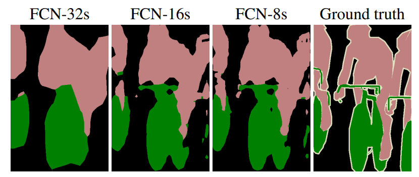
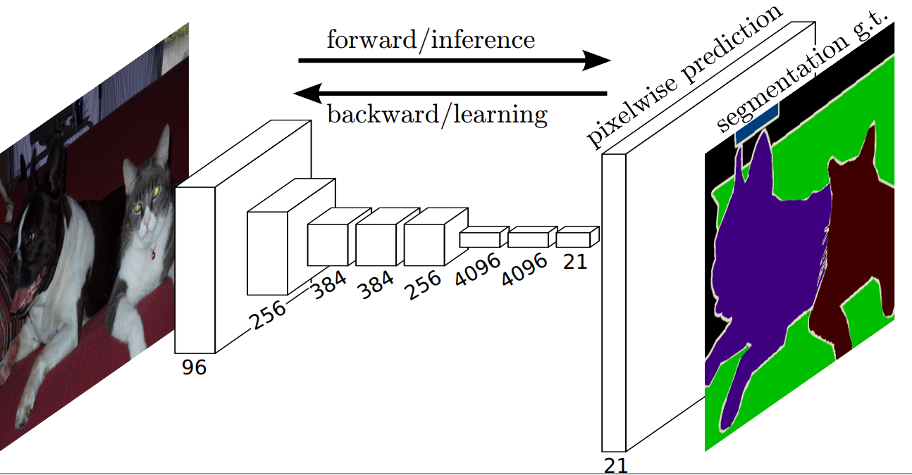

## FCN
- Technical Report
    - [Fully Convolutional Networks for Semantic Segmentation](https://arxiv.org/abs/1411.4038)


## Code Source
```
# awesome
link: https://github.com/Tramac/awesome-semantic-segmentation-pytorch/blob/master/core/models/fcn.py
branch: master
commit: b8366310de50869f89e836ed24de24edd432ece5

# mmsegmentation
link: https://github.com/open-mmlab/mmsegmentation
branch: v1.0.0rc2
commit: 8a611e122d67b1d36c7929331b6ff53a8c98f539
```

<div  align="center">

</div>


## Model Arch

<div  align="center">

</div>

### pre-processing

FCN网络的预处理操作可以按照如下步骤进行，即先对图片进行resize至一定尺寸(320)，然后对其进行归一化、减均值除方差等操作（不同来源或数据集可能不一样，实际参考推理脚本）

```python
[
    torchvision.transforms.Resize(scale_size),
    torchvision.transforms.CenterCrop(input_size),
    torchvision.transforms.ToTensor(),
    torchvision.transforms.Normalize(mean=[0.485, 0.456, 0.406], std=[0.229, 0.224, 0.225],),
]
```

### post-processing

FCN算法的后处理即是对网络输出的heatmap进行逐像素判断，比如一共20个类别，则网络会输出21个通道(20class+background)尺寸等于原图大小的heatmap，然后逐像素判断哪个通道数值大，就表示当前像素点所代表的类别为当前通道对应的类别

### backbone

FCN将传统CNN中的全连接层转化成一个个的卷积层进行下采样提取特征，然后采用反卷积层或者上采样层对最后一个卷积层的feature map进行上采样, 使它恢复到输入图像相同的尺寸，从而可以对每个像素都产生了一个预测, 同时保留了原始输入图像中的空间信息, 最后在上采样的特征图上进行逐像素分类。因为FCN为全卷积层，因此可以接受任意尺寸的输入图像。

### common

- interpolate

## Model Info

### 模型精度


|                                           Methods                                           | Code Source | Backbone | FLOPs(G) | Params(M) | MIoU |   Shapes   |
| :------------------------------------------------------------------------------------------: | :-----------: | :------: | :------: | :-------: | :------: | :---------: |
| fcn8s |     [awesome](https://github.com/Tramac/awesome-semantic-segmentation-pytorch/blob/master/README.md)        |  vgg16  | 178.434 |  30.038  |  50.959  | 3×320×320 |
|                                   fcn8s **vacc fp16**                                   |     -        |    -    |    -    |     -     |  50.623  | 3×320×320 |
|                            fcn8s **vacc int8 kl_divergence**                            |      -       |    -    |    -    |     -     |  50.611  | 3×320×320 |
| fcn16s |      [awesome](https://github.com/Tramac/awesome-semantic-segmentation-pytorch/blob/master/README.md)       |  vgg16  | 178.422 |  30.033  |  53.339  | 3×320×320 |
|                                  fcn16s **vacc fp16**                                  |       -      |    -    |    -    |     -     |  53.232  | 3×320×320 |
|                           fcn16s **vacc int8 kl_divergence**                           |      -       |    -    |    -    |          |  53.217  | 3×320×320 |
| fcn32s |     [awesome](https://github.com/Tramac/awesome-semantic-segmentation-pytorch/blob/master/README.md)        |  vgg16  |  44.667  |  15.307  |  49.961  | 3×320×320 |
|                                  fcn32s **vacc fp16**                                  |       -      |    -    |    -    |          |  49.356  | 3×320×320 |
|                           fcn32s **vacc int8 kl_divergence**                           |       -      |    -    |    -    |          |  49.339  | 3×320×320 |
|     fcn_r50_d8_20k     |      [mmsegmentation](https://github.com/open-mmlab/mmsegmentation/tree/master/configs/fcn)       | resnet50 |          |          |  67.08  | 3×512×512 |
|                              fcn_r50_d8_20k **vacc fp16**                              |      -       |    -    |    -    |     -     |  66.304  | 3×512×512 |
|                       fcn_r50_d8_20k **vacc int8 kl_divergence**                       |       -      |    -    |    -    |     -     |  66.268  | 3×512×512 |
|     fcn_r50_d8_40k     |      [mmsegmentation](https://github.com/open-mmlab/mmsegmentation/tree/master/configs/fcn)       | resnet50 |          |          |  66.97  | 3×512×512 |
|                              fcn_r50_d8_40k **vacc fp16**                              |      -       |    -    |    -    |     -     |  66.493  | 3×512×512 |
|                       fcn_r50_d8_40k **vacc int8 kl_divergence**                       |       -      |    -    |    -    |     -     |  66.732  | 3×512×512 |
|     fcn_r101_d8_20k     |     [mmsegmentation](https://github.com/open-mmlab/mmsegmentation/tree/master/configs/fcn)        | resnet50 |          |          |  71.16  | 3×512×512 |
|                              fcn_r101_d8_20k **vacc fp16**                              |      -       |    -    |    -    |     -     |  70.175  | 3×512×512 |
|                       fcn_r101_d8_20k **vacc int8 kl_divergence**                       |      -       |    -    |    -    |     -     |  70.535  | 3×512×512 |
|     fcn_r101_d8_40k     |     [mmsegmentation](https://github.com/open-mmlab/mmsegmentation/tree/master/configs/fcn)        | resnet50 |          |          |  69.91  | 3×512×512 |
|                              fcn_r101_d8_40k **vacc fp16**                              |      -       |    -    |    -    |     -     |  70.049  | 3×512×512 |
|                       fcn_r101_d8_40k **vacc int8 kl_divergence**                       |      -       |    -    |    -    |     -     |  71.181  | 3×512×512 |

> Tips
> 
> - awesome项目并未提供模型权重，我们重新训练了模型，原始Torch模型精度一般
>

### 测评数据集说明

[PASCAL VOC](http://host.robots.ox.ac.uk/pascal/VOC/voc2012/)数据集除了用于object detection任务之外，还用于segmentation等任务，该数据集包含20个对象类，加背景共21类。

数据集子文件夹SegmentationClass内存放了JPEGimages中部分对应的pixel-level标注，以png形式存放，用于语义分割。

<div  align="center">

</div>


### 指标说明
- IoU并交比：两个区域重叠的部分除以两个区域的集合部分，取值TP/(TP+FN+FP)
- MIoU平均并交比：分割图像一般都有好几个类别，把每个分类得出的分数进行平均得到mean IoU，也就是mIoU，其是各种基准数据集最常用的标准之一，绝大数的图像语义分割论文中模型评估比较都以此作为主要评估指标。


## Build_In Deploy
- [awesome.md](./source_code/awesome.md)
- [mmseg.md](./source_code/mmseg.md)
