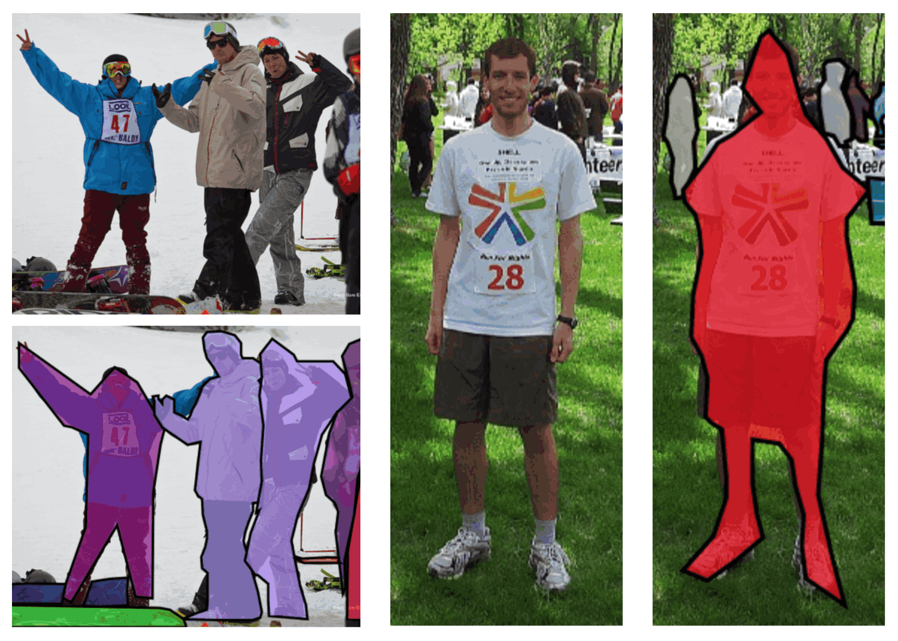

# Human_seg


## Code Source
```
link: https://github.com/thuyngch/Human-Segmentation-PyTorch
branch: master
commit: b15baef04e7b628c01a4526de5e14f9524f18da6
```

## Model Arch

### describe

将人物和背景在像素级别进行区分，是一个图像分割的经典任务，具有广泛的应用。 一般而言，该任务可以分为两类：针对半身人像的分割，简称肖像分割；针对全身和半身人像的分割，简称通用人像分割。

构建人体和背景两个类别，human_seg可直接使用unet等语义分割模型实现。

## Model Info

### 模型精度

| Model | FLOPs(G)|params(M)  |  train mIoU | vacc mIOU |
|:-:|:-:|:-:|:-:|:-:|
| [UNet_MobileNetV2](https://github.com/thuyngch/Human-Segmentation-PyTorch) |  1.3 |4.7 |  85.56 |fp16 76.35 <br/> int8 76.71|
| [UNet_ResNet18](https://github.com/thuyngch/Human-Segmentation-PyTorch) |  9.1 |16.6 | 91.62 |fp16 88.09 <br/> int8 88.00|
| [DeepLab3Plus_ResNet18](https://github.com/thuyngch/Human-Segmentation-PyTorch) |  9.1 |16.6 | 82.13 |fp16 - <br/> int8 73.92|
| [BiSeNet_ResNet18](https://github.com/thuyngch/Human-Segmentation-PyTorch) |  4.7 |11.9 | 80.77 |-|
| [PSPNet_ResNet18](https://github.com/thuyngch/Human-Segmentation-PyTorch) |  20.7 |12.6 | - | -|
| [ICNet_ResNet18](https://github.com/thuyngch/Human-Segmentation-PyTorch) |  2.0 |11.6 | 87.74 |-|


### 测评数据集说明

[Supervisely Person](https://ecosystem.supervise.ly/projects/persons/)人像分割数据集，包含5711张图片，6884个人像注释。有一个背景，一个人像，共两个类别。

<div  align="center">

</div>


### 指标说明
- IoU并交比：两个区域重叠的部分除以两个区域的集合部分，取值TP/(TP+FN+FP)
- MIoU平均并交比：分割图像一般都有好几个类别，把每个分类得出的分数进行平均得到mean IoU，也就是mIoU，其是各种基准数据集最常用的标准之一，绝大数的图像语义分割论文中模型评估比较都以此作为主要评估指标。


## Build_In Deploy

### step.1 模型准备

1. 下载模型权重

    ```
    link: https://github.com/thuyngch/Human-Segmentation-PyTorch
    branch: master
    commit: b15baef04e7b628c01a4526de5e14f9524f18da6
    ```

2. 模型导出
    一般在原始仓库内进行模型转为onnx或torchscript。在原仓库test或val脚本内，如[inference_video.py#L100](https://github.com/thuyngch/Human-Segmentation-PyTorch/blob/master/inference_video.py#L100)，定义模型和加载训练权重后，添加以下脚本可实现：

    ```python
    args.weights_test = "path/to/trained/weight.pth"
    model = self.model.eval()
    input_shape = (1, 3, 320, 320)
    shape_dict = [("input", input_shape)]
    input_data = torch.randn(input_shape)
    scripted_model = torch.jit.trace(model, input_data).eval()
    scripted_model.save(args.weights_test.replace(".pth", ".torchscript.pt"))
    scripted_model = torch.jit.load(args.weights_test.replace(".pth", ".torchscript.pt"))

    import onnx
    torch.onnx.export(model, input_data, args.weights_test.replace(".pth", ".onnx"), input_names=["input"], output_names=["output"], opset_version=11)
    shape_dict = {"input": input_shape}
    onnx_model = onnx.load(args.weights_test.replace(".pth", ".onnx"))
    ```


### step.2 准备数据集
- 下载[Supervisely Person](https://ecosystem.supervise.ly/projects/persons/)数据集，解压
- 按此链接整理转换数据集：[blog](https://blog.csdn.net/u011622208/article/details/108535943)

### step.3 模型转换
1. 根据具体模型修改模型转换配置文件
    - [official_human_seg.yaml](./build_in/build/official_human_seg.yaml)
    
    > - runstream推理，编译参数`backend.type: tvm_vacc`
    > - fp16精度: 编译参数`backend.dtype: fp16`
    > - int8精度: 编译参数`backend.dtype: int8`，需要配置量化数据集和预处理算子

2. 模型编译
    ```bash
    cd human_seg
    mkdir workspace
    cd workspace
    vamc compile ../build_in/build/official_human_seg.yaml
    ```

### step.4 模型推理
1. runstream推理，参考：[vsx_inference.py](./build_in/vsx/python/vsx_inference.py)
    ```bash
    python ../build_in/vsx/python/vsx_inference.py \
        --image_dir  /path/to/Supervisely_Person_Dataset/src/ \
        --model_prefix_path deploy_weights/official_human_seg_run_stream_fp16/mod \
        --vdsp_params_info ../build_in/vdsp_params/thuyngch-unet_resnet18-vdsp_params.json \
        --mask_dir /path/to/Supervisely_Person_Dataset/mask/ \
        --save_dir ./runstream_output \
        --device 0
    ```

    ```
    # int8
    mean iou: 88.60116600990295

    # fp16
    mean iou: 88.68908286094666
    ```

### step.5 性能精度测试
1. 性能测试
    - 配置vdsp参数[thuyngch-deeplabv3plus_resnet18-vdsp_params.json](./build_in/vdsp_params/thuyngch-deeplabv3plus_resnet18-vdsp_params.json)
    ```bash
    vamp -m deploy_weights/official_human_seg_run_stream_fp16/mod \
    --vdsp_params ../build_in/vdsp_params/thuyngch-deeplabv3plus_resnet18-vdsp_params.json \
    -i 2 p 2 -b 1
    ```

2. 精度测试
    - 数据准备，基于[image2npz.py](./build_in/vdsp_params/image2npz.py)，将评估数据集转换为npz格式，生成对应的`npz_datalist.txt`
    ```bash
    python ../build_in/vdsp_params/image2npz.py \
        --dataset_path Supervisely_Person_Dataset/src \
        --target_path  Supervisely_Person_Dataset/src_npz \
        --text_path npz_datalist.txt
    ```
    
    - vamp推理得到npz结果：
    ```bash
    vamp -m deploy_weights/official_human_seg_run_stream_fp16/mod \
        --vdsp_params ../build_in/vdsp_params/thuyngch-deeplabv3plus_resnet18-vdsp_params.json \
        -i 2 p 2 -b 1 \
        --datalist npz_datalist.txt \
        --path_output npz_output
    ```
    
    - 解析npz结果并统计精度, 参考：[vamp_eval.py](../build_in/vdsp_params/vamp_eval.py)
   ```bash
    python ../build_in/vdsp_params/vamp_eval.py \
        --src_dir Supervisely_Person_Dataset/src \
        --gt_dir Supervisely_Person_Dataset/mask \
        --input_npz_path npz_datalist.txt \
        --out_npz_dir ./npz_output \
        --input_shape 320 320 \
        --draw_dir npz_draw_result \
        --vamp_flag
   ```