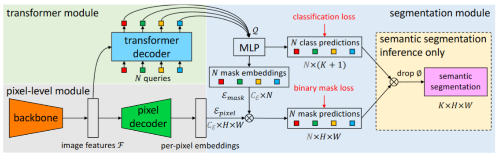
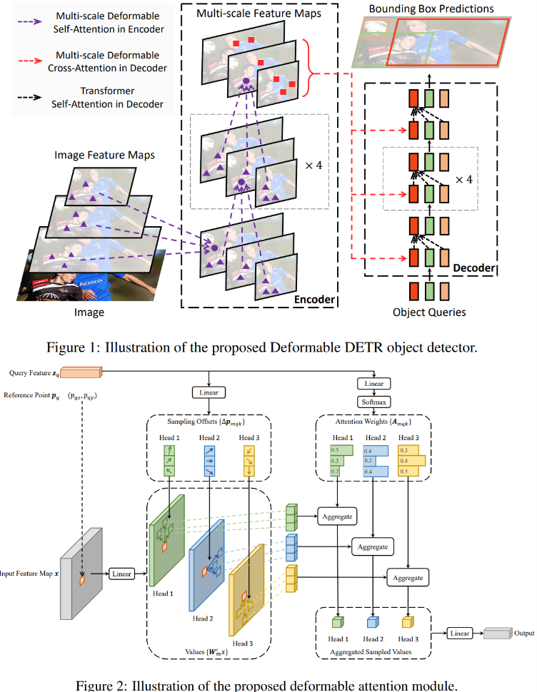
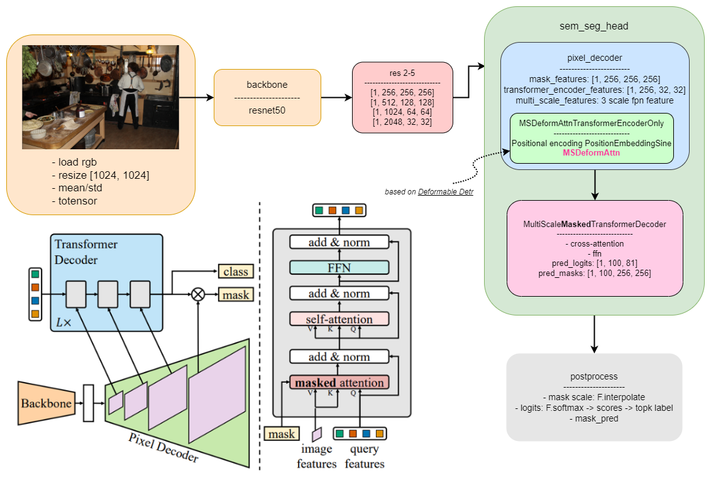

# Mask2Former

[Masked-attention Mask Transformer for Universal Image Segmentation](https://arxiv.org/abs/2112.01527)

## Model Arch
- 首先，回顾Mask2Former的前作——MaskFormer的基础结构

    整体框架如图所示，分为pixel-level模型，Transformer模型以及分割模型。首先通过backbone提取出图像特征，再将其送入解码器以生成像素嵌入特征。在Transformer模型中，使用低分辨率的图像特征作为K和V，结合0初始化的查询向量query通过Transformer decoder生成N个预分割嵌入向量Q。通过MLP将Q一支送去分类，另一只映射到像素嵌入的空间，进行mask的预测。最后将mask预测和类别预测进行矩阵相乘送去分割。


    <div align=center></div>

- Deformable Attention

    可变形注意力的简单原理：query不是和全局每个位置的key都计算注意力权重，而是对于每个query，仅在全局位置中采样部分位置的key，并且value也是基于这些位置进行采样插值得到的，最后将这个局部&稀疏的注意力权重施加在对应的value上。

    <div align=center></div>

- Deformable Transformer

    这里的Transformer和DETR中的大体过程一致，最主要的区别在于用可变形注意力替代了Encoder中的自注意力（self-attention）以及Decoder中的交叉注意力（cross-attention）。


- Mask2Former

    Mask2Former采用与MaskFormer相同的元架构，具有backbone、像素解码器和transformer解码器。

    - backbone从图像中提取低分辨率特征的主干。
    - 像素解码器，从主干的输出中逐渐上采样低分辨率的特征，以生成高分辨率的逐像素嵌入。
    - Transformer解码器，它通过图像特征处理对象查询。

    背景特征已经被证明对图像分割非常重要。然而，最近的研究表明，基于transformer的模型收敛缓慢是由于交叉注意层的全局上下文，交叉注意学习关注局部对象区域需要许多训练时间。假设局部特征足以更新查询特征，通过自我注意可以收集上下文信息。
    
    为此，提出了掩码注意，这是交叉注意的一种变体，对每个查询只关注预测掩码的前景区域，这使得每个通过Transformer的特征只在前景区域进行特证间的交互，而不是每个像素对整张图像都做注意力。基于此想法提出了假设：假设局部前景特征足以保证query向量的更新，以及局部前景特征通过自注意力机制可以获取有保证的上下文信息。

    为了帮助分割小目标，本文使用了一种特征金字塔结构，该结构采用特征由低像素到高像素的策略，每次将不同分辨率的特征送入一个Transformer Decoder。具体而言是使用pixel decoder产生的1/32，1/16，1/8的特征，结合正弦位置嵌入，以及可学习的尺度规模嵌入。依次由低到高的送入Transformer Decoder，3次为一个循环，共循环L次（也即共送入3L个Transformer Decoder）。

    在进行完上述改进后，还针对Transformer进行了进一步的改进。首先本文交换了self-attention和cross-attention（mask attention）的位置，因为第一层自注意力的查询特征与图像无关，没有来自图像的信号，故用自注意力不太可能丰富信息，所以进行交换。其次，将MaskFormer中0初始化的Query特征换为可学习的参数，并以次直接监督的生成。最后，作者发现Transformer中的Dropout是非必要的，故将Transformer Decoder中的Dropout其全部去掉。

    最后为了提升训练效率，且受到PointRend和Implicit PointRend的启发，在匹配损失计算时，对所有预测值和mask掩码进行统一采样相同的K个点组成集合进行计算。在计算整体loss时，在不同对的预测值和真实值通过重要性采样选取不同的K个点进行损失的计算。K = 12544这样节省了3倍的内存，由18G->6G。

    <div align=center></div>


<details><summary>MSDeformAttn</summary>

    ```python

    def ms_deform_attn_core_pytorch(value, value_spatial_shapes, sampling_locations, attention_weights):
        # for debug and test only,
        # need to use cuda version instead
        N_, S_, M_, D_ = value.shape
        _, Lq_, M_, L_, P_, _ = sampling_locations.shape
        value_list = value.split([H_ * W_ for H_, W_ in value_spatial_shapes], dim=1)
        sampling_grids = 2 * sampling_locations - 1
        sampling_value_list = []
        for lid_, (H_, W_) in enumerate(value_spatial_shapes):
            # N_, H_*W_, M_, D_ -> N_, H_*W_, M_*D_ -> N_, M_*D_, H_*W_ -> N_*M_, D_, H_, W_
            value_l_ = value_list[lid_].flatten(2).transpose(1, 2).reshape(N_*M_, D_, H_, W_)
            # N_, Lq_, M_, P_, 2 -> N_, M_, Lq_, P_, 2 -> N_*M_, Lq_, P_, 2
            sampling_grid_l_ = sampling_grids[:, :, :, lid_].transpose(1, 2).flatten(0, 1)
            # N_*M_, D_, Lq_, P_
            sampling_value_l_ = F.grid_sample(value_l_, sampling_grid_l_,
                                            mode='bilinear', padding_mode='zeros', align_corners=False)
            sampling_value_list.append(sampling_value_l_)
        # (N_, Lq_, M_, L_, P_) -> (N_, M_, Lq_, L_, P_) -> (N_, M_, 1, Lq_, L_*P_)
        attention_weights = attention_weights.transpose(1, 2).reshape(N_*M_, 1, Lq_, L_*P_)
        output = (torch.stack(sampling_value_list, dim=-2).flatten(-2) * attention_weights).sum(-1).view(N_, M_*D_, Lq_)
        return output.transpose(1, 2).contiguous()

</details>


<details><summary>MultiScaleMaskedTransformerDecoder</summary>

    ```python

    @TRANSFORMER_DECODER_REGISTRY.register()
    class MultiScaleMaskedTransformerDecoder(nn.Module):

        _version = 2

        def _load_from_state_dict(
            self, state_dict, prefix, local_metadata, strict, missing_keys, unexpected_keys, error_msgs
        ):
            version = local_metadata.get("version", None)
            if version is None or version < 2:
                # Do not warn if train from scratch
                scratch = True
                logger = logging.getLogger(__name__)
                for k in list(state_dict.keys()):
                    newk = k
                    if "static_query" in k:
                        newk = k.replace("static_query", "query_feat")
                    if newk != k:
                        state_dict[newk] = state_dict[k]
                        del state_dict[k]
                        scratch = False

                if not scratch:
                    logger.warning(
                        f"Weight format of {self.__class__.__name__} have changed! "
                        "Please upgrade your models. Applying automatic conversion now ..."
                    )

        @configurable
        def __init__(
            self,
            in_channels,
            mask_classification=True,
            *,
            num_classes: int,
            hidden_dim: int,
            num_queries: int,
            nheads: int,
            dim_feedforward: int,
            dec_layers: int,
            pre_norm: bool,
            mask_dim: int,
            enforce_input_project: bool,
        ):
            """
            NOTE: this interface is experimental.
            Args:
                in_channels: channels of the input features
                mask_classification: whether to add mask classifier or not
                num_classes: number of classes
                hidden_dim: Transformer feature dimension
                num_queries: number of queries
                nheads: number of heads
                dim_feedforward: feature dimension in feedforward network
                enc_layers: number of Transformer encoder layers
                dec_layers: number of Transformer decoder layers
                pre_norm: whether to use pre-LayerNorm or not
                mask_dim: mask feature dimension
                enforce_input_project: add input project 1x1 conv even if input
                    channels and hidden dim is identical
            """
            super().__init__()

            assert mask_classification, "Only support mask classification model"
            self.mask_classification = mask_classification

            # positional encoding
            N_steps = hidden_dim // 2
            self.pe_layer = PositionEmbeddingSine(N_steps, normalize=True)
            
            # define Transformer decoder here
            self.num_heads = nheads
            self.num_layers = dec_layers
            self.transformer_self_attention_layers = nn.ModuleList()
            self.transformer_cross_attention_layers = nn.ModuleList()
            self.transformer_ffn_layers = nn.ModuleList()

            for _ in range(self.num_layers):
                self.transformer_self_attention_layers.append(
                    SelfAttentionLayer(
                        d_model=hidden_dim,
                        nhead=nheads,
                        dropout=0.0,
                        normalize_before=pre_norm,
                    )
                )

                self.transformer_cross_attention_layers.append(
                    CrossAttentionLayer(
                        d_model=hidden_dim,
                        nhead=nheads,
                        dropout=0.0,
                        normalize_before=pre_norm,
                    )
                )

                self.transformer_ffn_layers.append(
                    FFNLayer(
                        d_model=hidden_dim,
                        dim_feedforward=dim_feedforward,
                        dropout=0.0,
                        normalize_before=pre_norm,
                    )
                )

            self.decoder_norm = nn.LayerNorm(hidden_dim)

            self.num_queries = num_queries
            # learnable query features
            self.query_feat = nn.Embedding(num_queries, hidden_dim)
            # learnable query p.e.
            self.query_embed = nn.Embedding(num_queries, hidden_dim)

            # level embedding (we always use 3 scales)
            self.num_feature_levels = 3
            self.level_embed = nn.Embedding(self.num_feature_levels, hidden_dim)
            self.input_proj = nn.ModuleList()
            for _ in range(self.num_feature_levels):
                if in_channels != hidden_dim or enforce_input_project:
                    self.input_proj.append(Conv2d(in_channels, hidden_dim, kernel_size=1))
                    weight_init.c2_xavier_fill(self.input_proj[-1])
                else:
                    self.input_proj.append(nn.Sequential())

            # output FFNs
            if self.mask_classification:
                self.class_embed = nn.Linear(hidden_dim, num_classes + 1)
            self.mask_embed = MLP(hidden_dim, hidden_dim, mask_dim, 3)

        @classmethod
        def from_config(cls, cfg, in_channels, mask_classification):
            ret = {}
            ret["in_channels"] = in_channels
            ret["mask_classification"] = mask_classification
            
            ret["num_classes"] = cfg.MODEL.SEM_SEG_HEAD.NUM_CLASSES
            ret["hidden_dim"] = cfg.MODEL.MASK_FORMER.HIDDEN_DIM
            ret["num_queries"] = cfg.MODEL.MASK_FORMER.NUM_OBJECT_QUERIES
            # Transformer parameters:
            ret["nheads"] = cfg.MODEL.MASK_FORMER.NHEADS
            ret["dim_feedforward"] = cfg.MODEL.MASK_FORMER.DIM_FEEDFORWARD

            # NOTE: because we add learnable query features which requires supervision,
            # we add minus 1 to decoder layers to be consistent with our loss
            # implementation: that is, number of auxiliary losses is always
            # equal to number of decoder layers. With learnable query features, the number of
            # auxiliary losses equals number of decoders plus 1.
            assert cfg.MODEL.MASK_FORMER.DEC_LAYERS >= 1
            ret["dec_layers"] = cfg.MODEL.MASK_FORMER.DEC_LAYERS - 1
            ret["pre_norm"] = cfg.MODEL.MASK_FORMER.PRE_NORM
            ret["enforce_input_project"] = cfg.MODEL.MASK_FORMER.ENFORCE_INPUT_PROJ

            ret["mask_dim"] = cfg.MODEL.SEM_SEG_HEAD.MASK_DIM

            return ret

        def forward(self, x, mask_features, mask = None):
            # x is a list of multi-scale feature
            assert len(x) == self.num_feature_levels
            src = []
            pos = []
            size_list = []

            # disable mask, it does not affect performance
            del mask

            for i in range(self.num_feature_levels):
                size_list.append(x[i].shape[-2:])
                pos.append(self.pe_layer(x[i], None).flatten(2))
                src.append(self.input_proj[i](x[i]).flatten(2) + self.level_embed.weight[i][None, :, None])

                # flatten NxCxHxW to HWxNxC
                pos[-1] = pos[-1].permute(2, 0, 1)
                src[-1] = src[-1].permute(2, 0, 1)

            _, bs, _ = src[0].shape

            # QxNxC
            query_embed = self.query_embed.weight.unsqueeze(1).repeat(1, bs, 1)
            output = self.query_feat.weight.unsqueeze(1).repeat(1, bs, 1)

            predictions_class = []
            predictions_mask = []

            # prediction heads on learnable query features
            outputs_class, outputs_mask, attn_mask = self.forward_prediction_heads(output, mask_features, attn_mask_target_size=size_list[0])
            predictions_class.append(outputs_class)
            predictions_mask.append(outputs_mask)

            for i in range(self.num_layers):
                level_index = i % self.num_feature_levels
                attn_mask[torch.where(attn_mask.sum(-1) == attn_mask.shape[-1])] = False
                # attention: cross-attention first
                output = self.transformer_cross_attention_layers[i](
                    output, src[level_index],
                    memory_mask=attn_mask,
                    memory_key_padding_mask=None,  # here we do not apply masking on padded region
                    pos=pos[level_index], query_pos=query_embed
                )

                output = self.transformer_self_attention_layers[i](
                    output, tgt_mask=None,
                    tgt_key_padding_mask=None,
                    query_pos=query_embed
                )
                
                # FFN
                output = self.transformer_ffn_layers[i](
                    output
                )

                outputs_class, outputs_mask, attn_mask = self.forward_prediction_heads(output, mask_features, attn_mask_target_size=size_list[(i + 1) % self.num_feature_levels])
                predictions_class.append(outputs_class)
                predictions_mask.append(outputs_mask)

            assert len(predictions_class) == self.num_layers + 1

            out = {
                'pred_logits': predictions_class[-1],
                'pred_masks': predictions_mask[-1],
                'aux_outputs': self._set_aux_loss(
                    predictions_class if self.mask_classification else None, predictions_mask
                )
            }
            return out

        def forward_prediction_heads(self, output, mask_features, attn_mask_target_size):
            decoder_output = self.decoder_norm(output)
            decoder_output = decoder_output.transpose(0, 1)
            outputs_class = self.class_embed(decoder_output)
            mask_embed = self.mask_embed(decoder_output)
            outputs_mask = torch.einsum("bqc,bchw->bqhw", mask_embed, mask_features)

            # NOTE: prediction is of higher-resolution
            # [B, Q, H, W] -> [B, Q, H*W] -> [B, h, Q, H*W] -> [B*h, Q, HW]
            attn_mask = F.interpolate(outputs_mask, size=attn_mask_target_size, mode="bilinear", align_corners=False)
            # must use bool type
            # If a BoolTensor is provided, positions with ``True`` are not allowed to attend while ``False`` values will be unchanged.
            attn_mask = (attn_mask.sigmoid().flatten(2).unsqueeze(1).repeat(1, self.num_heads, 1, 1).flatten(0, 1) < 0.5).bool()
            attn_mask = attn_mask.detach()

            return outputs_class, outputs_mask, attn_mask
            
</details>

### 预处理

- 输入图像预处理：load rgb, resize，mean/std

    ```python
        def get_image_data(image_file, input_shapes, dtype=np.float16):
            image = Image.open(image_file)
            if image.mode != 'RGB':
                image = image.convert("RGB")
            
            source_shape = image.size[::-1] # hw
            
            image = image.resize([input_shapes[2], input_shapes[3]], resample=2)
            image_data = np.asarray(image)

            mean = [123.6750, 116.2800, 103.5300]
            std = [58.3950, 57.1200, 57.3750]
            image_data = (image_data - np.array(mean)) / np.array(std)
            image_data = image_data.transpose((2, 0, 1))
            image_data = image_data[np.newaxis, :]

            return image_data.astype(dtype), np.array(image), source_shape
    ```


### 后处理
- 模型输出为mask_cls_result和mask_pred_result两个分支，前者表示检测到类别信息，后者包含box和mask等信息
- 涉及[sem_seg_postprocess](https://github.com/facebookresearch/Mask2Former/blob/main/mask2former/maskformer_model.py#L240)，[instance_inference](https://github.com/facebookresearch/Mask2Former/blob/main/mask2former/maskformer_model.py#L259)等后处理


### model_info
- 查看模型算子列表：[op_info.txt](./source_code/official/op_info.txt)


## Build_In Deploy

- [official_deploy.md](./source_code/official_deploy.md)