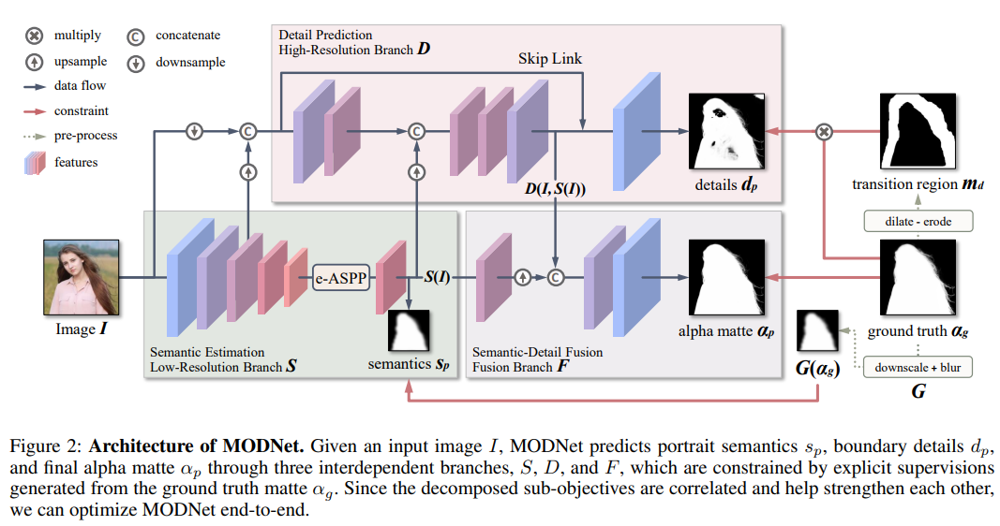
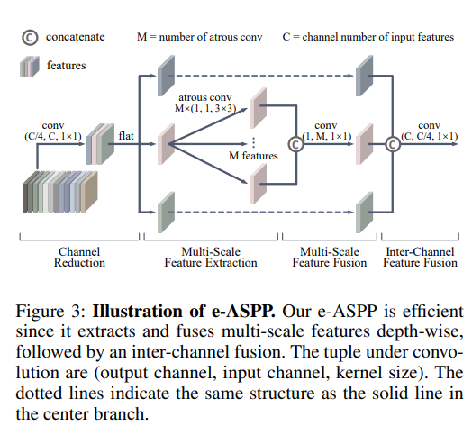

# MODNet


## Code Source
```
link: https://github.com/ZHKKKe/MODNet
branch: master
commit: 28165a451e4610c9d77cfdf925a94610bb2810fb
```


## Model Arch

### describe

现有的Matting方法常常需要辅助的输入如tripmap才能获得好的效果，但是tripmap获取成本较高。MODNet是一个不需要Trimap的实时抠图算法。MODNet包含2种新颖的方法来提升模型效率和鲁棒性：
- e-ASPP(Efficient Atrous Spatial Pyramid Pooling)融合多尺度特征图；
- 自监督SOC(sub-objectives consistency)策略使MODNet适应真实世界的数据。

<div  align="center">

</div>

Semantic Estimation，用来定位肖像的位置，这里仅使用了encoder来提取高级语义信息，这里的encoder可以是任意backbone网络，论文中使用mobilenetv2。这么做有2个好处：
- Semantic Estimation效率更高，因为没有decoder，参数减少了；
- 得到的高级语义表示S(I)对后续分支有利；

Efficient ASPP (e-ASPP)，DeepLab提出的ASPP已被证明可以显著提升语义分割效果，它利用多个不同空洞率的卷积来得到不同感受野的特征图，然后将多个特征图融合（ASPP可以参考这里）。为了减少计算量，对ASPP进行以下修改：
- 将每个空洞卷积改为depth-wise conv+point-wise conv；
- 交换通道融合和多尺度特征图融合的顺序，ASPP是各个通道先计算，得到不同尺度特征图然后用conv融合，e-ASPP是每个通道不同空洞率的卷积，concat后融合（这里是参考论文理解的，源码没找到这部分）；
- 输入e-ASPP的特征图通道数减少为原来的1/4。
<div  align="center">

</div>


## Model Info

### 模型精度

| Model | FLOPs(G)|Params(M)  | MSE | MAD |mIOU| Shapes|
|:-:|:-:|:-:|:-:|:-:|:-:|:-:|
| [modnet](https://github.com/ZHKKKe/MODNet) |  24.011 | 8.700| 0.00945 | 0.01456|0.970898|3x480x288|
| modnet **vacc fp16**|  - | - | 0.00951 | 0.01378| 0.970788| 3x480x288|
| modnet **vacc int8 kl**|  - | - | 0.01915 | 0.02453| 0.946498| 3x480x288|


### 测评数据集说明

[PPM-100](https://github.com/ZHKKKe/PPM)是一个人像抠图基准，它包含了100张来自Flickr的人像图片，具有以下特点：
- 精细标注 - 所有图像都被仔细标注并检查。
- 丰富多样 - 图像涵盖全身/半身人像和各种姿态。
- 高分辨率 - 图像的分辨率介于1080P和4K之间。
- 自然背景 - 所有图像都包含原始无替换的背景。

<div  align="center">

</div>


### 指标说明
- SAD(Sum of Absolute Difference)：绝对误差和
- MAD(Mean Absolute Difference): 平均绝对差值
- MSE(Mean Squared Error)：均方误差
- MIoU平均并交比：分割图像一般都有好几个类别，把每个分类得出的分数进行平均得到mean IoU，也就是mIoU，其是各种基准数据集最常用的标准之一，绝大数的图像语义分割论文中模型评估比较都以此作为主要评估指标。


## Build_In Deploy

### step.1 模型准备

1. 下载模型权重
    ```
    link: https://github.com/ZHKKKe/MODNet
    branch: master
    commit: 28165a451e4610c9d77cfdf925a94610bb2810fb
    ```
2. 模型导出

    - 克隆原始仓库，基于原始仓库代码转换至onnx，[onnx/export_onnx.py](https://github.com/ZHKKKe/MODNet/blob/master/onnx/export_onnx.py)；修改脚本内尺寸信息和权重信息；注意修改此`onnx`文件夹名称为其它，否则可能会误识别成公共库
    - 导出后onnx内已包含sigmoid后处理


### step.2 准备数据集
- 下载[PPM-100](https://github.com/ZHKKKe/PPM)数据集，解压

### step.3 模型转换
1. 根据具体模型修改配置文件
    - [official_modnet.yaml](./build_in/build/official_modnet.yaml)
    
    > - 编译参数`backend.type: tvm_vacc`
    > - fp16精度: 编译参数`backend.dtype: fp16`
    > - int8精度: 编译参数`backend.dtype: int8`，需要配置量化数据集和预处理算子

2. 模型编译
    ```bash
    cd modnet
    mkdir workspace
    cd workspace
    vamc compile ../build_in/build/official_modnet.yaml
    ```

### step.4 模型推理
1. 参考：[vsx_inference.py](./build_in/vsx/python/vsx_inference.py)，修改参数并运行如下脚本
    ```bash
    python ../build_in/vsx/python/vsx_inference.py \
        --file_path  /path/to/PPM-100/image \
        --model_prefix_path deploy_weights/official_modnet_int8/mod \
        --vdsp_params_info ../build_in/vdsp_params/official-modnet-vdsp_params.json \
        --gt_path /path/to/PPM-100/matte \
        --save_dir ./infer_output \
        --device 0
    ```

### step.5 性能精度测试
1. 基于[image2npz.py](./build_in/vdsp_params/image2npz.py)，将评估数据集转换为npz格式，生成对应的`npz_datalist.txt`
    ```bash
    python ../build_in/vdsp_params/image2npz.py \
    --dataset_path datasets/PPM-100/image \
    --target_path  datasets/PPM-100/image_npz \
    --text_path npz_datalist.txt
    ```

2. 性能测试，配置vdsp参数[official-modnet-vdsp_params.json](./build_in/vdsp_params/official-modnet-vdsp_params.json)
    ```bash
    vamp -m deploy_weights/official_modnet_int8/mod \
    --vdsp_params ../build_in/vdsp_params/official-modnet-vdsp_params.json \
    -i 2 p 2 -b 1
    ```

> 可选步骤，和step.4的精度测试基本一致

3. 精度测试，推理得到npz结果：
    ```bash
    vamp -m deploy_weights/official_unetpp_int8/mod \
    --vdsp_params ../build_in/vdsp_params/official-modnet-vdsp_params.json \
    -i 2 p 2 -b 1 \
    --datalist npz_datalist.txt \
    --path_output npz_output
    ```

4. [vamp_eval.py](./build_in/vdsp_params/vamp_eval.py)，解析npz结果，绘图并统计精度：
   ```bash
    python ./build_in/vdsp_params/vamp_eval.py \
    --src_dir datasets/PPM-100/image \
    --gt_dir datasets/PPM-100/matte \
    --input_npz_path npz_datalist.txt \
    --out_npz_dir ./npz_output \
    --input_shape 480 288 \
    --draw_dir npz_draw_result \
    --vamp_flag
   ```