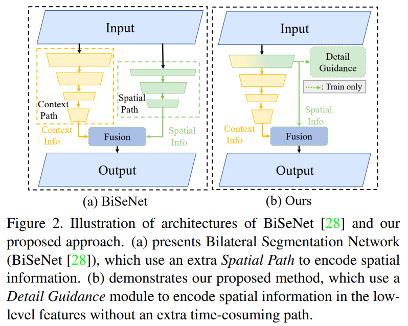
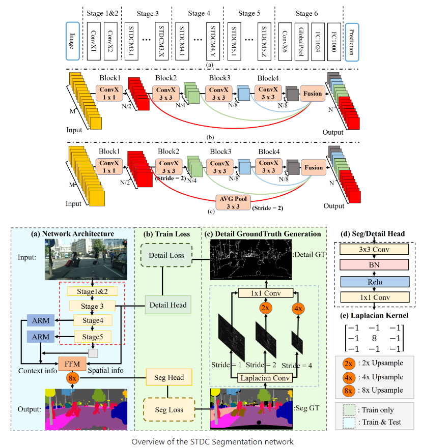

## STDC

[Rethinking BiSeNet For Real-time Semantic Segmentation](https://openaccess.thecvf.com/content/CVPR2021/papers/Fan_Rethinking_BiSeNet_for_Real-Time_Semantic_Segmentation_CVPR_2021_paper.pdf)


## Code Source
```
link: https://github.com/MichaelFan01/STDC-Seg
branch: master
commit: 59ff37fbd693b99972c76fcefe97caa14aeb619f
```


## Model Arch

<div  align="center">

</div>

### pre-processing

STDC网络的预处理操作可以按照如下步骤进行，即先对图片进行resize至一定尺寸(512)，然后对其进行归一化、减均值除方差等操作

```python
[
    torchvision.transforms.Resize(scale_size),
    torchvision.transforms.ToTensor(),
    torchvision.transforms.Normalize(mean=[0.485, 0.456, 0.406], std=[0.229, 0.224, 0.225],),
]
```

### post-processing

STDC算法的后处理即是对网络输出的heatmap进行逐像素判断，比如一共19个类别，则网络会输出19个通道尺寸等于原图大小的heatmap，然后逐像素判断哪个通道数值大，就表示当前像素点所代表的类别为当前通道对应的类别

### backbone
BiSeNet已被证明在实时分割two-stream网络中是有效的。但是，其添加额外path以对空间信息进行编码的原理很耗时，并且由于缺少任务专用设计，因此从预训练任务（例如图像分类）中借用的主干可能无法有效地进行图像分割。

为了解决这些问题，作者提出了一种新颖且有效的结构，即通过消除结构冗余来缓解以上的耗时问题（Short-Term Dense Concatenate network）。具体来说，本文将特征图的维数逐渐降低，并将特征图聚合起来进行图像表征，形成了STDC网络的基本模块。在decoder中，提出了一个Detail Aggregation module将空间信息的学习以single-stream方式集成到low-level layers中。最后，将low-level features和deep features融合以预测最终的分割结果。

<div  align="center">

</div>

- 编码阶段
  - 首先，设计了一个新的结构Short-Term Dense Concatenate module模块(STDC模块)，以通过少量的参数来获得Variant Scalable Receptive Fields。
  - 其次，将STDC模块集成到U-net体系结构中，形成STDC Network，这一操作极大地提高了语义分割任务网络的性能。
- 解码阶段
  - 在解码阶段，采用Detail Guidance来引导low-level layers进行空间细节的学习，而不是使用额外的Path。
  - 首先，利用Detail Aggregation模块生成详细的Ground-truth。
  - 然后，利用binary cross-entropy loss和dice loss优化细节信息，将细节信息作为一种约束信息在推理时不需要。
  - 最后，融合low-level layers信息和semantic信息预测语义分割结果。

STDC Module的优势：
- 通过几何级数的方式精心调整块的卷积核的大小，从而显著降低了计算复杂度。
- STDC模块的最终输出由所有块cat而成，保留了scalable respective fields和multi-scale information。

### common

- Short-Term Dense Concatenate Module
- Detail Aggregation Module
- BiSeNet


## Model Info

### 模型精度

|                  Models                  |                                   Code Source                                   | GFLOPs(G) | Params(M) |  mIOU  |   Shapes   |
| :---: | :--: | :--: | :--: | :---: | :--------: |
| STDC1-Seg50 |[official](https://github.com/MichaelFan01/STDC-Seg)|  52.089  |  14.242   |     56.474   | 3x512x512    |
| STDC1 **vacc fp16**|-|    -   |   -    |     54.288  | 3x512x512   |
| STDC1 **vacc int8 percentile** |-|   -   |   -    |     49.157  | 3x512x512   |


### 测评数据集说明

[CityScapes](https://www.cityscapes-dataset.com/)数据集，即城市景观数据集，这是一个新的大规模数据集，其中包含不同的立体视频序列，记录在50个不同城市的街道场景。数据集被分为2975 train，500 val，1525 test，它具有19个类别的密集像素标注。

<div  align="center">

</div>


### 指标说明
- IoU并交比：两个区域重叠的部分除以两个区域的集合部分，取值TP/(TP+FN+FP)
- MIoU平均并交比：分割图像一般都有好几个类别，把每个分类得出的分数进行平均得到mean IoU，也就是mIoU，其是各种基准数据集最常用的标准之一，绝大数的图像语义分割论文中模型评估比较都以此作为主要评估指标。


## Build_In Deploy
- [official.md](./source_code/official.md)
