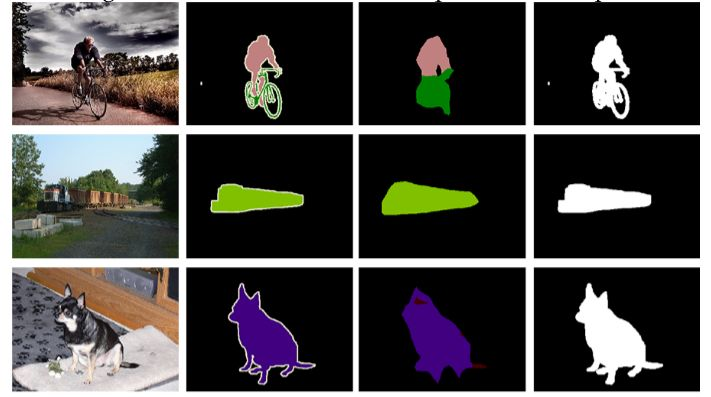
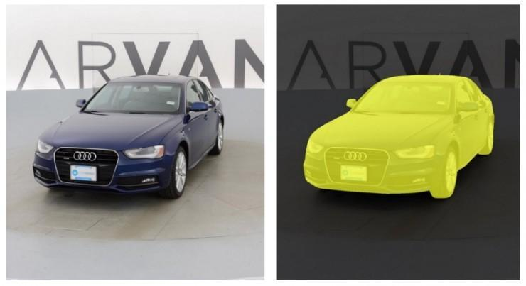

## UNet

- Technical Report
    - [U-Net: Convolutional Networks for Biomedical Image Segmentation](https://arxiv.org/pdf/1505.04597.pdf)

## Code_Source
```
# bubbliiiing
link：https://github.com/bubbliiiing/unet-pytorch
branch: main
commit: 8ab373232c5c3a1877f3e84e6f5d97404089c20f
```

```
# milesial
link：https://github.com/milesial/Pytorch-UNet
branch: master
commit: a013c80ca6b011ba34ba0700b961b77e0ed003a2

# keras
link：https://github.com/zhixuhao/unet
branch: master
commit: b45af4d458437d8281cc218a07fd4380818ece4a
```

## Model Arch

<div  align="center">

</div>

### pre-processing

UNet网络的预处理操作可以按照如下步骤进行，即先对图片进行resize至一定尺寸(320)，然后对其进行归一化、减均值除方差等操作：

```python
[
    torchvision.transforms.Resize(scale_size),
    torchvision.transforms.ToTensor()
]
```

### post-processing

UNet算法的后处理即是对网络输出的heatmap进行逐像素判断，比如一共20个类别，则网络会输出21个通道(20class+background)尺寸等于原图大小的heatmap，然后逐像素判断哪个通道数值大，就表示当前像素点所代表的类别为当前通道对应的类别。

### backbone

UNet和FCN一样是全卷积形式，没有全连接层(即没有固定输入的尺寸)。Unet包括两部分，可以看上图，第一部分，特征编码Encoder（可以使用多种分类骨架作为特征提取网络，resnet/vgg/mobilenet）；第二部分，上采样特征解码Decoder。

- Encoder，由卷积和下采样操作组成，所用卷积结构统一为3x3卷积核，padding=0，striding=1。没有padding所以每次卷积之后特征图的H和W变小了，在跳层连接（Skip connection）时需注意特征图的维度

- Decoder，用以恢复特征图的原始分辨率，除了卷积以外，该过程的关键步骤就是上采样与跳层连接。上采样常用转置卷积和插值两种方式实现。在插值实现方式中，双线性插值（bilinear）的综合表现较好也较为常见 。要想网络获得好的效果，跳层连接基本必不可少。UNet 中的跳层连接通过拼接将底层的位置信息与深层的语义信息相融合。需要注意的是，在FCN中，特征图是以相加的方式进行融合

UNet结构的优点：
- 深/浅层特征有着各自意义：网络越深，感受野越大，网络更关注全局特征（更抽象、更本质）；浅层网络则更加关注纹理等局部特征特征
- 通过特征拼接来实现边缘特征的找回。通过上采样（转置卷积）固然能够得到更大尺寸的特征图，但特征图的边缘是缺少信息的。毕竟每一次下采样提取特征的同时，必然会损失一些边缘特征，而上采样并不能找回这些失去的特征


### common
- encoder-decoder
- max pooling
- unsample
- concact

## Model Info

### 模型精度


|Models|Backbone|Code Source|FLOPs(G)|Params(M)| MIoU |DataSet|Shapes|
|:-:|:-:|:-:|:-:|:-:|:-:|:-:|:-:|
|UNet|doubleconv<br>scale 0.5|[milesial](https://github.com/milesial/Pytorch-UNet)| 486.098| 31.038|98.842|Carvana|3×512×512|
|UNet|-|vacc fp16|-|-|98.426|-|3×512×512|
|UNet|-|vacc int8 kl_divergence|-|-|98.515|-|3×512×512|
|UNet|doubleconv<br>scale 1.0|[milesial](https://github.com/milesial/Pytorch-UNet)|  486.098| 31.038|96.682|Carvana|3×512×512|
|UNet|-|vacc fp16|-|-|95.014|-|3×512×512|
|UNet|-|vacc int8 kl_divergence|-|-|89.702|-|3×512×512|
|UNet|vgg16|[bubbliiiing](https://github.com/bubbliiiing/unet-pytorch)|502.875|24.892|59.092|VOC 2012|3×512×512|
|UNet|vgg16|-|-|-|63.260|-|3×256×256|
|UNet|-|vacc fp16|-|-|63.304|-|3×256×256|
|UNet|-|vacc int8 kl_divergence|-|-|62.999|-|3×256×256|
|UNet|resnet50|[bubbliiiing](https://github.com/bubbliiiing/unet-pytorch)|205.127|43.934|67.660|VOC 2012|3×512×512|
|UNet|resnet50|-|-|-|66.028|-|3×256×256|
|UNet|-|vacc fp16|-|-|66.696|-|3×256×256|
|UNet|-|vacc int8 kl_divergence|-|-|66.210|-|3×256×256|
|UNet||[keras](https://github.com/zhixuhao/unet)|-|31.032|71.800|isbi challenge|3×256×256|
|UNet|-|vacc fp16|-|-|70.777|-|3×256×256|
|UNet|-|vacc int8 kl_divergence|-|-|71.291|-|3×256×256|


>
> milesial来源中，scale表示输入尺寸缩放系数，网络结构是一致的
>
> bubbliiiing来源中，输入512尺寸，vacc run会超时
>

### 测评数据集说明

[PASCAL VOC](http://host.robots.ox.ac.uk/pascal/VOC/voc2012/)数据集除了用于object detection任务之外，还用于segmentation等任务，该数据集包含20个对象类，加背景共21类。

数据集子文件夹SegmentationClass内存放了JPEGimages中部分对应的pixel-level标注，以png形式存放，用于语义分割。

<div  align="center">

</div>


[Carvana](https://www.kaggle.com/competitions/carvana-image-masking-challenge/data)数据集，是美国二手汽车批发平台 Carvana 在知名机器学习竞赛平台 kaggle 上发布了名为 Carvana 图像掩模大应战赛（Carvana Image Masking Challenge）的竞赛项目。数据集包含大量的汽车图像（以.jpg文件形式）。每辆车正好有16张照片，每张照片都是从不同的角度拍摄的。每辆车都有一个唯一的id，图像根据id_01.jpg、id_02.jpg … id_16.jpg命名。除了图像，还为您提供了一些关于汽车品牌、型号、年份和装饰的基本元数据。掩码标签对应一个.gif文件，其中包含每个图像的手动剪切遮罩。
<div  align="center">

</div>

[ISBI细胞分割](https://github.com/zhixuhao/unet/tree/master/data/membrane)数据集是EM分割挑战提供的，这个挑战是从ISBI 2012开始的。训练数据是一组来自果蝇幼虫腹侧腹侧神经索（VNC）的连续切片透射电镜的30张图像（512x512像素）。每个图像都带有一个对应的标注分割图，细胞（白色）和膜（黑色）。

<div  align="center">

</div>

### 指标说明
- IoU并交比：两个区域重叠的部分除以两个区域的集合部分，取值TP/(TP+FN+FP)
- MIoU平均并交比：分割图像一般都有好几个类别，把每个分类得出的分数进行平均得到mean IoU，也就是mIoU，其是各种基准数据集最常用的标准之一，绝大数的图像语义分割论文中模型评估比较都以此作为主要评估指标。


## Build_In Deploy
- [bubbliiiing.md](./source_code/bubbliiiing.md)
- [milesial.md](./source_code/milesial.md)
- [keras.md](./source_code/keras.md)
