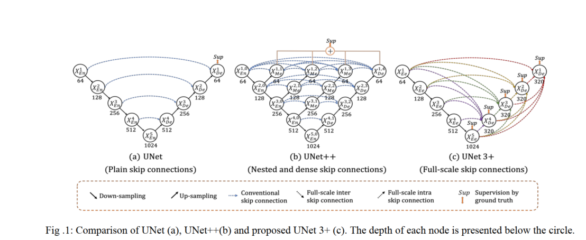
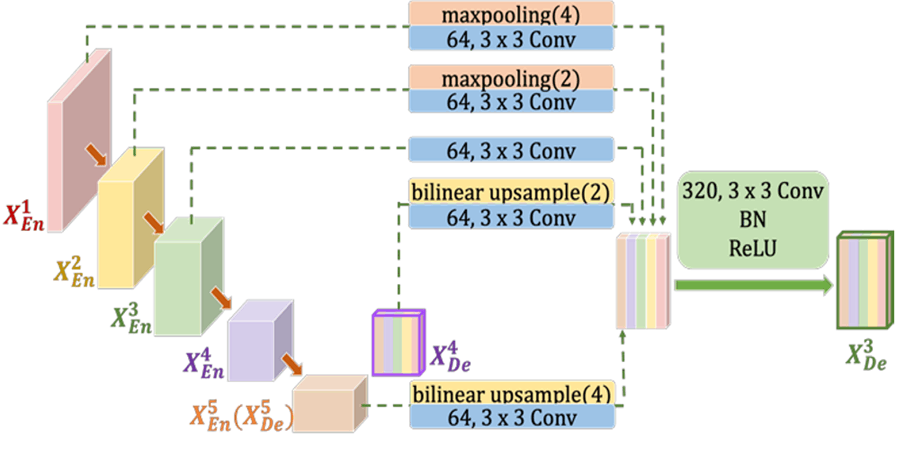
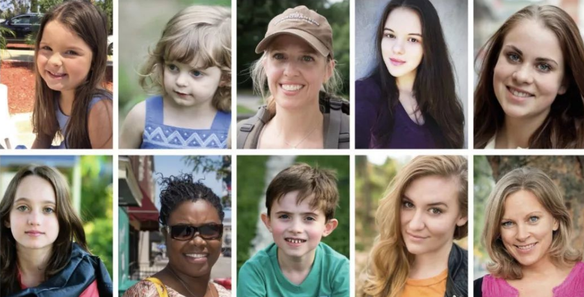

## UNet3P

- Technical Report
    - [UNet 3+: A Full-Scale Connected UNet for Medical Image Segmentation](https://arxiv.org/abs/2004.08790)


## Code Source
```
link: https://github.com/avBuffer/UNet3plus_pth
branch: master
commit: 263534e4a48964e907324622b14b90f1c3b4270d
```

## Model Arch

<div  align="center">

</div>

### pre-processing

UNet3P网络的预处理操作可以按照如下步骤进行，即先对图片进行resize至一定尺寸(128)，然后对其进行归一化、减均值除方差等操作

```python
src_image = cv2.imread(image_path)
image = cv2.resize(src_image, (input_size[-1], input_size[-2]))
image = cv2.cvtColor(image, cv2.COLOR_BGR2RGB)
image = image / 255.0
image = image.transpose((2, 0, 1)).astype(np.float32)
image = image[np.newaxis, :]
```

### post-processing

UNet3P算法的后处理即是对网络输出的heatmap进行逐像素判断，比如一共20个类别，则网络会输出21个通道(20class+background)尺寸等于原图大小的heatmap，然后逐像素判断哪个通道数值大，就表示当前像素点所代表的类别为当前通道对应的类别。

### backbone
UNet3P使用自定义的encode-decode卷积网络作为特征提取backbone。UNet3P利用了全尺度的跳跃连接(skip connection)和深度监督(deep supervisions)。全尺度的跳跃连接把来自不同尺度特征图中的高级语义与低级语义直接结合（当然需要必要的上采样操作）;而深度监督则从多尺度聚合的特征图中学习层次表示。注意一点：UNetPP和UNet3P都用到了深度监督，但是监督的位置是完全不一样的。

所提出的全尺寸跳跃连接改变了编码器和解码器之间的互连以及解码器子网之间的内连接。无论是连接简单的UNet，还是连接紧密嵌套的UNetPP，都缺乏从全尺度探索足够信息的能力，未能明确了解器官的位置和边界。为了弥补UNet和UNetPP的缺陷，UNet3P中的每一个解码器层都融合了来自编码器中的小尺度和同尺度的特征图，以及来自解码器的大尺度的特征图，这些特征图捕获了全尺度下的细粒度语义和粗粒度语义。

<div  align="center">

</div>

为了从全尺度的聚合特征图中学习层次表示，UNet3P进一步采用了全尺度深度监督。不同于UNetPP，UNet3P中每个解码器阶段都有一个侧输出，是金标准(ground truth，GT)进行监督。为了实现深度监督，每个解码器阶段的最后一层被送入一个普通的3×3卷积层，然后是一个双线性上采样和一个sigmoid函数。(这里的上采样是为了放大到全分辨率)。

### common
- Full-scale Skip Connections
- Full-scale Deep Supervision
- Classification-guided Module (CGM)

## Model Info

### 模型精度

|Models|Code Source|FLOPs(G)|Params(M)|MIoU|Shapes|
|:-:|:-:|:-:|:-:|:-:|:-:|
|unet3p|[avBuffer](https://github.com/avBuffer/UNet3plus_pth)|110.928|26.972|80.284|3×128×128|
|unet3p **vacc fp16**|-|-|-|79.324|3×128×128|
|unet3p **vacc int8 kl_divergence**|-|-|-|79.357|3×128×128|
|unet3p_deepsupervision|[avBuffer](https://github.com/avBuffer/UNet3plus_pth)|110.965|26.990|71.411|3×128×128|
|unet3p **vacc fp16**|-|-|-|71.103|3×128×128|
|unet3p **vacc int8 kl_divergence**|-|-|-|70.823|3×128×128|


### 测评数据集说明

[Automatic Portrait Matting](http://www.cse.cuhk.edu.hk/leojia/projects/automatting/index.html)数据集包含2000张图，训练集1700张，测试集300张，数据都是来源于Flickr的肖像图，图像原始分辨率大小为600×800，其中Matting用closed-form matting和KNN matting方法生成。
<div  align="center">

</div>

### 指标说明
- IoU并交比：两个区域重叠的部分除以两个区域的集合部分，取值TP/(TP+FN+FP)
- MIoU平均并交比：分割图像一般都有好几个类别，把每个分类得出的分数进行平均得到mean IoU，也就是mIoU，其是各种基准数据集最常用的标准之一，绝大数的图像语义分割论文中模型评估比较都以此作为主要评估指标。


## Build_In Deploy

### step.1 模型准备

1. 下载模型权重

    ```
    link: https://github.com/avBuffer/UNet3plus_pth
    branch: master
    commit: 263534e4a48964e907324622b14b90f1c3b4270d
    ```

2. 模型导出
    - 将文件[export.py](./source_code/export.py)移动至仓库根目录；修改其相关参数，即可导出torchscript和onnx

### step.2 准备数据集
- 原仓库中下载[Deep Automatic Portrait Matting](https://github.com/avBuffer/UNet3plus_pth)数据集

### step.3 模型转换
1. 根据具体模型修改模型转换配置文件
    - [official_unet3p.yaml](./build_in/build/official_unet3p.yaml)

    > - runstream推理，编译参数`backend.type: tvm_vacc`
    > - fp16精度: 编译参数`backend.dtype: fp16`
    > - int8精度: 编译参数`backend.dtype: int8`，需要配置量化数据集和预处理算子

2. 模型编译
    ```bash
    vamc compile ./build_in/build/official_unet3p.yaml
    ```

### step.4 模型推理
1. runstream推理，参考[vsx_inference.py](./build_in/vsx/python/vsx_inference.py)，修改参数并运行如下脚本
    ```bash
    python ./build_in/vsx/python/vsx_inference.py \
        --file_path  /path/to/AutoPortraitMatting/testing/images \
        --model_prefix_path deploy_weights/official_unet3p_run_stream_int8/mod \
        --vdsp_params_info ../build_in/vdsp_params/avbuffer-unetpp-vdsp_params.json \
        --gt_path /path/to/AutoPortraitMatting/testing/masks \
        --save_dir ./runstream_output \
        --device 0
    ```

### step.5 性能精度测试
1. 基于[image2npz.py](../common/utils/image2npz.py)，将评估数据集转换为npz格式（注意配置图片后缀为`.png`）：
    ```bash
    python ../common/utils/image2npz.py \
    --dataset_path AutoPortraitMatting/testing/images \
    --target_path  AutoPortraitMatting/testing/images_npz \
    --text_path npz_datalist.txt
    ```

2. 性能测试，配置vdsp参数[avbuffer-unetpp-vdsp_params.json](./build_in/vdsp_params/avbuffer-unetpp-vdsp_params.json)，执行：
    ```bash
    vamp -m deploy_weights/official_unet3p_run_stream_int8/mod \
    --vdsp_params ./build_in/vdsp_params/avbuffer-unetpp-vdsp_params.json \
    -i 1 p 1 -b 1
    ```

> 可选步骤，和step.4内使用runstream脚本方式的精度测试基本一致

3. 精度测试，推理得到npz结果：
    ```bash
    vamp -m deploy_weights/official_unet3p_run_stream_int8/mod \
    --vdsp_params build_in/vdsp_params/avbuffer-unetpp-vdsp_params.json \
    -i 1 p 1 -b 1 \
    --datalist npz_datalist.txt \
    --path_output npz_output
    ```
4. [vamp_eval.py](./build_in/vdsp_params/vamp_eval.py)，解析npz结果，绘图并统计精度：
   ```bash
    python ./build_in/vdsp_params/vamp_eval.py \
    --src_dir AutoPortraitMatting/testing/images \
    --gt_dir AutoPortraitMatting/testing/masks \
    --input_npz_path npz_datalist.txt \
    --out_npz_dir vamp/opuputs \
    --input_shape 128 128 \
    --draw_dir npz_draw_result \
    --vamp_flag
   ```
