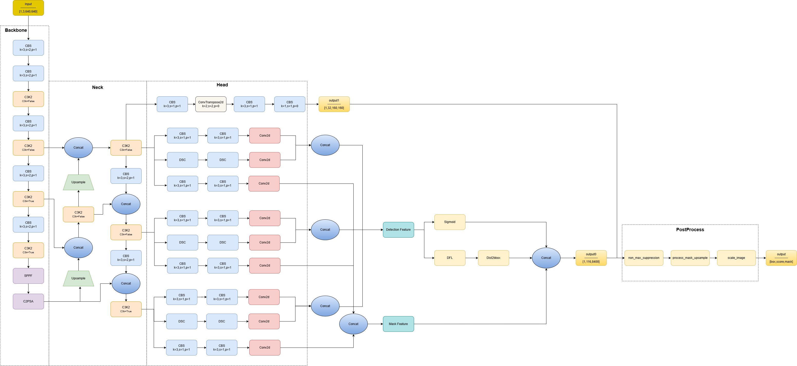
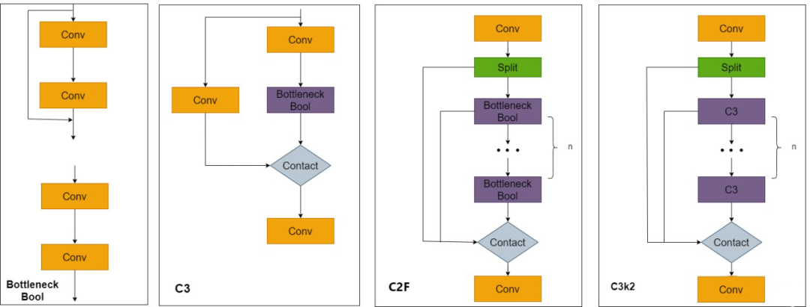
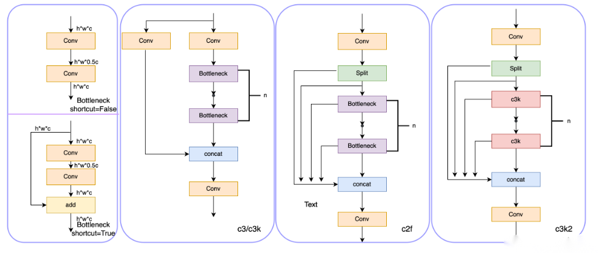
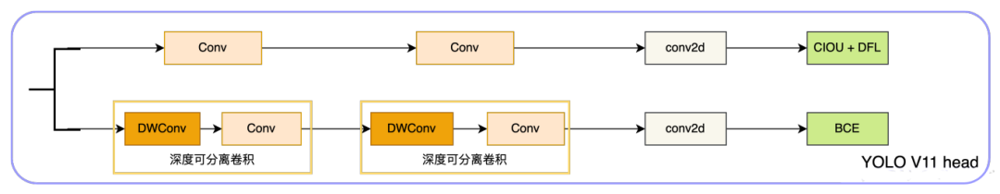

# Yolov11_seg

## Code Source
```
link: https://github.com/ultralytics/ultralytics
branch: main
commit: d17b305786ba1055c642b5e5e820749ca66f132e
```

## Model Arch




### pre-processing

yolov11_seg系列的预处理主要是对输入图片利用`letterbox`算子进行resize，然后进行归一化

### post-processing

yolov11_seg系列的后处理操作：进行box decode之后进行nms, 然后利用预测得到的box生成掩码

### backbone

YOLO11采用改进的骨干和颈部架构，增强了特征提取能力，提高了物体检测的精确度和复杂任务的表现。相比较于YOLOv8模型，其将CF2模块改成C3K2，同时在SPPF模块后面添加了一个C2PSA模块，且将YOLOv10的head思想引入到YOLO11的head中，使用深度可分离的方法，减少冗余计算，提高效率。

YOLO11增加了一个C2PSA模块，并且将C2f替换为了C3k2。相比于C2f，当超参数c3k=True时，瓶颈块替换为 C3k，否则还是C2f,而C3k相比于C3则是可以让使用者自定义卷积块大小，更加灵活。C2PSA扩展了C2f，通过引入PSA( Position-Sensitive Attention)，旨在通过多头注意力机制和前馈神经网络来增强特征提取能力。它可以选择性地添加残差结构（shortcut）以优化梯度传播和网络训练效果。同时，使用FFN 可以将输入特征映射到更高维的空间，捕获输入特征的复杂非线性关系，允许模型学习更丰富的特征表示。

</a>

### neck
YOLO11使用PAN结构，并在其中也使用了C3K2模块。这种结构设计有助于聚合来自不同尺度的特征，并优化特征的传递过程。C3K2模块其实就是C2F模块转变出来的，它代码中有一个设置，就是当c3k这个参数为FALSE的时候，C3K2模块就是C2F模块，也就是说它的Bottleneck是普通的Bottleneck；反之当它为true的时候，将Bottleneck模块替换成C3模块。

</a>
    

### head

与早期的YOLO版本类似，YOLOv11使用多尺度预测头来检测不同大小的物体。头部使用由脊柱和颈部生成的特征图输出三种不同尺度（低、中、高）的检测框。

检测头从三个特征图（通常来自P3、P4和P5）输出预测，对应于图像中的不同粒度级别。这种方法确保了小物体被更精细地检测到（P3），而较大的物体被更高级别的特征捕获（P5）。


- 通道分离系数设置为 0.5，在精度损失 <0.3% 条件下计算量减少 38%
- 引入通道洗牌（Channel Shuffle）操作，保持特征多样性
</a>

### common

- C2f
- SPPF
- letterbox
- DFL

## Model Info

### 模型性能

| 模型  | 尺寸<br><sup>(像素) | mAP<sup>box<br>50-95 | mAP<sup>mask<br>50-95 | 速度<br><sup>CPU ONNX<br>(毫秒) | 速度<br><sup>T4 TensorRT10<br>(毫秒) | 参数<br><sup>(百万) | FLOPs<br><sup>(十亿) |
| -------------------------------------------------------------------------------------------- | ------------------- | -------------------- | --------------------- | ------------------------------- | ------------------------------------ | ------------------- | -------------------- |
| [YOLO11n-seg](https://github.com/ultralytics/assets/releases/download/v8.3.0/yolo11n-seg.pt) | 640                 | 38.9                 | 32.0                  | 65.9 ± 1.1                      | 1.8 ± 0.0                            | 2.9                 | 9.7                  |
| [YOLO11s-seg](https://github.com/ultralytics/assets/releases/download/v8.3.0/yolo11s-seg.pt) | 640                 | 46.6                 | 37.8                  | 117.6 ± 4.9                     | 2.9 ± 0.0                            | 10.1                | 33.0                 |
| [YOLO11m-seg](https://github.com/ultralytics/assets/releases/download/v8.3.0/yolo11m-seg.pt) | 640                 | 51.5                 | 41.5                  | 281.6 ± 1.2                     | 6.3 ± 0.1                            | 22.4                | 113.2                |
| [YOLO11l-seg](https://github.com/ultralytics/assets/releases/download/v8.3.0/yolo11l-seg.pt) | 640                 | 53.4                 | 42.9                  | 344.2 ± 3.2                     | 7.8 ± 0.2                            | 27.6                | 132.2                |
| [YOLO11x-seg](https://github.com/ultralytics/assets/releases/download/v8.3.0/yolo11x-seg.pt) | 640                 | 54.7                 | 43.8                  | 664.5 ± 3.2                     | 15.8 ± 0.7                           | 62.1                | 296.4                |


### 测评数据集说明


[MS COCO](https://cocodataset.org/#download)的全称是Microsoft Common Objects in Context，是微软于2014年出资标注的Microsoft COCO数据集，与ImageNet竞赛一样，被视为是计算机视觉领域最受关注和最权威的比赛数据集之一。 

COCO数据集支持目标检测、关键点检测、实例分割、全景分割与图像字幕任务。在图像检测和实例分割任务中，COCO数据集提供了80个类别，验证集包含5000张图片，上表的结果即在该验证集下测试。

### 评价指标说明

- mAP: mean of Average Precision, 多类别的AP的平均值；AP即平均精度，是Precision-Recall曲线下的面积
-  mAP50-95: 表示在不同IoU阈值（从0.5到0.95，步长0.05）上的平均mAP

## Build_In Deploy

### step.1 模型准备

1. 下载模型权重
    ```
    link: https://github.com/ultralytics/ultralytics
    branch: main
    commit: d17b305786ba1055c642b5e5e820749ca66f132e
    ```

2. 模型导出

    暂不支持`onnx`，需转为`torchscript`格式，参考：

    ```python
    import torch
    from ultralytics import YOLO

    input_shape = (1, 3, 640, 640)
    img_tensor=torch.zeros(input_shape)
    model = YOLO("yolov11n-seg.pt")
    model.to("cpu")
    scripted_model = torch.jit.trace(model.model, img_tensor, check_trace=False).eval()

    torch.jit.save(scripted_model, 'yolov11n_seg.torchscript.pt')
    ```


### step.2 数据集准备
- [校准数据集](http://images.cocodataset.org/zips/val2017.zip)
- [评估数据集](http://images.cocodataset.org/zips/val2017.zip)
- [gt: instances_val2017.json](http://images.cocodataset.org/annotations/annotations_trainval2017.zip)
- [label: coco.txt](../../detection/common/label/coco.txt)


### step.3 模型转换
1. 根据具体模型,修改模型转换配置文件
    - [official_yolov11_seg_fp16.yaml](./build_in/build/official_yolov11_seg_fp16.yaml)
    - [official_yolov11_seg_int8.yaml](./build_in/build/official_yolov11_seg_int8.yaml)
    
    > - 编译参数`backend.type: tvm_vacc`
    > - fp16精度: 编译参数`backend.dtype: fp16`
    > - int8精度: 编译参数`backend.dtype: int8`，需要配置量化数据集和预处理算子


2. 模型编译
    ```bash
    cd yolov11_seg
    mkdir workspace
    cd workspace
    vamc compile ../build_in/build/official_yolov11_seg_fp16.yaml
    vamc compile ../build_in/build/official_yolov11_seg_int8.yaml
    ```

### step.4 模型推理
1. vsx推理：[yolov11_seg_vsx.py](./build_in/vsx/python/yolov11_seg_vsx.py)
    - 依赖自定义算子：[yolov8_seg_post_proc](./build_in/vsx/python/yolov8_seg_post_proc)

    ```bash
    #先获取测试数据集的txt文件列表
    python ../build_in/vsx/python/get_filelist.py --input_dir /path/to/det_coco_val --output_file ./det_coco_val_filelist.txt

    #推理
    mkdir -p yolov11_seg_out
    python3 ../build_in/vsx/python/yolov11_seg_vsx.py \
        -m ./deploy_weights/yolo11n_seg_fp16/mod \
        --vdsp_params ../build_in/vdsp_params/ultralytics-yolov11n_seg-vdsp_params.json \
        --device_id 0 \
        --elf_file ../build_in/vsx/python/yolov8_seg_post_proc \
        --threshold 0.01 \
        --label_file /path/to/coco.txt \
        --dataset_filelist  /path/to/det_coco_val_filelist.txt \
        --dataset_root /path/to/det_coco_val/ \
        --dataset_output_folder ./yolov11_seg_out
    ```

### step.5 精度性能
1. 精度统计：[yolov11_seg_eval.py](./build_in/vsx/python/yolov11_seg_eval.py)
   > 指定`instances_val2017.json`标签文件和上步骤中获取的推理结果路径，即可获得mAP评估指标
   ```bash
    python3 ../build_in/vsx/python/yolov11_seg_eval.py \
        --gt /path/to/instances_val2017.json \
        --output_path ./yolov11_seg_out
   ```
    <details><summary>查看精度信息</summary>

    ```
    # yolo11n_seg_640_0.01

    ## fp16
    Evaluate annotation type *bbox*
    DONE (t=25.34s).
    Accumulating evaluation results...
    DONE (t=4.26s).
    Average Precision  (AP) @[ IoU=0.50:0.95 | area=   all | maxDets=100 ] = 0.380
    Average Precision  (AP) @[ IoU=0.50      | area=   all | maxDets=100 ] = 0.533
    Average Precision  (AP) @[ IoU=0.75      | area=   all | maxDets=100 ] = 0.412
    Average Precision  (AP) @[ IoU=0.50:0.95 | area= small | maxDets=100 ] = 0.181
    Average Precision  (AP) @[ IoU=0.50:0.95 | area=medium | maxDets=100 ] = 0.419
    Average Precision  (AP) @[ IoU=0.50:0.95 | area= large | maxDets=100 ] = 0.551
    Average Recall     (AR) @[ IoU=0.50:0.95 | area=   all | maxDets=  1 ] = 0.305
    Average Recall     (AR) @[ IoU=0.50:0.95 | area=   all | maxDets= 10 ] = 0.491
    Average Recall     (AR) @[ IoU=0.50:0.95 | area=   all | maxDets=100 ] = 0.521
    Average Recall     (AR) @[ IoU=0.50:0.95 | area= small | maxDets=100 ] = 0.278
    Average Recall     (AR) @[ IoU=0.50:0.95 | area=medium | maxDets=100 ] = 0.577
    Average Recall     (AR) @[ IoU=0.50:0.95 | area= large | maxDets=100 ] = 0.701
    Running per image evaluation...

    Evaluate annotation type *segm*
    DONE (t=29.60s).
    Accumulating evaluation results...
    DONE (t=4.16s).
    Average Precision  (AP) @[ IoU=0.50:0.95 | area=   all | maxDets=100 ] = 0.309
    Average Precision  (AP) @[ IoU=0.50      | area=   all | maxDets=100 ] = 0.500
    Average Precision  (AP) @[ IoU=0.75      | area=   all | maxDets=100 ] = 0.324
    Average Precision  (AP) @[ IoU=0.50:0.95 | area= small | maxDets=100 ] = 0.115
    Average Precision  (AP) @[ IoU=0.50:0.95 | area=medium | maxDets=100 ] = 0.343
    Average Precision  (AP) @[ IoU=0.50:0.95 | area= large | maxDets=100 ] = 0.479
    Average Recall     (AR) @[ IoU=0.50:0.95 | area=   all | maxDets=  1 ] = 0.260
    Average Recall     (AR) @[ IoU=0.50:0.95 | area=   all | maxDets= 10 ] = 0.401
    Average Recall     (AR) @[ IoU=0.50:0.95 | area=   all | maxDets=100 ] = 0.419
    Average Recall     (AR) @[ IoU=0.50:0.95 | area= small | maxDets=100 ] = 0.182
    Average Recall     (AR) @[ IoU=0.50:0.95 | area=medium | maxDets=100 ] = 0.474
    Average Recall     (AR) @[ IoU=0.50:0.95 | area= large | maxDets=100 ] = 0.617
    
    ## int8
    Evaluate annotation type *bbox*
    DONE (t=23.87s).
    Accumulating evaluation results...
    DONE (t=4.19s).
    Average Precision  (AP) @[ IoU=0.50:0.95 | area=   all | maxDets=100 ] = 0.366
    Average Precision  (AP) @[ IoU=0.50      | area=   all | maxDets=100 ] = 0.517
    Average Precision  (AP) @[ IoU=0.75      | area=   all | maxDets=100 ] = 0.397
    Average Precision  (AP) @[ IoU=0.50:0.95 | area= small | maxDets=100 ] = 0.166
    Average Precision  (AP) @[ IoU=0.50:0.95 | area=medium | maxDets=100 ] = 0.405
    Average Precision  (AP) @[ IoU=0.50:0.95 | area= large | maxDets=100 ] = 0.532
    Average Recall     (AR) @[ IoU=0.50:0.95 | area=   all | maxDets=  1 ] = 0.297
    Average Recall     (AR) @[ IoU=0.50:0.95 | area=   all | maxDets= 10 ] = 0.478
    Average Recall     (AR) @[ IoU=0.50:0.95 | area=   all | maxDets=100 ] = 0.508
    Average Recall     (AR) @[ IoU=0.50:0.95 | area= small | maxDets=100 ] = 0.259
    Average Recall     (AR) @[ IoU=0.50:0.95 | area=medium | maxDets=100 ] = 0.567
    Average Recall     (AR) @[ IoU=0.50:0.95 | area= large | maxDets=100 ] = 0.688
    Running per image evaluation...

    Evaluate annotation type *segm*
    DONE (t=27.81s).
    Accumulating evaluation results...
    DONE (t=4.08s).
    Average Precision  (AP) @[ IoU=0.50:0.95 | area=   all | maxDets=100 ] = 0.298
    Average Precision  (AP) @[ IoU=0.50      | area=   all | maxDets=100 ] = 0.484
    Average Precision  (AP) @[ IoU=0.75      | area=   all | maxDets=100 ] = 0.311
    Average Precision  (AP) @[ IoU=0.50:0.95 | area= small | maxDets=100 ] = 0.108
    Average Precision  (AP) @[ IoU=0.50:0.95 | area=medium | maxDets=100 ] = 0.331
    Average Precision  (AP) @[ IoU=0.50:0.95 | area= large | maxDets=100 ] = 0.463
    Average Recall     (AR) @[ IoU=0.50:0.95 | area=   all | maxDets=  1 ] = 0.253
    Average Recall     (AR) @[ IoU=0.50:0.95 | area=   all | maxDets= 10 ] = 0.390
    Average Recall     (AR) @[ IoU=0.50:0.95 | area=   all | maxDets=100 ] = 0.409
    Average Recall     (AR) @[ IoU=0.50:0.95 | area= small | maxDets=100 ] = 0.170
    Average Recall     (AR) @[ IoU=0.50:0.95 | area=medium | maxDets=100 ] = 0.463
    Average Recall     (AR) @[ IoU=0.50:0.95 | area= large | maxDets=100 ] = 0.604
    ```

    </details>

2. 性能统计

- 测试性能：[yolov11_seg_prof.py](./build_in/vsx/python/yolov11_seg_prof.py)

    - 测试最大吞吐
        ```bash
        python3 ../build_in/vsx/python/yolov11_seg_prof.py \
            -m ./deploy_weights/yolo11n_seg_int8/mod \
            --vdsp_params ../build_in/vdsp_params/ultralytics-yolov11n_seg-vdsp_params.json \
            --elf_file ../build_in/vsx/python/yolov8_seg_post_proc \
            --device_ids [0] \
            --shape "[3,640,640]" \
            --batch_size 1 \
            --instance 1 \
            --iterations 600 \
            --queue_size 1
        ```

    - 测试最小延迟
        ```bash
        python3 ../build_in/vsx/python/yolov11_seg_prof.py \
            -m ./deploy_weights/yolo11n_seg_int8/mod \
            --vdsp_params ../build_in/vdsp_params/ultralytics-yolov11n_seg-vdsp_params.json \
            --elf_file ../build_in/vsx/python/yolov8_seg_post_proc \
            --device_ids [0] \
            --shape "[3,640,640]" \
            --batch_size 1 \
            --instance 1 \
            --iterations 600 \
            --queue_size 0
        ```

### Tips
- 使用yolov8_seg_post_proc后处理算子
- 不同参数量模型，在量化参数上存在差异：
    ```yaml
    quantize:
        calibrate_mode: percentile
        quantize_per_channel: true
        skip_matmul_layers: [0, 1] # yolo11-n/s/m
        # skip_matmul_layers: [0, 1, 2, 3, 4, 5, 6, 7]  # yolo11-l/x
        calibrate_chunk_by: -1
    ```
- yolov11含有Attention模块，GQA计算时，由于硬件限制seqlen需要是128的倍数；即输入分辨率需设置为128的倍数