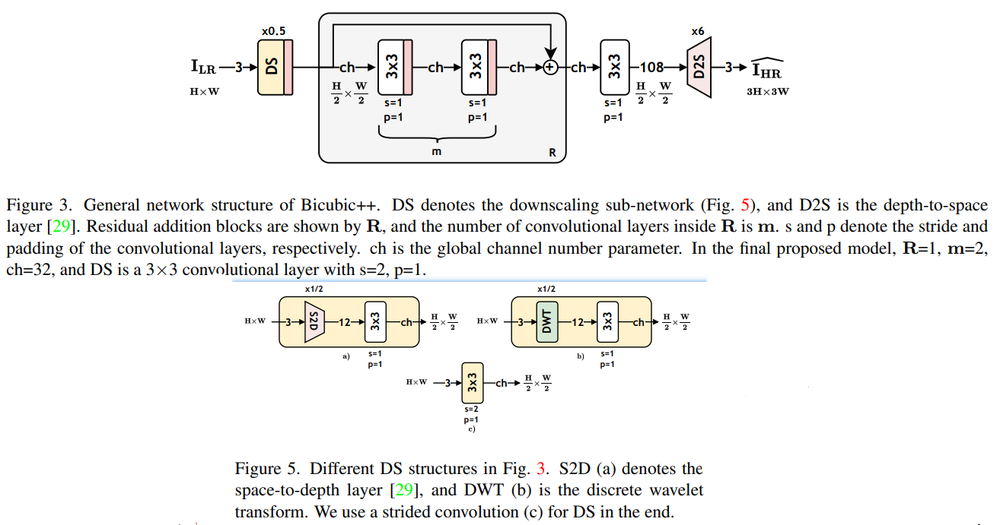

# Bicubic_PlusPlus

[Bicubic++: Slim, Slimmer, Slimmest - Designing an Industry-Grade Super-Resolution Network](https://arxiv.org/abs/2305.02126)

## Code Source
```
# official
link: https://github.com/aselsan-research-imaging-team/bicubic-plusplus
branch: main
commit: 52084c8d016f5e8a5cd62c050e47536a0d022177
```

## Model Arch

<div align=center></div>

### pre-processing

Bicubic_PlusPlus系列网络的预处理操作，可以按照如下步骤进行：

```python
def get_image_data(image_file, input_shape = [1, 3, 1080, 1920]):
    size = input_shape[2:][::-1]

    image = cv2.imread(image_file)
    img = cv2.resize(image, size) # , interpolation=cv2.INTER_AREA
    img = cv2.cvtColor(img, cv2.COLOR_BGR2RGB)

    img = np.ascontiguousarray(np.transpose(img, (2, 0, 1))) # HWC to CHW
    img /= 255.0
    img = np.expand_dims(img, axis=0)

    return np.array(img)
```

### post-processing

Bicubic_PlusPlus系列网络的后处理操作，可以按照如下步骤进行：

```python
heatmap = vacc_model.get_output(name, 0, 0).asnumpy().astype("float32")

output = np.squeeze(heatmap)
output = np.transpose(output[[2, 1, 0], :, :], (1, 2, 0))  # HWC, BGR
output = np.clip(output * 255, 0, 255)
```

### backbone

Bicubic_PlusPlus是一个简单轻量的超分模型，首先学习图像的快速可逆降级和较低分辨率特征，以减少计算量。还构建了一个训练管道，在其中应用卷积层的端到端全局结构化剪枝，而不使用幅度和梯度范数等指标，并专注于优化剪枝网络在验证集上的PSNR。此外，通过实验表明，偏差项会占用相当多的运行时间，同时略微增加 PSNR，因此还将偏差消除应用于卷积层。


### common

- LeakyReLU
- Pixel-Shuffle

## Model Info

### 模型性能

| Models  |  Code Source |Flops(G) | Params(M) | PSNR(dB) | SSIM | Shape |
| :---: | :--: |:--: | :--: | :---: | :----: | :--------: |
| bicubic_plusplus_2x | [Official](https://github.com/aselsan-research-imaging-team/bicubic-plusplus) |  38.154  |  0.033  |  32.911 | 0.775 | 3x1080x1920 |
| bicubic_plusplus_2x **vacc kl_divergence int8** |  -  |  -  |  -  |  31.559 |  0.751 |  3x1080x1920  |
| bicubic_plusplus_3x | [Official](https://github.com/aselsan-research-imaging-team/bicubic-plusplus) |  58.061  |  0.050  |  29.358 | 0.885 | 3x1080x1920 |
| bicubic_plusplus_3x **vacc percentile int8** |  -  |  -  |  -  |  28.210 |  0.791 |  3x1080x1920  |


> Tips
>
> - 原始仓库只提供了3x预训练权重
> - 基于原始仓库训练代码，设置模型参数`sr_rate = 2`，重新训练`2x`模型
> - 精度指标基于DIV2K_valid_LR_bicubic/X2/X3数据集


### 测评数据集说明

[DIV2K数据集](https://data.vision.ee.ethz.ch/cvl/DIV2K/)是一个受欢迎的单图像超分辨率数据集，可用于通过低分辨率图像重建高分辨率图像。
此数据集包含 1000 张具有不同退化类型的低分辨率图像，分为：
- 训练数据：800 张低分辨率图像，并为降级因素提供高分辨率和低分辨率图像。
- 验证数据：100 张高清高分辨率图片，用于生成低分辨率的图像。
- 测试数据：100 张多样化的图像，用来生成低分辨率的图像。

<div  align="center">

</div>


### 评价指标说明
- 峰值信噪比(Peak Signal-to-Noise Ratio, PSNR)，PSNR是信号的最大功率和信号噪声功率之比，测量重构图像的质量，通常以分贝（dB）来表示。PSNR指标越高，说明图像质量越好
- 结构相似性评价(Structure Similarity Index, SSIM)，SSIM是衡量两幅图像相似度的指标，其取值范围为[0,1]，SSIM的值越大，表示图像失真程度越小，说明图像质量越好
- Fréchet Inception Distance，FID是衡量两个多元正态分布的距离，反映了生成图片和真实图片的距离，数据越小越好


## Build_In Deploy

- [official.md](./source_code/official.md)