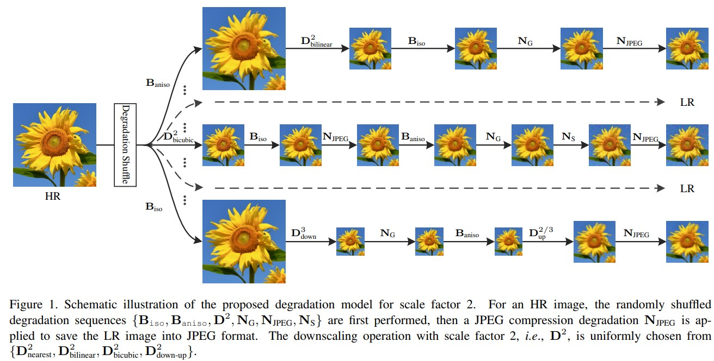

# BSRGAN

[Designing a Practical Degradation Model for Deep Blind Image Super-Resolution](https://arxiv.org/abs/2103.14006)

## Code Source
```
link: https://github.com/cszn/BSRGAN
branch: master
commit: 5ce1a9c6ae292f30ccfce4b597ecb73c70401733
```


## Model Arch

### pre-processing

BSRGAN系列网络的预处理操作可以按照如下步骤进行，即先对图片进行resize至128的尺寸，然后对其进行归一化等操作：

```python
def get_image_data(image_file, input_shape = [1, 3, 128, 128]):
    size = input_shape[2:]

    src_image = cv2.imread(image_file, cv2.IMREAD_UNCHANGED)
    image = cv2.resize(src_image, size, interpolation=cv2.INTER_AREA)

    img = image.astype(np.float32) / 255.
    img = img[:, :, [2, 1, 0]] # BGR to RGB
    img = np.ascontiguousarray(np.transpose(img, (2, 0, 1))) # HWC to CHW
    img = np.expand_dims(img, axis=0)

    return np.array(image), np.array(img)
```

### post-processing

BSRGAN系列网络的后处理操作，对模型输出乘以255，像素恢复至[0, 255]：
```python
output = np.squeeze(heatmap)
output = np.transpose(output[[2, 1, 0], :, :], (1, 2, 0))  # HWC, BGR
output = np.clip(output, 0, 1.0)
output = (output * 255.0).round().astype(np.uint8)
```

### backbone

众所周知，当图像超分的预假设退化模型与真实图像的退化方式不匹配时，模型的性能会出现性能下降，甚至负面效果现象。尽管已有集中退化模型考虑的额外的影响因素(比如模糊核以及程度)，但是它们仍然无法有效覆盖真实图像的多样性退化方式。

为解决该问题，本文设计了一种更复杂但实用的退化模型，它包含对模糊、下采样以及噪声退化的随机置换(也就是说每种退化对应多种类型，且顺序会进行随机调整)。具体来说，模糊退化通过两个卷积(各向同性与各向异性高斯模糊)进行模拟；下采样从最近邻、双线性以及双三次插值中随机挑选；噪声则通过不同噪声水平的高斯噪声、不同压缩质量的JPEG压缩、逆转ISP生成的传感器噪声等。

为验证所设计的新的退化模型的有效性，我们训练了一个深度盲ESRGAN超分模型并将其对不同退化的合成、真实图像进行处理。实验结果表明：新的退化模型有助于显著提升深度超分模型的实用性，为RealSR应用提供了一种有效的解决方案。

设计一个范围更广的退化模型：
- 将模糊，降采样和噪声复杂化（实用化）。模糊：采用两种模糊，分别是各向同性高斯模糊和各向异性高斯模糊；降采样：nearest、bilinear、bicubic以及up-down scaling；噪声：3D高斯噪声、JPEG噪声、相机噪声。
- 随机打乱模糊，降采样和噪声的顺序


<div  align="center">

</div>
超分网络：超分模型并不是BSRGAN的核心，现有的超分辨率模型均可以作为训练退化模型生成的图像的选择。选择了ESRGAN作为基线模型。

### common

- Degradation
- RRDB
- ESRGAN

## Model Info

### 模型性能

| Models  | Flops(G) | Params(M) | PSNR(dB) | SSIM | Shape |
| :---: | :--: | :--: | :---: | :----: | :--------: |
| [BSRNet_x4](https://github.com/cszn/BSRGAN) |  652.697  |  16.698  |  24.533 | 0.675  |  3x128x128  |
| BSRNet_x4 **vacc fp16** |  -  |  -  |  24.535 | 0.676 |  3x128x128  |
| BSRNet_x4 **vacc percentile int8** |  -  |  -  |  19.777 | 0.609 |  3x128x128  |
| [BSRGAN_x4](https://github.com/cszn/BSRGAN) |  652.697  |  16.698  |  23.023 | 0.637  |  3x128x128  |
| BSRGAN_x4 **vacc fp16** |  -  |  -  | 23.028  | 0.637 |  3x128x128  |
| BSRGAN_x4 **vacc percentile int8** |  -  |  -  | 22.686  | 0.622 |  3x128x128  |
| [BSRGAN_x2](https://github.com/cszn/BSRGAN) |  615.207  |  16.661  |  25.053 | 0.654  |  3x128x128  |
| BSRGAN_x2 **vacc fp16** |  -  |  -  | 25.059  |  0.655 |  3x128x128  |
| BSRGAN_x2 **vacc percentile int8** |  -  |  -  |  24.129 | 0.614 |  3x128x128  |


### 测评数据集说明


[DIV2K数据集](https://data.vision.ee.ethz.ch/cvl/DIV2K/)数据集是一个受欢迎的单图像超分辨率数据集，可用于通过低分辨率图像重建高分辨率图像。
此数据集包含 1000 张具有不同退化类型的低分辨率图像，分为：
- 训练数据：800 张低分辨率图像，并为降级因素提供高分辨率和低分辨率图像。
- 验证数据：100 张高清高分辨率图片，用于生成低分辨率的图像。
- 测试数据：100 张多样化的图像，用来生成低分辨率的图像。

<div  align="center">

</div>

### 评价指标说明
- 峰值信噪比(Peak Signal-to-Noise Ratio, PSNR)，PSNR是信号的最大功率和信号噪声功率之比，测量重构图像的质量，通常以分贝（dB）来表示。PSNR指标越高，说明图像质量越好
- 结构相似性评价(Structure Similarity Index, SSIM)，SSIM是衡量两幅图像相似度的指标，其取值范围为[0,1]，SSIM的值越大，表示图像失真程度越小，说明图像质量越好
- Fréchet Inception Distance，FID是衡量两个多元正态分布的距离，反映了生成图片和真实图片的距离，数据越小越好


## Build_In Deploy

- [official.md](./source_code/official.md)