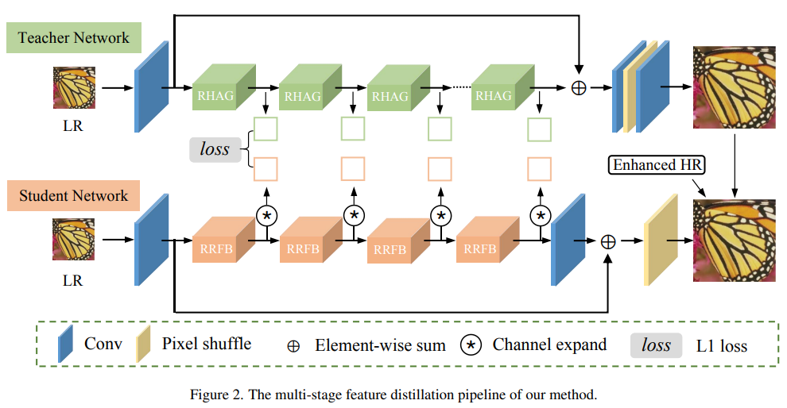
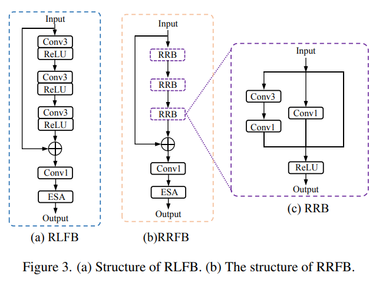

# DIPNet

[DIPNet: Efficiency Distillation and Iterative Pruning for Image Super-Resolution](https://arxiv.org/pdf/2304.07018)

## Code Source
```
# official
link: https://github.com/xiumu00/DIPNet
branch: master
commit: 69f43a7873a866a492ee316bc579e56b6f861170
```

## Model Arch

<div align=center></div>

### pre-processing

MSRN系列网络的预处理操作，可以按照如下步骤进行：

```python
def get_image_data(image_file, input_shape = [1, 3, 1080, 1920]):
    size = input_shape[2:][::-1]

    image = cv2.imread(image_file)
    img = cv2.resize(image, size) # , interpolation=cv2.INTER_AREA
    img = cv2.cvtColor(img, cv2.COLOR_BGR2RGB)

    img = np.ascontiguousarray(np.transpose(img, (2, 0, 1))) # HWC to CHW
    img = np.expand_dims(img, axis=0)
    img /= 255.0
    return np.array(img)
```

### post-processing

MSRN系列网络的后处理操作，可以按照如下步骤进行：

```python
heatmap = vacc_model.get_output(name, 0, 0).asnumpy().astype("float32")

output = np.squeeze(heatmap)
output = np.transpose(output[[2, 1, 0], :, :], (1, 2, 0))  # HWC, BGR
output = np.clip(output*255, 0, 255)
```

### backbone

首先，提出了使用增强的HR图像来增强轻量级网络的学习能力；

作者提出了一个结合蒸馏，渐进式学习和修剪的多阶段轻量化训练策略；

大量实验表明论文所提方法的有效性，并且该方法在推理时间和模型大小上超过了NITRE 2023高效超分挑战赛的所有其他对手。

作者提出的高效蒸馏和迭代式修剪SR网络，称为DIPNet，该网络包含四个主要模块，分别为：
- 重参数化残差特征块（reparameterization residual feature block, RRFB）；
- 基于模型引导的GT增强（Model Guided Ground-truth Enhancement）；
- 多锚点特征蒸馏（Multi-anchor Feature Distillation）；
- 迭代式修剪策略（Iterative Pruning Strategy）

<div align=center></div>

### common

- RRFB
- Pixel-Shuffle

## Model Info

### 模型性能

| Models  |  Code Source |Flops(G) | Params(M) | PSNR(dB) | SSIM | Shape |
| :---: | :--: |:--: | :--: | :---: | :----: | :--------: |
| DIPNet | [Official](https://github.com/xiumu00/DIPNet) |  431.604  |  0.093  |  32.912 | 0.776 | 3x1080x1920 |
| DIPNet **vacc max int8** |  -  |  -  |  -  |  32.449 | 0.770 |  3x1080x1920  |


> Tips
>
> - 基于原始模型[DIPNet.py](https://github.com/xiumu00/DIPNet/blob/master/models/DIPNet.py)进行修改，原始模型为4x放大，且有ESA注意力模块，模型较大
> - [dipnet_arch.py](../dipnet/source_code/basicsr/archs/dipnet_arch.py)修改：去除ESA，减少网络参数为：`feature_channels=32, mid_channels=24, upscale=2`，在[BasicSR](https://github.com/XPixelGroup/BasicSR)框架下，重新训练2x模型
> - 精度指标基于DIV2K valid两倍放大数据集


### 测评数据集说明

[DIV2K数据集](https://data.vision.ee.ethz.ch/cvl/DIV2K/)是一个受欢迎的单图像超分辨率数据集，可用于通过低分辨率图像重建高分辨率图像。
此数据集包含 1000 张具有不同退化类型的低分辨率图像，分为：
- 训练数据：800 张低分辨率图像，并为降级因素提供高分辨率和低分辨率图像。
- 验证数据：100 张高清高分辨率图片，用于生成低分辨率的图像。
- 测试数据：100 张多样化的图像，用来生成低分辨率的图像。

<div  align="center">

</div>


### 评价指标说明
- 峰值信噪比(Peak Signal-to-Noise Ratio, PSNR)，PSNR是信号的最大功率和信号噪声功率之比，测量重构图像的质量，通常以分贝（dB）来表示。PSNR指标越高，说明图像质量越好
- 结构相似性评价(Structure Similarity Index, SSIM)，SSIM是衡量两幅图像相似度的指标，其取值范围为[0,1]，SSIM的值越大，表示图像失真程度越小，说明图像质量越好
- Fréchet Inception Distance，FID是衡量两个多元正态分布的距离，反映了生成图片和真实图片的距离，数据越小越好


## Build_In Deploy

- [basicsr.md](./source_code/basicsr.md)
