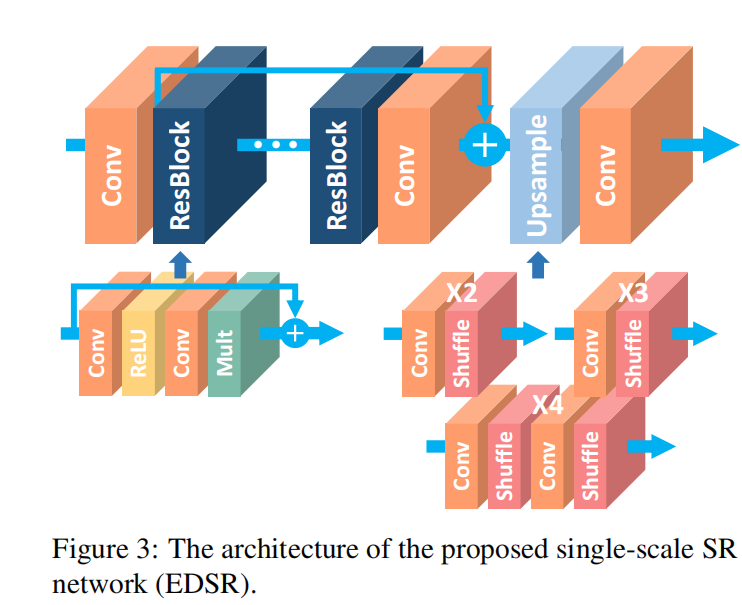
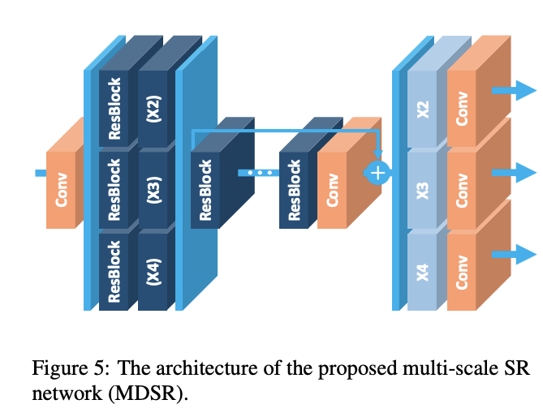

# EDSR

[Enhanced Deep Residual Networks for Single Image Super-Resolution](https://arxiv.org/abs/1707.02921)

## Code Source
```
#official
link: https://github.com/sanghyun-son/EDSR-PyTorch
branch: master
commit: 8dba5581a7502b92de9641eb431130d6c8ca5d7f

# basicsr
link: https://github.com/XPixelGroup/BasicSR
branch: v1.4.2
commit: 651835a1b9d38dbbdaf45750f56906be2364f01a
```

## Model Arch

<div  align="center">

</div> 

### pre-processing

EDSR系列网络的预处理操作，可以按照如下步骤进行（不同来源实现可能不同，实际查看推理脚本实现）：

```python
image = cv2.imread(image_file)
img = cv2.resize(image, size, interpolation=cv2.INTER_AREA)
img = cv2.cvtColor(img, cv2.COLOR_BGR2RGB)
img = np.ascontiguousarray(np.transpose(img, (2, 0, 1))) # HWC to CHW
img = img / 255.0
img = np.expand_dims(img, axis=0)
```

### post-processing

EDSR系列网络的后处理操作，可以按照如下步骤进行（不同来源实现可能不同，实际查看推理脚本实现）：
```python
output = np.squeeze(heatmap)
output = np.transpose(output[[2, 1, 0], :, :], (1, 2, 0))  # HWC, BGR
output = np.clip(output * 255, 0, 255)
```

### detail

韩国首尔大学的研究团队提出用于图像超分辨率任务的新方法，分别是增强深度超分辨率网络 EDSR 和一种新的多尺度深度超分辨率 MDSR，在减小模型大小的同时实现了比当前其他方法更好的性能，分别赢得NTIRE2017超分辨率挑战赛的第一名和第二名。
EDSR是一个加强的用于SR的深度残差网络，主要是在SRResnet的基础上进行改造的。
VDSR模型是可以同时解决不同scale问题的，这说明尺度特定的模型的训练是有冗余的，但是VDSR的LR是需要通过bicubic成HR尺寸的，没有直接在LR空间进行计算，损失了LR空间的图像细节并增大了计算复杂度。为了解决这个问题呢，作者主要采用了以下两点：
- 移除了不必要的模型，主要就是移除了BN
- 设计了带有一个单一主分支的基准（多尺度multi-scale）模块 ，含有 B = 16 的残差模块，所以大部分参数都可以在不同尺度间进行共享

<div  align="center">

</div> 

Batch Norm可谓深度学习中非常重要的技术，不仅可以使训练更深的网络变容易，加速收敛，还有一定正则化的效果，可以防止模型过拟合。在很多基于CNN的分类任务中，被大量使用。
但在图像超分辨率和图像生成方面，Batch Norm的表现并不好，加入了Batch Norm，反而使得训练速度缓慢，不稳定，甚至最后发散。

以图像超分辨率来说，网络输出的图像在色彩、对比度、亮度上要求和输入一致，改变的仅仅是分辨率和一些细节，而Batch Norm，对图像来说类似于一种对比度的拉伸，任何图像经过Batch Norm后，其色彩的分布都会被归一化，也就是说，它破坏了图像原本的对比度信息，所以Batch Norm的加入反而影响了网络输出的质量。虽然Batch Norm中的scale和shift参数可以抵消归一化的效果，但这样就增加了训练的难度和时间，还不如直接不用。不过有一类网络结构可以用，那就是残差网络（Residual Net），但也仅仅是在residual block当中使用，比如SRResNet，就是一个用于图像超分辨率的残差网络。为什么这类网络可以使用Batch Norm呢？有人认为是因为图像的对比度信息可以通过skip connection直接传递，所以也就不必担心Batch Norm的破坏了。

广泛一些，Batch Norm会忽略图像像素（或者特征）之间的绝对差异（因为均值归零，方差归一），而只考虑相对差异，所以在不需要绝对差异的任务中（比如分类），有锦上添花的效果。而对于图像超分辨率这种需要利用绝对差异的任务，Batch Norm只会添乱。

由于批规范化层消耗了与它前面的卷积层相同大小的内存，在去掉这一步操作后，相同的计算资源下，EDSR就可以堆叠更多的网络层或者使每层提取更多的特征，从而得到更好的性能表现。EDSR用L1范数样式的损失函数来优化网络模型。在训练时先训练低倍数的上采样模型，接着用训练低倍数上采样模型得到的参数来初始化高倍数的上采样模型，这样能减少高倍数上采样模型的训练时间，同时训练结果也更好。


此外，设计了带有一个单一主分支的基准（多尺度multi-scale）模块 ，含有 B = 16 的残差模块，所以大部分参数都可以在不同尺度间进行共享。

在多尺度结构中，引入了尺度特定（scale-specific）的处理模块，以在多尺度下控制超分辨率。首先，预处理模块被置于网络的前端，以减少不同尺度的输入图像的变化幅度，每一个预处理模块包括两个 5×5 内核（kernels）的残值区块（residual blocks ）。通过在预处理模块中采用较大的内核，我们可以使尺度特定的部分保持浅层（shallow）状态，在网络的早期阶段可以覆盖较大的感受野（receptive field）。

在模型的末端，尺度特定的升采样模块被并行放置，以进行多尺度重构。其升采样（upsampling）模块与单尺度模型中的情况相类似。

<div  align="center">

</div> 

### common

- RIR
- Pixel-Shuffle

## Model Info

### 模型性能

| Models  | Source |Flops(G) | Params(M) | PSNR(dB) | SSIM | Shape |
| :---: | :--: |:--: | :--: | :---: | :----: | :--------: |
| EDSR_Mx2 | [BasicSR](https://github.com/XPixelGroup/BasicSR/blob/master/docs/ModelZoo_CN.md) | 2403.078  |  1.370  |  31.619 | 0.908 |  3x768x1024  |
| EDSR_Mx2 **vacc percentile int8** | - |-  |  -  |  33.031 | 0.853 |  3x768x1024  |
| EDSR_x1 | [BasicSR](https://github.com/XPixelGroup/BasicSR/blob/master/docs/ModelZoo_CN.md) | 363.469  |  0.177  | 28.847 | 0.872 |  3x720x1280  |
| EDSR_x1 **vacc percentile int8** | - |-  |  -  |  28.788 | 0.807 |  3x720x1280  |
| EDSR_x2 | [Official](https://github.com/sanghyun-son/EDSR-PyTorch) | 5934.700  |  40.730  | 35.030 | - |  multi-shape  |
| EDSR_x2 **vacc percentile int8** | - |-  |  -  |  29.320 | 0.787 |  3x256x256  |
| EDSR_baseline_x2 | [Official](https://github.com/sanghyun-son/EDSR-PyTorch) | 200.256  |  1.370  | 34.610 | - |  multi-shape  |
| EDSR_baseline_x2 **vacc percentile int8** | - |-  |  -  |  28.552 | 0.801 |  3x256x256  |
| EDSR_baseline_x4 | [Official](https://github.com/sanghyun-son/EDSR-PyTorch) | 289.330  |  1.518  | 28.950 | - |  multi-shape  |
| EDSR_baseline_x4 **vacc percentile int8** | - |-  |  -  |  27.252 | 0.609 |  3x256x256  |


### 测评数据集说明

[DIV2K数据集](https://data.vision.ee.ethz.ch/cvl/DIV2K/)是一个受欢迎的单图像超分辨率数据集，可用于通过低分辨率图像重建高分辨率图像。
此数据集包含 1000 张具有不同退化类型的低分辨率图像，分为：
- 训练数据：800 张低分辨率图像，并为降级因素提供高分辨率和低分辨率图像。
- 验证数据：100 张高清高分辨率图片，用于生成低分辨率的图像。
- 测试数据：100 张多样化的图像，用来生成低分辨率的图像。

<div  align="center">

</div>

[GOPRO](https://seungjunnah.github.io/Datasets/gopro)数据集，作者使用GOPRO4 HERO Black相机拍摄了240fps的视频，然后对连续的7到13帧取平均获得模糊程度不一的图像。每张清晰图像的快门速度为1/240s，对15帧取平均相当于获得了一张快门速度为1/16s的模糊图像。作者将模糊图像对应的清晰图像定义为处于中间位置的那一帧图像。最终，一共生成了3214对模糊-清晰图像，分辨率为1280×720。

<div  align="center">

</div>


### 评价指标说明
- 峰值信噪比(Peak Signal-to-Noise Ratio, PSNR)，PSNR是信号的最大功率和信号噪声功率之比，测量重构图像的质量，通常以分贝（dB）来表示。PSNR指标越高，说明图像质量越好
- 结构相似性评价(Structure Similarity Index, SSIM)，SSIM是衡量两幅图像相似度的指标，其取值范围为[0,1]，SSIM的值越大，表示图像失真程度越小，说明图像质量越好
- Fréchet Inception Distance，FID是衡量两个多元正态分布的距离，反映了生成图片和真实图片的距离，数据越小越好


## Build_In Deploy

- [basicsr.md](./source_code/basicsr.md)
- [official.md](./source_code/official.md)
