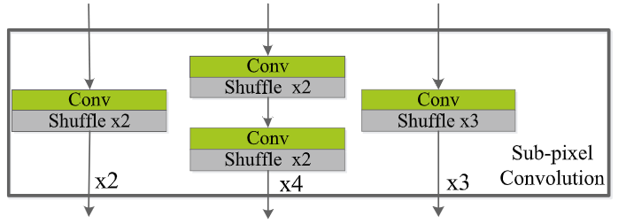

# LESRCNN

[Lightweight image super-resolution with enhanced CNN](https://arxiv.org/abs/2007.04344)

## Code Source
```
link: https://github.com/hellloxiaotian/LESRCNN
branch: master
commit: e3729ed3884cbaa67c1534a1ac9626c71d670d27
```

## Model Arch

<div align=center></div>

### pre-processing

LESRCNN系列网络的预处理操作，可以按照如下步骤进行：

```python
def get_image_data(image_file, input_shape=[1, 3, 128, 128], scale=2):
    size = input_shape[2:][::-1]

    src_image = cv2.imread(image_file, cv2.IMREAD_COLOR)
    image = cv2.resize(src_image, size, interpolation=cv2.INTER_AREA)

    img = image.astype(np.float32) / 255.
    img = img[:, :, [2, 1, 0]] # BGR to RGB
    img = np.ascontiguousarray(np.transpose(img, (2, 0, 1))) # HWC to CHW
    img = np.expand_dims(img, axis=0)

    return img
```

### post-processing

LESRCNN系列网络的后处理操作，可以按照如下步骤进行：
```python
output = np.squeeze(heatmap)
output = np.transpose(output[[2, 1, 0], :, :], (1, 2, 0))  # HWC, BGR
output = np.clip(output, 0, 1)
output = (output * 255.0).round().astype(np.uint8)
```

### backbone
已有方法都通过增大网络深度提升图像超分辨性能， 但这会增大网络计算代价，也不适用于手机和相机等。针对这些问题，本文提出一种轻量级增强的超分辨网络（A lightweight enhanced SR CNN, LESRCNN）。LSRCNN主要从网络结构和解决任务两方面来设计网络的。在网络结构方面，LESRCNN采用异构结构，结合低频特征和高频特征，提升网络超分辨性能。在解决任务上，采用一组自适应的子像素卷积计算实现盲超分辨网络。本文提出的LESRCNN由信息提取和增强块（IEEB）、重构块（RB）和信息提纯块（IRB）组成。


IEEB: IEEB能提取层次的低频特征和逐步加强获得特征的作用来增强网络浅层对深层的记忆能力。为了移除冗余的低频特征，3x3和1x1卷积组成的异构结构应用到IEEB中。

RB: 因为SR任务目标是把低分辨率图像转换为高分辨率图像，所以RB能通过子像素卷积技术把低频特征转换为高频特征。为防止原始输入低频图像在转换过程中丢失重要信息，RB通过融合局部和全局特征来解决网络长依赖问题。

此外，为了实现盲超分辨网络，一组灵活的子像素卷积技术应用到RB中。
<div  align="center">

</div> 

其中，这个灵活的子像素卷积技术由x2、x3和x4三种模式组成。当训练固定缩放因子的超分辨模型时，选择三种模式中一种即可。当训练盲超分辨模型时，三种模式同时开启。

IRB: IRB能进一步学习RB获得高频特征，以恢复更多的高频细节信息，提升SR性能。此外，IRB也负责构造高清图像。

- LESRCNN通过级联三个块，以减少参数量和获得高的图像超分辨性能
- LESRCNN通过提取层次低频特征并融合这些特征，以解决网络长期依赖问题。此外，LSRCNN中异构卷积结构能在不降低SR性能情况下降低网络参数和提高SR网络效率。低频和高频特征同时使用能提升SR性能
- LESRCNN能处理固定缩放因子的低分辨率图像和盲超分辨任务


### common

- Light Weight
- Sub-Pixel Convolution

## Model Info

### 模型性能

| Models  | Flops(G) | Params(M) | PSNR(dB) | SSIM | Shape |
| :---: | :--: | :--: | :---: | :----: | :--------: |
| [LESRCNN_x2](https://github.com/hellloxiaotian/LESRCNN) |  44.459  |  0.626  |  29.763 | 0.916 |  3x128x128 |
| LESRCNN_x2 **vacc percentile int8** |  -  |  -  |  27.575 | 0.877 |  3x128x128  |
| [LESRCNN_x4](https://github.com/hellloxiaotian/LESRCNN) |  152.592  |  0.7740  |  25.951 | 0.769 |  3x128x128 |
| LESRCNN_x4 **vacc percentile int8** |  -  |  -  |  25.258 | 0.752 |  3x128x128  |

> Tips
>
> PixelShuffle现在只支持int8
>

### 测评数据集说明

[DIV2K数据集](https://data.vision.ee.ethz.ch/cvl/DIV2K/)是一个受欢迎的单图像超分辨率数据集，可用于通过低分辨率图像重建高分辨率图像。
此数据集包含 1000 张具有不同退化类型的低分辨率图像，分为：
- 训练数据：800 张低分辨率图像，并为降级因素提供高分辨率和低分辨率图像。
- 验证数据：100 张高清高分辨率图片，用于生成低分辨率的图像。
- 测试数据：100 张多样化的图像，用来生成低分辨率的图像。

<div  align="center">

</div>


### 评价指标说明
- 峰值信噪比(Peak Signal-to-Noise Ratio, PSNR)，PSNR是信号的最大功率和信号噪声功率之比，测量重构图像的质量，通常以分贝（dB）来表示。PSNR指标越高，说明图像质量越好
- 结构相似性评价(Structure Similarity Index, SSIM)，SSIM是衡量两幅图像相似度的指标，其取值范围为[0,1]，SSIM的值越大，表示图像失真程度越小，说明图像质量越好
- Fréchet Inception Distance，FID是衡量两个多元正态分布的距离，反映了生成图片和真实图片的距离，数据越小越好


## Build_In Deploy
- [official.md](./source_code/official.md)
