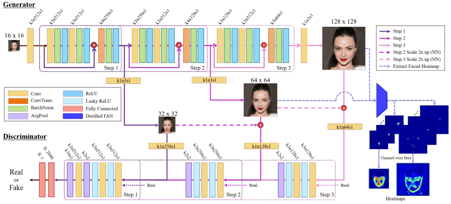

## PFSRNet

[Progressive Face Super-Resolution via Attention to Facial Landmark](https://arxiv.org/abs/1908.08239)


## Code Source
```
link: https://github.com/DeokyunKim/Progressive-Face-Super-Resolution
branch: master
commit: 8d7a354fa96c92f6efdb2074732c343a351d2ce8
```


## Model Arch

<div  align="center">

</div>

### pre-processing

PFSRNet网络的预处理操作可以按照如下步骤进行，即先对图片进行渐进式resize至一定尺寸(16)，然后对其进行归一化、减均值除方差等操作：

```python
  input_image = Image.open(image_file).convert('RGB')

  # 需要人脸配准，src，128-64-32-16，input
  pre_process = transforms.Compose([
                                    transforms.CenterCrop((178, 178)),
                                    transforms.Resize((128,128)),
                                            ])
  input_image = pre_process(input_image)
  _16x16_down_sampling = transforms.Resize((16,16))
  _32x32_down_sampling = transforms.Resize((32, 32))
  _64x64_down_sampling = transforms.Resize((64, 64))

  totensor = transforms.Compose([
                              transforms.ToTensor(),
                              transforms.Normalize((0.5, 0.5, 0.5), (0.5, 0.5, 0.5)),
                              ])

  transformed_image = _16x16_down_sampling(_32x32_down_sampling(_64x64_down_sampling(input_image)))
  transformed_image = totensor(transformed_image).unsqueeze(0)
  image_array = np.array(transformed_image)
```

### post-processing

PFSRNet算法的后处理，在模型输出后只需反归一化至[0, 255]。

### detail

- 提出渐进式多尺度训练方法，该方法通过将网络分成连续的步骤来进行稳定的训练，每个步骤产生的输出分辨率都逐渐提高（2x）
- 提出了一种新颖的面部注意力损失，并将其应用于每一步，以通过乘以像素差和热图值来更详细地恢复面部属性
- 提出了最新版本的人脸对齐网络（FAN）的蒸馏压缩版本，用于landmark热图提取


为了包含对抗性损失，网络结构由生成器网络和判别器网络组成，它们都是由逐级堆叠的层组成的。生成器网络就是人脸SR网络，由三个残差模块组成；鉴别器网络具有与生成器网络相对应的体系结构。

在生成器网络中，每个阶段的预测LR图像和判别器网络的缩放GT图像进行对抗，渐进式提升生成模型效果，最终达到8倍尺寸超分效果。


一般的人脸注意力网络（Facial Attention Network，FAN）在生成人脸关键点特征图时会存在重叠问题。为了生成更准确的人脸关键点区域的热图，基于标准的HourGlass沙漏结构，构建了既没有编解码器架构也没有跳跃层的网络，以单尺度特征图为基础预测标志点。此外，为了减少总体训练时间并获得与最好的性能，作者将FAN压缩蒸馏到下图所示的网络中。

相比原始FAN，distilled FAN对关键点的定位更加模糊，造成实际上获得的加权是整个人脸范围，而原始FAN仅仅加权关键点，忽略了整个人脸范围，造成人脸非关键点位置的还原变差。

<div  align="center">

</div>


### common

- Progressive & Multi-Scale Training
- HourGlass Block
- Facial Attention Loss
- Distilled Face Alignment Network
- GAN


## Model Info

## 模型精度

| Model | Params(M)| Flops(G)| PSNR| SSIM | Shape |
|:-:|:-:|:-:|:-:|:-:|:-:|
| [PFSRNet](https://github.com/DeokyunKim/Progressive-Face-Super-Resolution) | 8.968 |22.418| 23.432 | 0.684 | 3x16x16 |
| PFSRNet **vacc fp16**| - |  - |23.956| 0.685 | 3x16x16 |
| PFSRNet **vacc int8 kl_divergence**| - | - | 23.816| 0.673 | 3x16x16 |

> **Note**

> 8x放大，输出：3x128x128
> 
> 评估指标基于[eval.py](https://github.com/DeokyunKim/Progressive-Face-Super-Resolution/blob/master/eval.py)，完整评估数据集


### 测评数据集说明

[CelebA](http://mmlab.ie.cuhk.edu.hk/projects/CelebA.html)是一个大规模的人脸属性数据集，包含超过 20 万张名人图像，每张都有 40 个属性注释。 该数据集中的图像涵盖了较大的姿势变化和杂乱的背景。 CelebA 种类多、数量多、注释丰富，包括10,177 个身份，202,599 张人脸图像，以及5 个地标位置，每张图像 40 个二进制属性注释。该数据集可用作以下计算机视觉任务的训练和测试集：人脸属性识别、人脸识别、人脸检测、地标（或人脸部分）定位以及人脸编辑与合成。

<div  align="center">

</div>

### 指标说明
- 峰值信噪比(Peak Signal-to-Noise Ratio, PSNR)，PSNR是信号的最大功率和信号噪声功率之比，测量重构图像的质量，通常以分贝（dB）来表示。PSNR指标越高，说明图像质量越好
- 结构相似性评价(Structure Similarity Index, SSIM)，SSIM是衡量两幅图像相似度的指标，其取值范围为[0,1]，SSIM的值越大，表示图像失真程度越小，说明图像质量越好
- Fréchet Inception Distance，FID是衡量两个多元正态分布的距离，反映了生成图片和真实图片的距离，数据越小越好

## Build_In Deploy
- [official.md](./source_code/official.md)
