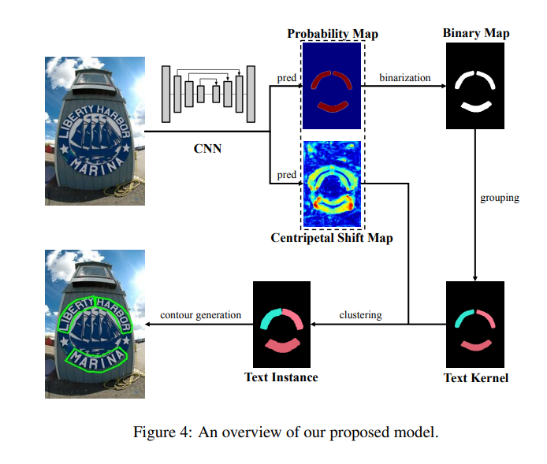

# CT
[CentripetalText: An Efficient Text Instance Representation for Scene Text Detection](https://arxiv.org/abs/2107.05945)

## code source

```
# ppocr
link: https://github.com/PaddlePaddle/PaddleOCR
branch: v2.7
commit: b17c2f3a5687186caca590a343556355faacb243
```

## Model Arch

CentripetalText（CTText）是一个用于场景文本检测的深度学习算法。CentripetalText (CT) 将文本实例分解为text kernels和centripetal shifts。除了将文本检测器转换为proposals生成模块，即CentripetalText Proposal Network (CPN)，替换了Mask TextSpotter v3中的Segmentation Proposal Network (SPN)，生成了更准确的 proposals。




### pre-processing

CT系列网络的预处理操作可以按照如下步骤进行，即先对图片(RGB)进行resize至[640, 960]的尺寸，然后对其进行归一化、减均值除方差等操作

```python
[
    torchvision.transforms.Resize((640, 960)),
    torchvision.transforms.ToTensor(),
    torchvision.transforms.Normalize(mean=[0.485, 0.456, 0.406], std=[0.229, 0.224, 0.225],),
]
```

### backbone

ppocr中采用resnet18_vd网络提取特征。然后，为了提高轻量 backbone 的representation能力，我们使用了两个级联FPEMs来持续增强特征金字塔的上下层。其次，将生成的不同深度的特征金字塔合并为单层基本特征。最后，我们使用基本特征来Probability Map与centripetal shift map，以便进行轮廓生成。


## Model Info

### 模型性能

| 模型  | 源码 | precision  | recall | Hmean |
| :---: | :--: | :--: | :--: | :----: | 
|  det_r18_vd_ct   | [ppocr](https://github.com/PaddlePaddle/PaddleOCR/blob/release/2.7/doc/doc_ch/algorithm_det_ct.md) | 88.68% | 81.70% |   85.05%   | 


### 测评数据集说明


<div  align="center">

</div>

Total-Text是最大弯曲文本数据集之一-ArT（任意形状文本数据集）训练集中的一部分。用于关于任意形状文本识别阅读任务的创新想法研究，包括：

a）训练集-包含1255张图像。

b）测试集-包含300张图像。

### 评价指标说明

- precision检测精度：正确的检测框个数在全部检测框的占比，主要是判断检测指标
- recall检测召回率：正确的检测框个数在全部标注框的占比，主要是判断漏检的指标
- hmean是前两项的调和平均值

## Build_In Deploy
- [ppocr](./source_code/ppocr.md)
