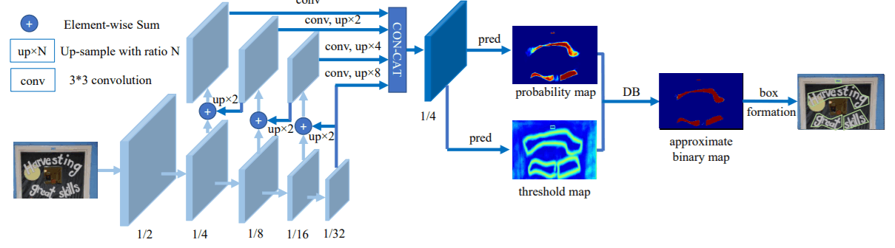
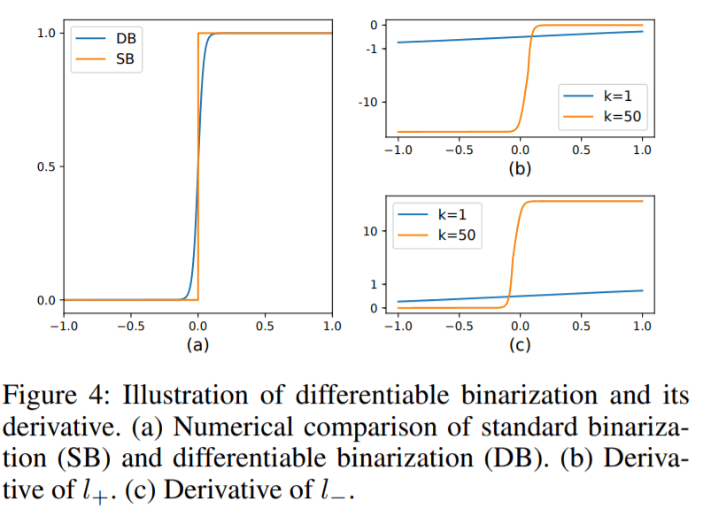

# DBNet
[Real-time Scene Text Detection with Differentiable Binarization](https://arxiv.org/abs/1911.08947)

## code source
```
# ppocr
link: https://github.com/PaddlePaddle/PaddleOCR
branch: v2.6.0
commit: 56aaead6d06b9ef6c6ecb8655f5a571f579f939e
```
```
# ppocr_v4
link: https://github.com/PaddlePaddle/PaddleOCR
branch: v2.7.0
commit: 8cce9b6fd7ccb50226d0c38f94054d81c29b8184
```
```
# official
link: https://github.com/MhLiao/DB
branch: master
commit: e5a12f5c2f0c2b4a345b5b8392307ef73481d5f6
```

## Model Arch

基于分割的文字检测方法，最关键的步骤是对二值化map的后处理过程，即将分割方法产生的概率图转化为文本框的过程。

与传统的固定阈值不同，DBNet的pipeline目的是将二值化操作插入到分割网络中进行联合优化，这样网络可以自适应的预测图像中每一个像素点的阈值（区别去传统方法的固定阈值），从而可完全区分前景和背景的像素。

二值化阈值由网络学习得到，彻底将二值化这一步骤加入到网络里一起训练，这样最终的输出图对于阈值就会具有非常强的鲁棒性，在简化了后处理的同时提高了文本检测的效果。

整个流程如下:

- 图像经过FPN网络结构，得到四个特征图，分别为1/4,1/8,1/16,1/32大小
- 将四个特征图分别上采样为1/4大小，再concat，得到特征图F
由F得到 probability map (P) 和 threshold map (T)
- 通过P、T计算（通过可微分二值化DB，下文介绍） approximate binary map（ 近似binary map）

对于每个网络，一定要区分训练和推理阶段的不同：

- 训练阶段：对P、T、B进行监督训练，P和B是用的相同的监督信号（label）
- 推理阶段：通过P或B就可以得到文本框。

<div  align="center">

</div>

### pre-processing
DBNet系列网络的预处理操作可以按照如下步骤进行，即先对图片进行resize至[736, 1280]的尺寸（32的倍数），然后对其进行归一化、减均值除方差等操作

```python
[
    torchvision.transforms.Resize((736, 1280)),
    torchvision.transforms.ToTensor(),
    torchvision.transforms.Normalize(mean=[0.485, 0.456, 0.406], std=[0.229, 0.224, 0.225],),
]
```

### backbone

DBNet的主干网络是ResNet，在stage2-4中使用Deformable convolution来更好地检测长文本。然后增加了一个FPN结构，经过FPN后，得到了四张大小分别为原图的1/4，1/8，1/16，1/32的特征图。再将四个特征图分别上采样至原图的1/4大小，然后将四个1/4大小的特征图concat，得到F。改善对不同文字尺度的识别。

### 可微分二值化
标准的二值化操作会给训练带来梯度不可微的情况，如果将二值化操作加入到分割网络进行联合优化，是没法直接用SGD来做的。

为解决不可微的问题，作者引入了Differentiable Binarization。DB曲线与标准二值化曲线具有很高的相似度，并且DB曲线是可微分的，从而达到了二值化的目的，也可加入分割网络联合优化。

<div  align="center">

</div>

### head-DBHead

- probability map, w×h×1 , 代表像素点是文本的概率

- threshhold map, w×h×1, 每个像素点的阈值

- binary map, w×h×1, 由1,2计算得到，计算公式为DB公式


### post-processing

在推理时，采用概率图或近似二值图便可计算出文本框，为了方便，作者选择了概率图，这样在推理时便可删掉阈值分支。文本框的形成可分为三个步骤：

- 使用固定阈值（0.2）对概率图（或近似二值图）进行二值化，得到二值图

- 从二值图中得到连通区域（收缩文字区域）

- 将收缩文字区域按Vatti clipping算法的偏移系数D'进行扩张得到最终文本框


## Model Info

### 模型性能

| 模型  | 源码 | precision  | recall | Hmean | input size |
| :---: | :--: | :--: | :--: | :----: | :--------: |
|  dbnet_mobilenet_v3   | [ppocr](https://github.com/PaddlePaddle/PaddleOCR/blob/release/2.6/doc/doc_ch/algorithm_det_db.md) | 0.7729 | 0.7308 |   0.7512   |    train 640×640 <br/> val 736×1280    |
|  dbnet_mobilenet_v3 **vacc int8 kl_divergence**   | [ppocr](https://github.com/PaddlePaddle/PaddleOCR/blob/release/2.6/doc/doc_ch/algorithm_det_db.md) | 0.7723 |  0.6760 |   0.7210   |    736×1280     |
|  dbnet_resnet50_vd   | [ppocr](https://github.com/PaddlePaddle/PaddleOCR/blob/release/2.6/doc/doc_ch/algorithm_det_db.md) | 0.8641 |  0.7872 |   0.8238   |    train 640×640 <br/> val 736×1280     |
|  dbnet_resnet50_vd **vacc int8 kl_divergence**   | [ppocr](https://github.com/PaddlePaddle/PaddleOCR/blob/release/2.6/doc/doc_ch/algorithm_det_db.md) | 0.8218 |  0.8036 |   0.8126   |    736×1280     |
|  ch_PP_OCRv3_det   | [ppocr](https://github.com/PaddlePaddle/PaddleOCR/blob/release/2.7/doc/doc_ch/PP-OCRv3_introduction.md) | 0.5514 | 0.4006 |   0.4640   |    train 960×960 <br/> val 736×1280    |
|  ch_PP_OCRv4_det   | [ppocr](https://github.com/PaddlePaddle/PaddleOCR/blob/release/2.7/doc/doc_ch/PP-OCRv4_introduction.md) | 0.5215 | 0.4077 |   0.4577   |    train 640×640 <br/> val 736×1280    |
|  en_PP_OCRv3_det   | [ppocr](https://github.com/PaddlePaddle/PaddleOCR/blob/release/2.7/doc/doc_ch/PP-OCRv3_introduction.md) | 0.5202 | 0.4218 |   0.4658   |    train 960×960 <br/> val 736×1280    |
|  dbnet_resnet18_no_dcn | [MhLiao](https://github.com/MhLiao/DB) | 0.8484 |  	0.7085 |  	0.7722   |    train 640×640 <br/> val 736×1280     |
|  dbnet_resnet18_no_dcn | [MhLiao](https://github.com/MhLiao/DB) | 0.7579 |  	0.4580 |  	0.5720   |    val 640×640     |
|  dbnet_resnet18_no_dcn **vacc int8 percentile**| [MhLiao](https://github.com/MhLiao/DB) | 0.6158 |  	0.5340 |  	0.5710   |    640×640     |
|  dbnet_resnet50_no_dcn | [MhLiao](https://github.com/MhLiao/DB) | 0.8727 |  	0.7920 |  	0.8304   |    train 640×640 <br/> val 736×1280     |
|  dbnet_resnet50_no_dcn | [MhLiao](https://github.com/MhLiao/DB) | 0.8004 |  	0.6158 |  	0.6961   |   val 640×640     |
|  dbnet_resnet50_no_dcn **vacc int8 percentile**| [MhLiao](https://github.com/MhLiao/DB) | 0.7430 |  	0.6558 |  	0.6967   |    640×640     |
|  dbnet_resnet18_fpnc_1200e_icdar2015 | [mmocr](https://github.com/open-mmlab/mmocr/tree/main/configs/textdet/dbnet) | 0.8853 |  	0.7583 |  	0.8169   |   736x1280     |
|  dbnet_resnet18_fpnc_1200e_totaltext | [mmocr](https://github.com/open-mmlab/mmocr/tree/main/configs/textdet/dbnet) | 0.8640 |  	0.7770 |  	0.8182   |   736x1280     |
|  dbnet_resnet18_fpnc_100k_synthtext | [mmocr](https://github.com/open-mmlab/mmocr/tree/main/configs/textdet/dbnet) | null |   null |  	null   |   736x1280     |
|  dbnet_resnet50_1200e_icdar2015 | [mmocr](https://github.com/open-mmlab/mmocr/tree/main/configs/textdet/dbnet) | 0.8744 |  	0.8276 |  	0.8504   |   736x1280     |
|  dbnet_resnet50_oclip_1200e_icdar2015 | [mmocr](https://github.com/open-mmlab/mmocr/tree/main/configs/textdet/dbnet) | 0.9052 |  	0.8272 |  	0.8644   |   736x1280     |


> **Note**: 基于以下数据集
> 
> ICDAR 2015 ，train 640×640，val 736×1280
> 
> PPOCR v3系列模型并不是在ICDAR2015数据集下训练，因此精度偏低


### 测评数据集说明


<div  align="center">

</div>

[ICDAR 2015](https://rrc.cvc.uab.es/?ch=4&com=downloads)数据集包含1000张训练图像和500张测试图像。ICDAR 2015 数据集可以从上表中链接下载，首次下载需注册。 注册完成登陆后，下载下图中红色框标出的部分，其中， Training Set Images下载的内容保存在icdar_c4_train_imgs文件夹下，Test Set Images 下载的内容保存早ch4_test_images文件夹下。
<div  align="center">

</div>

[PaddleOCR](https://github.com/PaddlePaddle/PaddleOCR.git)提供了数据格式转换脚本，可以将官网 label 转换支持的数据格式。数据转换工具在`ppocr/utils/gen_label.py`, 这里以训练集为例：

```
# 将官网下载的标签文件转换为 train_icdar2015_label.txt
python gen_label.py --mode="det" --root_path="/path/to/icdar_c4_train_imgs/"  \
                    --input_path="/path/to/ch4_training_localization_transcription_gt" \
                    --output_label="/path/to/train_icdar2015_label.txt"
```
解压数据集和下载标注文件后，按照如下方式组织icdar2015数据集：
```
train_data/icdar2015/text_localization/
  └─ icdar_c4_train_imgs/         icdar 2015 数据集的训练数据
  └─ ch4_test_images/             icdar 2015 数据集的测试数据
  └─ train_icdar2015_label.txt    icdar 2015 数据集的训练标注
  └─ test_icdar2015_label.txt     icdar 2015 数据集的测试标注
```

### 评价指标说明

- precision检测精度：正确的检测框个数在全部检测框的占比，主要是判断检测指标
- recall检测召回率：正确的检测框个数在全部标注框的占比，主要是判断漏检的指标
- hmean是前两项的调和平均值

## Build_In Deploy

- [ppocr](./source_code/ppocr.md)
- [ppocr_v4](./source_code/ppocr_v4_det.md)
- [official](./source_code/official.md)   
- [mmocr](./source_code/mmocr.md)
