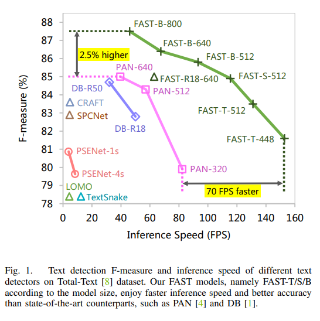
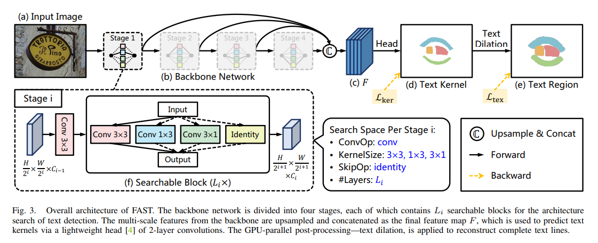

# FAST
[FAST: Faster Arbitrarily-Shaped Text Detector with Minimalist Kernel Representation](https://arxiv.org/pdf/2111.02394.pdf)



## code source

```
# pytorch
link: https://github.com/czczup/FAST/tree/main
branch: main
commit: 7ab105474ab226ab74a346b0648d2e2baab67d79
```

## Model Arch

FAST算法采用NAS网络搜索，同时运用Connected Components Labeling (CCL)算法，实现用gpu快速后处理得到最终文本位置



### pre-processing

FAST系列网络的预处理操作可以按照如下步骤进行，即先对图片(BGR)进行resize至对应的尺寸（32的倍数），然后对其进行归一化、减均值除方差等操作

```python
[
    torchvision.transforms.Resize((640, 640)),
    torchvision.transforms.ToTensor(),
    torchvision.transforms.Normalize(mean=[0.485, 0.456, 0.406], std=[0.229, 0.224, 0.225],),
]
```

### backbone

FAST算法网络结构使用NAS搜索，在NAS搜索中，遵循以下原则：

- NAS选项中，设计了1*3、3*1的卷积核，有利于长文本，竖排文本检测。
- NAS还用identity(表示什么都不加)控制网络规模。
- 没有使用fpn，直接用类似残差结构进行特征融合


### post-processing

后处理运用Connected Components Labeling (CCL)算法，实现用gpu快速后处理得到最终文本位置

## Model Info

### 模型性能

| 模型  | 源码 | precision  | recall | f-measure | input size | datasets |
| :---: | :--: | :--: | :--: | :----: | :--------: | :--------:|
|  fast_base_ic17mlt_640   | [pytorch](https://github.com/czczup/FAST/tree/main) | null | null |   null   | 640x640 | IC17-MLT |
|  fast_small_ic17mlt_640   | [pytorch](https://github.com/czczup/FAST/tree/main) | null | null |   null   | 640x640 | IC17-MLT |
|  fast_tiny_ic17mlt_640   | [pytorch](https://github.com/czczup/FAST/tree/main) | null | null |   null   | 640x640 | IC17-MLT |
|  fast_tiny_tt_448_finetune_ic17mlt   | [pytorch](https://github.com/czczup/FAST/tree/main) | 86.5 | 77.2 |   81.6   | 448x448 | total-text |
|  fast_tiny_tt_512_finetune_ic17mlt   | [pytorch](https://github.com/czczup/FAST/tree/main) | 87.3 | 80.0 |   83.5   | 512x512 | total-text |
|  fast_tiny_tt_640_finetune_ic17mlt   | [pytorch](https://github.com/czczup/FAST/tree/main) | 87.1 | 81.4 |   84.2   | 640x640 | total-text |
|  fast_small_tt_512_finetune_ic17mlt   | [pytorch](https://github.com/czczup/FAST/tree/main) | 88.3 | 81.7 |   84.9   | 512x512 | total-text |
|  fast_small_tt_640_finetune_ic17mlt   | [pytorch](https://github.com/czczup/FAST/tree/main) | 89.1 | 81.9 |   85.4   | 640x640 | total-text |
|  fast_base_tt_512_finetune_ic17mlt   | [pytorch](https://github.com/czczup/FAST/tree/main) | 89.6 | 82.4 |   85.8   | 512x512 | total-text |
|  fast_base_tt_640_finetune_ic17mlt   | [pytorch](https://github.com/czczup/FAST/tree/main) | 89.9 | 83.2 |   86.4   | 640x640 | total-text |
|  fast_base_tt_800_finetune_ic17mlt   | [pytorch](https://github.com/czczup/FAST/tree/main) | 90.0 | 85.2 |   87.5   | 800x800 | total-text |
|  fast_tiny_ctw_512_finetune_ic17mlt   | [pytorch](https://github.com/czczup/FAST/tree/main) | 85.5 | 77.9 |   81.5   | 512x512 | ctw1500 |
|  fast_small_ctw_512_finetune_ic17mlt   | [pytorch](https://github.com/czczup/FAST/tree/main) | 85.6 | 78.7 |   82.0   | 512x512 | ctw1500 |
|  fast_base_ctw_512_finetune_ic17mlt   | [pytorch](https://github.com/czczup/FAST/tree/main) | 85.7 | 80.2 |   82.9   | 512x512 | ctw1500 |
|  fast_base_ctw_640_finetune_ic17mlt   | [pytorch](https://github.com/czczup/FAST/tree/main) | 87.8 | 80.9 |   84.2   | 640x640 | ctw1500 |
|  fast_tiny_ic15_736_finetune_ic17mlt   | [pytorch](https://github.com/czczup/FAST/tree/main) | 86.0 | 77.9 |   81.7   | 736x736 | ICDAR 2015 |
|  fast_small_ic15_736_finetune_ic17mlt   | [pytorch](https://github.com/czczup/FAST/tree/main) | 86.3 | 79.8 |   82.9   | 736x736 | ICDAR 2015 |
|  fast_base_ic15_736_finetune_ic17mlt   | [pytorch](https://github.com/czczup/FAST/tree/main) | 88.0 | 81.7 |   84.7   | 736x736 | ICDAR 2015 |
|  fast_base_ic15_896_finetune_ic17mlt   | [pytorch](https://github.com/czczup/FAST/tree/main) | 89.2 | 83.6 |   86.3   | 896x896 | ICDAR 2015 |
|  fast_base_ic15_1280_finetune_ic17mlt   | [pytorch](https://github.com/czczup/FAST/tree/main) | 89.7 | 84.6 |   87.1   | 1280x1280 | ICDAR 2015 |
|  fast_tiny_msra_512_finetune_ic17mlt   | [pytorch](https://github.com/czczup/FAST/tree/main) | 91.1 | 78.8 |   84.5   | 512x512 | MSRA-TD500 |
|  fast_tiny_msra_736_finetune_ic17mlt   | [pytorch](https://github.com/czczup/FAST/tree/main) | 88.1 | 81.9 |   84.9   | 736x736 | MSRA-TD500 |
|  fast_small_msra_736_finetune_ic17mlt   | [pytorch](https://github.com/czczup/FAST/tree/main) | 91.6 | 81.7 |   86.4   | 736x736 | MSRA-TD500 |
|  fast_base_msra_736_finetune_ic17mlt   | [pytorch](https://github.com/czczup/FAST/tree/main) | 92.1 | 83.0 |   87.3   | 736x736 | MSRA-TD500 |


### 测评数据集说明


<div  align="center">

</div>

[ICDAR 2015](https://rrc.cvc.uab.es/?ch=4&com=downloads)数据集包含1000张训练图像和500张测试图像。ICDAR 2015 数据集可以从上表中链接下载，首次下载需注册。 注册完成登陆后，下载下图中红色框标出的部分，其中， Training Set Images下载的内容保存在icdar_c4_train_imgs文件夹下，Test Set Images 下载的内容保存早ch4_test_images文件夹下。
```
train_data/icdar2015/text_localization/
  └─ icdar_c4_train_imgs/         icdar 2015 数据集的训练数据
  └─ ch4_test_images/             icdar 2015 数据集的测试数据
  └─ train_icdar2015_label.txt    icdar 2015 数据集的训练标注
  └─ test_icdar2015_label.txt     icdar 2015 数据集的测试标注
```

### 评价指标说明

- precision检测精度：正确的检测框个数在全部检测框的占比，主要是判断检测指标
- recall检测召回率：正确的检测框个数在全部标注框的占比，主要是判断漏检的指标
- hmean是前两项的调和平均值

## Build_In Deploy
- [pytorch](./source_code/pytorch.md)
