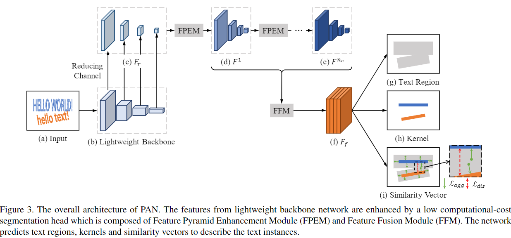
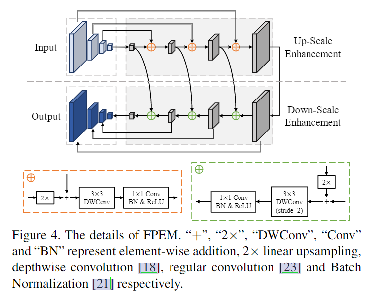
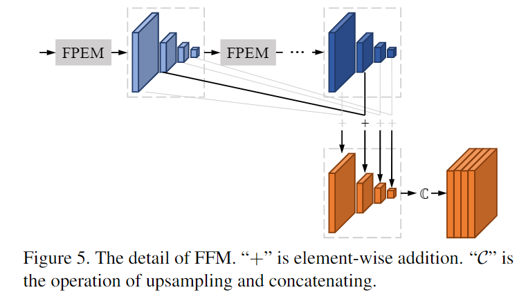

# PAN
[Efficient and Accurate Arbitrary-Shaped Text Detection with Pixel Aggregation Network](https://arxiv.org/abs/1908.05900v1)


## Model Arch

基于聚类的思想，将每一个单独的文本看做是一类。文章借鉴了CornerNet 中的思想，为每个像素点预测一个四维的向量。文本kernel中像素点的四维向量的均值，作为一个聚类中心，于是属于该类中心的像素的四维向量与聚类中心四维向量的距离应该尽可能小，并且每个聚类中心四维向量距离应该尽可能大


<div  align="center">

</div>

### pre-processing
PAN系列网络的预处理操作可以按照如下步骤进行，一般是按照预先设置的`short_size`等比例`resize`，针对不同数据集最终可呈现为`dynamic shape`和`static shape`两种情况

1. resize

    ```python
    def scale_aligned_short(img, short_size=640):
        # print('original img_size:', img.shape)
        h, w = img.shape[0:2]
        scale = short_size * 1.0 / min(h, w)
        h = int(h * scale + 0.5)
        w = int(w * scale + 0.5)
        if h % 32 != 0:
            h = h + (32 - h % 32)
        if w % 32 != 0:
            w = w + (32 - w % 32)
        img = cv2.resize(img, dsize=(w, h))
        # print('img_size:', img.shape)
        return img
    ```

2. transforms

    ```python
    img = Image.fromarray(img)
    img = img.convert('RGB')
    img = transforms.ToTensor()(img)
    img = transforms.Normalize(mean=[0.485, 0.456, 0.406],
                                std=[0.229, 0.224, 0.225])(img)
    img = torch.unsqueeze(img, 0)
   ```


### backbone
论文中是ResNet18，从下到上分别为ResNet18的conv_2x、conv_3x、conv_4x、conv_5x的输出C2、C3、C4、C5。原始输入为`640*640*3`，C2到C5的shape分别为`160*160*256`、`80*80*512`、`40*40*1024`、`20*20*2048`

### neck
主要分为：fpem特征增强，ffm融合特征，然后输出一个通道数为6的长和宽都和输入图片相同的矩阵
#### FPEM
<div  align="center">

</div>

- 放大增强作用在输特征金字塔上，在此阶段，对步长分别为32、16、8、4个像素的特征图进行迭代增强。
- 在缩小阶段，输入是通过放大增强生成的特征金字塔，并且增强从4步进行到32步。与此同时，缩小增强的输出特征金字塔是FPEM的最终输出。
> 对比FPN
> - 首先，FPEM是可级联的模块,随着级联数nc的增加，不同尺度的特征图被更充分地融合，特征的感受野变大
> - 其次，FPEM在计算上高效。 FPEM是通过深度可分离卷积构建的，FPEM的FLOPS约为FPN的1/5

#### FFM
<div  align="center">

</div>

FFM模块用于融合FPEM的特征,因为FPEM是级联结构，输出的多个尺度的feature map。为了减少特征通道量，加快速度，论文并没有采用将不同sacle的特征图upsample后全部concate的思路，(因为这样会有`scales_num*stage_num*128`:每个scale的特征图被1*1卷积降维成128个channel的特征)。论文针对性的提出了如上图的融合方法，同一尺度的feature map通过逐元素相加，再对其进行upsample操作后使特征图具有相同的 size,最后concate起来，得到了模型的输出特征，最后，使用1x1 conv得到6通道的输出。


### post-processing

#### output
1. text region：`w*h*1`
2. kernel：`w*h*1`
3. similarity vectors：`w*h*4`（在无监督聚类中，通过找一个聚类中心使得周围点到聚类中心的距离最小，这个距离的计算需要聚类中心点和待聚类点的一个值来计算，此处的similarity vectors输出的就是那个值）
#### post_process
1. 在内核的分割结果中找到连接的组件，每个连接的组件都是一个内核。
2. 对于每个核 `K_i`，有条件地将其相邻文本像素（4向）p 合并在预测文本区域中，而它们的相似性向量的欧几里得距离小于d = 6。
3. 重复步骤2，直到text_region没有文本像素。


## Model Info

### 模型性能
|           Method           | Precision (%) | Recall (%) | F-measure (%) |                      Shape  |
| :------------------------: | :-----------: | :--------: | :-----------: | :-------------------------------------------: |
|      pan_r18_ctw    |      85.1      |    79.1    |     82.0   | 640x640 |
|      pan_r18_ctw_finetune    |      86.0      |    81.0    |     83.4   | 640x640 |
|      pan_r18_ic15    |      84.4      |    77.5    |     80.8   | 736x1280 |
|      pan_r18_ic15_finetune    |      86.6      |    79.7    |     83.0   | 736x1280 |
|      pan_r18_tt    |      87.9      |    79.6    |     83.5   | 640x640 |
|      pan_r18_tt_finetune    |      88.5      |    81.7    |     85.0   | 640x640 |
|      pan_r18_msra    |      82.0     |    79.4    |     80.7   | 736x1280 |
|      pan_r18_msra_finetune    |      85.7      |    83.4    |     84.5   | 736x1280 |


### 测评数据集说明


<div  align="center">

</div>

SCUT-CTW1500 是一个可用于识别场景中弧形文字的数据集。其中一种基于多边形的曲线文本检测器 CTD，能够探索上下文信息，而不是独立预测点，从而使检测更加准确，该数据集包括：

- 1500 张图像（训练集 1000 张，测试集 500 张）
- 10,751 张裁剪过的包含文本的图像，其中 3,530 张图像中包含弧形不规则文本
- 大量图像中的文本是横向或方向各异的
```
├── CTW1500
│   ├── train
│   │   ├── text_image
│   │   └── text_label_curve
│   └── test
│       ├── text_image
│       └── text_label_curve
```

### 评价指标说明

- precision检测精度：正确的检测框个数在全部检测框的占比，主要是判断检测指标
- recall检测召回率：正确的检测框个数在全部标注框的占比，主要是判断漏检的指标
- hmean是前两项的调和平均值

### pan_pp.pytorch
- [code base](https://github.com/whai362/pan_pp.pytorch/blob/master/config/psenet/README.md)
  > commit 674e4d8c88635543e803e4dae4f992e1cc7ea645

## Build_In Deploy

- [vacc deploy](./source_code/deploy.md)


