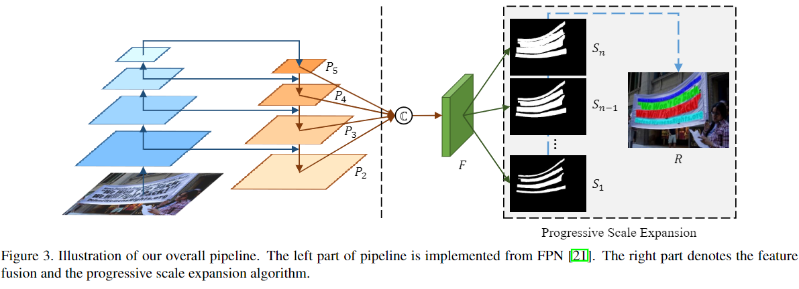

# PSENet
[Shape Robust Text Detection with Progressive Scale Expansion Network](https://arxiv.org/abs/1903.12473)

## code source
```
# ppocr
link: https://github.com/PaddlePaddle/PaddleOCR
branch: v2.7
commit: b17c2f3a5687186caca590a343556355faacb243
```
```
# pytorch
link: https://github.com/whai362/pan_pp.pytorch
branch: master
commit: 903f900e853f4eac64514b6d2e33098989fd5ab2
```

## Model Arch

基于分割的文字检测方法，最关键的步骤是对二值化map的后处理过程，即将分割方法产生的概率图转化为文本框的过程。
该网络提出了渐进式扩展算法PSE，即使两个文本实例离得很近也可以分开，从而保证文本实例的准确位置


<div  align="center">

</div>

### pre-processing
PSENet系列网络的预处理操作可以按照如下步骤进行，一般是按照预先设置的`short_size`等比例`resize`，针对不同数据集最终可呈现为`dynamic shape`和`static shape`两种情况

1. resize

    ```python
    def scale_aligned_short(img, short_size=736):
        # print('original img_size:', img.shape)
        h, w = img.shape[0:2]
        scale = short_size * 1.0 / min(h, w)
        h = int(h * scale + 0.5)
        w = int(w * scale + 0.5)
        if h % 32 != 0:
            h = h + (32 - h % 32)
        if w % 32 != 0:
            w = w + (32 - w % 32)
        img = cv2.resize(img, dsize=(w, h))
        # print('img_size:', img.shape)
        return img
    ```

2. transforms

    ```python
    img = Image.fromarray(img)
    img = img.convert('RGB')
    img = transforms.ToTensor()(img)
    img = transforms.Normalize(mean=[0.485, 0.456, 0.406],
                                std=[0.229, 0.224, 0.225])(img)
    img = torch.unsqueeze(img, 0)
   ```


### backbone + neck

1. **backbone**：论文中是ResNet50，从下到上分别为ResNet50的conv_2x、conv_3x、conv_4x、conv_5x的输出C2、C3、C4、C5。原始输入为`640*640*3`，C2到C5的shape分别为`160*160*256`、`80*80*512`、`40*40*1024`、`20*20*2048`
2. **FPN** ： `1*1*256`，upsample，add
3. P5、P4、P3分别upsample成P2的大小，然后concatenate得到`160*160*1024`的fusion feature即图中的`F`
4. 然后经过`3*3*256`的Conv、BN、ReLU、`1*1*num\_class`（论文中num_class=6，包含1个完整的文本标注）得到`7*160*160`的特征图
5. 最后以stride=4，upsample成输入大小得到最终结果。模型的输入shape为(batch_size,3,640,640)，输出shape为(batch_size,7,640,640)


### post-processing

以上PSENet网络得到的结果是通道数为`7`的特征图，每一个特征图都预测了文本行的位置，这些预测结果的形状是相似且位于相同的中点，只是大小比例不同，简单来说，有的文本通道预测的文本行比较“瘦”，有些文本行预测的比较“胖”，不管“胖瘦”，它们有相同的中心和形状。

这部分就是PSENet整体过程图右侧黑色虚线框的位置，单独截图出来如下所示：
<div  align="center">

</div>

S1里面对应的文本行是“最瘦”的，S1最大限度“拉大”了文本行与行之间的间距。尺度扩张就从这里开始，如上图所示：
1. 从具有最小尺度的核开始(小的kernel，不同文本行之间的margin很大，容易区分，这一步可以区分实列），S1代表最小kernel的分割结果，它的内部有四个连通域`C={c1, c2, c3, c4}`，`CC`操作得到的S1中的四个连通域，得到图b。
2. 将属于S2中的kernel的但不属于S1中的kernel的像素点(g图中的灰色部分)进行分配。在灰色区域(S2的kernel范围)内，将b图所找到的连通域的每个pixel使用[BFS](https://blog.csdn.net/g11d111/article/details/76169861)的方式，逐个向上下左右扩展，即相当于把S1中预测的文本行区域逐渐变宽（换句说法：对于S2中的kernel的每个像素点，把他们分配给S1中的某个连通域）。
3. 重复以上过程直到发现最大核作为预测结果


## Model Info

### 模型性能

1. pytorch

    |     Method      |  Scale  | Precision (%) | Recall (%) | F-measure (%) | 
    | :-------------: | :-----: | :-----------: | :--------: | :-----------: | 
    | psenet_r50_ic15_736      | 736x1280  |     83.6      |    74.0    |     78.5      | 
    | psenet_r50_ic15_1024      | 1024x1760 |     84.4      |    76.3    |     80.2      | 
    | psenet_r50_ic15_736_finetune | 736x1280  |     85.3      |    76.8    |     80.9      | 
    | psenet_r50_ic15_1024_finetune | 1024x1760 |     86.2      |    79.4    |     82.7      | 
    | psenet_r50_ctw | 736x1280 |     82.6      |    76.4    |     79.4      | 
    | psenet_r50_ctw_finetune | 736x1280 |     84.3      |    78.9    |     81.5     | 
    | psenet_r50_tt | 736x1280 |     87.3      |    77.9    |     82.3      | 
    | psenet_r50_tt_finetune | 736x1280 |     89.3      |    79.6    |     84.2      | 

2. ppocr

    | 模型  | 源码 | precision  | recall | Hmean |
    | :---: | :--: | :--: | :--: | :----: | 
    |  det_r50_vd_pse   | [ppocr](https://github.com/PaddlePaddle/PaddleOCR/blob/release/2.7/doc/doc_ch/algorithm_det_psenet.md) | 85.81% | 79.53% |   82.55%   | 
    |  det_mv3_pse   | [ppocr](https://github.com/PaddlePaddle/PaddleOCR/blob/release/2.7/doc/doc_ch/algorithm_det_psenet.md) | 82.20% | 70.48% |   75.89%   | 

### 测评数据集说明


<div  align="center">

</div>

ICDAR 2015 数据集包含1000张训练图像和500张测试图像。ICDAR 2015 数据集可以从上表中链接下载，首次下载需注册。 注册完成登陆后，下载下图中红色框标出的部分，其中， Training Set Images下载的内容保存在icdar_c4_train_imgs文件夹下，Test Set Images 下载的内容保存早ch4_test_images文件夹下。
```
train_data/icdar2015/text_localization/
  └─ icdar_c4_train_imgs/         icdar 2015 数据集的训练数据
  └─ ch4_test_images/             icdar 2015 数据集的测试数据
  └─ train_icdar2015_label.txt    icdar 2015 数据集的训练标注
  └─ test_icdar2015_label.txt     icdar 2015 数据集的测试标注
```

### 评价指标说明

- precision检测精度：正确的检测框个数在全部检测框的占比，主要是判断检测指标
- recall检测召回率：正确的检测框个数在全部标注框的占比，主要是判断漏检的指标
- hmean是前两项的调和平均值

## Build_In Deploy

- [pytorch](./source_code/pytorch.md)
- [ppocr](./source_code/ppocr.md)
