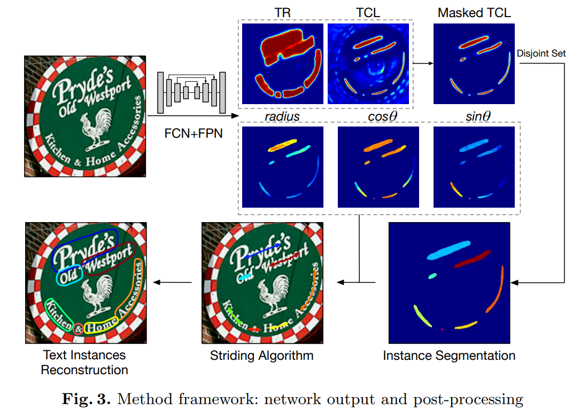
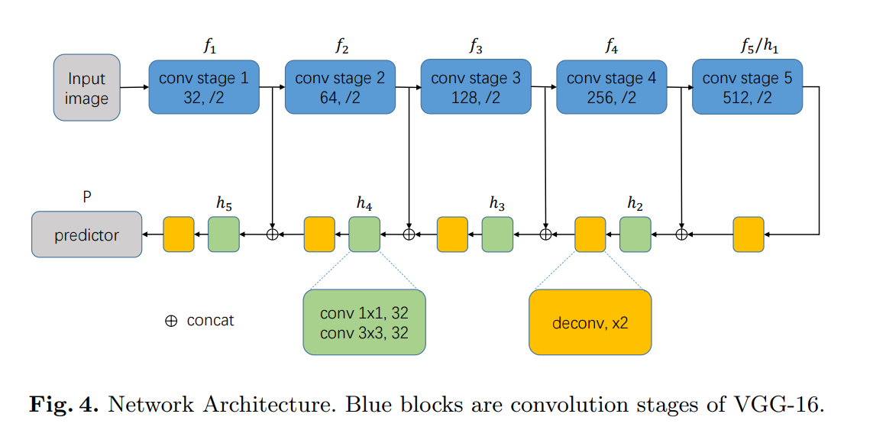

# Text Snake
[TextSnake: A Flexible Representation for Detecting Text of Arbitrary Shapes](https://arxiv.org/abs/1807.01544)

## code source

```
# mmocr
link: https://github.com/open-mmlab/mmocr/tree/main/configs/textdet/textsnake
branch: main
commit: b18a09b2f063911a2de70f477aa21da255ff505d
```


## Model Arch

Text Snake的创新点主要在于提出一个类似于文本蛇的检测方式对不规则文本进行预测。自然场景中大部分文本都是不规则文本，按照正常矩形框的检测方式显然无法有效的解决这种情况。虽然自然场景中的文本可以各种形状，但本质不变的就是必然是一个不断层的文本。

该算法主要做的是五个任务：1、预测文本 2、预测文本中心线 3、预测一个文本中15个圆的半径 4、预测中心线与圆心的sin 5、预测cos



### pre-processing

Text Snake网络的预处理操作可以按照如下步骤进行，即先对图片(BGR)进行resize至对应的尺寸（32的倍数），然后对其进行归一化、减均值除方差等操作

```python
[
    torchvision.transforms.Resize((736, 1280)),
    torchvision.transforms.ToTensor(),
    torchvision.transforms.Normalize(mean=[0.485, 0.456, 0.406], std=[0.229, 0.224, 0.225],),
]
```

### backbone



Text Snake算法网络框架如图所示，采用VGG16，抽取五层的feature map进行融合预测，即采样五层特征，深层先上采样然后与浅层进行融合，再用一个（1*1）卷积和（3*3）的卷积核进行卷积运算。

### post-processing

Text Snake算法后处理的主要思路是先找到文本的两个端点和边线，然后按照边线的1/2去寻找中心线，除去两边的端点就是中心线的label。

## Model Info

### 模型性能

| 模型  | 源码 | precision  | recall | hmean | input size | datasets |
| :---: | :--: | :--: | :--: | :----: | :--------: | :--------:|
|  textsnake_resnet50_fpn   | [mmocr](https://github.com/open-mmlab/mmocr/tree/main/configs/textdet/textsnake) | 85.35 | 80.52 |   82.86   | 736x1280 | CTW1500 |
|  textsnake_resnet50_oclip_fpn   | [mmocr](https://github.com/open-mmlab/mmocr/tree/main/configs/textdet/textsnake) | 88.69 | 82.15 |   85.29   | 736x1280 | CTW1500 |

### 测评数据集说明


<div  align="center">

</div>


[SCUT-CTW1500](https://github.com/Yuliang-Liu/Curve-Text-Detector/tree/master)是一个可用于识别场景中弧形文字的数据集。其中一种基于多边形的曲线文本检测器 CTD，能够探索上下文信息，而不是独立预测点，从而使检测更加准确。SCUT-CTW1500数据集包含1,500张图片，其中1,000张用于训练，500张用于测试。特别地，该数据集提供了10,751张文本实例的裁剪图像，其中包含3,530张弯曲文本的图像。这些图像是通过人工从互联网、图像库（如Google Open-Image）或手机相机上获取的。该数据集包含大量的水平文本和多方向文本。


### 评价指标说明

- precision检测精度：正确的检测框个数在全部检测框的占比，主要是判断检测指标
- recall检测召回率：正确的检测框个数在全部标注框的占比，主要是判断漏检的指标
- hmean是前两项的调和平均值

## Build_In Deploy
- [mmocr](./source_code/mmocr.md)
