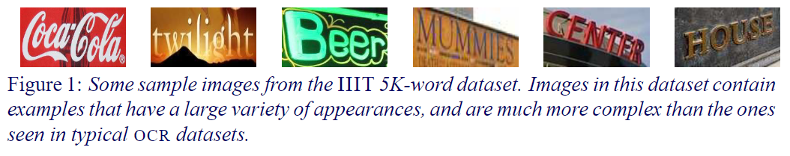

# CNN_CTC
[CTC](https://distill.pub/2017/ctc/)

## Model Arch
- CNN：传统的分类算法用于获取`feature map`
- RNN(optional)：消息传递
- CTC: 用于将得到的`feature map`解析后输入与输出标签的对齐问题

### pre-processing
一般`ocr`算法的输入为单通道数据，涉及到的预处理为：
- ToGray
- Resize
- Normal(mean=0.5,std=0.5)

### post-processing
- softmax (optional)
- max
- decode

### ctc loss

在语音识别中，我们的数据集是音频文件和其对应的文本，不幸的是，音频文件和文本很难在单词的单位上对齐。除了语言识别，在OCR，机器翻译中，都存在类似的Sequence to Sequence结构，同样也需要在预处理操作时进行对齐，但是这种对齐有时候是非常困难的。如果不使用对齐而直接训练模型时，由于人的语速的不同，或者字符间距离的不同，导致模型很难收敛。
CTC(Connectionist Temporal Classification)是一种避开输入与输出手动对齐的一种方式，是非常适合语音识别或者OCR这种应用的。
- 传统的数据对齐
    <div align=center></div>
- CTC的数据对齐
   <div align=center></div>


## Model Info

### 模型性能
|   model   | prec  |  quant mode   |  acc  | origin acc |  test set   |
| :-------: | :---: | :-----------: | :---: | :--------: | :---------: |
| resnet_fc | int8  |      max      | 88.73 |   88.80    | IIIT5K_3000 |
| resnet_fc | int8  | kl_divergence | 88.77 |   88.80    | IIIT5K_3000 |
| resnet_fc | int8  |  percentile   | 88.70 |   88.80    | IIIT5K_3000 |

### 测评数据集说明

[IIIT5K_3000](http://cvit.iiit.ac.in/research/projects/cvit-projects/the-iiit-5k-word-dataset)5K张裁剪好的文字图片，如上图。2K张训练集，3K张测试集。测试集中包含了街景，网络图片等。仅标注62个字符，52个字母以及10个数字。

## Build_In Deploy

### step.1 获取模型
1. 获取模型

    ```bash
    git clone https://github.com/Media-Smart/vedastr.git
    pip install -r requirements.txt
    ```
2. 截断网络输出`reshape`, [code](https://github.com/Media-Smart/vedastr/blob/master/vedastr/models/heads/fc_head.py#L70)

   ```python
    return out
   ```

3. 导出模型

   ```bash
    cp ./source_code/torch2onnx.py  vedastr/
    cd vedastr
    python torch2onnx.py ./configs/resnet_fc.py ./resnet_fc.pth ./resnet_fc_without_reshape.onnx
   ```

### step.2 获取数据集
- [校准数据集&测试数据集](http://cvit.iiit.ac.in/research/projects/cvit-projects/the-iiit-5k-word-dataset)
- 下载`IIIT5K_3000`数据集之后，通过运行[get_data_info.py](./source_code/get_data_info.py)获取数据集的`gt_label：test_info.txt`

### step.3 模型转换
1. 根据具体模型修改模型转换配置文件
    - [config.yaml](./build_in/build/config.yaml)
    
    > - 编译参数`backend.type: tvm_vacc`
    > - fp16精度: 编译参数`backend.dtype: fp16`
    > - int8精度: 编译参数`backend.dtype: int8`，需要配置量化数据集和预处理算子

2. 模型编译
    ```bash
    cd cnn_ctc
    mkdir workspace
    cd workspace
    vamc compile ../build_in/build/config.yaml
    ```

### step.4 模型推理
**NOTE:** [sdk1.x sample](./build_in/infer/run_vacl.py)
```
python ../build_in/infer/run_vacl.py
```

### step.5 性能精度测试
1. 生成推理数据`npz`以及对应的`dataset.txt`

    ```bash
     python ../build_in/vdsp_params/image2npz.py --dataset_path /path/to/iii5k/ --target_path  ./ocr_npz  --text_path ./ocr_npz.txt
    ```

2. 执行测试

   ```bash
    vamp  -m ./weights/resnet_fc-int8-percentile-1_32_100-vacc/resnet_fc/mod --vdsp_params ./build_in/vdsp_params/vdsp_params.json -i 1 -d 0 -b 1
   ```

3. 结果解析

    ```bash
    cd ../build_in/utils
    python decode_result.py ./weights/resnet_fc-int8-percentile-1_32_100-debug-result ./weights/decode.txt
    ```

4. 精度评估

   ```bash
   cd ../build_in/utils
   python eval.py
   ```
   输出结果如下：
   ```bash
    Test, average acc 0.8870, edit distance 0.9628469179427386
   ```