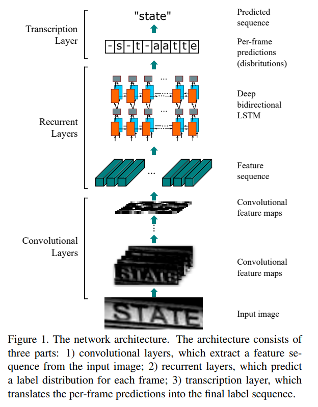
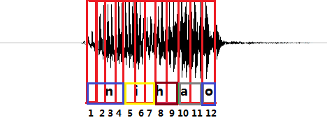
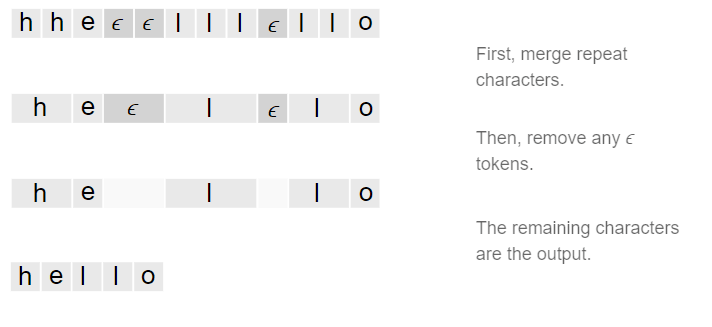

# CRNN

[An End-to-End Trainable Neural Network for Image-based Sequence Recognition and Its Application to Scene Text Recognition](https://arxiv.org/abs/1507.05717)


## Model Arch

<div align=center></div>

### pre-processing

CRNN系列网络的预处理操作可以按照如下步骤进行
- 预处理主要是对输入图片利用`letterbox`算子进行resize，然后进行归一化
- 归一化参数为：mean=[0.5, 0.5, 0.5], std=[0.5, 0.5, 0.5]
- Resnet34_vd[模型](https://github.com/PaddlePaddle/PaddleOCR/blob/v2.6.0/configs/rec/rec_r34_vd_none_bilstm_ctc.yml)的输入尺寸为3x32x100

### backbone

CRNN系列网络的backbone包括CNN（resnet34或mobilenetv2）提取特征以及lstm

### ctc loss

在语音识别中，我们的数据集是音频文件和其对应的文本，不幸的是，音频文件和文本很难在单词的单位上对齐。除了语言识别，在OCR，机器翻译中，都存在类似的Sequence to Sequence结构，同样也需要在预处理操作时进行对齐，但是这种对齐有时候是非常困难的。如果不使用对齐而直接训练模型时，由于人的语速的不同，或者字符间距离的不同，导致模型很难收敛。
CTC(Connectionist Temporal Classification)是一种避开输入与输出手动对齐的一种方式，是非常适合语音识别或者OCR这种应用的。

- 传统的数据对齐
    <div align=center></div>
- CTC的数据对齐
   <div align=center></div>

### common

- lstm
- ctc

## Model Info

### 模型性能
| 模型  | 源码 |  accuracy | input size |
| :---: | :--: | :--: | :--------: |
| Resnet34_vd |[resnet34_vd](https://github.com/PaddlePaddle/PaddleOCR/blob/v2.6.0/doc/doc_ch/algorithm_rec_crnn.md)|   81.04%  |        32x100    |

- 该模型使用MJSynth和SynthText两个文字识别数据集训练，精度评测集为IIIT, SVT, IC03, IC13, IC15, SVTP, CUTE数据集

### 测评数据集说明

常用的OCR识别测试数据集包括ICDAR 2003 (IC03)、ICDAR 2013 (IC13)、IIIT 5k字(IIIT5k)和街景文本(SVT)等。

- IC03

    包含251幅标有标记文本边界框的场景图像。忽略了包含非字母的数字字符和少于三个字符的图像，并剪切出860个文本图像的测试集。每个测试图像与一个含有50词的字典相关连。一个完整的词典是通过组合所有的每个图像的词典来建立的。

- IC13

    继承了IC03的大部分数据。它包含了1015个单词图像。

- SVT

    由从谷歌街景收集的249幅街景图像组成。从中裁剪出647幅文字图像。每个单词图像有一个由50个单词的词典。

- IIIT 5k字(IIIT5k)

    包含从互联网上收集的3000个裁剪的单词测试图像。每个图像都与一个50个单词的词典和一个1千个单词的词典相关联


### 评价指标说明

- 准确率: 测试图片中文本所对应的标签是正确标注类别的样本数除以总的样本数

## Build_In Deploy

### step.1 模型准备
```
link: https://github.com/PaddlePaddle/PaddleOCR/blob/v2.6.0/doc/doc_ch/algorithm_rec_crnn.md
tag: v2.6.0
```

**Note:** 转换onnx模型需在Python3.8环境下执行

1. 首先，需要进入到PaddleOCR工程主目录，安装PaddleOCR：

    ```
    pip install -r requirements.txt
    python setup.py install
    ```

2. 将CRNN文本识别训练过程中保存的模型，转换成inference model
    - 获取[原始模型](https://paddleocr.bj.bcebos.com/dygraph_v2.0/en/rec_r34_vd_none_bilstm_ctc_v2.0_train.tar)
    ```bash
    # 转换推理模型时，需在configs/rec/rec_r34_vd_none_bilstm_ctc.yml中配置词典路径，可参考ppocr/utils/ic15_dict.txt
    python tools/export_model.py -c configs/rec/rec_r34_vd_none_bilstm_ctc.yml -o Global.pretrained_model=configs/rec/rec_r34_vd_none_bilstm_ctc.yml -o Global.pretrained_model=./rec_r34_vd_none_bilstm_ctc_v2.0_train/best_accuracy Global.save_inference_dir=./inference_result/rec_crnn
    ```

3. 利用paddle2onnx导出onnx模型

    ```bash
    paddle2onnx --model_dir ./inference_result/rec_crnn/ --model_filename inference.pdmodel --params_filename inference.pdiparams --save_file ./inference_result/rec_crnn/crnn.onnx --opset_version 10
    ```

4. 优化onnx模型
    ```
    python -m paddle2onnx.optimize --input_model crnn.onnx \                     
                                --output_model crnn_new.onnx \
                                --input_shape_dict "{'x':[1,3,32,100]}"
    ```

5. 简化onnx模型
    ```
    python -m onnxsim ./inference_result/rec_crnn/crnn_new.onnx ./inference_result/rec_crnn/crnn_final.onnx --input-shape 1,3,32,100
    ```

### step.2 准备数据集
- [评估数据集](https://www.dropbox.com/scl/fo/zf04eicju8vbo4s6wobpq/ALAXXq2iwR6wKJyaybRmHiI?rlkey=2rywtkyuz67b20hk58zkfhh2r&e=1&dl=0)
- 通过[lmdb_datasets.py](../common/utils/lmdb_datasets.py)加载lmdb格式数据生成图片及标签文件
    ```bash
    cd ../common/utils
    python lmdb_datasets.py
    ```
- 通过[image2npz.py](../common/utils/image2npz.py)，转换为对应npz文件


### step.3 模型转换
1. 根据具体模型修改配置文件
    -[resnet34_vd.yaml](./build_in/build/resnet34_vd.yaml)

    > - runstream推理，编译参数`backend.type: tvm_vacc`
    > - fp16精度: 编译参数`backend.dtype: fp16`
    > - int8精度: 编译参数`backend.dtype: int8`，需要配置量化数据集和预处理算子

2. 模型编译
    - 注意需要先替换yaml文件中校正集数据的路径
    ```bash
    cd crnn
    mkdir workspace
    cd workspace
    vamc compile ../build_in/build/resnet34_vd.yaml
    ```
    - 转换后将在当前目录下生成`deploy_weights/crnn_resnet34_vd_run_stream_int8`文件夹，其中包含转换后的模型文件。

### step.4 模型推理
1. 参考[vsx脚本](./build_in/vsx/python/crnn_vsx.py)，修改参数并运行如下脚本
    ```bash
    python ../build_in/vsx/python/crnn_vsx.py \
        --file_path  path/to/CUTE80/img \
        --model_prefix_path deploy_weights/crnn_resnet34_vd_run_stream_int8/mod \
        --vdsp_params_info ../build_in/vdsp_params/ppocr-resnet34_vd-vdsp_params.json \
        --label ../source_code/config/ic15_dict.txt \
        --output_file cute80_runstream_pred.txt \
        --device_id 0
    ```
    - 注意替换命令行中--file_path为实际路径

2. [crnn_eval.py](./source_code/crnn_eval.py)，精度统计，指定`CUTE80.txt`标签文件和上步骤中的txt保存路径，即可获得精度指标
   ```bash
    python ../source_code/crnn_eval.py --gt_file /path/to/CUTE80.txt --output_file ./cute80_runstream_pred.txt
   ```
   - 测试精度如下：
   ```
   right_num = 214 all_num=288, acc = 0.7430555555555556
   ```

### step.5 性能精度测试
1. 基于[image2npz.py](../common/utils/image2npz.py)，将评估数据集转换为npz格式，生成对应的`npz_datalist.txt`：
    ```bash
    python ../../common/utils/image2npz.py \
    --dataset_path eval/CUTE80 \
    --target_path eval/CUTE80_npz \
    --text_path npz_datalist.txt
    ```

2. 性能测试，配置vdsp参数[ppocr-resnet34_vd-vdsp_params.json](./build_in/vdsp_params/ppocr-resnet34_vd-vdsp_params.json)，执行：
    - 由于vamp暂不支持该性能测试，所以这里使用python脚本进行性能测试
    - 测试最大吞吐
    ```bash
    python3 ../build_in/vsx/python/crnn_prof.py \
        -m deploy_weights/crnn_resnet34_vd_run_stream_int8/mod \
        --vdsp_params ../build_in/vdsp_params/ppocr-resnet34_vd-vdsp_params.json \
        --device_ids [0] \
        --batch_size 8 \
        --instance 1 \
        --shape "[3,32,100]" \
        --iterations 200 \
        --percentiles "[50,90,95,99]" \
        --input_host 1 \
        --queue_size 1
    ```
    - 测试最小时延
    ```bash
    python3 ../build_in/vsx/python/crnn_prof.py \
    -m deploy_weights/crnn_resnet34_vd_run_stream_int8/mod \
    --vdsp_params ../build_in/vdsp_params/ppocr-resnet34_vd-vdsp_params.json \
    --device_ids [0] \
    --batch_size 1 \
    --instance 1 \
    --shape "[3,32,100]" \
    --iterations 500 \
    --percentiles "[50,90,95,99]" \
    --input_host 1 \
    --queue_size 0
    ```

3. 精度测试，推理得到npz结果：
    ```bash
    vamp -m deploy_weights/crnn_resnet34_vd_run_stream_int8/mod \
    --vdsp_params ../build_in/vdsp_params/ppocr-resnet34_vd-vdsp_params.json \
    -i 1 p 1 -b 1 \
    --datalist npz_datalist.txt \
    --path_output npz_output --backend vastpipe
    ```

4. [vamp_eval.py](./build_in/vsx/python/vamp_eval.py)，解析npz结果，绘图并统计精度：
   ```bash
    python ../build_in/vsx/python/vamp_eval.py --label_file data/label/CUTE80.txt --pred_npz_dir npz_output --npz_datalist npz_datalist.txt
   ```
