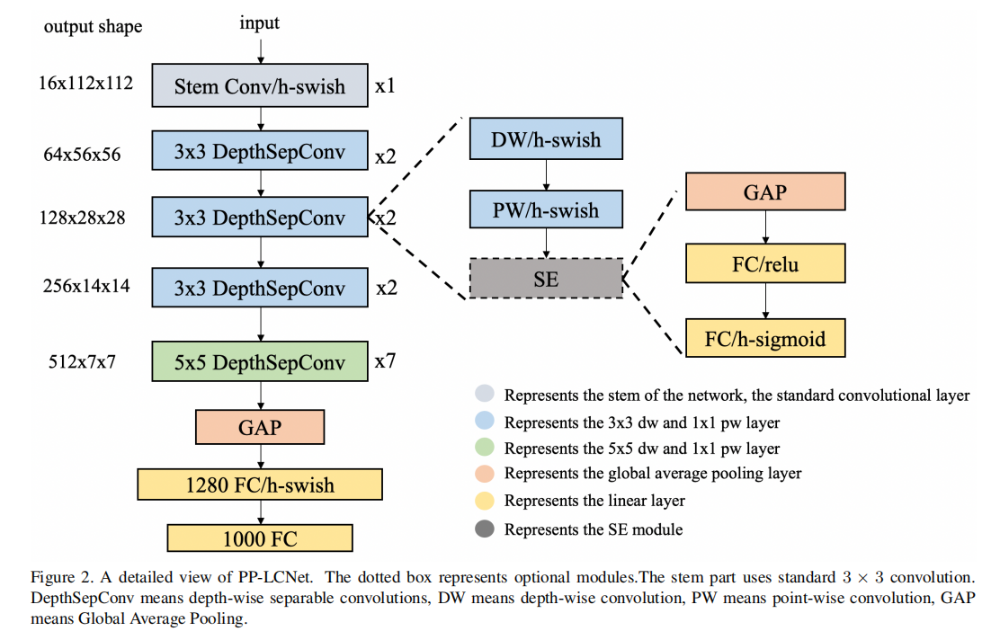

# PPOCRV4 REC

[PP-OCRv4-Rec介绍](https://github.com/PaddlePaddle/PaddleOCR/blob/release/2.7/doc/doc_ch/PP-OCRv4_introduction.md)

## Model Arch

<div align=center></div>

### pre-processing

PPOCRV4识别网络的预处理操作可以按照如下步骤进行
- 预处理主要是对输入图片利用`letterbox`算子进行resize，然后进行归一化
- 归一化参数为：mean=[0.5, 0.5, 0.5], std=[0.5, 0.5, 0.5]
- PP-OCRv4[模型](https://github.com/PaddlePaddle/PaddleOCR/blob/v2.7.0/configs/rec/PP-OCRv4/ch_PP-OCRv4_rec.yml)的输入尺寸为3x48x320

### backbone

PP-LCNetV3系列模型是PP-LCNet系列模型的延续，覆盖了更大的精度范围，能够适应不同下游任务的需要。PP-LCNetV3系列模型从多个方面进行了优化，提出了可学习仿射变换模块，对重参数化策略、激活函数进行了改进，同时调整了网络深度与宽度。最终，PP-LCNetV3系列模型能够在性能与效率之间达到最佳的平衡，在不同精度范围内取得极致的推理速度。

PP-LCNet模型结构图如下：

<div align=center></div>

### ctc loss

在语音识别中，我们的数据集是音频文件和其对应的文本，不幸的是，音频文件和文本很难在单词的单位上对齐。除了语言识别，在OCR，机器翻译中，都存在类似的Sequence to Sequence结构，同样也需要在预处理操作时进行对齐，但是这种对齐有时候是非常困难的。如果不使用对齐而直接训练模型时，由于人的语速的不同，或者字符间距离的不同，导致模型很难收敛。
CTC(Connectionist Temporal Classification)是一种避开输入与输出手动对齐的一种方式，是非常适合语音识别或者OCR这种应用的。

- 传统的数据对齐
    <div align=center></div>
- CTC的数据对齐
   <div align=center></div>

### common

- ctc

## Model Info

### 模型性能
| 模型  | 源码 |  accuracy | input size |
| :---: | :--: | :--: | :--------: |
| PP-OCRv4-Rec |[ppocr_v4_rec](https://github.com/PaddlePaddle/PaddleOCR/blob/v2.7.0/doc/doc_ch/PP-OCRv4_introduction.md)|   75.45%  |        48x320    |

- 该模型使用MJSynth和SynthText两个文字识别数据集训练，精度评测集为IIIT, SVT, IC03, IC13, IC15, SVTP, CUTE数据集

### 测评数据集说明

常用的OCR识别测试数据集包括ICDAR 2003 (IC03)、ICDAR 2013 (IC13)、IIIT 5k字(IIIT5k)和街景文本(SVT)等。

- IC03

    包含251幅标有标记文本边界框的场景图像。忽略了包含非字母的数字字符和少于三个字符的图像，并剪切出860个文本图像的测试集。每个测试图像与一个含有50词的字典相关连。一个完整的词典是通过组合所有的每个图像的词典来建立的。

- IC13

    继承了IC03的大部分数据。它包含了1015个单词图像。

- SVT

    由从谷歌街景收集的249幅街景图像组成。从中裁剪出647幅文字图像。每个单词图像有一个由50个单词的词典。

- IIIT 5k字(IIIT5k)

    包含从互联网上收集的3000个裁剪的单词测试图像。每个图像都与一个50个单词的词典和一个1千个单词的词典相关联


### 评价指标说明

- 准确率: 测试图片中文本所对应的标签是正确标注类别的样本数除以总的样本数

## Build_In Deploy

```
link: https://github.com/PaddlePaddle/PaddleOCR.git
branch: main
commit: 37f44372b11f30032b1c591d08a41ff6d3521c63
```

### step.1 获取推理模型
1. 首先，需要进入到PaddleOCR工程主目录，安装PaddleOCR：
```
cd PaddleOCR
python3 -m pip install -e . -i https://pypi.tuna.tsinghua.edu.cn/simple
```
- 主要python包版本如下：
```
paddlepaddle           3.0.0b2
paddle2onnx            2.0.0
onnxruntime            1.20.1
```

2. 下载推理模型：
```shell
wget https://paddleocr.bj.bcebos.com/PP-OCRv4/chinese/ch_PP-OCRv4_rec_infer.tar
mkdir -p weights/
tar -xvf ch_PP-OCRv4_rec_infer.tar -C weights/
```

3. 将推理模型转换为onnx：

```shell
paddle2onnx --model_dir weights/ch_PP-OCRv4_rec_infer
--model_filename inference.pdmodel \
--params_filename inference.pdiparams \
--save_file ./inference/cls_onnx/model.onnx \
--opset_version 11 \
--enable_onnx_checker True
```

### step.2 准备数据集
- [校准数据集](http://cs-chan.com/downloads_CUTE80_dataset.html)
- [评估数据集](http://cs-chan.com/downloads_CUTE80_dataset.html)
- 通过[image2npz.py](../common/utils/image2npz.py)，转换为对应npz文件


### step.3 模型转换
1. 根据具体模型，修改编译配置
    - [ppocr_v4_rec.yaml](./build_in/build/ppocr_v4_rec.yaml)
        
    > - runstream推理，编译参数`backend.type: tvm_vacc`
    > - fp16精度: 编译参数`backend.dtype: fp16`
    > - int8精度: 编译参数`backend.dtype: int8`，需要配置量化数据集和预处理算子

2. 模型编译
    ```bash
    cd ppocr_v4_rec
    mkdir workspace
    cd workspace
    vamc compile ../build_in/build/ppocr_v4_rec.yaml
    ```

### step.4 模型推理
1. runstream
    - 参考: [ppocr_v4_rec_vsx.py](./build_in/vsx/python/ppocr_v4_rec_vsx.py)
    ```bash
    python ../build_in/vsx/python/ppocr_v4_rec_vsx.py \
        --file_path  path/to/CUTE80/img \
        --model_prefix_path deploy_weights/ppocr_v4_rec_run_stream_fp16/mod \
        --vdsp_params_info ../build_in/vdsp_params/ppocr-v4-rec-vdsp_params.json \
        --label ../source_code/config/ppocr_keys_v1.txt \
        --output_file cute80_runstream_pred.txt \
        --device 0
    ```

    - 精度统计，参考：[ppocr_v4_rec_eval.py](./source_code/ppocr_v4_rec_eval.py),指定`CUTE80.txt`标签文件和上步骤中的txt保存路径，即可获得精度指标
    ```bash
    python ../source_code/ppocr_v4_rec_eval.py --gt_file /path/to/CUTE80.txt --output_file ./cute80_runstream_pred.txt
    ```
    
    ```
    # int8
    right_num = 230 all_num=288, acc = 0.7986111111111112

    # fp16
    right_num = 233 all_num=288, acc = 0.8090277777777778
    ```

### step.5 性能测试
1. 性能测试
    ```bash
    python3 ../build_in/vsx/python/ppocr_v4_rec_prof.py \
        -m deploy_weights/ppocr_v4_rec_run_stream_fp16/mod \
        --vdsp_params ../build_in/vdsp_params/ppocr-v4-rec-vdsp_params.json \
        --device_ids [0] \
        --batch_size 8 \
        --instance 1 \
        --shape "[3,48,320]" \
        --iterations 200 \
        --percentiles "[50,90,95,99]" \
        --input_host 1 \
        --queue_size 1
    ```