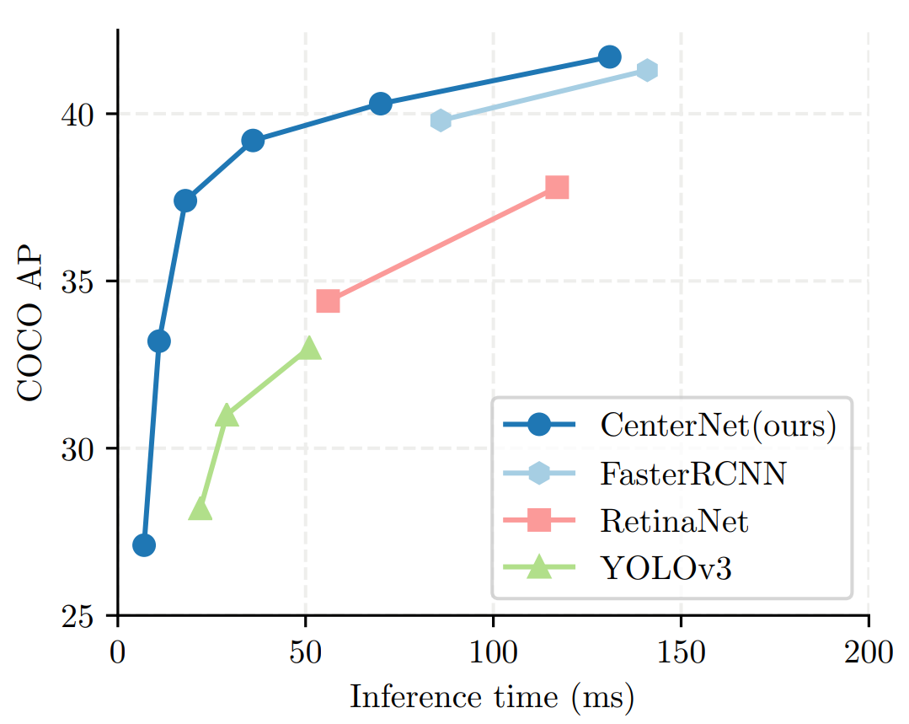
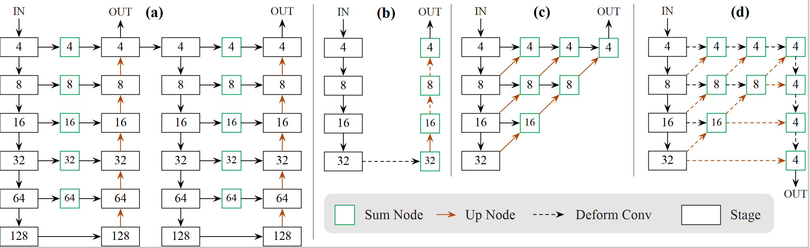

<div  align="center">

</div>

# CenterNet

[Objects as Points](https://arxiv.org/abs/1904.07850)

## Code Source
```
# official
link: https://github.com/xingyizhou/CenterNet
branch: master
commit: 4c50fd3a46bdf63dbf2082c5cbb3458d39579e6c

# mmdet
link: https://github.com/open-mmlab/mmdetection
branch: v2.25.0
commit: ca11860f4f3c3ca2ce8340e2686eeaec05b29111
```

## Model Arch


### pre-processing

`centernet`系列的预处理主要是对输入图片仿射变换后进行归一化操作并减均值除方差，然后送入网络forward即可，均值方差的设置如下

```python
mean = np.array([0.408, 0.447, 0.470], dtype=np.float32).reshape(1, 1, 3)
std = np.array([0.289, 0.274, 0.278], dtype=np.float32).reshape(1, 1, 3)
```

### post-processing

`centernet`系列的后处理操作是利用网络预测特征图进行box decode，然后进行nms操作

### backbone

论文中CenterNet提到了三种用于目标检测的网络，这三种网络都是编码解码(encoder-decoder)的结构：

- Resnet-18 with up-convolutional layers : 28.1% coco and 142 FPS
- DLA-34 : 37.4% COCOAP and 52 FPS
- Hourglass-104 : 45.1% COCOAP and 1.4 FPS


### head

backbone每个网络内部的结构不同，但是在模型的最后都是加了三个网络构造来输出预测值，默认是80个类、2个预测的中心点坐标、2个中心点的偏置。

用官方的源码(使用Pytorch)来表示一下最后三层，其中hm为heatmap、wh为对应中心点的width和height、reg为偏置量

```
(hm): Sequential(
(0): Conv2d(64, 64, kernel_size=(3, 3), stride=(1, 1), padding=(1, 1))
(1): ReLU(inplace)
(2): Conv2d(64, 80, kernel_size=(1, 1), stride=(1, 1))
)
(wh): Sequential(
(0): Conv2d(64, 64, kernel_size=(3, 3), stride=(1, 1), padding=(1, 1))
(1): ReLU(inplace)
(2): Conv2d(64, 2, kernel_size=(1, 1), stride=(1, 1))
)
(reg): Sequential(
(0): Conv2d(64, 64, kernel_size=(3, 3), stride=(1, 1), padding=(1, 1))
(1): ReLU(inplace)
(2): Conv2d(64, 2, kernel_size=(1, 1), stride=(1, 1))
)
```

### common
- warpAffine
- residual layer


## Model Info

### 模型性能

|    模型    |                       源码                       | mAP@.5:.95 | mAP@.5 | flops(G) | params(M) | input size |
| :--------: | :----------------------------------------------: | :--------: | :----: | :------: | :-------: | :--------: |
|   centernet_res18   | [official](https://github.com/xingyizhou/CenterNet) |    25.6    |  43.5  | 90.016  |  15.820   |    512     |
|   centernet_res18 **vacc fp16** | - |    25.6    |  43.5  | -  |  -   |    512     |
|   centernet_res18 **vacc int8 kl_divergence** | - |    25.1    |  43.0  | -  |  -  |    512     |
|   centernet_res18   | [mmdet](https://github.com/open-mmlab/mmdetection/blob/v2.25.0/configs/centernet/README.md) |    25.9    |  42.6  | 13.14  |  14.22   |    512     |
|   centernet_res18 **vacc fp16** | - |    25.0    |  41.0  | -  |  -   |    512     |
|   centernet_res18 **vacc int8 kl_divergence** | - |    24.6    |  40.6  | -  |  -  |    512     |


### 测评数据集说明


[MS COCO](https://cocodataset.org/#download)数据集，MS COCO的全称是Microsoft Common Objects in Context，是微软于2014年出资标注的Microsoft COCO数据集，与ImageNet竞赛一样，被视为是计算机视觉领域最受关注和最权威的比赛数据集之一。

COCO数据集支持目标检测、关键点检测、实例分割、全景分割与图像字幕任务。在图像检测任务中，COCO数据集提供了80个类别，验证集包含5000张图片，上表的结果即在该验证集下测试。

### 评价指标说明

- mAP: mean of Average Precision, 检测任务评价指标，多类别的AP的平均值；AP即平均精度，是Precision-Recall曲线下的面积
- mAP@.5: 即将IoU设为0.5时，计算每一类的所有图片的AP，然后所有类别求平均，即mAP
- mAP@.5:.95: 表示在不同IoU阈值（从0.5到0.95，步长0.05）上的平均mAP

## Deploy

- [official.md](../centernet/source_code/official.md)
- [mmdet.md](../centernet/source_code/mmdet.md)

