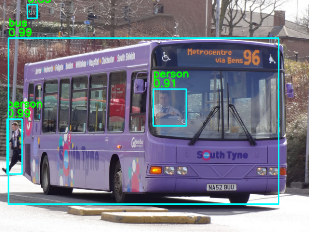
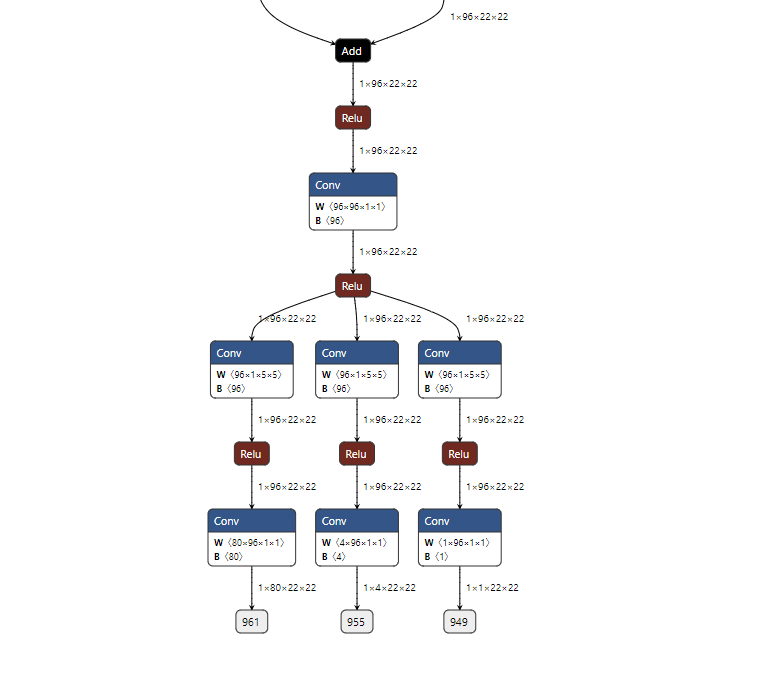

# FastestDet

- [offical code](https://github.com/dog-qiuqiu/FastestDet)

## Model Arch

FastestDet的几个重要特性:

- 单轻量化检测头 
- anchor-free 
- 跨网格多候选目标 
- 动态正负样本分配 
- 简单的数据增强

### pre-processing

`fastestdet`模型的预处理主要是对输入图片resize至相应尺寸后进行归一化操作，然后送入网络forward即可

### post-processing

`fastestdet`模型的后处理操作是利用网络预测特征图进行box decode，然后进行nms操作

### backbone

`fastestdet`模型的backbone替换为了shufflenetV2，相比原先的backbone，访存带宽（内存访问代价 MAC）减少了很多，更加轻量

### head

多检测头设计的是为了适应检测不同尺度物体目标，高分辨率的检测头负责检测小物体，低分辨的检测头负责检测大物体，一种分而治之的思想。作者觉得根因在于感知野，不同尺度的物体所需要的感知野是不同的，而模型每层的感知野都是不一样的，包括FPN也是对不同感知野特征的汇总融合。因此`fastestdet`模型的单检测头参考了YOLOF的思想，在网络结构中，采用类似inception的5x5分组卷积并行网络结构，期待能融合不同感知野的特征，让单个检测头也能适应检测不同尺度的物体。

### common
- shuffle block

## Model Info

### 模型性能

|    模型    |                       源码                       | mAP@.5:.95 | mAP@.5 | flops(G) | params(M) | input size |
| :--------: | :----------------------------------------------: | :--------: | :----: | :------: | :-------: | :--------: |
|   fastestdet   | [official](https://github.com/dog-qiuqiu/FastestDet) |    13.0    |  25.3  | 0.297  |  0.24  |    352     |

### 测评数据集说明

[MS COCO](https://cocodataset.org/#download)的全称是Microsoft Common Objects in Context，是微软于2014年出资标注的Microsoft COCO数据集，与ImageNet竞赛一样，被视为是计算机视觉领域最受关注和最权威的比赛数据集之一。

COCO数据集支持目标检测、关键点检测、实例分割、全景分割与图像字幕任务。在图像检测任务中，COCO数据集提供了80个类别，验证集包含5000张图片，上表的结果即在该验证集下测试。

### 评价指标说明

- mAP: mean of Average Precision, 检测任务评价指标，多类别的AP的平均值；AP即平均精度，是Precision-Recall曲线下的面积
- mAP@.5: 即将IoU设为0.5时，计算每一类的所有图片的AP，然后所有类别求平均，即mAP
- mAP@.5:.95: 表示在不同IoU阈值（从0.5到0.95，步长0.05）上的平均mAP

## VACC 部署

- [official_deploy](./source_code/official_deploy.md)