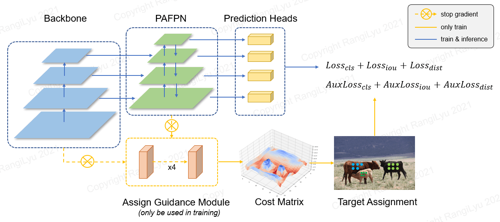
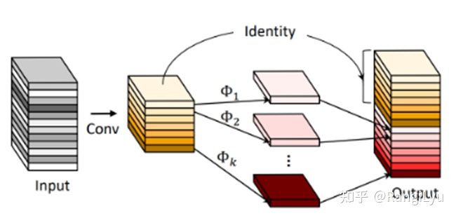

# NanoDet

- [offical code](https://github.com/RangiLyu/nanodet)

## Model Arch



### pre-processing

`nanodet`系列算法的预处理主要是对输入图片利用`letterbox`算子进行resize，然后进行归一化后减均值除方差操作后送入网络forward即可，均值方差设置如下:

```python
mean = [0.406, 0.456, 0.485]
std = [0.225, 0.224, 0.229]
```

### post-processing

`nanodet`系列的后处理操作是利用网络预测特征图进行box decode，然后进行nms操作

### backbone

在NanoDet系列算法中，使用shufflenet v2作为backbone，同时作者重新设计了一个非常轻量但性能不错的PAN：Ghost-PAN。Ghost-PAN使用GhostNet中的GhostBlock作为处理多层之间特征融合的模块，其基本结构单元由一组1x1卷积和3x3的depthwise卷积组成，参数量和计算量都非常小，具体结构如下图



因此最终整个Ghost-PAN的参数量只有190k个参数，且在ARM上只增加了大概1ms的延时，x86端和GPU端的速度影响就更小了，但是小归小，它的性能一点也不差，在增加了GhostPAN后，模型的mAP提升了2个点！


### head

ThunderNet的文章中提出，在轻量级模型中将深度可分离卷积的depthwise部分从3x3改成5x5，能够在增加较少的参数量的情况下提升检测器的感受野并提升性能。现在，在轻量级模型的depthwise部分增大kernel已经成为了非常通用的技巧，因此NanoDet-Plus也将检测头的depthwise卷积的卷积核大小也改成了5x5。

PicoDet在原本NanoDet的3层特征基础上增加了一层下采样特征，为了能够赶上其性能，NanoDet-Plus中也采取了这种改进。这部分操作增加了大约0.7mAP。

### common

- letterbox
- Ghost-PAN
- depthwise conv


## Model Info

### 模型性能

| 模型  | 源码 | mAP@.5:.95  | flops(G) | params(M) | input size |
| :---: | :--: | :--: | :--: | :----: | :--------: |
| nanodet_m |[official](https://github.com/RangiLyu/nanodet)|   20.6      | 0.72 |    0.95    |    320    |
| nanodet_plus_m |[official](https://github.com/RangiLyu/nanodet)|  27.0    | 0.9 | 1.17 | 320 |
| nanodet_plus_m |[official](https://github.com/RangiLyu/nanodet)|  30.4     | 1.52 | 1.17 | 416 |
| nanodet_plus_m_1.5x |[official](https://github.com/RangiLyu/nanodet)|  29.9    | 1.75 | 2.44 | 320 |
| nanodet_plus_m_1.5x |[official](https://github.com/RangiLyu/nanodet)|  34.1    | 2.97 | 2.44 | 416 |

### 测评数据集说明


[MS COCO](https://cocodataset.org/#download)的全称是Microsoft Common Objects in Context，是微软于2014年出资标注的Microsoft COCO数据集，与ImageNet竞赛一样，被视为是计算机视觉领域最受关注和最权威的比赛数据集之一。

COCO数据集支持目标检测、关键点检测、实例分割、全景分割与图像字幕任务。在图像检测任务中，COCO数据集提供了80个类别，验证集包含5000张图片，上表的结果即在该验证集下测试。

### 评价指标说明

- mAP: mean of Average Precision, 检测任务评价指标，多类别的AP的平均值；AP即平均精度，是Precision-Recall曲线下的面积
- mAP@.5: 即将IoU设为0.5时，计算每一类的所有图片的AP，然后所有类别求平均，即mAP
- mAP@.5:.95: 表示在不同IoU阈值（从0.5到0.95，步长0.05）上的平均mAP

## VACC部署

### step.1 获取预训练模型

目前仅支持不带后处理的模型进行三件套转换，因此在转换onnx以及torchscript格式前需修改下代码，主要修改部分是`/PATH/to/nanodet/nanodet/model/head/nanodet_plus_head.py`中`_forward_onnx`函数以及`forward`函数去掉后处理部分，如下：

```python
def _forward_onnx(self, feats):
    """only used for onnx export"""
    outputs = []
    for feat, cls_convs, gfl_cls in zip(
        feats,
        self.cls_convs,
        self.gfl_cls,
    ):
        for conv in cls_convs:
            feat = conv(feat)
        output = gfl_cls(feat)
        outputs.append(output)
        '''cls_pred, reg_pred = output.split(
            [self.num_classes, 4 * (self.reg_max + 1)], dim=1
        )
        cls_pred = cls_pred.sigmoid()
        out = torch.cat([cls_pred, reg_pred], dim=1)
        outputs.append(out.flatten(start_dim=2))'''
    # return torch.cat(outputs, dim=2).permute(0, 2, 1)
    return outputs
def forward(self, feats):
    if torch.onnx.is_in_onnx_export():
        return self._forward_onnx(feats)
    outputs = []
    for feat, cls_convs, gfl_cls in zip(
        feats,
        self.cls_convs,
        self.gfl_cls,
    ):
        for conv in cls_convs:
            feat = conv(feat)
        output = gfl_cls(feat)
        outputs.append(output)
        #outputs.append(output.flatten(start_dim=2))
    #outputs = torch.cat(outputs, dim=2).permute(0, 2, 1)
    return outputs
```

执行以下命令转换出onnx模型以及torchscript模型

```bash
python tools/export_torchscript.py --cfg_path config/nanodet-plus-m-1.5x_416.yml --model_path models/nanodet-plus-m-1.5x_416.pth --input_shape 416,416 --out_path nanodet_plus_m_1.5x-416.torchscript.pth

python tools/export_onnx.py --cfg_path config/nanodet-plus-m-1.5x_416.yml --model_path models/nanodet-plus-m-1.5x_416.pth --out_path nanodet_plus_m_1.5x-416.onnx
```

### step.2 准备数据集
- 准备[COCO](https://cocodataset.org/#download)数据集

### step.3 模型转换

1. 获取vamc模型转换工具

2. 根据具体模型修改模型转换配置文件[config_official.yaml](./vacc_code/build/config_official.yaml)：
    ```bash
    vamc build ./vacc_code/build/config_official.yaml
    ```

### step.4 性能精度
1. 获取vamp性能测试工具
2. 基于[image2npz.py](../common/utils/image2npz.py)，将评估数据集转换为npz格式，生成对应的`npz_datalist.txt`
    ```bash
    python ../common/utils/image2npz.py --dataset_path path/to/coco_val2017 --target_path  path/to/coco_val2017_npz  --text_path npz_datalist.txt
    ```
3. 性能测试
    ```bash
    vamp -m deploy_weights/nanodet_plus_m-int8-max-3_416_416-vacc/nanodet_plus_m --vdsp_params vacc_code/vdsp_params/official-nanodet_plus_m-vdsp_params.json -i 2 p 2 -b 1
    ```
4. npz结果输出
    ```bash
    vamp -m deploy_weights/nanodet_plus_m-int8-max-3_416_416-vacc/nanodet_plus_m --vdsp_params vacc_code/vdsp_params/official-nanodet_plus_m-vdsp_params.json -i 2 p 2 -b 1 --datalist datasets/coco_npz_datalist.txt --path_output npz_output
    ```
5. [vamp_decode.py](./vacc_code/vdsp_params/vamp_decode.py)，解析vamp输出的npz文件，进行绘图和保存txt结果
    ```bash
    python ./vacc_code/runmodel/vamp_decode.py --txt result_npz --label_txt datasets/coco.txt --input_image_dir datasets/coco_val2017 --model_size 416 416 --vamp_datalist_path datasets/coco_npz_datalist.txt --vamp_output_dir npz_output
    ```
6. [eval_map.py](../common/eval/eval_map.py)，精度统计，指定`instances_val2017.json`标签文件和上步骤中的txt保存路径，即可获得mAP评估指标
   ```bash
    python ../common/eval/eval_map.py --gt path/to/instances_val2017.json --txt path/to/vamp_draw_output
   ```
