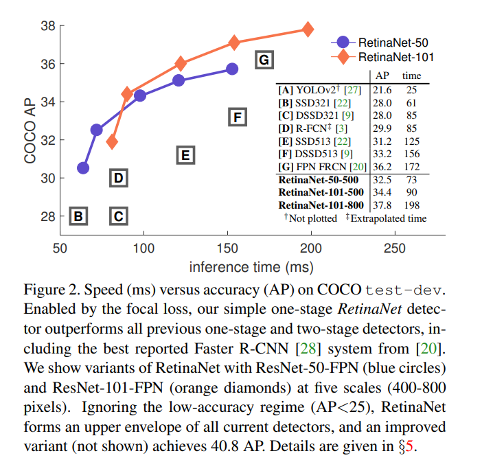
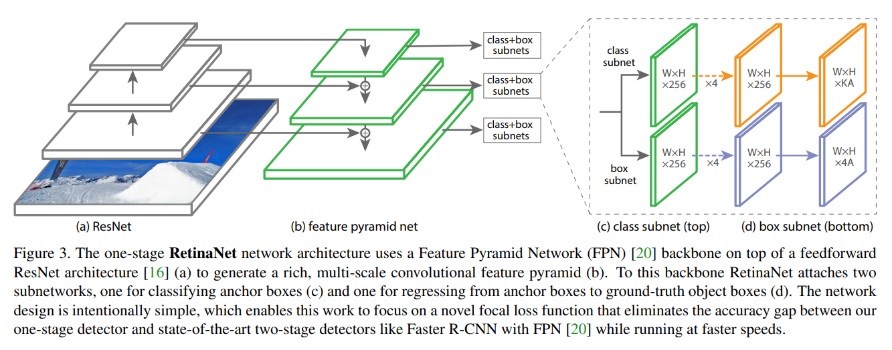

# RetinaNet

[Focal Loss for Dense Object Detection](https://arxiv.org/abs/1708.02002)

## Code Source
```
# pytorch
link: https://github.com/yhenon/pytorch-retinanet/tree/master
branch: master
commit: 0348a9d57b279e3b5b235461b472d37da5feec3d

# mmdet
link: https://github.com/open-mmlab/mmdetection/tree/v3.1.0
branch: v3.1.0
commit: f78af7785ada87f1ced75a2313746e4ba3149760
```

## Model Arch

RetinaNet论文基于交叉熵损失函数，提出了新的分类损失函数Focal loss，该损失函数通过抑制那些容易分类样本的权重，将注意力集中在那些难以区分的样本上，有效控制正负样本比例，防止失衡现象。

为了验证Focal loss的有效性，设计了一个叫RetinaNet的网络进行评估。实验结果表明，RetinaNet能够在实现和one-stage同等的速度基础上，在精度上超越所有（2017年）two-stage的检测器。

### pre-processing

retinanet系列的预处理主要是对输入图片利用`letterbox`算子进行resize(1024x1024)，然后减均值除以方差即可，均值配置如下

```python
mean=[123.675, 116.28, 103.53]
std=[58.395, 57.12, 57.375]
```

### post-processing

retinanet算法的后处理部分基于输出feature map进行box decode，再进行nms输出最终预测框

### network

RetinaNet是一个由一个backbone和两个子网络组成的统一目标检测网络。backbone的主要作用是通过一系列卷积操作得到整张输入图像的feature map。两个子网分别基于输出的feature map进行目标分类和位置回归。整体网络结构如下图所示：



相比原版的FPN，RetinaNet的卷积过程用的是ResNet，上采样和侧边连接还是FPN结构。通过主干网络，产生了多尺度的特征金字塔。然后后面连接两个子网，分别进行分类和回归。总体来看，网络结构是非常简洁的，作者的重心并不是网路结构的创新，而是验证focal loss的有效性。

### common

- letterbox
- FPN

## Model Info

### 模型性能

| 模型  | 源码 | mAP@.5 | mAP@.5:.95 | flops(G) | params(M) | input size |
| :---: | :--: | :--: | :--: | :---: | :----: | :--------: |
| retinanet |[pytorch](https://github.com/yhenon/pytorch-retinanet/tree/master)|   49.9  |   33.5   |   244.6    |    37.97    |        1024    |
| retinanet_r18_fpn_1x_coco |[mmdet](https://github.com/open-mmlab/mmdetection/tree/v3.1.0)|   -   |   31.7   |   -    |    -    |        1024    |
| retinanet_r18_fpn_1x8_1x_coco |[mmdet](https://github.com/open-mmlab/mmdetection/tree/v3.1.0)|   -   |   31.7   |   -    |    -    |        1024    |
| retinanet_r50_fpn_1x_coco |[mmdet](https://github.com/open-mmlab/mmdetection/tree/v3.1.0)|   -   |   36.5   |   -    |    -    |        1024    |
| retinanet_r50_fpn_2x_coco |[mmdet](https://github.com/open-mmlab/mmdetection/tree/v3.1.0)|   -   |   37.4   |   -    |    -    |        1024    |
| retinanet_r50_fpn_fp16_1x_coco |[mmdet](https://github.com/open-mmlab/mmdetection/tree/v3.1.0)|   -   |   36.4   |   -    |    -    |        1024    |
| retinanet_r50_caffe_fpn_1x_coco |[mmdet](https://github.com/open-mmlab/mmdetection/tree/v3.1.0)|   -   |   36.3   |   -    |    -    |        1024    |
| retinanet_r101_fpn_1x_coco |[mmdet](https://github.com/open-mmlab/mmdetection/tree/v3.1.0)|   -   |   38.5   |   -    |    -    |        1024    |
| retinanet_r101_fpn_2x_coco |[mmdet](https://github.com/open-mmlab/mmdetection/tree/v3.1.0)|   -   |   38.9   |   -    |    -    |        1024    |
| retinanet_r101_caffe_fpn_1x_coco |[mmdet](https://github.com/open-mmlab/mmdetection/tree/v3.1.0)|   -   |   38.5   |   -    |    -    |        1024    |
| retinanet_x101_32x4d_fpn_1x_coco |[mmdet](https://github.com/open-mmlab/mmdetection/tree/v3.1.0)|   -   |   39.9   |   -    |    -    |        1024    |
| retinanet_x101_32x4d_fpn_2x_coco |[mmdet](https://github.com/open-mmlab/mmdetection/tree/v3.1.0)|   -   |   40.1   |   -    |    -    |        1024    |
| retinanet_x101_64x4d_fpn_1x_coco |[mmdet](https://github.com/open-mmlab/mmdetection/tree/v3.1.0)|   -   |   41.0   |   -    |    -    |        1024    |
| retinanet_x101_64x4d_fpn_2x_coco |[mmdet](https://github.com/open-mmlab/mmdetection/tree/v3.1.0)|   -   |   40.8   |   -    |    -    |        1024    |
| retinanet_r50_fpn_mstrain_3x_coco |[mmdet](https://github.com/open-mmlab/mmdetection/tree/v3.1.0)|   -   |   39.5   |   -    |    -    |        800    |
| retinanet_r101_caffe_fpn_mstrain_3x_coco |[mmdet](https://github.com/open-mmlab/mmdetection/tree/v3.1.0)|   -   |   40.7   |   -    |    -    |        1024    |
| retinanet_r101_fpn_mstrain_3x_coco |[mmdet](https://github.com/open-mmlab/mmdetection/tree/v3.1.0)|   -   |   41   |   -    |    -    |        800    |
| retinanet_x101_64x4d_fpn_mstrain_3x_coco |[mmdet](https://github.com/open-mmlab/mmdetection/tree/v3.1.0)|   -   |   41.6   |   -    |    -    |        800    |

### 测评数据集说明


[MS COCO](https://cocodataset.org/#download)的全称是Microsoft Common Objects in Context，是微软于2014年出资标注的Microsoft COCO数据集，与ImageNet竞赛一样，被视为是计算机视觉领域最受关注和最权威的比赛数据集之一。 

COCO数据集支持目标检测、关键点检测、实力分割、全景分割与图像字幕任务。在图像检测任务中，COCO数据集提供了80个类别，验证集包含5000张图片，上表的结果即在该验证集下测试。

### 评价指标说明

- mAP: mean of Average Precision, 检测任务评价指标，多类别的AP的平均值；AP即平均精度，是Precision-Recall曲线下的面积
- mAP@.5: 即将IoU设为0.5时，计算每一类的所有图片的AP，然后所有类别求平均，即mAP
- mAP@.5:.95: 表示在不同IoU阈值（从0.5到0.95，步长0.05）上的平均mAP

## VACC部署

- [pytorch](./source_code/pytorch_deploy.md)
- [mmdet](./source_code/mmdet_deploy.md)