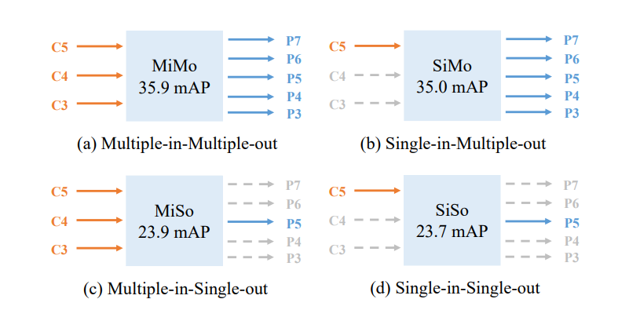
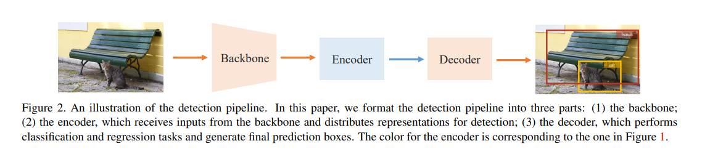

# YOLOF

[You Only Look One-level Feature](https://arxiv.org/abs/2103.09460)

## Code Source
```
# mmdet
link: https://github.com/open-mmlab/mmdetection/tree/main/configs/yolof
branch: main
commit: f78af7785ada87f1ced75a2313746e4ba3149760
```

## Model Arch

此前一般认为，FPN的成功之处在于进行了多级特征的融合，这引发了一系列人工设计或者NAS搜索更加复杂融合方法的研究，如EfficientDet中的BiFPN。遗憾的是，这种观念忽视了FPN分治的功能，这就导致很少有研究研究这两个收益对FPN的成功贡献究竟如何，也一定程度上阻碍了目标检测领域新的进展。

这篇论文就是针对FPN在单阶段检测器中这两个收益的。作者在RetinaNet的基础上通过解耦多尺度特征融合和分治功能设计了实验。具体而言，将FPN视作一个多进多出（Multiple-in-Multiple-out，MiMo）编码器，它从骨干网络编码多尺度特征并且为解码器即检测head提供特征表示。作者对MiMo（多进多出）、单进多出（SiMo）、多进单出（MiSo）和单进单出（SiSo）编码器进行了对比实验，结果如下图：



上图可以发现一个令人惊讶的事实，SiMo编码器几乎可以获得和MiMo编码器（如FPN）相当的表现，注意，它只使用了C5特征图没有使用多层特征融合，它们之间的差距只有1 mAP左右。相比之下，MiSo和SiSo结构则有非常大的性能下降。这些实验结果表明两个事实：第一，C5特征图上其实就包含了检测各种尺度目标的足够的上下文信息，这就导致SiMo编码器可以获得相当不错的效果；第二，多尺度特征融合带来的收益要远远小于分治策略带来的收益，因此多尺度特征融合在FPN不是最关键的功能。 进而更深入思考分治策略，其实它对应目标检测中的优化问题，它将复杂的目标检测问题依据目标尺度分解为几个子问题，促进了优化过程。

上面的分析说明，FPN关键的成功因素其实是对目标检测优化问题的解决方案，分治策略是一个好的方式，然而，它也带来了比较大的内存负担，降低了检测器速度并且使得单阶段检测器的结构比较复杂。考虑到C5特征图其实已经包含了足够的信息用于目标检测，那么有没有更加优雅的方式处理优化问题呢？这就诞生了这篇论文提出的You Only Look One-level Feature（YOLOF），这是一个新的只使用32倍下采样的C5特征图的目标检测框架。为了弥补SiSo编码器和MiMo编码器之间的性能差距，作者首先对编码器的结构进行了适当的设计，以提取不同尺度目标的多尺度上下文特征，弥补多尺度特征的不足；然后，作者采用均衡匹配机制来解决单特征图中稀疏anchor引起的正样本不平衡问题。

### pre-processing

yolof系列的预处理主要是对输入图片利用`letterbox`算子进行resize(1280x1280)，然后减均值即可，均值配置如下

```python
mean = [103.530, 116.280, 123.675]
```

### post-processing

yolof算法的后处理操作是利用anchor以及网络预测特征图进行box decode，然后进行nms操作

### network

作者提出了一种只使用单级别特征图的简单目标检测框架YOLOF，它包含三个主要部分：backbone、encoder、decoder。



backbone作者还是采用经典的ResNet和ResNeXt，选取的特征图是C5，通道数为2048且下采样率为32。关于encoder的大致思路，上面已经说明了，这里详细说一下结构。首先，和FPN类似，对backbone的输出使用两个投影层（由1x1卷积和3x3卷积组成），得到通道数为512的特征图。然后，为了获得全尺度感受野，作者这里使用了一种残差模块，它由三个卷积组成，第一个1x1卷积通道减少4倍，然后一个3x3膨胀卷积用于增大感受野，最后的1x1卷积恢复通道维度，这个残差块会重复四次。

至于decoder，则和RetinaNet类似，它包含两个并行的head分支，用于目标分类和边框回归任务。作者这里主要做了两个改动，第一，是按照DETR中FFN的设计，使得两个head卷积层数目不同。在回归分支中，是四个卷积层加上BN层和ReLU层，而在分类分支中只有两个卷积层。第二，依据Autoassign，为回归分支的每个anchor增加一个隐式的objectness（没有直接监督），最终的分类置信度由分类分支的输出和objectness得分相乘得到。


### common

- Dilated Encoder
- letterbox

## Model Info

### 模型性能

| 模型  | 源码 | mAP@.5 | mAP@.5:.95 | flops(G) | params(M) | input size |
| :---: | :--: | :--: | :--: | :---: | :----: | :--------: |
| yolof |[mmdet](https://github.com/open-mmlab/mmdetection/tree/main/configs/yolof)|   -   |   37.5   |   8.3    |    -    |        1280    |

### 测评数据集说明


[MS COCO](https://cocodataset.org/#download)的全称是Microsoft Common Objects in Context，是微软于2014年出资标注的Microsoft COCO数据集，与ImageNet竞赛一样，被视为是计算机视觉领域最受关注和最权威的比赛数据集之一。 

COCO数据集支持目标检测、关键点检测、实力分割、全景分割与图像字幕任务。在图像检测任务中，COCO数据集提供了80个类别，验证集包含5000张图片，上表的结果即在该验证集下测试。

### 评价指标说明

- mAP: mean of Average Precision, 检测任务评价指标，多类别的AP的平均值；AP即平均精度，是Precision-Recall曲线下的面积
- mAP@.5: 即将IoU设为0.5时，计算每一类的所有图片的AP，然后所有类别求平均，即mAP
- mAP@.5:.95: 表示在不同IoU阈值（从0.5到0.95，步长0.05）上的平均mAP

## VACC部署

- [mmdet](./source_code/mmdet_deploy.md)