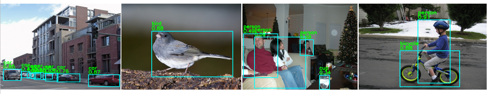
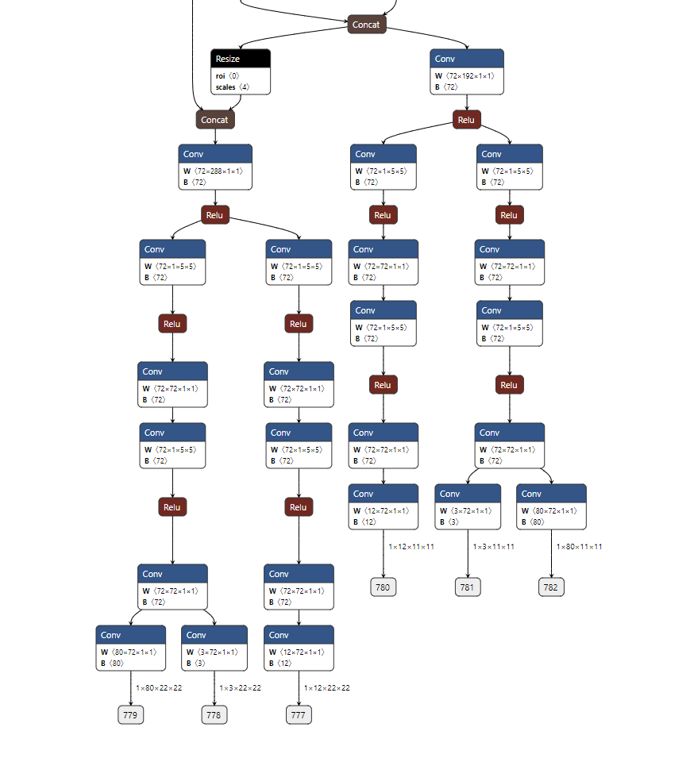

# YoloFastV2

- [offical code](https://github.com/dog-qiuqiu/Yolo-FastestV2)

## Code Source
```
# official

link: https://github.com/dog-qiuqiu/Yolo-FastestV2.git
branch: main
commit: ac2a5e3060bff76dd1e45f9b921dd77bfbeb194d
```

## Model Arch

### pre-processing

`yolofastv2`模型的预处理主要是对输入图片resize至相应尺寸后进行归一化操作，然后送入网络forward即可

### post-processing

`yolofastv2`模型的后处理操作是利用anchor以及网络预测特征图进行box decode，然后进行nms操作

### backbone

`yolofastv2`模型的backbone替换为了shufflenetV2，相比原先的backbone，访存减少了一些，更加轻量


### head

`yolofastv2`模型检测头的解耦合，这个是参考YoloX的，将检测框的回归、前景背景的分类以及检测类别的分类由yolo的一个特征图解耦成3个不同的特征图，其中前景背景的分类以及检测类别的分类采用同一网络分支参数共享。最后将检测类别分类的loss由sigmoid替换为softmax。模型只有输出11x11和22x22两个尺度的检测头，因为发现在coco上三个检测头（11x11，22x22，44x44）和两个检测头（11x11，22x22）的精度无太大差异



### common
- shuffle block


## Model Info

### 模型性能

|    模型    |                       源码                       | mAP@.5:.95 | mAP@.5 | flops(G) | params(M) | input size |
| :--------: | :----------------------------------------------: | :--------: | :----: | :------: | :-------: | :--------: |
|   yolofastv2   | [official](https://github.com/dog-qiuqiu/Yolo-FastestV2) |    9.8    |  17.5  | 0.212  |  0.25  |    352     |

### 测评数据集说明


[MS COCO](https://cocodataset.org/#download)的全称是Microsoft Common Objects in Context，是微软于2014年出资标注的Microsoft COCO数据集，与ImageNet竞赛一样，被视为是计算机视觉领域最受关注和最权威的比赛数据集之一。

COCO数据集支持目标检测、关键点检测、实例分割、全景分割与图像字幕任务。在图像检测任务中，COCO数据集提供了80个类别，验证集包含5000张图片，上表的结果即在该验证集下测试。

### 评价指标说明

- mAP: mean of Average Precision, 检测任务评价指标，多类别的AP的平均值；AP即平均精度，是Precision-Recall曲线下的面积
- mAP@.5: 即将IoU设为0.5时，计算每一类的所有图片的AP，然后所有类别求平均，即mAP
- mAP@.5:.95: 表示在不同IoU阈值（从0.5到0.95，步长0.05）上的平均mAP

## VACC 部署

- [official_deploy](./source_code/official_deploy.md)