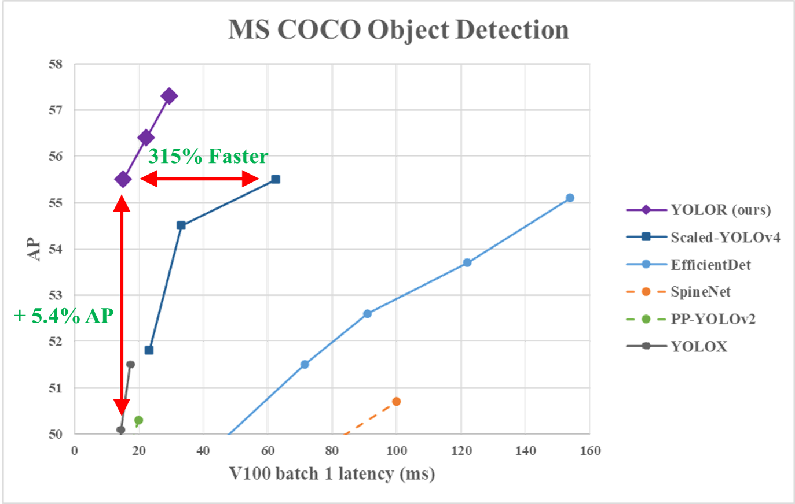
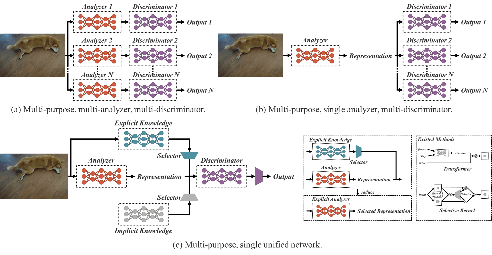
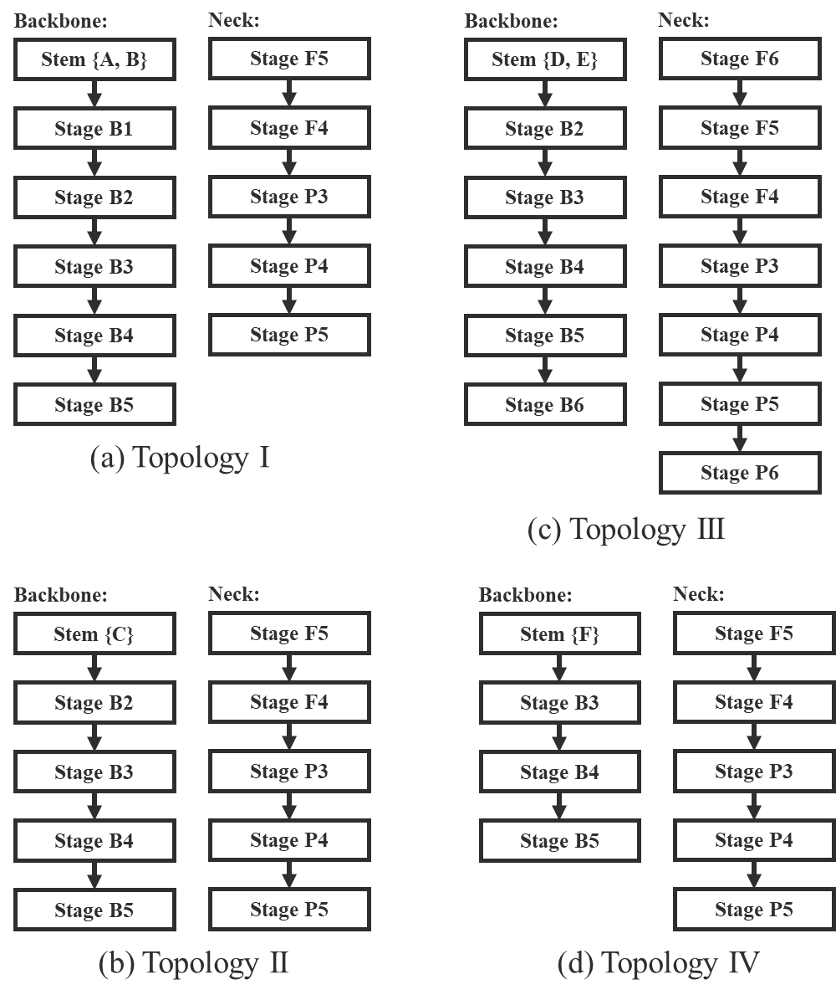

# YoloR

[paper](https://arxiv.org/abs/2105.04206)

## Code Source
```
# official

link: https://github.com/WongKinYiu/yolor/tree/paper
branch: paper
commit: be7da6eba2f612a15bf462951d3cdde66755a180
```

## Model Arch



YOLOR算法受人类学习方式（使用五官，通过常规和潜意识学习，总结丰富的经验并编码存储，进而处理已知或未知的信息）的启发，本篇论文提出了一个统一的网络来同时编码显式知识和隐式知识，在网络中执行了kernel space alignment（核空间对齐）、prediction refinement（预测细化）和 multi-task learning（多任务学习），同时对多个任务形成统一的表示。结果表明神经网络中引入隐式知识有助于所有任务的性能提升，进一步的分析发现隐式表示之所以能带来性能提升，是因为其具备了捕获不同任务的物理意义的能力。

人可以从多个角度来分析同一个目标，然而通常训练CNN时只给予了一个角度，也就是说针对某一个任务得到的CNN特征很难适用于其他问题。作者认为造成上述问题的原因主要是模型只提取了神经元特征而丢弃了隐式知识的学习运用，然而就像人脑一样隐式知识对分析各种各样的任务是非常有用的。

人类对隐式知识的学习通常通过潜意识，然而并没有系统的定义怎样学习和获得隐式知识。对于神经网络而言，一般将浅层特征定义为显式知识，深层特征定义为隐式知识。本文将直接可观察的知识定义为显式知识，隐藏在神经网络中且无法观察的知识定义为隐式知识。

### pre-processing

YOLOR系列的预处理主要是对输入图片利用`letterbox`算子进行resize，然后进行归一化，与yolov5检测算法一致

### post-processing

YOLOR系列的后处理操作是利用anchor以及网络预测特征图进行box decode，然后进行nms操作，与yolov5检测算法一致

### backbone

YOLOR系列网络backbone采用了CSPDarknet53结构

### head

YOLOR算法的head层与yolov5基本一致，利用FPN的结构，融合不同维度的特征，同时通过ImplicitA与ImplicitM模块实现同时编码显式知识和隐式知识



### common

- Focus Layer
- CSPF
- SPPCSP
- ImplicitA
- ImplicitM
- letterbox

## Model Info

### 模型性能

| 模型  | 源码 | mAP@.5 | mAP@.5:.95 | flops(G) | params(M) | input size |
| :---: | :--: | :--: | :--: | :---: | :----: | :--------: |
| yolor_d6 |[official](https://github.com/WongKinYiu/yolor/tree/paper)|   48.3   |   35.1   |   64.921    |    151.707    |        320    |
| yolor_d6 |[official](https://github.com/WongKinYiu/yolor/tree/paper)|   58.0   |   43.1  |   166.197    |    151.707    |        512    |
| yolor_d6 |[official](https://github.com/WongKinYiu/yolor/tree/paper)|   62.1   |   46.5   |   259.682    |    151.707    |        640    |
| yolor_w6 |[official](https://github.com/WongKinYiu/yolor/tree/paper)|   45.6   |   33.0   |   31.457    |    79.836    |        320    |
| yolor_w6 |[official](https://github.com/WongKinYiu/yolor/tree/paper)|   55.6   |   41.2   |   80.531    |    79.836    |        512    |
| yolor_w6 |[official](https://github.com/WongKinYiu/yolor/tree/paper)|   59.3   |   44.2   |   125.829    |    79.836    |        640    |
| yolor_e6 |[official](https://github.com/WongKinYiu/yolor/tree/paper)|   47.2   |   34.3   |   47.399    |    115.850    |        320    |
| yolor_e6 |[official](https://github.com/WongKinYiu/yolor/tree/paper)|   57.0   |   42.4   |   121.341    |    115.850   |        512    |
| yolor_e6 |[official](https://github.com/WongKinYiu/yolor/tree/paper)|   60.8   |   45.5   |   189.595    |    115.850   |        640    |
| yolor_p6 |[official](https://github.com/WongKinYiu/yolor/tree/paper)|   43.6   |   31.4   |   22.599    |    37.238    |        320    |
| yolor_p6 |[official](https://github.com/WongKinYiu/yolor/tree/paper)|   53.8   |   39.6   |   57.853    |    37.238    |        512    |
| yolor_p6 |[official](https://github.com/WongKinYiu/yolor/tree/paper)|   57.4   |   42.6   |   90.395    |    37.238    |        640    |

### 测评数据集说明


[MS COCO](https://cocodataset.org/#download)的全称是Microsoft Common Objects in Context，是微软于2014年出资标注的Microsoft COCO数据集，与ImageNet竞赛一样，被视为是计算机视觉领域最受关注和最权威的比赛数据集之一。 

COCO数据集支持目标检测、关键点检测、实力分割、全景分割与图像字幕任务。在图像检测任务中，COCO数据集提供了80个类别，验证集包含5000张图片，上表的结果即在该验证集下测试。

### 评价指标说明

- mAP: mean of Average Precision, 检测任务评价指标，多类别的AP的平均值；AP即平均精度，是Precision-Recall曲线下的面积
- mAP@.5: 即将IoU设为0.5时，计算每一类的所有图片的AP，然后所有类别求平均，即mAP
- mAP@.5:.95: 表示在不同IoU阈值（从0.5到0.95，步长0.05）上的平均mAP

## VACC部署

### step.1 获取预训练模型

yolor官方项目提供了模型转换脚本，可以执行以下命令进行转换。目前onnx格式转换仍有部分问题，因此仅需转换torchscript格式即可

```bash
python models/export.py --weights weights/yolor-w6.pt --img-size 640 640
```

### step.2 准备数据集
- 准备[COCO](https://cocodataset.org/#download)数据集


### step.3 模型转换

1. 获取vamc模型转换工具

2. 根据具体模型修改模型转换配置文件[config_official.yaml](./vacc_code/build/config_official.yaml)：
    ```bash
    vamc build ./vacc_code/build/config_official.yaml
    ```

### step.4 性能精度
1. 获取vamp性能测试工具
2. 基于[image2npz.py](../common/utils/image2npz.py)，将评估数据集转换为npz格式，生成对应的`npz_datalist.txt`
    ```bash
    python ../common/utils/image2npz.py --dataset_path path/to/coco_val2017 --target_path  path/to/coco_val2017_npz  --text_path npz_datalist.txt
    ```
3. 性能测试
    ```bash
    vamp -m deploy_weights/yolor_w6-int8-kl_divergence-3_640_640-vacc/yolor_w6 --vdsp_params ./vacc_code/vdsp_params/official-yolor_w6-vdsp_params.json -i 2 p 2 -b 1
    ```
4. npz结果输出
    ```bash
    vamp -m deploy_weights/yolor_w6-int8-kl_divergence-3_640_640-vacc/yolor_w6 --vdsp_params ./vacc_code/vdsp_params/official-yolor_w6-vdsp_params.json -i 2 p 2 -b 1 --datalist datasets/coco_npz_datalist.txt --path_output npz_output
    ```
5. [vamp_decode.py](./vacc_code/vdsp_params/vamp_decode.py)，解析vamp输出的npz文件，进行绘图和保存txt结果
    ```bash
    python ./vacc_code/vdsp_params/vamp_decode.py --txt result_npz --label_txt datasets/coco.txt --input_image_dir datasets/coco_val2017 --model_size 640 640 --vamp_datalist_path datasets/coco_npz_datalist.txt --vamp_output_dir npz_output
    ```
6. [eval_map.py](../common/eval/eval_map.py)，精度统计，指定`instances_val2017.json`标签文件和上步骤中的txt保存路径，即可获得mAP评估指标
   ```bash
    python ../common/eval/eval_map.py --gt path/to/instances_val2017.json --txt path/to/vamp_draw_output
   ```