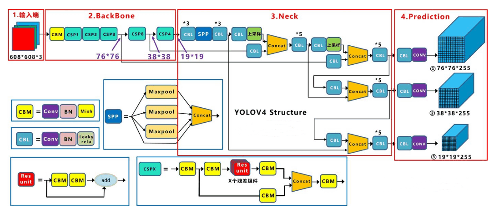
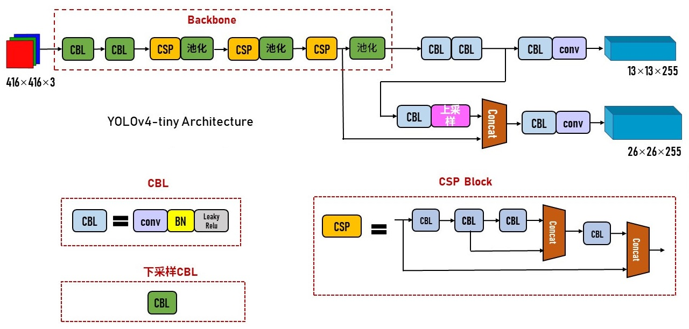

# YoloV4

[YOLOv4: Optimal Speed and Accuracy of Object Detection](https://arxiv.org/abs/2004.10934)

## Code Source
```
# bubbliiiing

link: https://github.com/bubbliiiing/yolov4-tiny-pytorch
branch: master
commit: 60598a259cfe64b4b87f064fbd4b183a4cdd6cba

link: https://github.com/bubbliiiing/yolov4-pytorch
branch: master
commit: b7c2212250037c262282bac06fcdfe97ac86c055

# Tianxiaomo

link: https://github.com/Tianxiaomo/pytorch-YOLOv4
branch: master
commit: a65d219f9066bae4e12003bd7cdc04531860c672

# darknet
link: https://github.com/AlexeyAB/darknet
branch: master
commit: ed59050950b5a890a2a1d1c69547250c436a5968
```

## Model Arch

### pre-processing

yolov4系列的预处理主要是对输入图片利用`letterbox`算子进行resize，然后进行归一化

### post-processing

yolov4系列的后处理操作是利用anchor以及网络预测特征图进行box decode，然后进行nms操作

### backbone

采用的主干网络为CSPDarknet53，CSPDarknet53是在Yolov3主干网络Darknet53的基础上，借鉴2019年CSPNet的经验，产生的Backbone结构，其中包含了1个CBM和5个CSP模块。
同时SPP作为Neck的附加模块，PANet作为Neck的特征融合模块。




### head

输出层的锚框机制和Yolov3相同，主要改进的是训练时的回归框位置损失函数CIOU_Loss，以及预测框筛选的nms变为DIOU_nms

### common

- Cutmix
- Mosaic
- letterbox
- Dropblock
- CIoU Loss
- DIOU_nms

## Model Info

### 模型性能

| 模型  | 源码 | mAP@.5 | mAP@.5:.95 | Flops(G) | Params(M) | Shapes | Notes |
| :---: | :--: | :--: | :--: | :---: | :----: | :--------: |:--------: |
| yolov4 |[bubbliiiing](https://github.com/bubbliiiing/yolov4-pytorch)|   70.2   |   46.1   |   60.52    |    64.36    |      416    | confidence=0.001, nms_iou=0.65(仓库作者设置)|
| yolov4_tiny |[bubbliiiing](https://github.com/bubbliiiing/yolov4-tiny-pytorch)|   41.0   |   21.5   |   6.95    |    6.05   |        416    | 下同|
| yolov4 |[tianxiaomo](https://github.com/Tianxiaomo/pytorch-YOLOv4)|   70.4   |   46.6   |   67.25    |    64.36   |        416    ||
| yolov4 |[darknet](https://github.com/AlexeyAB/darknet)|   70.9   |   47.9   |   60.137 BFLOPS    |    49.84    |      416    | |
| yolov4_tiny |[darknet](https://github.com/AlexeyAB/darknet)|   40.6   |   22.1   |   6.910 BFLOPS    |    24.92    |      416    | |
| yolov4_csp |[darknet](https://github.com/AlexeyAB/darknet)|   65.4   |   47.1   |   77.003 BFLOPS    |    75.50    |      512    | |
| yolov4_csp_swish |[darknet](https://github.com/AlexeyAB/darknet)|   68.4   |   49.5   |   120.317 BFLOPS    |    117.96    |      640    | |
| yolov4_csp_x_swish |[darknet](https://github.com/AlexeyAB/darknet)|   69.7   |   51.1   |   221.986 BFLOPS    |    147.46    |      640    | |
| yolov4x_mish |[darknet](https://github.com/AlexeyAB/darknet)|   68.9   |   50.3   |   221.986 BFLOPS    |    147.46    |      640    | |

### 测评数据集说明


[MS COCO](https://cocodataset.org/#download)数据集全称是Microsoft Common Objects in Context，是微软于2014年出资标注的Microsoft COCO数据集，与ImageNet竞赛一样，被视为是计算机视觉领域最受关注和最权威的比赛数据集之一。 

COCO数据集支持目标检测、关键点检测、实力分割、全景分割与图像字幕任务。在图像检测任务中，COCO数据集提供了80个类别，验证集包含5000张图片，上表的结果即在该验证集下测试。

### 评价指标说明

- mAP: mean of Average Precision, 检测任务评价指标，多类别的AP的平均值；AP即平均精度，是Precision-Recall曲线下的面积
- mAP@.5: 即将IoU设为0.5时，计算每一类的所有图片的AP，然后所有类别求平均，即mAP
- mAP@.5:.95: 表示在不同IoU阈值（从0.5到0.95，步长0.05）上的平均mAP

## VACC部署
- [bubbliiiing_deploy](./source_code/bubbliiiing_deploy.md)
- [tianxiaomo_deploy](./source_code/tianxiaomo_deploy.md)
- [darknet_deploy](./source_code/darknet_deploy.md)