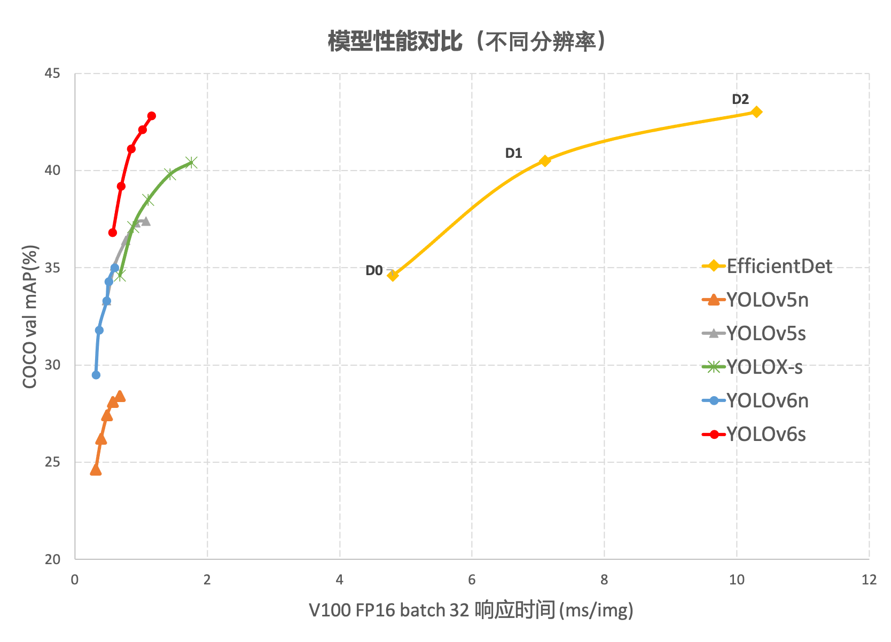
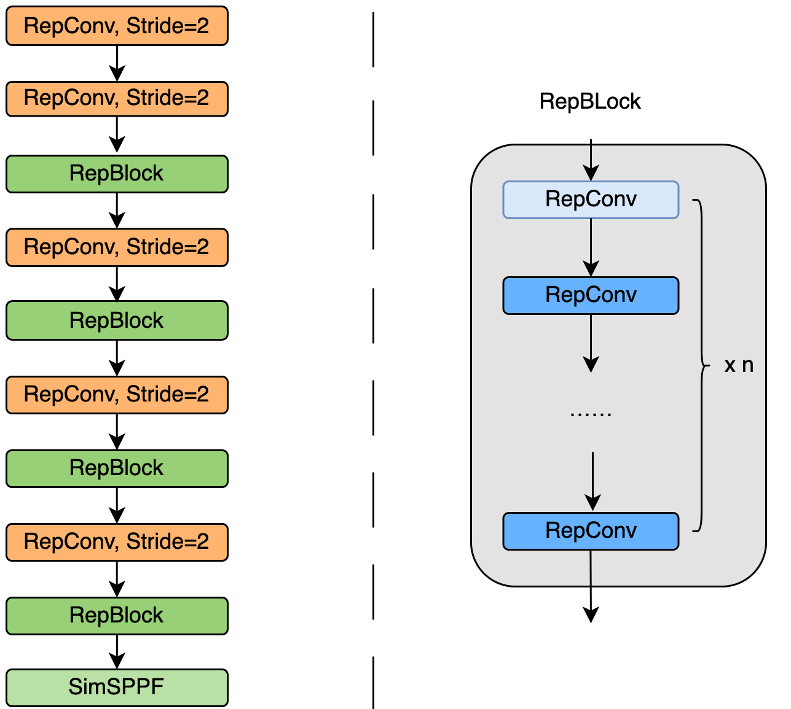
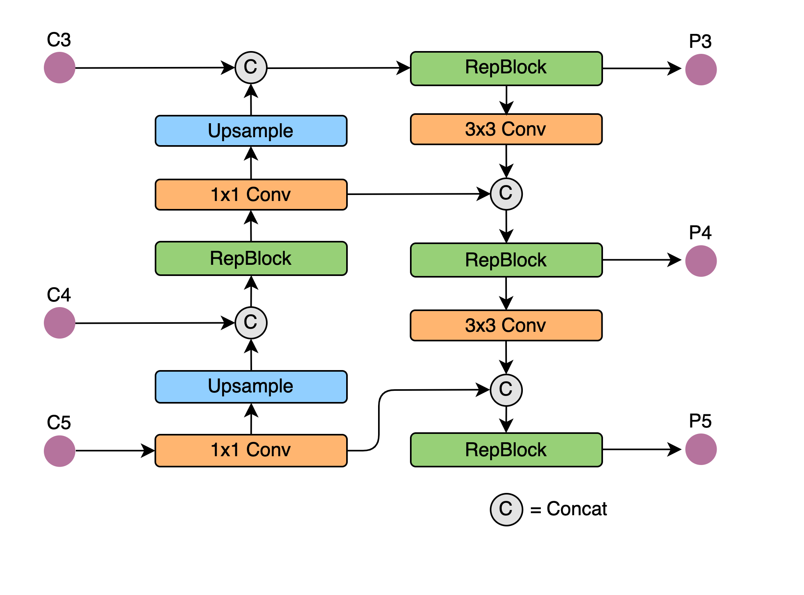
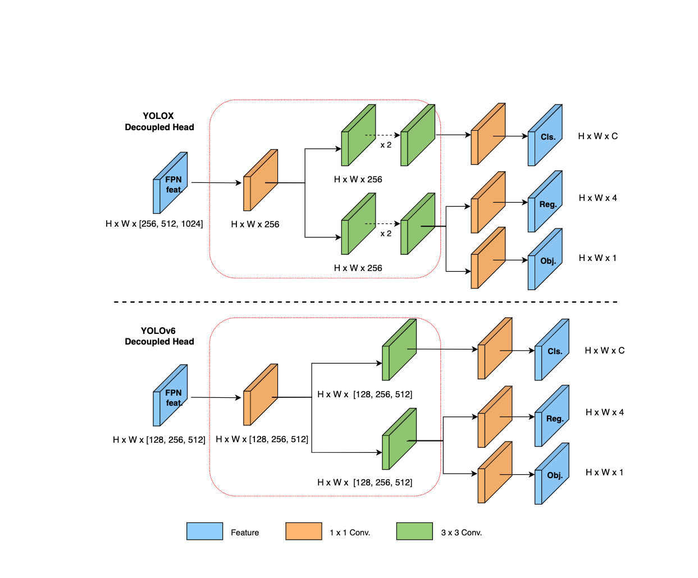

# YOLOv6

- [offical code](https://github.com/meituan/YOLOv6)

## Code Source
```
# official
link: https://github.com/meituan/YOLOv6
branch: main
commit: 07dd2561009c5e0affa767ecf0d612ea971cf101

```

## Model Arch

### pre-processing

`yolov6`系列的预处理主要是对输入图片利用`letterbox`算子进行resize，然后送入网络forward即可，该过程和`yolov5`一致

### post-processing

`yolov6`系列的后处理操作是利用网络预测特征图进行box decode，然后进行nms操作

### backbone

YOLOv6在BackBone、Neck以及训练策略等方面进行了诸多的改进：

- 设计了更高效的Backbone和Neck：受到硬件感知神经网络设计思想的启发，基于RepVGG style设计了可重参数化、更高效的骨干网络EfficientRep Backbone和Rep-PAN Neck。
- 在训练策略上，我们采用Anchor-free 无锚范式，同时辅以SimOTA标签分配策略以及SIoU边界框回归损失来进一步提高检测精度。

EfficientRep Backbone：在 Backbone 设计方面，基于Rep算子设计了一个高效的Backbone。相比于YOLOv5采用的CSP-Backbone，该Backbone能够高效利用硬件（如 GPU）算力的同时，还具有较强的表征能力。

下图为EfficientRep Backbone具体设计结构图，将Backbone中stride=2的普通Conv层替换成了stride=2的 RepConv层。同时，将原始的CSP-Block都重新设计为RepBlock，其中RepBlock的第一个RepConv会做channel维度的变换和对齐。另外，还将原始的SPPF优化设计为更加高效的SimSPPF。



Rep-PAN：在Neck设计方面，为了让其在硬件上推理更加高效，以达到更好的精度与速度的平衡，基于硬件感知神经网络设计思想，为YOLOv6设计了一个更有效的特征融合网络结构。

Rep-PAN基于PAN拓扑方式，用RepBlock替换了YOLOv5中使用的CSP-Block，同时对整体Neck中的算子进行了调整，目的是在硬件上达到高效推理的同时，保持较好的多尺度特征融合能力（Rep-PAN结构图如下图所示）



### head
在 YOLOv6 中，采用了解耦检测头（Decoupled Head）结构，并对其进行了精简设计。原始YOLOv5的检测头是通过分类和回归分支融合共享的方式来实现的，而YOLOX的检测头则是将分类和回归分支进行解耦，同时新增了两个额外的3x3的卷积层，虽然提升了检测精度，但一定程度上增加了网络延时。

因此，yolov6对解耦头进行了精简设计，同时综合考虑到相关算子表征能力和硬件上计算开销这两者的平衡，采用Hybrid Channels策略重新设计了一个更高效的解耦头结构，在维持精度的同时降低了延时，缓解了解耦头中3x3卷积带来的额外延时开销。通过在nano尺寸模型上进行消融实验，对比相同通道数的解耦头结构，精度提升0.2% AP的同时，速度提升6.8%



### common

- letterbox
- RepBlock
- Rep-PAN
- Decoupled Head
- SimSPPF

## Model Info

### 模型性能

| 模型  | 源码 | mAP@.5:.95 | flops(G) | params(M) | input size |
| :---: | :--:  | :--: | :---: | :----: | :--------: |
| yolov6-n |[official](https://github.com/meituan/YOLOv6)|   35.0   | 11.1 |    4.3    |    640    |
| yolov6-tiny |[official](https://github.com/meituan/YOLOv6)  |    41.3    | 36.7| 15.0 | 640 |
| yolov6-s |[official](https://github.com/meituan/YOLOv6)  |    43.1    | 44.2 | 17.2 | 640 |

### 测评数据集说明


[MS COCO](https://cocodataset.org/#download)的全称是Microsoft Common Objects in Context，是微软于2014年出资标注的Microsoft COCO数据集，与ImageNet竞赛一样，被视为是计算机视觉领域最受关注和最权威的比赛数据集之一。

COCO数据集支持目标检测、关键点检测、实例分割、全景分割与图像字幕任务。在图像检测任务中，COCO数据集提供了80个类别，验证集包含5000张图片，上表的结果即在该验证集下测试。

### 评价指标说明

- mAP: mean of Average Precision, 检测任务评价指标，多类别的AP的平均值；AP即平均精度，是Precision-Recall曲线下的面积
- mAP@.5: 即将IoU设为0.5时，计算每一类的所有图片的AP，然后所有类别求平均，即mAP
- mAP@.5:.95: 表示在不同IoU阈值（从0.5到0.95，步长0.05）上的平均mAP

## VACC部署

### step.1 获取预训练模型

预训练模型导出onnx，参考[README.md](./source_code/README.md)


### step.2 准备数据集
- 准备[COCO](https://cocodataset.org/#download)数据集


### step.3 模型转换

1. 获取vamc模型转换工具

2. 根据具体模型修改模型转换配置文件[official_yolov6.yaml](./vacc_code/build/official_yolov6.yaml)：
    ```bash
    vamc build ./vacc_code/build/official_yolov6.yaml
    ```

### step.4 性能精度
1. 获取vamp性能测试工具
2. 基于[image2npz.py](../common/utils/image2npz.py)，将评估数据集转换为npz格式，生成对应的`npz_datalist.txt`
    ```bash
    python ../common/utils/image2npz.py --dataset_path path/to/coco_val2017 --target_path  path/to/coco_val2017_npz  --text_path npz_datalist.txt
    ```
3. 性能测试
    ```bash
    vamp -m deploy_weights/yolov6s-int8-kl_divergence-3_640_640-vacc/yolov6s --vdsp_params ./vacc_code/vdsp_params/official-yolov6s-vdsp_params.json -i 2 p 2 -b 1
    ```
4. npz结果输出
    ```bash
    vamp -m deploy_weights/yolov6s-int8-kl_divergence-3_640_640-vacc/yolov6s --vdsp_params ./vacc_code/vdsp_params/official-yolov6s-vdsp_params.json -i 2 p 2 -b 1 --datalist datasets/coco_npz_datalist.txt --path_output npz_output
    ```
5. [vamp_decode.py](./vacc_code/vdsp_params/vamp_decode.py)，进行后处理，解析vamp输出的npz文件，进行绘图和保存txt结果
    > yolov6未适配后处理算子，需要使用使用带后处理的npz解析脚本
    ```bash
    python ./vacc_code/vdsp_params/vamp_decode.py --input_image_dir datasets/coco_val2017 --vamp_datalist_path datasets/coco_npz_datalist.txt --vamp_output_dir npz_output --model_size 640 640 --save_dir output
    ```
6. [eval_map.py](../common/eval/eval_map.py)，精度统计，指定`instances_val2017.json`标签文件和上步骤中的txt保存路径，即可获得mAP评估指标
   ```bash
    python ../common/eval/eval_map.py --gt path/to/instances_val2017.json --txt path/to/vamp_draw_output
   ```
