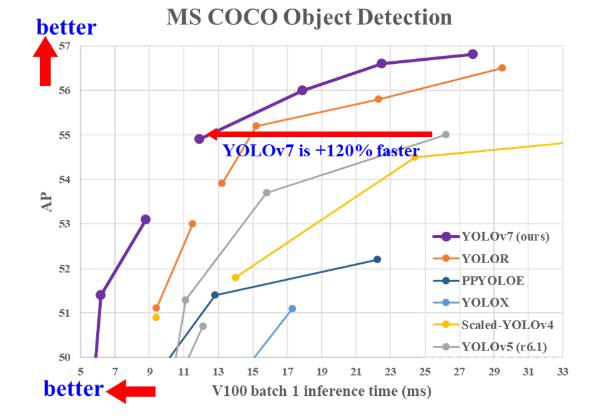
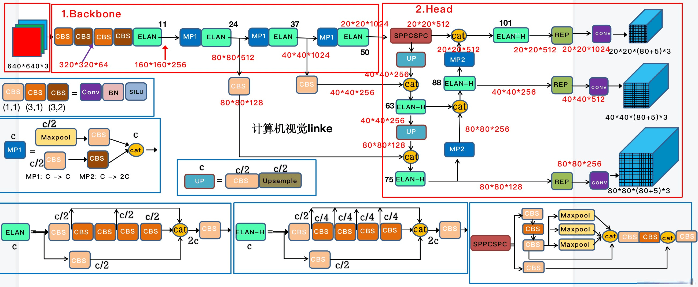
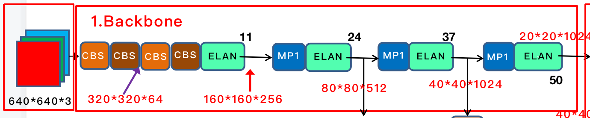
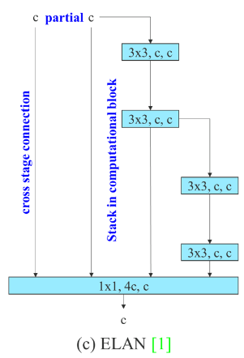
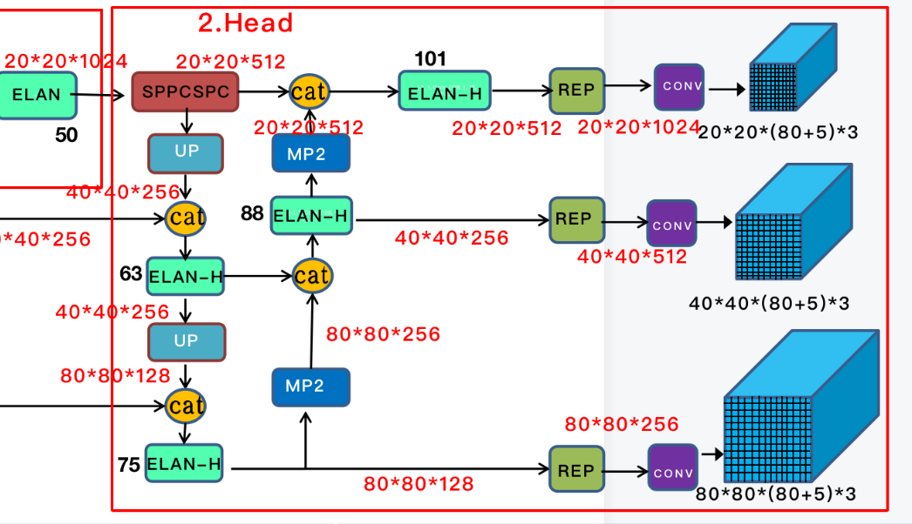
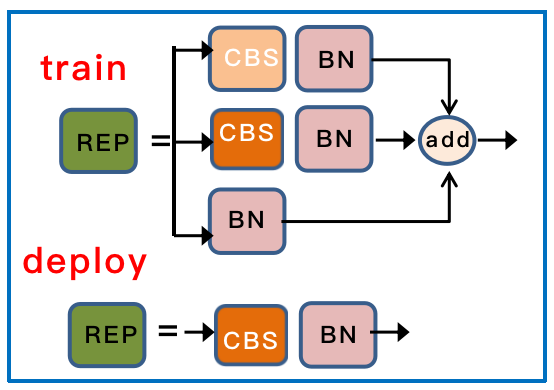

# YOLOv7

- [YOLOv7: Trainable bag-of-freebies sets new state-of-the-art for real-time object detectors](https://arxiv.org/abs/2207.02696)
- [offical code](https://github.com/WongKinYiu/yolov7)

## Code Source
```bash
git clone https://github.com/WongKinYiu/yolov7
cd yolov7
git checkout 072f76c72c641c7a1ee482e39f604f6f8ef7ee92
```

## Model Arch

### pre-processing

`yolov7`系列的预处理主要是对输入图片利用`letterbox`算子进行resize，然后送入网络forward即可，该过程和`yolov5`一致

### post-processing

`yolov7`系列的后处理操作是利用网络预测特征图进行box decode，然后进行nms操作

### backbone

- 首先是经过 4 层卷积层，CBS 主要是 Conv + BN + SiLU 构成，参考上图中用不同的颜色表示不同的 size 和 stride, 如 (3, 2) 表示卷积核大小为 3 ，步长为2；
- 经过 4个 CBS 后，特征图变为 160 * 160 * 128 大小。随后会经过论文中提出的 ELAN 模块，ELAN 由多个 CBS 构成，其输入输出特征大小保持不变，通道数在开始的两个 CBS 会有变化， 后面的几个输入通道都是和输出通道保持一致的，经过最后一个 CBS 输出为需要的通道；

    

    ```python
    [-1, 1, Conv, [128, 3, 2]],  # 3-P2/4
   [-1, 1, Conv, [64, 1, 1]],
   [-2, 1, Conv, [64, 1, 1]],
   [-1, 1, Conv, [64, 3, 1]],
   [-1, 1, Conv, [64, 3, 1]],
   [-1, 1, Conv, [64, 3, 1]],
   [-1, 1, Conv, [64, 3, 1]],
   [[-1, -3, -5, -6], 1, Concat, [1]],
   [-1, 1, Conv, [256, 1, 1]],  # 11
    ```

- MP层主要由CBS 和 Maxpool组成， 其中 MP1 和 MP2 主要是通道数的比变化；
### head

YOLOV7 head 其实就是一个 pafpn 的结构，和之前的YOLOV4，YOLOV5 一样。
- 首先，对于 backbone 最后输出的 32 倍降采样特征图 C5，然后经过 SPPCSP，通道数从1024变为512。
- 先按照 top down 和 C4、C3融合，得到 P3、P4 和 P5；再按 bottom-up 去和 P4、P5 做融合，这里基本和 YOLOV5 是一样的，区别在于将 YOLOV5 中的 CSP 模块换成了ELAN模块， 同时下采样变为了 MP2 层。它和 backbone 中的 ELAN 稍微有点区别就是 cat 的数量不同。
对于 pafpn 输出的 P3、P4 和 P5 ， 经过 RepConv 调整通道数，最后使用 1x1 卷积去预测 objectness、class 和 bbox 三部分。
RepConv 在训练和推理是有一定的区别。训练时有三个分支的相加输出，部署时会将分支的参数重参数化到主分支上


### common
- letterbox
- RepConv
- x(b,c,w,h) -> y(b,4c,w/2,h/2) 类似Focus


## Model Info

### 模型性能

|    模型    |                       源码                       | mAP@.5:.95 | mAP@.5 | flops(G) | params(M) | input size | mAP@.5:.95（0.45、0.25） | mAP@.5（0.45、0.25） |
| :--------: | :----------------------------------------------: | :--------: | :----: | :------: | :-------: | :--------: | :----------------------: | :------------------: |
|   yolov7   | [official](https://github.com/WongKinYiu/yolov7) |    51.4    |  69.7  | 118.302  |  37.620   |    640     |           46.1           |         61.5         |
|  yolov7x   | [official](https://github.com/WongKinYiu/yolov7) |    53.1    |  71.2  | 211.755  |  71.344   |    640     |           47.9           |         63.1         |
| yolov7-w6  | [official](https://github.com/WongKinYiu/yolov7) |    54.9    |  72.6  | 401.576  |  70.426   |    1280    |           48.8           |         63.6         |
| yolov7-e6  | [official](https://github.com/WongKinYiu/yolov7) |    56.0    |  73.5  | 574.623  |   97.24   |    1280    |           50.4           |         65.2         |
| yolov7-d6  | [official](https://github.com/WongKinYiu/yolov7) |    56.6    |  74.0  |  783.4   |  133.81   |    1280    |           50.6           |         65.4         |
| yolov7-e6e | [official](https://github.com/WongKinYiu/yolov7) |    56.8    |  74.4  | 574.623  |  97.247   |    1280    |           51.4           |         66.3         |

- 源码`map`使用参数为0.65和0.001
### 测评数据集说明


[MS COCO](https://cocodataset.org/#download)的全称是Microsoft Common Objects in Context，是微软于2014年出资标注的Microsoft COCO数据集，与ImageNet竞赛一样，被视为是计算机视觉领域最受关注和最权威的比赛数据集之一。

COCO数据集支持目标检测、关键点检测、实例分割、全景分割与图像字幕任务。在图像检测任务中，COCO数据集提供了80个类别，验证集包含5000张图片，上表的结果即在该验证集下测试。

### 评价指标说明

- mAP: mean of Average Precision, 检测任务评价指标，多类别的AP的平均值；AP即平均精度，是Precision-Recall曲线下的面积
- mAP@.5: 即将IoU设为0.5时，计算每一类的所有图片的AP，然后所有类别求平均，即mAP
- mAP@.5:.95: 表示在不同IoU阈值（从0.5到0.95，步长0.05）上的平均mAP

## Deploy

### step.1 获取预训练模型

- 使用官方`export`脚本，并修改[export.py#L157](https://github.com/WongKinYiu/yolov7/blob/main/export.py#L157)为`model.model[-1].concat = False`
    ```bash
    python export.py --weights ./yolov7-tiny.pt --grid --simplify
    ```


### step.2 准备数据集
- 准备[COCO](https://cocodataset.org/#download)数据集


### step.3 模型转换

1. 获取vamc模型转换工具

2. 根据具体模型修改模型转换配置文件[official_yolov7.yaml](./vacc_code/build/official_yolov7.yaml)：
    ```bash
    vamc build ./vacc_code/build/official_yolov7.yaml
    ```

### step.4 性能精度
1. 获取vamp性能测试工具
2. 基于[image2npz.py](../common/utils/image2npz.py)，将评估数据集转换为npz格式，生成对应的`npz_datalist.txt`
    ```bash
    python ../../common/utils/image2npz.py --dataset_path path/to/coco_val2017 --target_path  path/to/coco_val2017_npz  --text_path npz_datalist.txt
    ```
3. 性能测试
    ```bash
    vamp -m deploy_weights/yolov7-int8-percentile-3_640_640-vacc/yolov7 --vdsp_params ../vacc_code/vdsp_params/official-yolov7-vdsp_params.json -i 2 p 2 -b 1
    ```
4. npz结果输出
    ```bash
    vamp -m deploy_weights/yolov7-int8-percentile-3_640_640-vacc/yolov7 --vdsp_params ../vacc_code/vdsp_params/official-yolov7-vdsp_params.json -i 2 p 2 -b 1 --datalist datasets/coco_npz_datalist.txt --path_output npz_output
    ```
5. [vamp_decode.py](./vacc_code/vdsp_params/vamp_decode.py)，解析vamp输出的npz文件，进行绘图和保存txt结果
    ```bash
    python ./vacc_code/vdsp_params/vamp_decode.py --txt result_npz --label_txt datasets/coco.txt --input_image_dir datasets/coco_val2017 --model_size 640 640 --vamp_datalist_path datasets/coco_npz_datalist.txt --vamp_output_dir npz_output
    ```
6. [eval_map.py](../common/eval/eval_map.py)，精度统计，指定`instances_val2017.json`标签文件和上步骤中的txt保存路径，即可获得mAP评估指标
   ```bash
    python ../common/eval/eval_map.py --gt path/to/instances_val2017.json --txt path/to/vamp_draw_output
   ```
