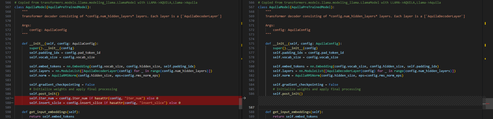
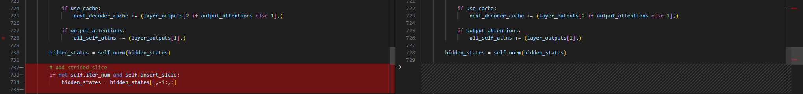
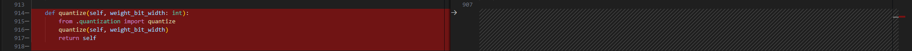
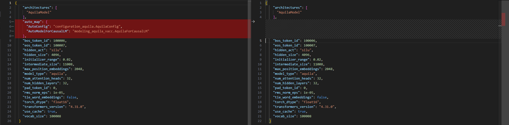

# Aquila

- [Aquila2](https://github.com/FlagAI-Open/Aquila2)


## Model Arch


## Model Info
### Support Models

| models  | tips |
| :---: | :--: |
| [BAAI/Aquila2-7B](https://huggingface.co/BAAI/Aquila2-7B) |[modeling_aquila_vacc.py](./source_code/modeling_aquila_vacc.py) |
| [BAAI/Aquila2-34B](https://huggingface.co/BAAI/Aquila2-34B) |GQA，[modeling_aquila_vacc.py](./source_code/modeling_aquila_vacc.py) |


## Build_In Deploy

### step.1 模型准备

1. 参考`Support Models`列表下载模型权重
2. 网络修改
    - 为部署`aquila`系列模型，在官方源码基础上，需要做部分修改，其中左图为修改后代码
    - 修改后模型文件[modeling_aquila_vacc.py](./source_code/modeling_aquila_vacc.py)
        - 借助config.iter_num和 config.insert_slice来判断是否插入strided_slice
        
        
        - class AquilaForCausalLM添加quantize方法，支持per_channel int8量化，[quantization_vacc.py](./source_code/quantization_vacc.py)
        

    - 修改后模型配置文件[config.json](./source_code/config.json)
        - 添加auto_map选项，以加载修改后的modeling脚本
        

    - 将以上文件移动至原始权重路径内，覆盖同名文件（注意7B/34B的config.josn区别）


### step.2 数据集

1. 量化校准数据集：
    - [allenai/c4](https://hf-mirror.com/datasets/allenai/c4/tree/main/en)
        - c4-train.00000-of-01024.json.gz
        - c4-validation.00000-of-00008.json.gz
    - [ceval/ceval-exam](https://hf-mirror.com/datasets/ceval/ceval-exam/tree/main)
        - ceval-exam.zip
    - [yahma/alpaca-cleaned](https://hf-mirror.com/datasets/yahma/alpaca-cleaned/tree/main)
        - alpaca_data_cleaned.json

### step.3 模型转换

1. 根据具体模型修改模型转换配置文件
    - [hf_aquila_fp16.yaml](./build_in/build/hf_aquila_fp16.yaml)
    - [hf_aquila_int8.yaml](./build_in/build/hf_aquila_int8.yaml)

    > - runstream推理，编译参数`backend.type: tvm_vacc`
    > - fp16精度: 编译参数`backend.dtype: fp16`
    > - int8精度: 编译参数`backend.dtype: int8`

    ```bash
    cd aquila
    mkdir workspace
    cd workspace
    vamc compile ../build_in/build/hf_aquila_fp16.yaml
    vamc compile ../build_in/build/hf_aquila_int8.yaml
    ```

### step.4 模型推理
1. 参考大模型部署推理工具：[vastgenx](../../tools/vastgenx/README.md)


### Tips
- **LLM模型请先查看概要指引**，[Tips🔔](../README.md)
- 34B，GQA模型，vamc2x版本需配置enable_kv_share编译参数，在vamc3x以后无需显式设置，在工具内判断是否为GQA模型，自动添加
