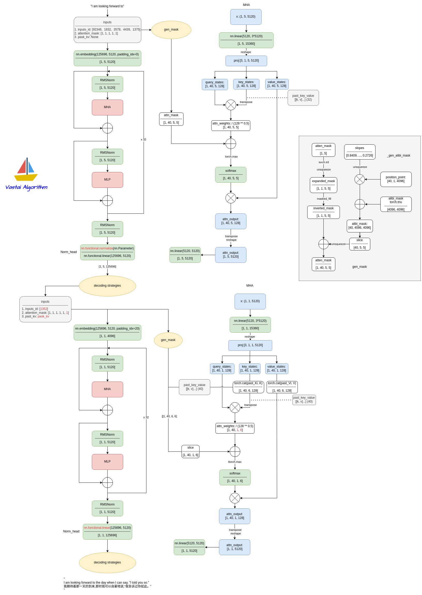
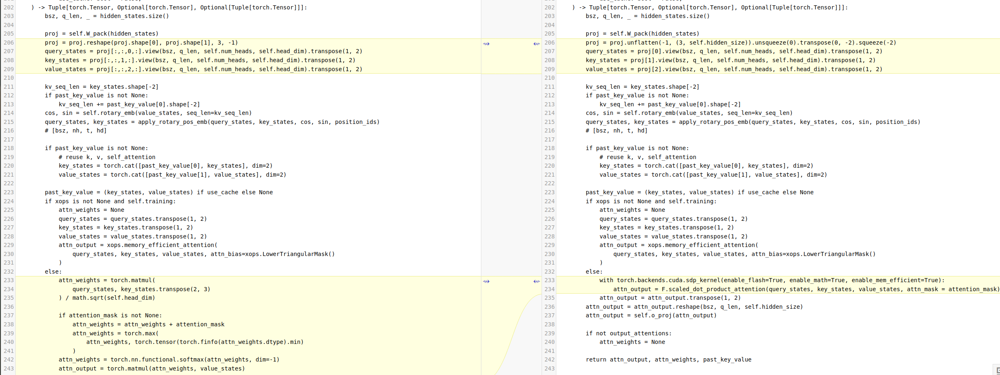
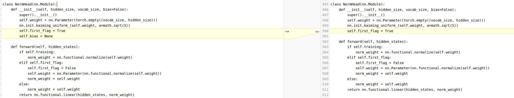
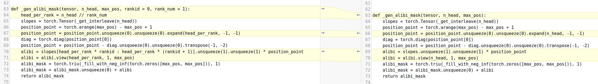
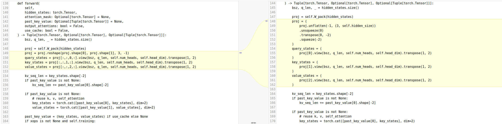
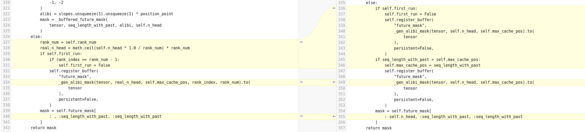
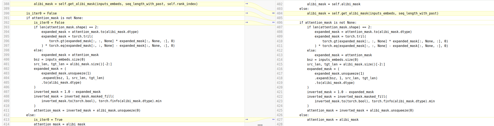
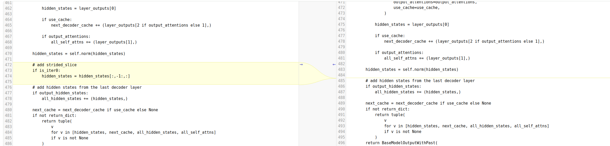

# Baichuan2

- [Baichuan 2: Open Large-scale Language Models](https://arxiv.org/abs/2309.10305)

## Model Arch


## Model Info

### Support Models
| models  | tips |
| :---: | :--: |
| [baichuan-inc/Baichuan2-7B-Base](https://huggingface.co/baichuan-inc)  | MHA |
| [baichuan-inc/Baichuan2-7B-Chat](https://huggingface.co/baichuan-inc)| MHA |
| [baichuan-inc/Baichuan2-13B-Base](https://huggingface.co/baichuan-inc) | MHA，基于Alibi位置编码，最长序列长度4096 |
| [baichuan-inc/Baichuan2-13B-Chat](https://huggingface.co/baichuan-inc)   | MHA，基于Alibi位置编码，最长序列长度4096 |


## TVM_VACC部署

### step.1 模型准备

1. 参考`Support Models`列表下载模型权重
2. 网络修改
- 为了方便部署`Baichuan`系列模型， 在官方源码的基础上， 对`modeling_baichuan.py`做了一些修改，其中左图为修改的代码
- 7B：[modeling_baichuan7b_vacc.py](./build_in/source_code/modeling_baichuan7b_vacc.py)
    - 1. Attention.forward，修改QKV reshape，替换`scaled_dot_product_attention`

    

    - 2. NormHead，添加bias, tp切分需要

    

- 13B：[modeling_baichuan13b_vacc.py](./build_in/source_code/modeling_baichuan13b_vacc.py)
    - 1. gen_alibi_mask，修改gen_alibi_mask函数的实现，函数参数增加rank_num和rankid，每次调用该函数，只返回当前rank对应的那一部分attention_mask，减少内存消耗和model proto占用

    

    - 2. attention.forward，修改qkv拆分的实现

    

    - 3. baichuanmodel.init，获取rank_num以及rank_index

    

    - 4. gen_alibi_mask，与1对应， 修改mask的获取方式

    

    - 5. baichuanmodel.forward，修改gen_alibi_mask的调用，增加iter0标志， 为插入slice做准备

    

    - 6. slice，模型插入slice算子

    

    - 7. normhead，tp切分需要，normhead添加bias

    

    - 8. forcausallm.forward，vamc return_dict&use_cache初始化有所不同， 需要做相应修改

    

    - 9. 为支持int8_per_channel量化，在quantizer.py中添加int8_per_channel量化的支持，[quantizer_vacc.py](./build_in/source_code/quantizer_vacc.py)
    

    
### step.2 数据集

1. 量化校准数据集：
    - [allenai/c4](https://hf-mirror.com/datasets/allenai/c4/tree/main/en)
        - c4-train.00000-of-01024.json.gz
        - c4-validation.00000-of-00008.json.gz
    - [ceval/ceval-exam](https://hf-mirror.com/datasets/ceval/ceval-exam/tree/main)
        - ceval-exam.zip
    - [yahma/alpaca-cleaned](https://hf-mirror.com/datasets/yahma/alpaca-cleaned/tree/main)
        - alpaca_data_cleaned.json

### step.3 模型转换
1. 根据具体模型修改模型转换配置文件
    - [hf_baichuan_fp16.yaml](./build_in/build/hf_baichuan_fp16.yaml)
    - [hf_baichuan_int8.yaml](./build_in/build/hf_baichuan_int8.yaml)
    
    > - runstream推理，编译参数`backend.type: tvm_vacc`
    > - fp16精度: 编译参数`backend.dtype: fp16`
    > - int8精度: 编译参数`backend.dtype: int8`

    ```bash
    vamc compile ./build_in/build/hf_baichuan_fp16.yaml
    vamc compile ./build_in/build/hf_baichuan_int8.yaml
    ```


### step.4 模型推理
1. 参考大模型部署推理工具：[vastgenx: v1.1.0+](../../docs/vastgenx/README.md)


### Tips
- **LLM模型请先查看概要指引**，[Tips🔔](../README.md)
- 依赖配置
    ```bash
    protobuf==3.20.3
    torch==2.1.0
    onnx==1.14.0
    onnxsim==0.4.35
    onnxruntime==1.13.1
    accelerate==0.25.0
    transformers>=4.31.0 # 推荐4.40
    ```
