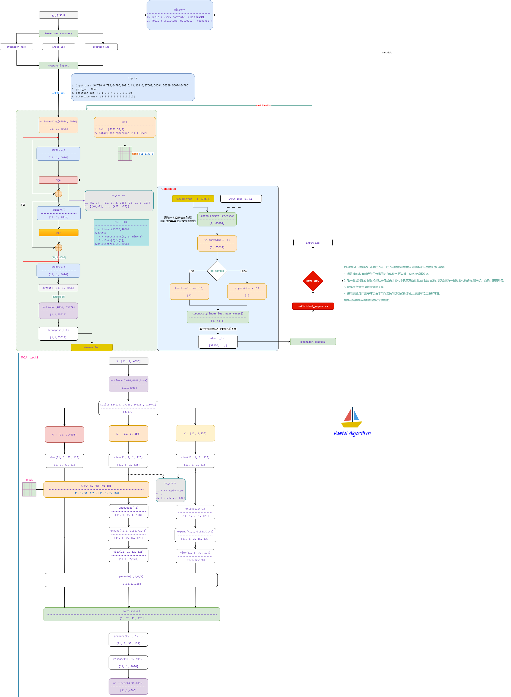

# ChatGLM4

- [GLM: General Language Model Pretraining with Autoregressive Blank Infilling](https://arxiv.org/abs/2103.10360)

## Model Arch




## Model Info

### Support Models

| models | tips |
| :---: | :--: |
| [THUDM/glm-4-9b-hf](https://huggingface.co/collections/THUDM/glm-4-665fcf188c414b03c2f7e3b7)  | GQA，[modeling_chatglm4_vacc.py](./build_in/source_code/modeling_chatglm4_vacc.py) |
| [THUDM/glm-4-9b-chat-hf](https://huggingface.co/collections/THUDM/glm-4-665fcf188c414b03c2f7e3b7) | GQA，[modeling_chatglm4_vacc.py](./build_in/source_code/modeling_chatglm4_vacc.py) |

## TVM_VACC部署

### step.1 模型准备

1. 参考`Support Models`列表下载模型权重
2. 网络修改
- 为了部署chatglm4模型，modeling_chatglm.py需要适当修改，修改后[modeling_chatglm4_vacc.py](./build_in/source_code/modeling_chatglm4_vacc.py)
  - 1. CoreAttention，适应tp切分调整size
  
  - 2. CoreAttention，使用手动实现scaled_dot_product_attention
  
  


### step.2 数据集

1. 量化校准数据集：
    - [allenai/c4](https://hf-mirror.com/datasets/allenai/c4/tree/main/en)
        - c4-train.00000-of-01024.json.gz
        - c4-validation.00000-of-00008.json.gz
    - [ceval/ceval-exam](https://hf-mirror.com/datasets/ceval/ceval-exam/tree/main)
        - ceval-exam.zip
    - [yahma/alpaca-cleaned](https://hf-mirror.com/datasets/yahma/alpaca-cleaned/tree/main)
        - alpaca_data_cleaned.json

### step.3 模型转换
1. 根据具体模型修改模型转换配置文件
    - v2/v3/v4模型，编译配置一致
    - [hf_chatglm_fp16.yaml](./build_in/build/hf_chatglm_fp16.yaml)
    - [hf_chatglm_int8.yaml](./build_in/build/hf_chatglm_int8.yaml)
    - [hf_chatglm_kv8.yaml](./build_in/build/hf_chatglm_kv8.yaml)

    > - runstream推理，编译参数`backend.type: tvm_vacc`
    > - fp16精度: 编译参数`backend.dtype: fp16`
    > - int8精度: 编译参数`backend.dtype: int8`

    ```bash
    vamc compile ./build_in/build/hf_chatglm_fp16.yaml
    vamc compile ./build_in/build/hf_chatglm_int8.yaml
    vamc compile ./build_in/build/hf_chatglm_kv8.yaml
    ```


### step.4 模型推理
1. 参考大模型部署推理工具：[vastgenx: v1.1.0+](../../docs/vastgenx/README.md)

    **Note:** 基于[benchmark_llm.sh](../../docs/vastgenx/script/benchmarks/benchmark_llm.sh)测试性能时，需修改`benchmark_serveing.py`传入的参数，即添加`–-trust_remote_code`、`--backend "openai-chat"`修改为`--backend "openai"`


### Tips
- **LLM模型请先查看概要指引**，[Tips🔔](../README.md)
- 依赖配置
    ```bash
    protobuf==3.20.3
    torch==2.1.0
    onnx==1.14.0
    onnxsim==0.4.35
    onnxruntime==1.13.1
    accelerate==0.25.0
    transformers>=4.31.0 # 推荐4.40
    tiktoken
    ```
