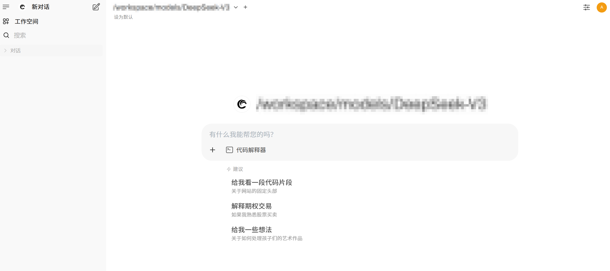
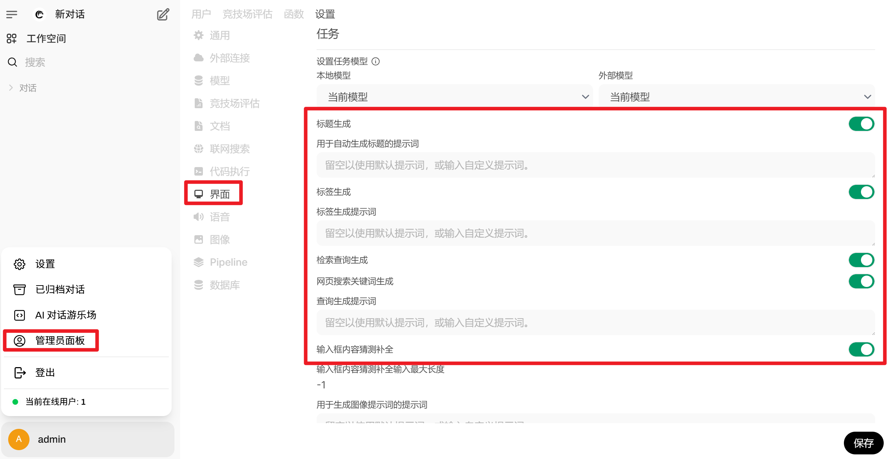
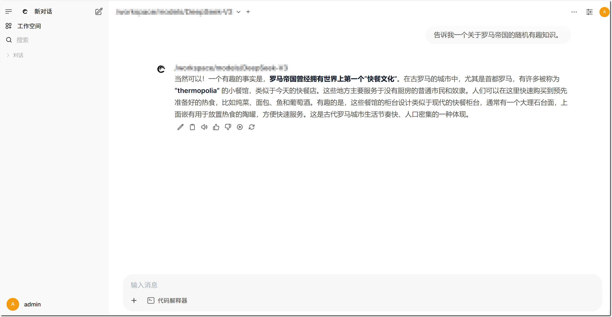

# DeepSeek-R1 系列模型部署

本文档旨在指导用户如何基于 vLLM 和 Open WebUI 在瀚博硬件设备上部署 DeepSeek-R1 系列模型，并测试模型的精度和性能。

## 硬件要求

  |模型规格 | 最低硬件配置要求  |
  | :--- | :--- |
  | DeepSeek-R1 系列 | 单台 VA16（8*128G）服务器 |


## 模型支持

  |model | huggingface  | modelscope | parameter | dtype| arch |
  | :--- | :--- | :-- | :-- | :-- | :-- |
  |DeepSeek-R1| [deepseek-ai/DeepSeek-R1](https://hf-mirror.com/deepseek-ai/DeepSeek-R1) | [deepseek-ai/DeepSeek-R1](https://www.modelscope.cn/models/deepseek-ai/DeepSeek-R1) | 671B-A37B | FP8 |LLM-MOE-MLA |
  |DeepSeek-R1-0528| [deepseek-ai/DeepSeek-R1-0528](https://hf-mirror.com/deepseek-ai/DeepSeek-R1-0528) | [deepseek-ai/DeepSeek-R1](https://www.modelscope.cn/models/deepseek-ai/DeepSeek-R1-0528) | 671B-A37B | FP8 | LLM-MOE-MLA |

## 使用限制

  | parallel | seq limit | mtp | tips|
  |:--- | :-- | :-- | :-- |
  | tp32-pp2 | max-input-len 100k </br> max-model-len 128k | ❌ | max-concurrency 4|
  | tp32 | max-input-len 56k </br> max-model-len 64k | ✅ | max-concurrency 4|

> - max-input-len: 最大输入长度
> - max-model-len: 最大上下文长度
> - mtp: Multi-Token Prediction，多token预测模式
> - max-concurrency: 最大并发
> - 对于超过上下文长度的请求，内部会拦截不做处理，需要客户端自行处理
> - `模型支持列表`内模型配置一致


## 模型下载
1. 通过hf-mirror下载

- 参考[hf-mirror](https://hf-mirror.com/)下载权重
  ```shell
  wget https://hf-mirror.com/hfd/hfd.sh
  chmod a+x hfd.sh
  export HF_ENDPOINT=https://hf-mirror.com
  apt install aria2
  ./hfd.sh deepseek-ai/DeepSeek-R1 -x 10 --local-dir DeepSeek-R1
  ```

2. 或通过modelscope下载

- 参考[modelscope](https://modelscope.cn/docs/models/download)下载权重
  ```shell
  pip install modelscope -i https://mirrors.ustc.edu.cn/pypi/web/simple 
  export PATH=$PATH:~/.local/bin
  modelscope download --model deepseek-ai/DeepSeek-R1 --local_dir ./DeepSeek-R1
  ```


## 启动模型服务

1. 参考官方启动命令：[vllm](https://docs.vllm.ai/en/latest/cli/#bench)

  ```bash
  docker run \
      --privileged=true --shm-size=256g \
      --name vllm_service \
      -v /path/to/model:/weights/ \
      -p 8000:8000 \
      --ipc=host \
      -e LLM_MAX_PREFILL_SEQ_LEN="102400" \
      -e FUSE_ALL_DECODER_LAYERS="0" \
      harbor.vastaitech.com/ai_deliver/vllm_vacc:AI3.2_GR_1202 \
      vllm serve /weights/DeepSeek-R1-0528 \
      --trust-remote-code \
      --tensor-parallel-size 32 \
      --pipeline-parallel-size 2 \
      --max-model-len 131072 \
      --enforce-eager \
      --reasoning-parser deepseek_r1 \
      --host 0.0.0.0 \
      --port 8000 \
      --served-model-name DeepSeek-R1-0528
  ```

- 参数说明如下

  - `LLM_MAX_PREFILL_SEQ_LEN="102400"`：最大prefill长度环境变量设置，仅针对100k输入时，需要设置该环境变量。

  - `FUSE_ALL_DECODER_LAYERS="0"`禁用融合优化环境变量设置，仅针对100k输入时，需要设置该环境变量。

  - `--tensor-parallel-size`：张量并行数, 针对 DeepSeek 系列模型仅支持TP32, 对应参数：“--tensor-parallel-size 32”

  - `--pipeline-parallel-size`：流水线并行数，仅测试100k输入时，需要设置该参数"--pipeline-parallel-size 2"。

  - `--model`：原始模型权重所在路径。请根据实际情况替换。

  - `--port`：模型服务端口。

  - `--served-model-name`：模型名称。

  - `--max-model-len`：模型最大上下文长度。

  - `--speculative-config` : 是否开启MTP模式。若开启MTP，需设置参数：--speculative-config '{"method":"deepseek_mtp","num_speculative_tokens":1}'


## 模型性能测试

> 模型性能包含吞吐和推理时延，可通过 vLLM 服务加载模型，并使用 vLLM 自带框架进行性能测试。

1. 参考vLLM文档测试模型性能：[benchmarking/cli](https://docs.vllm.ai/en/latest/benchmarking/cli/)

  ```shell
  vllm bench serve \
      --host <IP> \
      --port <Port> \
      --model <model_path> \
      --dataset-name random \
      --num-prompts <num> \
      --random-input-len <input_len> \
      --ignore-eos \
      --random-output-len <output_len> \
      --max-concurrency <concurrency> \
      --served-model-name <model_name> \
      --save-result \
      --result-dir <result> \
      --result-filename <result_name>
  ```


  - 其中，参数说明如下：

    - `--host`：vLLM 推理服务所在 IP 地址。

    - `--port`：vLLM 推理服务端口，请根据实际情况替换。

    - `--model`：原始模型权重文件所在路径。和 vLLM 推理服务启动时设置的模型路径一致。

    - `--dataset-name`：数据集名称。

    - `--num-prompts`：测试时使用的输入数据数量。

    - `--random-input-len`：输入序列的长度。

    - `--ignore-eos`：用于控制生成文本时是否忽略模型的 EOS（End-of-Sequence） Token，即结束标记，如 `<|endoftext|>` 或 `</s>`。

    - `--random-output-len`： 输出序列的长度。

    - `--max-concurrency`：最大请求并发数。

    - `--served-model-name`：API 中使用的模型名称。该参数设置应与模型服务启动脚本中`--served-model-name`参数一致

    - `--save-result`：是否保存测试结果。如果设置该参数，则测试保存至`--result-dir` 和 `--result-filename` 指定的路径。

    - `--result-dir`：测试结果保存目录。如果不设置，则保存至当前路径。

    - `--result-filename`：测试结果文件名称。


2. 测试示例
- 启动vLLM服务
- 测试`DeepSeek-R1-0528`模型性能

    ```shell
    docker exec -it  vllm_service bash
    cd /test/benchmark
    mkdir benchmark_result
    export OPENAI_API_KEY="token-abc123"
    vllm bench serve \
        --host <IP> \
        --port 8000 \
        --model /weights/DeepSeek-R1-0528 \
        --dataset-name random \
        --num-prompts 3 \
        --random-input-len 128 \
        --ignore-eos \
        --random-output-len 1024 \
        --max-concurrency 1 \
        --served-model-name DeepSeek-R1-0528 \
        --save-result \
        --result-dir ./benchmark_result \
        --result-filename result.json     
    ```
    - 其中，`vllm_service`为vLLM 服务容器名称，可通过`docker ps |grep vLLM`查询；`host`为本机ip地址。


## 性能结果指标说明

- Maximum request concurrency： 最大并发数。

- Benchmark duration (s)：请求测试耗时。

- Successful requests：请求总数。

- Total input tokens：输入Token数量。

- Total generated tokens：输出Token数量。

- Request throughput：每秒处理的请求数。

- Output token throughput：每秒输出Token数量。

- Total Token throughput：每秒生成Token数量。

- Mean TTFT ：从用户发送请求到模型生成第一个 Token 的平均时间。

- Mean TPOT：模型生成每个输出 Token 所需的平均时间。

- Mean ITL: token间延迟。


## 模型精度测试

1. 通过EvalScope进行模型精度测试，参考：[installation](https://evalscope.readthedocs.io/zh-cn/latest/get_started/installation.html)
2. 启动 vLLM 模型服务
3. 参考脚本：[precision_llm.py](../../docs/evalscope/precision_llm.py)，配置测评数据集及采样参数等信息，执行脚本获取精度测评结果

  - 测评主要参数：
    - model：模型名称。该参数设置应与模型服务启动脚本中`--served-model-name`参数一致。

    - api_url：vLLM 服务地址。

    - api_key：API 密钥。默认值：Empty。

    - datasets：数据集名称。支持输入多个数据集，数据集将自动从modelscope下载。

    - dataset_args：数据集参数

      - subset_list：评测数据子集列表，指定后将只使用子集数据。

    - eval_batch_size：评测批次大小。

    - generation_config：生成参数。

      - max_tokens：生成的最大Token数量。

      - temperature：生成温度。

      - top_p：生成top-p。
        
      - top_k：生成top-k。

      - n： 生成序列数量。

    - stream：是否使用流式输出，默认值：false。

    - timeout：请求超时时间。

    - limit：每个数据集最大评测数据量，不填写则默认为全部评测，可用于快速验证。支持int和float类型，int表示评测数据集的前N条数据，float表示评测数据集的前N%条数据。


## Open WebUI界面服务

1. 启动 vLLM 服务。
2. 新打开一个终端拉取 Open WebUI 镜像。

  ```shell
  docker pull harbor.vastaitech.com/ai_deliver/vast-webui:latest
  ```

3. 启动 Open WebUI 服务。

  ```shell
  docker run -d \
      -v vast-webui:/app/backend/data \
      -e ENABLE_OLLAMA_API=False \
      --network=host \
      -e PORT=18080 \
      -e OPENAI_API_BASE_URL="http://127.0.0.1:8000/v1" \
      -e DEFAULT_MODELS="/weights/DeepSeek-R1-0528" \
      -e DEFAULT_LOCALE="cn" \
      --name vast-webui \
      --restart always \
      harbor.vastaitech.com/ai_deliver/vast-webui:latest
  ```
- 上述指令默认在 x86 架构的 CPU 环境中执行。如果 CPU 是 ARM 架构，则`harbor.vastaitech.com/ai_deliver/vast-webui:latest`需替换为`harbor.vastaitech.com/ai_deliver/vast-webui:latest_arm`。
  - 其中，`OPENAI_API_BASE_URL`为 vLLM 服务地址，`DEFAULT_MODELS`为原始模型权重所在路径。请根据实际情况替换。
- Open WebUI 服务启动后，即可通过[http://HostIP:18080](http://HostIP:18080)访问  Open WebUI。
  - 其中，“HostIP” 为 Open WebUI 服务所在IP地址。

4. 访问 Open WebUI 页面，并根据界面提示注册账号并登录。

- 首次进入需设置管理员账号密码。设置完毕后，进入如下所示主页。



> 如果瀚博已提供环境，则默认用户名为“admin@vastai.com”，默认密码为“admin123”。

5. 连接 vLLM 服务并添加DeepSeek-R1-0528模型。

- 如果是普通用户，也可在“设置 > 外部连接”页签添加 vLLM服务和模型，但是添加后仅针对当前普通用户有效。

  5.1. 在“管理员面板 > 设置 > 外部连接”页签的“管理 Open API 连接”栏单击“+”。

  

  5.2. 在“添加一个连接”页面配置 vLLM 服务地址、密钥和DeepSeek-R1-0528模型地址并保存。

  -  vLLM 服务地址格式：http://HostIP:Port/v1。其中，HostIP 为 vLLM 服务所在地址，Port 为 vLLM 服务端口。

  - 密钥：API密钥，需配置为“token-abc123”。

  - 模型地址：原始模型权重文件所在路径。

  

  5.3. 在“管理员面板 > 设置 > 界面”页签禁用下图红框中的功能以防止 Open WebUI 自动调用大模型执行红框中的功能。



6. 开启一个新对话进行简单体验。



- 本节仅简单说明如何使用 Open WebUI。详细使用说明可参考[https://openwebui-doc-zh.pages.dev/features/](https://openwebui-doc-zh.pages.dev/features/)
