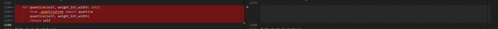

# DeepSeek-R1

- Technical Report
    - [DeepSeek-V3 Technical Report](https://arxiv.org/abs/2412.19437)
    - [DeepSeek-R1 Technical Report](https://arxiv.org/abs/2501.12948)

- Huggingface
    - https://hf-mirror.com/deepseek-ai


## Model Arch


### DeepSeek-R1-Zero
DeepSeek-R1-Zero是一个独特的通过大规模强化学习(Reinforcement Learning，RL) 训练的模型，无需有监督微调 (Supervised Fine-Tuning，SFT) ，具备较强的推理（Reasoning）能力。

DeepSeek-R1-Zero展示出自我验证、反思和长链思维推理能力，甚至在推理方面得分略微超过R1。但R1-Zero有一些明显的局限性，特别是在输出可读性和语言一致性方面，仍需要解决可读性差和语言混合等问题。

### DeepSeek-R1
相比之下，DeepSeek-R1采用了多阶段训练方法，加入了SFT，而不是采用纯粹的强化学习。训练步骤分四个阶段：
- 冷启动：
    - 搜集一些思维链的数据来微调模型，大概几千条数据，方法包括：
        - 直接提示基础模型去生成详细答案并附带反思和验证
        - 搜集DeepSeek-R1-Zero的可读输出，并使用人工进行标注
- 面向推理的强化学习：
    - 使用和DeepSeek-R1-Zero相同的GRPO
    - 语言可能会不统一，引入语言一致性奖赏，对模型推理能力有轻微影响
    - 准确性奖赏+语言一致性奖赏
- 拒绝采样和SFT：
    - 推理数据：这个阶段不仅仅采样能用规则判定的输出，还引入其他任务。奖赏也更多样，比如会使用DeepSeek-V3来判断事实和所采样回答的正确性。广泛做采样，并过滤语种混杂，长段落，以及代码块等，得到数据600k
    - 非推理数据：对写作，事实性问答，自我认同和翻译等数。我们重用DeepSeek-V3的SFT数据集。有时也会用DeepSeek-V3来生成可能的思维链。得到数据200k。
    - 使用这800k数据，微调2个epoch
- 面向全场景的强化学习：
    - 目的是对齐人类喜好，提高模型的有用程度和无害性，同时优化推理能力
    - 使用组合奖赏信号和更广泛的提示词分布
    - 推理性数据仍然用规则
    - 非推理数据使用奖赏模型
        - 数据分布类似于DeepSeek-V3的提示词和答案偏好分布
        - 为了让模型有用，DeepSeek偏重于总结的有用性和相关性，而不打扰背后的思维链
        - 对于无害性，DeepSeek对整个推理过程和总结来检查，并识别和消灭任何潜在风险，偏见和有害内容

### DeepSeek-R1-Distill
DeepSeek使用DeepSeek-R1第三阶段生成800k数据，对LLaMa、Qwen的各种尺寸的模型进行了SFT微调，证实在不用RL的情况下，可以极大的提高小模型的推理能力。


## Build_In Deploy

### step.1 模型准备

1. 下载模型权重

    | models  |tips |
    | :--- | :--: |
    | [deepseek-ai/DeepSeek-R1-Distill-Qwen-1.5B](https://hf-mirror.com/deepseek-ai/DeepSeek-R1-Distill-Qwen-1.5B)  | GQA，base model: Qwen2.5-Math-1.5B |
    | [deepseek-ai/DeepSeek-R1-Distill-Qwen-7B](https://hf-mirror.com/deepseek-ai/DeepSeek-R1-Distill-Qwen-7B) |  GQA，base model: Qwen2.5-Math-7B |
    | [deepseek-ai/DeepSeek-R1-Distill-Qwen-14B](https://hf-mirror.com/deepseek-ai/DeepSeek-R1-Distill-Qwen-14B) |  GQA，base model: Qwen2.5-14B |
    | [deepseek-ai/DeepSeek-R1-Distill-Qwen-32B](https://hf-mirror.com/deepseek-ai/DeepSeek-R1-Distill-Qwen-32B) | GQA，base model: Qwen2.5-32B |
    | [deepseek-ai/DeepSeek-R1-Distill-Llama-8B](https://hf-mirror.com/deepseek-ai/DeepSeek-R1-Distill-Llama-8B) |  GQA，base model: Llama-3.1-8B |
    | [deepseek-ai/DeepSeek-R1-Distill-Llama-70B](https://hf-mirror.com/deepseek-ai/DeepSeek-R1-Distill-Llama-70B) | GQA，base model: Llama-3.3-70B-Instruct |

    > - 以上蒸馏模型均使用DeepSeek-R1生成的高质量数据微调而来


2. 模型修改
    - 瀚博软件栈部署`DeepSeek-R1-Distill-Llama`系列模型，无需修改原始模型文件
    - 瀚博软件栈部署`DeepSeek-R1-Distill-Qwen`系列模型，在官方源码的基础上，需要对`modeling_qwen2.py`做一些修改，其中左图为修改的代码
    - [modeling_qwen2_vacc.py](./build_in/source_code/modeling_qwen2_vacc.py)
        - 修改相关依赖的导入方式
        
        - 基于config.insert_slice来判断是否插入strided_slice
        
        - class Qwen2ForCausalLM添加quantize方法，支持per_channel int8量化，[quantization_vacc.py](./build_in/source_code/quantization_vacc.py)
        
        - 迁移transformers==4.37.0版本内cache_utils,modeling_attn_mask_utils,modeling_outputs和utils中移动至modeling_qwen2_vacc.py

    - [configuration_qwen2_vacc.py](./build_in/source_code/configuration_qwen2_vacc.py)
        - 修改对于相关依赖的导入方式
        
    - [quantization_vacc.py](./build_in/source_code/quantization_vacc.py)
        - Qwen2ForCausalLM添加quantize方法，支持per_channel int8量化
        
    - [config_vacc.json](./build_in/source_code/config_vacc.json)
        - 添加_attn_implementation选项，并将其只配置为eager；并添加auto_map选项
        
    - 将以上修改后文件，放置与原始权重目录下（注意不同子模型，对应修改config_vacc.json文件）


### step.2 数据集

1. 量化校准数据集：
    - [allenai/c4](https://hf-mirror.com/datasets/allenai/c4/tree/main/en)
        - c4-train.00000-of-01024.json.gz
        - c4-validation.00000-of-00008.json.gz
    - [ceval/ceval-exam](https://hf-mirror.com/datasets/ceval/ceval-exam/tree/main)
        - ceval-exam.zip
    - [yahma/alpaca-cleaned](https://hf-mirror.com/datasets/yahma/alpaca-cleaned/tree/main)
        - alpaca_data_cleaned.json

2. 性能测试不定长数据集：[ShareGPT_V3_unfiltered_cleaned_split.json](https://huggingface.co/datasets/anon8231489123/ShareGPT_Vicuna_unfiltered/resolve/main/ShareGPT_V3_unfiltered_cleaned_split.json)
3. 精度评估数据集：[OpenCompassData-core-20240207.zip](https://github.com/open-compass/opencompass/releases/download/0.2.2.rc1/OpenCompassData-core-20240207.zip)

### step.3 模型转换

1. 参考瀚博训推软件生态链文档，获取模型转换工具: [vamc v3.0+](../../docs/vastai_software.md)
2. 根据具体模型，修改模型转换配置文件
    - Distill-Llama/Qwen模型，编译配置一致
    - [hf_ds_r1_distill_fp16.yaml](./build_in/build/hf_ds_r1_distill_fp16.yaml)
    - [hf_ds_r1_distill_int8.yaml](./build_in/build/hf_ds_r1_distill_int8.yaml)

    ```bash
    vamc compile ./build_in/build/hf_ds_r1_distill_fp16.yaml
    vamc compile ./build_in/build/hf_ds_r1_distill_int8.yaml
    ```


> - DeepSeek-R1-Distill-Qwen系列模型，部署流程和Qwen2系列是一致的
> - DeepSeek-R1-Distill-Llama系列模型，部署流程和Llama3系列是一致的


### step.4 模型推理
1. 参考瀚博训推软件生态链文档，获取模型推理工具：[llmdeploy v1.6+](../../docs/vastai_software.md)
2. 参考llmdeploy工具文档，进行模型推理、性能和精度测试


## Pytorch Deploy

### step.1 模型准备
| models  |tips |
| :--- | :--: |
| [deepseek-ai/DeepSeek-R1](https://hf-mirror.com/deepseek-ai/DeepSeek-R1) |  MOE，MLA |


### step.2 模型推理

1. 参考瀚博训推软件生态链文档，`vllm_vacc`和`torch_vacc`: [vastai_software.md](../../../docs/vastai_software.md)
2. vllm docker
    ```bash
    # 基于开源vllm，构建cpu版本docker镜像
    git clone https://github.com/vllm-project/vllm.git
    cd vllm && git checkout v0.7.2 && docker build -f Dockerfile.cpu -t vllm-cpu-env:v0.7.2 --shm-size=32g . --no-cache && cd ..
    ```
3. vacc docker

    ```bash
    # 基于vllm-cpu-env:v0.7.2基础镜像，构建vllm_vacc镜像
    cd ./docker && docker build -t vllm_vacc -f Dockerfile --shm-size=16g . --no-cache

    # 启动容器
    docker run --ipc=host --rm -it --shm-size=256g  --network host --privileged \
        -v /nfs/workspace:/test \
        --name=vllm_vacc \
        vllm_vacc bash

    # 启动vllm服务，使用tp32并行推理
    vllm serve /test/weights/DeepSeek-R1 \
    --trust-remote-code --tensor-parallel-size 32 --max-model-len 32768 --enforce-eager \
    --enable-reasoning --reasoning-parser deepseek_r1 \
    --host 10.24.73.25 --port 8000
    ```

### step.3 性能测试

1. Online Benchmark

    ```bash
    python3 /workspace/vllm/benchmarks/benchmark_serving.py \
        --model /test/weights/DeepSeek-R1 \
        --endpoint /v1/chat/completions \
        --dataset-name sonnet \
        --sonnet-input-len 1024 \
        --sonnet-prefix-len 32 \
        --sonnet-output-len 1024 \
        --dataset-path /workspace/vllm/benchmarks/sonnet.txt \
        --num-prompts 100 \
        --max-concurrency 4 \
        --result-dir /workspace/models/benchmark_result \
        --result-filename result.json \
        --save-result
    ```

2. Offline Throughput Benchmark

    ```bash
    python3 benchmark_throughput.py --model /test/weights/DeepSeek-R1 \
        --trust-remote-code --tensor-parallel-size 32 --enforce-eager --max-model-len 16384 \
        --dataset-name random --num-prompts 10  --input-len 1000  --output-len 1000
    ```

3. Offline Latency Benchmark

    ```bash
    python3 benchmark_latency.py --model /test/weights/DeepSeek-R1 \
        --trust-remote-code --tensor-parallel-size 32 --enforce-eager --max-model-len 16384 \
        --input-len 1024 --output-len 1024 --batch-size 1 --num-iters 10
    ```


### step.4 精度测试
1. OpenCompass
    ```bash
    conda create -n opencompass python=3.10
    conda activate opencompass

    git clone https://github.com/open-compass/opencompass.git # git clone https://ghfast.top/https://github.com/open-compass/opencompass.git
    cd opencompass && git checkout 0.4.1 && pip install -e ".[full]" -i https://mirrors.aliyun.com/pypi/simple/
    ```

2. Datasets
    ```bash
    # Download dataset to opencompass/data folder
    # wget https://github.com/open-compass/opencompass/releases/download/0.2.2.rc1/OpenCompassData-core-20240207.zip
    # wget http://opencompass.oss-cn-shanghai.aliyuncs.com/datasets/data/math.zip

    unzip OpenCompassData-core-20240207.zip
    unzip -o math.zip  -d ./data/

    # some datasets can automatic download
    # pip install ModelScope
    # export DATASET_SOURCE=ModelScope # if not use auto download: unset DATASET_SOURCE
    ```

3. Eval

    - 使用前述已启动的vllm openapi服务
    - 配置数据集和模型服务: [eval/eval_ds.py](./pytorch/eval/eval_ds.py)

    ```bash
    # 设置精度测试数据集: cluewsc + math_500 + mmlu
    opencompass eval/eval_ds.py --dry-run  # 校验数据集是否完整
    opencompass eval/eval_ds.py            # 启动测试
    ```

    ```
    # 精度测试结果，输出格式类似如下

    | dataset | version | metric | mode | DeepSeek-R1-va16-0403-32768 |
    |----- | ----- | ----- | ----- | -----|
    | cluewsc-dev | 5ab83b | accuracy | gen | 97.48 |
    | cluewsc-test | 5ab83b | accuracy | gen | 95.18 |
    | avg |  | accuracy | gen | 96.33 |

    | dataset | version | metric | mode | DeepSeek-R1-h800-32768 |
    |----- | ----- | ----- | ----- | -----|
    | cluewsc-dev | 5ab83b | accuracy | gen | 96.86 |
    | cluewsc-test | 5ab83b | accuracy | gen | 95.59 |
    | avg |  | accuracy | gen | 96.225 |
    ```

