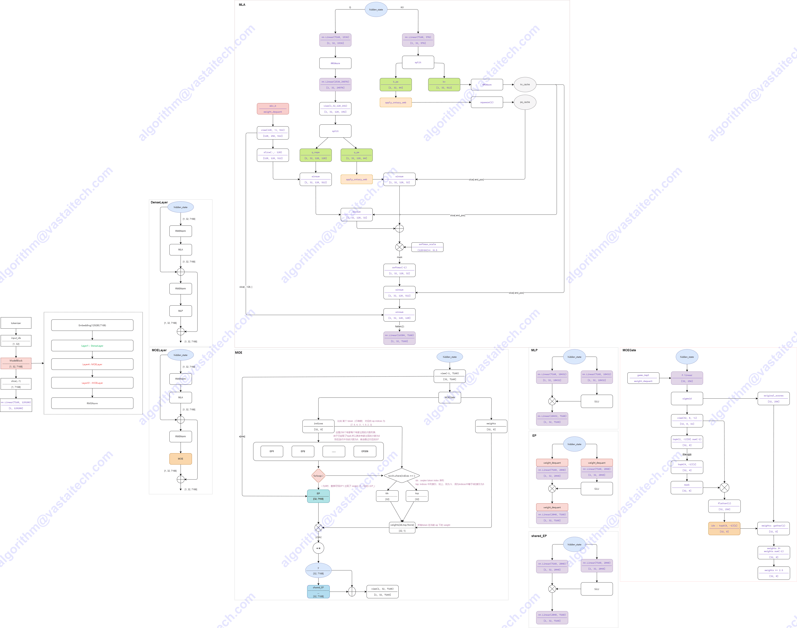
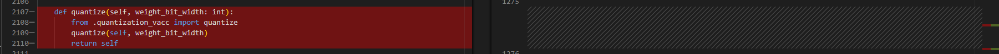

# DeepSeek-R1

- Technical Report
    - [DeepSeek-V3 Technical Report](https://arxiv.org/abs/2412.19437)
    - [DeepSeek-R1 Technical Report](https://arxiv.org/abs/2501.12948)

- Huggingface
    - https://hf-mirror.com/deepseek-ai


## Model Arch



### DeepSeek-R1-Zero
DeepSeek-R1-Zero是一个独特的通过大规模强化学习(Reinforcement Learning，RL) 训练的模型，无需有监督微调 (Supervised Fine-Tuning，SFT) ，具备较强的推理（Reasoning）能力。

DeepSeek-R1-Zero展示出自我验证、反思和长链思维推理能力，甚至在推理方面得分略微超过R1。但R1-Zero有一些明显的局限性，特别是在输出可读性和语言一致性方面，仍需要解决可读性差和语言混合等问题。

### DeepSeek-R1
相比之下，DeepSeek-R1采用了多阶段训练方法，加入了SFT，而不是采用纯粹的强化学习。训练步骤分四个阶段：
- 冷启动：
    - 搜集一些思维链的数据来微调模型，大概几千条数据，方法包括：
        - 直接提示基础模型去生成详细答案并附带反思和验证
        - 搜集DeepSeek-R1-Zero的可读输出，并使用人工进行标注
- 面向推理的强化学习：
    - 使用和DeepSeek-R1-Zero相同的GRPO
    - 语言可能会不统一，引入语言一致性奖赏，对模型推理能力有轻微影响
    - 准确性奖赏+语言一致性奖赏
- 拒绝采样和SFT：
    - 推理数据：这个阶段不仅仅采样能用规则判定的输出，还引入其他任务。奖赏也更多样，比如会使用DeepSeek-V3来判断事实和所采样回答的正确性。广泛做采样，并过滤语种混杂，长段落，以及代码块等，得到数据600k
    - 非推理数据：对写作，事实性问答，自我认同和翻译等数。我们重用DeepSeek-V3的SFT数据集。有时也会用DeepSeek-V3来生成可能的思维链。得到数据200k。
    - 使用这800k数据，微调2个epoch
- 面向全场景的强化学习：
    - 目的是对齐人类喜好，提高模型的有用程度和无害性，同时优化推理能力
    - 使用组合奖赏信号和更广泛的提示词分布
    - 推理性数据仍然用规则
    - 非推理数据使用奖赏模型
        - 数据分布类似于DeepSeek-V3的提示词和答案偏好分布
        - 为了让模型有用，DeepSeek偏重于总结的有用性和相关性，而不打扰背后的思维链
        - 对于无害性，DeepSeek对整个推理过程和总结来检查，并识别和消灭任何潜在风险，偏见和有害内容

### DeepSeek-R1-Distill
DeepSeek使用DeepSeek-R1第三阶段生成800k数据，对LLaMa、Qwen的各种尺寸的模型进行了SFT微调，证实在不用RL的情况下，可以极大的提高小模型的推理能力。

### DeepSeek-R1-0528
仍基于DeepSeek V3 Base模型作为基座，通过更多的算力和后训练策略提升思维深度和推理能力。
- 数学与编程能力大幅增强

    根据 Live CodeBench 测试数据显示，DeepSeek-R1-0528 在编程、逻辑推理和交互能力方面表现突出，整体性能接近 OpenAI 的 o3 高版本与 o4 mini 模型 。尤其在代码生成方面，它超越了 xAI 的 Grok 3 mini 和阿里巴巴的 Qwen 3，显示出强大的编程能力。

- 幻觉生成显著减少

    通过优化模型架构和训练方法，DeepSeek-R1-0528 在减少 AI 幻觉（hallucination）方面取得显著进展，使得生成内容更加准确可靠，提升了模型的实用性和可信度。

- 支持函数调用（FunctionCall）

    DeepSeek-R1 现已支持函数调用功能，使得大型语言模型（LLM）能够通过标准化接口调用外部工具和服务，极大地扩展了其功能边界。这一功能的引入，使得模型在执行复杂任务时更加高效和智能。


## Build_In Deploy

### step.1 模型准备

1. 下载模型权重

    | models  |tips |
    | :--- | :--: |
    | [deepseek-ai/DeepSeek-R1-Distill-Qwen-1.5B](https://hf-mirror.com/deepseek-ai/DeepSeek-R1-Distill-Qwen-1.5B)  | GQA，base model: Qwen2.5-Math-1.5B |
    | [deepseek-ai/DeepSeek-R1-Distill-Qwen-7B](https://hf-mirror.com/deepseek-ai/DeepSeek-R1-Distill-Qwen-7B) |  GQA，base model: Qwen2.5-Math-7B |
    | [deepseek-ai/DeepSeek-R1-Distill-Qwen-14B](https://hf-mirror.com/deepseek-ai/DeepSeek-R1-Distill-Qwen-14B) |  GQA，base model: Qwen2.5-14B |
    | [deepseek-ai/DeepSeek-R1-Distill-Qwen-32B](https://hf-mirror.com/deepseek-ai/DeepSeek-R1-Distill-Qwen-32B) | GQA，base model: Qwen2.5-32B |
    | [deepseek-ai/DeepSeek-R1-Distill-Llama-8B](https://hf-mirror.com/deepseek-ai/DeepSeek-R1-Distill-Llama-8B) |  GQA，base model: Llama-3.1-8B |
    | [deepseek-ai/DeepSeek-R1-Distill-Llama-70B](https://hf-mirror.com/deepseek-ai/DeepSeek-R1-Distill-Llama-70B) | GQA，base model: Llama-3.3-70B-Instruct |

    > - 以上蒸馏模型均使用DeepSeek-R1生成的高质量数据微调而来


2. 模型修改
    - 瀚博软件栈部署`DeepSeek-R1-Distill-Llama`系列模型，无需修改原始模型文件
    - 瀚博软件栈部署`DeepSeek-R1-Distill-Qwen`系列模型，在官方源码的基础上，需要对`modeling_qwen2.py`做一些修改，其中左图为修改的代码
    - [modeling_qwen2_vacc.py](./build_in/source_code/modeling_qwen2_vacc.py)
        - 修改相关依赖的导入方式
        
        - 基于config.insert_slice来判断是否插入strided_slice
        
        - class Qwen2ForCausalLM添加quantize方法，支持per_channel int8量化，[quantization_vacc.py](./build_in/source_code/quantization_vacc.py)
        
        - 迁移transformers==4.37.0版本内cache_utils,modeling_attn_mask_utils,modeling_outputs和utils中移动至modeling_qwen2_vacc.py

    - [configuration_qwen2_vacc.py](./build_in/source_code/configuration_qwen2_vacc.py)
        - 修改对于相关依赖的导入方式
        
    - [quantization_vacc.py](./build_in/source_code/quantization_vacc.py)
        - Qwen2ForCausalLM添加quantize方法，支持per_channel int8量化
        
    - [config_vacc.json](./build_in/source_code/config_vacc.json)
        - 添加_attn_implementation选项，并将其只配置为eager；并添加auto_map选项
        
    - 将以上修改后文件，放置与原始权重目录下（注意不同子模型，对应修改config_vacc.json文件）


### step.2 数据集

1. 量化校准数据集：
    - [allenai/c4](https://hf-mirror.com/datasets/allenai/c4/tree/main/en)
        - c4-train.00000-of-01024.json.gz
        - c4-validation.00000-of-00008.json.gz
    - [ceval/ceval-exam](https://hf-mirror.com/datasets/ceval/ceval-exam/tree/main)
        - ceval-exam.zip
    - [yahma/alpaca-cleaned](https://hf-mirror.com/datasets/yahma/alpaca-cleaned/tree/main)
        - alpaca_data_cleaned.json

### step.3 模型转换

1. 根据具体模型，修改模型转换配置文件
    - Distill-Llama/Qwen模型，编译配置一致
    - [hf_ds_r1_distill_fp16.yaml](./build_in/build/hf_ds_r1_distill_fp16.yaml)
    - [hf_ds_r1_distill_int8.yaml](./build_in/build/hf_ds_r1_distill_int8.yaml)

    > - runstream推理，编译参数`backend.type: tvm_vacc`
    > - fp16精度: 编译参数`backend.dtype: fp16`
    > - int8精度: 编译参数`backend.dtype: int8`
    
    ```bash
    vamc compile ./build_in/build/hf_ds_r1_distill_fp16.yaml
    vamc compile ./build_in/build/hf_ds_r1_distill_int8.yaml
    ```


> - DeepSeek-R1-Distill-Qwen系列模型，部署流程和Qwen2系列是一致的
> - DeepSeek-R1-Distill-Llama系列模型，部署流程和Llama3系列是一致的


### step.4 模型推理
1. 参考大模型部署推理工具：[vastgenx: v1.1.0+](../../tools/vastgenx/README.md)
